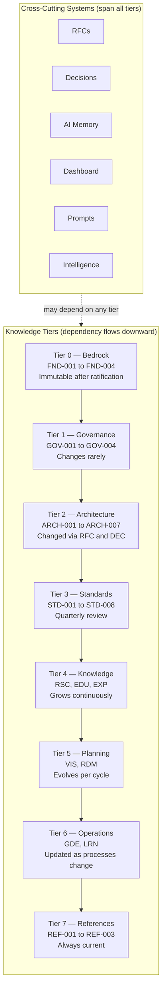
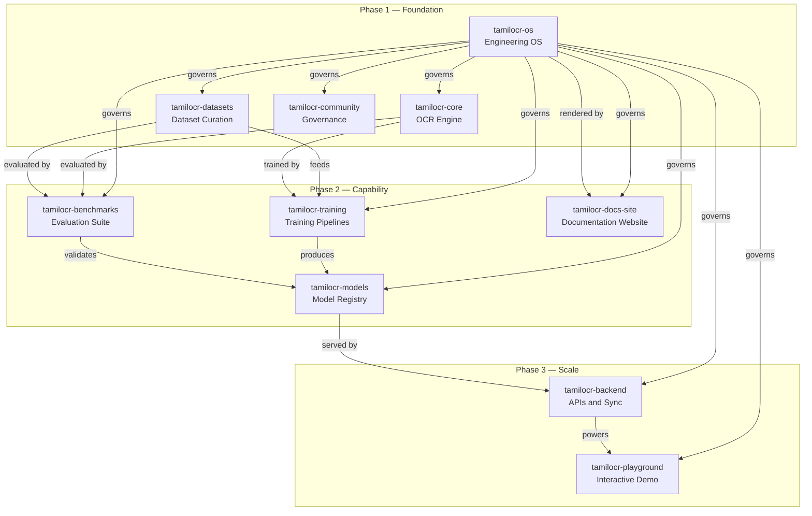
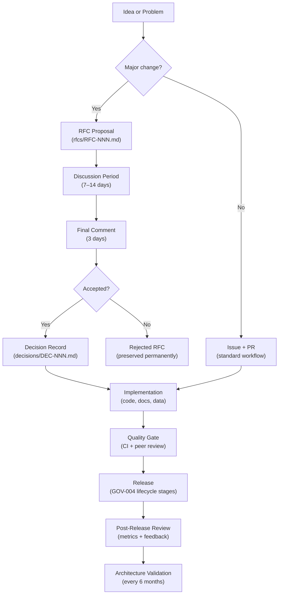
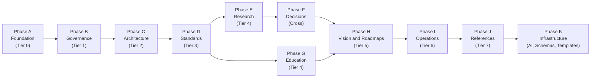

# TamilOCR OS — Master Index

> **SYS-000 · 2026.07-r2 · System Root · FROZEN v1.0**
>
> The engineering operating system for the OpenTamilOCR organization.
> Single source of truth for architecture, standards, governance,
> research, roadmaps, and AI workflows.
>
> This document is frozen. Future modifications require an RFC and Steering Council approval.

### Status Snapshot

| Metric | Value |
|--------|-------|
| **Project Phase** | Phase 1 — Foundation |
| **Documents Approved** | 1 / 71 (1.4%) |
| **Active Contributors** | 1 |
| **Latest Software Release** | — |
| **Latest Model Release** | — |
| **Latest Dataset Release** | — |
| **AI Memory Age** | 0 days |

*This snapshot is updated after each document approval or milestone event.*

---

## How to Use This Document

**If you are a human contributor:**
Read Section 1 for orientation, then jump to the document you need using the registry in Section 4.
If you are new, start with the contributor guide (`tamilocr-os://operations/guides/contributor-guide`, GDE-001) once it is available.

**If you are evaluating this project:**
Section 2 describes the knowledge architecture.
Section 4 lists every planned document.
Section 10 defines the governance pipeline.

### AI Agent Bootstrap Protocol

Every AI agent session interacting with TamilOCR OS must follow this protocol.

**Phase 1 — ORIENT**

| Step | Action | File |
|------|--------|------|
| 1 | Read the knowledge graph root | `SYS-000_Master_Index.md` (this file) |
| 2 | Load current project state | `ai/memory/current-state.yaml` |
| 3 | Load organizational health metrics | `ai/dashboard/org-dashboard.yaml` |
| 4 | Load generation progress | `ai/memory/generation-log.yaml` |
| 5 | Identify your agent role | `ai/roles/agent-roles.yaml` |
| 6 | Load repo-specific rules | `.agents/AGENTS.md` |

**Phase 2 — EXECUTE**

| Step | Action |
|------|--------|
| 7 | Load relevant architecture and standards documents for your task |
| 8 | Follow `requires` links in frontmatter for prerequisites |
| 9 | Load relevant decisions (`DEC-*`) and RFCs (`RFC-*`) |
| 10 | Select the appropriate prompt template from `PRM-*` |
| 11 | Execute the task within architectural constraints |

**Phase 3 — UPDATE**

| Step | Action | File |
|------|--------|------|
| 12 | Suggest updates to project state | `ai/memory/current-state.yaml` |
| 13 | Suggest updates to generation log | `ai/memory/generation-log.yaml` |
| 14 | Suggest metrics updates if applicable | `ai/dashboard/metrics.yaml` |
| 15 | Flag any inconsistencies with approved documents | (report to maintainer) |

---

## Table of Contents

1. [Project Identity](#1-project-identity)
2. [Knowledge Architecture](#2-knowledge-architecture)
3. [Document ID System](#3-document-id-system)
4. [Document Registry](#4-document-registry)
5. [Directory Structure](#5-directory-structure)
6. [Repository Map](#6-repository-map)
7. [Cross-Cutting Systems](#7-cross-cutting-systems)
8. [Dependency Rules](#8-dependency-rules)
9. [Document Conventions](#9-document-conventions)
10. [Governance Pipeline](#10-governance-pipeline)
11. [Generation Order](#11-generation-order)
12. [Architecture Boundaries](#12-architecture-boundaries)
13. [SYS-000 Maintenance](#13-sys-000-maintenance)
14. [Document History](#14-document-history)

---

## 1. Project Identity

**Organization:** OpenTamilOCR

**Mission:** Improve an existing open-source OCR framework to become one of the best open-source Tamil OCR projects available.

**Approach:** We do not build an OCR engine from scratch.
We improve an existing framework through better datasets, preprocessing, post-processing, training, benchmarking, documentation, and engineering.

**Version 1 scope:** Printed Tamil documents.

**License:** Apache 2.0 (code and models) · CC-BY-4.0 (documentation and datasets).

**Governing principles:**

| # | Principle |
|---|-----------|
| P1 | Single Source of Truth — TamilOCR OS is the canonical origin of all organizational knowledge. |
| P2 | Knowledge Graph First — every document is a node, every cross-reference is an edge. |
| P3 | AI-Native Design — any AI agent can understand the project by reading TamilOCR OS. |
| P4 | OCR Mission Primacy — everything exists to serve the OCR engine. |
| P5 | Progressive Complexity — start simple, add complexity only when earned. |
| P6 | Reproducibility — every experiment, benchmark, and training run must be reproducible. |
| P7 | Language Inclusivity — English-primary with Tamil as a first-class language. |
| P8 | Decision Traceability — every significant choice is recorded with rationale. |
| P9 | Organizational Resilience — the project survives changes in personnel and infrastructure. |
| P10 | Measurable Progress — organizational health and OCR quality are quantified over time. |

**Authoritative architecture:** Architectural Reasoning Report v3 (FINAL), 2026-07-04.
This is a pre-genesis planning artifact that preceded the creation of TamilOCR OS documents.
It is not assigned a document ID and is not part of the permanent knowledge graph.
Its architectural decisions are distributed across the generated documents (FND-001 through FND-004, GOV-001 through GOV-004, ARCH-001 through ARCH-007) and the locked decisions in Section 12 of this index.
The reasoning report is preserved as a historical reference in the project's planning archives.

---

## 2. Knowledge Architecture

### 2.1 Tier Model

TamilOCR OS organizes knowledge into **8 tiers** ordered by stability (Tier 0 is most stable) and **6 cross-cutting systems** that span all tiers.



| Tier | Name | Stability | Change Ceremony | Contents |
|------|------|-----------|-----------------|----------|
| **0** | Bedrock | Immutable after ratification | Ratification vote | Charter, Code of Conduct, Ethics Framework, Licensing Policy |
| **1** | Governance | Rarely changes | Steering Council approval | Governance Model, Business Continuity, Decision Process, Release Governance |
| **2** | Architecture | Stable | RFC → Decision Record | System Overview, Repo Arch, Knowledge Arch, OCR Pipeline, Data Arch, Web/Backend Arch, AI Workflow Arch |
| **3** | Standards | Versioned | Quarterly review | Documentation, Coding, Dataset, Model, API, Testing, Commit/Review, Prompt Engineering |
| **4** | Knowledge | Grows continuously | Append-only (research, experiments) or deepening (education) | Research notes, Education materials, Experiment records |
| **5** | Planning | Evolves per cycle | Vision: annually · Roadmaps: per release | 1/3/5/10-year visions, Product roadmap, Research roadmap |
| **6** | Operations | Updated as processes change | Maintainer approval | Contributor guide, Dev setup, Dataset creation, Training, Release, Learning paths |
| **7** | References | Living documents, always current | Any contributor | Glossary, Bibliography, Tool inventory |

### 2.2 Cross-Cutting Systems

These systems span all tiers and are not part of the vertical dependency hierarchy.

| System | Purpose | Primary Artifacts |
|--------|---------|-------------------|
| **RFC System** | Formal proposals before decisions | `rfcs/index.yaml`, `rfcs/RFC-NNN-*.md` |
| **Decision Database** | Record of every significant choice | `decisions/index.yaml`, `decisions/DEC-NNN-*.md` |
| **AI Memory** | Machine-readable project state snapshot | `ai/memory/current-state.yaml`, `generation-log.yaml`, `known-issues.yaml` |
| **Organization Dashboard** | Health metrics and status | `ai/dashboard/org-dashboard.yaml`, `metrics.yaml` |
| **Prompt Library** | Reusable AI interaction templates | `ai/prompts/PRM-*.md` |
| **Project Intelligence** | The knowledge graph itself (built from metadata) | Generated by `scripts/build-knowledge-graph.py` |

---

## 3. Document ID System

### 3.1 ID Format

```
{PREFIX}-{NNN}
```

- **PREFIX**: 3-character uppercase type code (see table below).
- **NNN**: Zero-padded sequential number within the prefix, starting at 001.
- IDs are **permanent**. Once assigned, an ID is never reused or reassigned.
- Superseded documents retain their ID with `status: superseded`.

**ID reservation policy:** IDs 001–899 within each prefix are available for regular sequential assignment.
IDs 900–999 are reserved for future system use (e.g., meta-documents, automated records, architecture review artifacts).
This reservation may be formally allocated via RFC when the need arises.

### 3.2 Registered Prefixes

| Prefix | Type | Tier | Lifecycle | Planned Count |
|--------|------|------|-----------|---------------|
| `SYS` | System (this index) | — | Immutable | 1 |
| `FND` | Foundation | 0 | Immutable after ratification | 4 |
| `GOV` | Governance | 1 | Stable, high ceremony | 4 |
| `ARCH` | Architecture | 2 | Stable, changed via RFC → DEC | 7 |
| `STD` | Standard | 3 | Versioned, reviewed quarterly | 8 |
| `RFC` | Request for Comments | Cross | Full lifecycle (draft → accepted/rejected) | Variable |
| `DEC` | Decision | Cross | Append-only (superseded, never deleted) | Variable |
| `RSC` | Research | 4 | Append-only | 4+ |
| `EDU` | Education | 4 | Updated as understanding deepens | 3+ |
| `EXP` | Experiment | 4 | Full lifecycle (proposed → completed/failed) | Variable |
| `VIS` | Vision | 5 | Updated annually to every 3 years | 4 |
| `RDM` | Roadmap | 5 | Updated per release cycle | 3 |
| `GDE` | Guide | 6 | Updated as processes change | 5 |
| `LRN` | Learning Path | 6 | Updated with education content | 3+ |
| `REF` | Reference | 7 | Living document | 3 |
| `PRM` | Prompt Template | Cross | Versioned with standards | 4 |
| `SCH` | Schema | Infra | Versioned with standards | 6 |
| `TPL` | Template | Infra | Versioned with standards | 5+ |

**18 prefixes total.**

**Reconciliation note:** The Architectural Reasoning Report v3 defined 17 prefixes.
SYS-000 introduced the `SYS` prefix for system-level meta-documents, bringing the total to 18.
This is the first exercised use of the prefix registration mechanism.
New prefixes require an RFC and Steering Council approval, with corresponding updates to this index (see Section 13).

### 3.3 Cross-Reference URI Scheme

Stable cross-references between documents use the `tamilocr-os://` URI scheme:

```
tamilocr-os://{directory-path}/{document-slug}
```

Examples:

| URI | Resolves To |
|-----|-------------|
| `tamilocr-os://foundation/charter` | `foundation/charter.md` |
| `tamilocr-os://decisions/DEC-001-base-framework` | `decisions/DEC-001-base-framework.md` |
| `tamilocr-os://knowledge/education/ocr-theory` | `knowledge/education/ocr-theory.md` |
| `tamilocr-os://ai/memory/current-state` | `ai/memory/current-state.yaml` |
| `tamilocr-os://ai/roles/agent-roles` | `ai/roles/agent-roles.yaml` |

**Unresolved URIs:** During the generation phase, many `tamilocr-os://` URIs will point to documents that do not yet exist.
The generation log (`ai/memory/generation-log.yaml`) tracks which documents have been approved.
If a URI target is listed as "Planned" in the registry below, the document is queued for generation in the order specified in Section 11.
Do not create placeholder files.
Do not generate content for unresolved URIs out of dependency order.

---

## 4. Document Registry

The complete catalog of all planned documents, data files, schemas, and templates in TamilOCR OS.

### Registry Summary

| Category | Count | Approved | Planned |
|----------|-------|----------|---------|
| Tier 0 — Foundation | 4 | 0 | 4 |
| Tier 1 — Governance | 4 | 0 | 4 |
| Tier 2 — Architecture | 7 | 0 | 7 |
| Tier 3 — Standards | 8 | 0 | 8 |
| Tier 4 — Knowledge (Research) | 4 | 0 | 4 |
| Tier 4 — Knowledge (Education) | 3 | 0 | 3 |
| Tier 5 — Planning (Vision) | 4 | 0 | 4 |
| Tier 5 — Planning (Roadmaps) | 3 | 0 | 3 |
| Tier 6 — Operations (Guides) | 5 | 0 | 5 |
| Tier 6 — Operations (Learning Paths) | 3 | 0 | 3 |
| Tier 7 — References | 3 | 0 | 3 |
| Cross-Cutting — Decisions | 3 | 0 | 3 |
| Cross-Cutting — AI Systems | 10 | 0 | 10 |
| Infrastructure — Schemas | 6 | 0 | 6 |
| Infrastructure — Templates | 5 | 0 | 5 |
| System | 1 | 1 | 0 |
| **Total** | **73** | **1** | **72** |

*This table is regenerable via `scripts/generate-index.py`.*

---

### Tier 0 — Foundation (Bedrock)

| ID | Title | File Path | Status |
|----|-------|-----------|--------|
| FND-001 | Charter | `foundation/charter.md` | Planned |
| FND-002 | Code of Conduct | `foundation/code-of-conduct.md` | Planned |
| FND-003 | Ethics Framework | `foundation/ethics-framework.md` | Planned |
| FND-004 | Licensing Policy | `foundation/licensing-policy.md` | Planned |

### Tier 1 — Governance

| ID | Title | File Path | Status |
|----|-------|-----------|--------|
| GOV-001 | Governance Model | `governance/governance-model.md` | Planned |
| GOV-002 | Business Continuity Plan | `governance/business-continuity.md` | Planned |
| GOV-003 | Decision Process | `governance/decision-process.md` | Planned |
| GOV-004 | Release Governance | `governance/release-governance.md` | Planned |

### Tier 2 — Architecture

| ID | Title | File Path | Status |
|----|-------|-----------|--------|
| ARCH-001 | System Architecture Overview | `architecture/system-overview.md` | Planned |
| ARCH-002 | Repository Architecture | `architecture/repository-architecture.md` | Planned |
| ARCH-003 | Knowledge Architecture | `architecture/knowledge-architecture.md` | Planned |
| ARCH-004 | OCR Pipeline Architecture | `architecture/ocr-pipeline-architecture.md` | Planned |
| ARCH-005 | Data Architecture | `architecture/data-architecture.md` | Planned |
| ARCH-006 | Web & Backend Architecture | `architecture/web-backend-architecture.md` | Planned |
| ARCH-007 | AI Workflow Architecture | `architecture/ai-workflow-architecture.md` | Planned |

### Tier 3 — Standards

| ID | Title | File Path | Status |
|----|-------|-----------|--------|
| STD-001 | Documentation Standards | `standards/documentation-standards.md` | Planned |
| STD-002 | Coding Standards | `standards/coding-standards.md` | Planned |
| STD-003 | Dataset Standards | `standards/dataset-standards.md` | Planned |
| STD-004 | Model Standards | `standards/model-standards.md` | Planned |
| STD-005 | API Standards | `standards/api-standards.md` | Planned |
| STD-006 | Testing Standards | `standards/testing-standards.md` | Planned |
| STD-007 | Commit & Review Standards | `standards/commit-review-standards.md` | Planned |
| STD-008 | Prompt Engineering Standards | `standards/prompt-standards.md` | Planned |

### Tier 4 — Knowledge: Research

| ID | Title | File Path | Status |
|----|-------|-----------|--------|
| RSC-001 | Tamil OCR Landscape Survey | `knowledge/research/tamil-ocr-landscape.md` | Planned |
| RSC-002 | Framework Evaluation Report | `knowledge/research/framework-evaluation.md` | Planned |
| RSC-003 | Preprocessing Research | `knowledge/research/preprocessing-research.md` | Planned |
| RSC-004 | Post-Processing Research | `knowledge/research/postprocessing-research.md` | Planned |

### Tier 4 — Knowledge: Education

| ID | Title | File Path | Status |
|----|-------|-----------|--------|
| EDU-001 | OCR Theory Fundamentals | `knowledge/education/ocr-theory.md` | Planned |
| EDU-002 | Tamil Script Structure | `knowledge/education/tamil-script-structure.md` | Planned |
| EDU-003 | Computer Vision for OCR | `knowledge/education/computer-vision-for-ocr.md` | Planned |

### Tier 4 — Knowledge: Experiments

| ID | Title | File Path | Status |
|----|-------|-----------|--------|
| — | (Experiment records created as experiments occur) | `knowledge/experiments/EXP-NNN-*.md` | — |
| — | Experiment Index | `knowledge/experiments/index.yaml` | Planned |

### Tier 5 — Planning: Vision

| ID | Title | File Path | Status |
|----|-------|-----------|--------|
| VIS-001 | One-Year Vision | `planning/vision/one-year.md` | Planned |
| VIS-002 | Three-Year Vision | `planning/vision/three-year.md` | Planned |
| VIS-003 | Five-Year Vision | `planning/vision/five-year.md` | Planned |
| VIS-004 | Ten-Year Vision | `planning/vision/ten-year.md` | Planned |

### Tier 5 — Planning: Roadmaps

| ID | Title | File Path | Status |
|----|-------|-----------|--------|
| RDM-001 | V1 Product Roadmap | `planning/roadmaps/v1-product.md` | Planned |
| RDM-002 | Future Versions | `planning/roadmaps/future-versions.md` | Planned |
| RDM-003 | Research Roadmap | `planning/roadmaps/research.md` | Planned |

### Tier 6 — Operations: Guides

| ID | Title | File Path | Status |
|----|-------|-----------|--------|
| GDE-001 | Contributor Guide | `operations/guides/contributor-guide.md` | Planned |
| GDE-002 | Development Setup | `operations/guides/development-setup.md` | Planned |
| GDE-003 | Dataset Creation Guide | `operations/guides/dataset-creation-guide.md` | Planned |
| GDE-004 | Training Guide | `operations/guides/training-guide.md` | Planned |
| GDE-005 | Release Guide | `operations/guides/release-guide.md` | Planned |

### Tier 6 — Operations: Learning Paths

| ID | Title | File Path | Status |
|----|-------|-----------|--------|
| LRN-001 | Learning Path: OCR Fundamentals | `operations/learning-paths/path-ocr-fundamentals.md` | Planned |
| LRN-002 | Learning Path: Development | `operations/learning-paths/path-development.md` | Planned |
| LRN-003 | Learning Path: Data | `operations/learning-paths/path-data.md` | Planned |

### Tier 7 — References

| ID | Title | File Path | Status |
|----|-------|-----------|--------|
| REF-001 | Glossary | `references/glossary.md` | Planned |
| REF-002 | Bibliography | `references/bibliography.md` | Planned |
| REF-003 | Tool & Infrastructure Inventory | `references/tool-inventory.md` | Planned |

### Cross-Cutting — RFCs

| ID | Title | File Path | Status |
|----|-------|-----------|--------|
| — | (RFC records created as proposals arise) | `rfcs/RFC-NNN-*.md` | — |
| — | RFC Index | `rfcs/index.yaml` | Planned |

### Cross-Cutting — Decisions

| ID | Title | File Path | Status |
|----|-------|-----------|--------|
| DEC-001 | Base Framework Selection | `decisions/DEC-001-base-framework.md` | Planned |
| DEC-002 | Annotation Format Selection | `decisions/DEC-002-annotation-format.md` | Planned |
| DEC-003 | Dataset Storage Strategy | `decisions/DEC-003-dataset-storage.md` | Planned |
| — | Decision Index | `decisions/index.yaml` | Planned |

### Cross-Cutting — AI Systems

| ID / Type | Title | File Path | Status |
|-----------|-------|-----------|--------|
| YAML | AI Memory: Current State | `ai/memory/current-state.yaml` | Planned |
| YAML | AI Memory: Generation Log | `ai/memory/generation-log.yaml` | Planned |
| YAML | AI Memory: Known Issues | `ai/memory/known-issues.yaml` | Planned |
| YAML | Dashboard: Organization Status | `ai/dashboard/org-dashboard.yaml` | Planned |
| YAML | Dashboard: Metrics History | `ai/dashboard/metrics.yaml` | Planned |
| YAML | AI Agent Roles | `ai/roles/agent-roles.yaml` | Planned |
| PRM-001 | Architecture Prompt Templates | `ai/prompts/architecture-prompts.md` | Planned |
| PRM-002 | Documentation Prompt Templates | `ai/prompts/documentation-prompts.md` | Planned |
| PRM-003 | Research Prompt Templates | `ai/prompts/research-prompts.md` | Planned |
| PRM-004 | Review Prompt Templates | `ai/prompts/review-prompts.md` | Planned |

### Infrastructure — Schemas

| ID | Title | File Path | Status |
|----|-------|-----------|--------|
| SCH-001 | Document Metadata Schema | `schemas/document-metadata.schema.json` | Planned |
| SCH-002 | Model Card Schema | `schemas/model-card.schema.json` | Planned |
| SCH-003 | Dataset Card Schema | `schemas/dataset-card.schema.json` | Planned |
| SCH-004 | Decision Record Schema | `schemas/decision-record.schema.json` | Planned |
| SCH-005 | Experiment Record Schema | `schemas/experiment-record.schema.json` | Planned |
| SCH-006 | RFC Schema | `schemas/rfc.schema.json` | Planned |

### Infrastructure — Templates

| ID | Title | File Path | Status |
|----|-------|-----------|--------|
| TPL-001 | Decision Record Template | `templates/decision-template.md` | Planned |
| TPL-002 | Experiment Report Template | `templates/experiment-template.md` | Planned |
| TPL-003 | Model Card Template | `templates/model-card-template.md` | Planned |
| TPL-004 | Dataset Card Template | `templates/dataset-card-template.md` | Planned |
| TPL-005 | RFC Template | `templates/rfc-template.md` | Planned |

### Infrastructure — Scripts

| Script | Purpose |
|--------|---------|
| `scripts/validate-metadata.py` | Validate YAML frontmatter in all documents against SCH-001 |
| `scripts/build-knowledge-graph.py` | Generate `knowledge-graph.json` from all document frontmatter |
| `scripts/check-dependencies.py` | Detect broken `requires`, `references`, and `tamilocr-os://` URIs |
| `scripts/generate-index.py` | Regenerate the registry and summary tables in this file |
| `scripts/staleness-check.py` | Flag AI memory and dashboard files older than 14 days |
| `scripts/generate-timeline.py` | Generate chronological decision timeline from `decisions/*.md` |

---

## 5. Directory Structure

```
tamilocr-os/
│
├── README.md                                # Repository introduction
├── SYS-000_Master_Index.md                  # SYS-000: This file (knowledge graph root)
├── LICENSE                                  # Apache 2.0
├── CONTRIBUTING.md                          # Brief; references GDE-001
├── SECURITY.md                              # Security policy
│
├── foundation/                              # Tier 0: Bedrock
│   ├── charter.md                           # FND-001
│   ├── code-of-conduct.md                   # FND-002
│   ├── ethics-framework.md                  # FND-003
│   └── licensing-policy.md                  # FND-004
│
├── governance/                              # Tier 1: Governance
│   ├── governance-model.md                  # GOV-001
│   ├── business-continuity.md               # GOV-002
│   ├── decision-process.md                  # GOV-003
│   └── release-governance.md                # GOV-004
│
├── architecture/                            # Tier 2: Architecture
│   ├── system-overview.md                   # ARCH-001
│   ├── repository-architecture.md           # ARCH-002
│   ├── knowledge-architecture.md            # ARCH-003
│   ├── ocr-pipeline-architecture.md         # ARCH-004
│   ├── data-architecture.md                 # ARCH-005
│   ├── web-backend-architecture.md          # ARCH-006
│   └── ai-workflow-architecture.md          # ARCH-007
│
├── standards/                               # Tier 3: Standards
│   ├── documentation-standards.md           # STD-001
│   ├── coding-standards.md                  # STD-002
│   ├── dataset-standards.md                 # STD-003
│   ├── model-standards.md                   # STD-004
│   ├── api-standards.md                     # STD-005
│   ├── testing-standards.md                 # STD-006
│   ├── commit-review-standards.md           # STD-007
│   └── prompt-standards.md                  # STD-008
│
├── rfcs/                                    # Cross-cutting: Proposals
│   ├── index.yaml                           # Machine-readable RFC index
│   └── RFC-NNN-*.md                         # Individual RFCs
│
├── decisions/                               # Cross-cutting: Decision Database
│   ├── index.yaml                           # Machine-readable decision index
│   └── DEC-NNN-*.md                         # Individual decision records
│
├── knowledge/                               # Tier 4: Knowledge
│   ├── research/
│   │   ├── tamil-ocr-landscape.md           # RSC-001
│   │   ├── framework-evaluation.md          # RSC-002
│   │   ├── preprocessing-research.md        # RSC-003
│   │   └── postprocessing-research.md       # RSC-004
│   ├── education/
│   │   ├── ocr-theory.md                    # EDU-001
│   │   ├── tamil-script-structure.md        # EDU-002
│   │   └── computer-vision-for-ocr.md       # EDU-003
│   └── experiments/
│       ├── index.yaml                       # Experiment index
│       └── EXP-NNN-*.md                     # Individual records
│
├── planning/                                # Tier 5: Vision & Roadmaps
│   ├── vision/
│   │   ├── one-year.md                      # VIS-001
│   │   ├── three-year.md                    # VIS-002
│   │   ├── five-year.md                     # VIS-003
│   │   └── ten-year.md                      # VIS-004
│   └── roadmaps/
│       ├── v1-product.md                    # RDM-001
│       ├── future-versions.md               # RDM-002
│       └── research.md                      # RDM-003
│
├── operations/                              # Tier 6: Guides & Learning Paths
│   ├── guides/
│   │   ├── contributor-guide.md             # GDE-001
│   │   ├── development-setup.md             # GDE-002
│   │   ├── dataset-creation-guide.md        # GDE-003
│   │   ├── training-guide.md                # GDE-004
│   │   └── release-guide.md                 # GDE-005
│   └── learning-paths/
│       ├── path-ocr-fundamentals.md         # LRN-001
│       ├── path-development.md              # LRN-002
│       └── path-data.md                     # LRN-003
│
├── references/                              # Tier 7: Living References
│   ├── glossary.md                          # REF-001
│   ├── bibliography.md                      # REF-002
│   └── tool-inventory.md                    # REF-003
│
├── ai/                                      # Cross-cutting: AI Systems
│   ├── memory/
│   │   ├── current-state.yaml               # Live project state
│   │   ├── generation-log.yaml              # Document generation tracking
│   │   └── known-issues.yaml                # Current known issues
│   ├── dashboard/
│   │   ├── org-dashboard.yaml               # Organization status
│   │   └── metrics.yaml                     # Health metrics history
│   ├── prompts/
│   │   ├── architecture-prompts.md          # PRM-001
│   │   ├── documentation-prompts.md         # PRM-002
│   │   ├── research-prompts.md              # PRM-003
│   │   └── review-prompts.md                # PRM-004
│   └── roles/
│       └── agent-roles.yaml                 # AI agent role definitions
│
├── schemas/                                 # Infrastructure: Validation Schemas
│   ├── document-metadata.schema.json        # SCH-001
│   ├── model-card.schema.json               # SCH-002
│   ├── dataset-card.schema.json             # SCH-003
│   ├── decision-record.schema.json          # SCH-004
│   ├── experiment-record.schema.json        # SCH-005
│   └── rfc.schema.json                      # SCH-006
│
├── templates/                               # Infrastructure: Document Templates
│   ├── decision-template.md                 # TPL-001
│   ├── experiment-template.md               # TPL-002
│   ├── model-card-template.md               # TPL-003
│   ├── dataset-card-template.md             # TPL-004
│   └── rfc-template.md                      # TPL-005
│
├── shared/                                  # Distributable Configs (for other repos)
│   ├── ci-templates/
│   ├── linter-configs/
│   └── agents-config/
│
├── scripts/                                 # Tooling
│   ├── validate-metadata.py
│   ├── build-knowledge-graph.py
│   ├── check-dependencies.py
│   ├── generate-index.py
│   ├── staleness-check.py
│   └── generate-timeline.py
│
└── .agents/                                 # AI Agent Configuration
    ├── AGENTS.md
    └── skills/
```

---

## 6. Repository Map

The OpenTamilOCR organization contains 10 repositories deployed across three phases.



| Repository | Purpose | Phase | Primary Language | Governed By |
|------------|---------|-------|-----------------|-------------|
| `tamilocr-os` | Engineering operating system (this repo) | 1 | Markdown, YAML, Python | SYS-000 |
| `tamilocr-core` | OCR engine improvements | 1 | Python | `tamilocr-os://architecture/ocr-pipeline-architecture` |
| `tamilocr-datasets` | Dataset curation and versioning | 1 | Python, DVC | `tamilocr-os://architecture/data-architecture` |
| `tamilocr-community` | Governance discussions, RFC mirrors, meeting notes | 1 | Markdown | `tamilocr-os://governance/governance-model` |
| `tamilocr-benchmarks` | Evaluation suite and leaderboards | 2 | Python | `tamilocr-os://architecture/data-architecture` |
| `tamilocr-models` | Model registry and model cards | 2 | Python, YAML | `tamilocr-os://standards/model-standards` |
| `tamilocr-training` | Training pipelines | 2 | Python | `tamilocr-os://architecture/ocr-pipeline-architecture` |
| `tamilocr-docs-site` | Documentation website | 2 | JS/TS (Astro) | `tamilocr-os://architecture/web-backend-architecture` |
| `tamilocr-backend` | APIs and sync services | 3 | Python (FastAPI) | `tamilocr-os://architecture/web-backend-architecture` |
| `tamilocr-playground` | Interactive web demo | 3 | JS/TS + Python | `tamilocr-os://architecture/web-backend-architecture` |

**Phase definitions:**
- **Phase 1 — Foundation:** Required before any OCR work begins.
- **Phase 2 — Capability:** Required once working OCR and data exist.
- **Phase 3 — Scale:** Required once there is a stable core and user base.

Every repository includes `.github/` (CI, templates, CODEOWNERS), `.agents/` (AI rules pointing to TamilOCR OS), `SECURITY.md`, `DCO.md`, and follows the standards defined in `tamilocr-os://standards/`.

---

## 7. Cross-Cutting Systems

### 7.1 RFC System

Formal proposals for major changes.
Lifecycle: `DRAFT → DISCUSSION → FINAL-COMMENT → ACCEPTED / REJECTED / WITHDRAWN`.
An accepted RFC generates a DEC record.
A rejected RFC is preserved as institutional memory.

- **Index file:** `rfcs/index.yaml`
- **Schema:** `tamilocr-os://schemas/rfc` (SCH-006)
- **Template:** `tamilocr-os://templates/rfc-template` (TPL-005)
- **Process:** Defined in `tamilocr-os://governance/decision-process` (GOV-003)

### 7.2 Decision Database

Unified record of every significant organizational decision.
Replaces traditional ADRs.
Categories: `architecture`, `governance`, `process`, `research`, `ethics`, `architecture-review`.
Decisions are append-only — superseded, never deleted.

- **Index file:** `decisions/index.yaml`
- **Schema:** `tamilocr-os://schemas/decision-record` (SCH-004)
- **Template:** `tamilocr-os://templates/decision-template` (TPL-001)
- **Process:** Defined in `tamilocr-os://governance/decision-process` (GOV-003)

### 7.3 AI Memory

Machine-readable snapshot of the current project state.
Enables any AI agent to resume from the exact current position without re-deriving context.

| File | Purpose | Staleness Threshold |
|------|---------|---------------------|
| `ai/memory/current-state.yaml` | Live project phase, priorities, blockers | 14 days (warn), 30 days (error) |
| `ai/memory/generation-log.yaml` | Which documents have been generated and approved | Updated per document merge |
| `ai/memory/known-issues.yaml` | Current known issues and their status | Updated as issues change |

### 7.4 Organization Dashboard

Quantitative health indicators for the organization.

| File | Purpose | Update Frequency |
|------|---------|-----------------:|
| `ai/dashboard/org-dashboard.yaml` | Comprehensive status snapshot | Per significant event |
| `ai/dashboard/metrics.yaml` | Historical metrics for trend analysis | Per measurement cycle |

14 defined metrics across 6 categories: OCR Quality, Data, Engineering, Community, Process, Knowledge.
Full metric definitions in `tamilocr-os://architecture/system-overview` (ARCH-001).

### 7.5 Prompt Library

Versioned, reviewed AI interaction templates.
Every template specifies: ID, purpose, input variables, expected output, quality criteria, and examples.

| ID | Scope | File |
|----|-------|------|
| PRM-001 | Architecture tasks | `ai/prompts/architecture-prompts.md` |
| PRM-002 | Documentation tasks | `ai/prompts/documentation-prompts.md` |
| PRM-003 | Research tasks | `ai/prompts/research-prompts.md` |
| PRM-004 | Review tasks | `ai/prompts/review-prompts.md` |

Standards: `tamilocr-os://standards/prompt-standards` (STD-008).

### 7.6 Project Intelligence

The emergent capability produced by all other systems working together.
Not a separate artifact — it is the knowledge graph itself, generated by `scripts/build-knowledge-graph.py` from all document frontmatter.

Answers: *Why was X decided? What depends on what? Is the project improving? Where are we now? What should we do next?*

---

## 8. Dependency Rules

### 8.1 Dependency Types

| Type | Notation | Meaning |
|------|----------|---------|
| `requires` | → | Hard dependency. Document cannot be understood without the target. |
| `references` | ⇢ | Soft dependency. Document cites target but stands alone. |
| `supersedes` | ⊳ | This document replaces the target. |
| `implements` | ⊨ | Concrete implementation of the target's design. |
| `extends` | ⊕ | Adds to the target without replacing it. |
| `triggered_by` | ⊲ | Created or updated because of a decision (DEC-NNN). |
| `proposed_by` | ⊲r | Decision was proposed by this RFC (RFC-NNN). |

### 8.2 Rules

1. **No upward dependencies within tiers.** A Tier 3 document must not `require` a Tier 6 document.
2. **No circular dependencies.** If A requires B, B must not require A (transitively).
3. **Superseded documents are never deleted.** They are marked `status: superseded` with a pointer to their replacement.
4. **Cross-repo references use stable URIs.** Format: `tamilocr-os://{path}/{slug}`.
5. **Cross-cutting documents may depend on any tier.** Decisions, RFCs, and prompts are exempt from the tier rule.
6. **Causal links are explicit.** If a document exists because of a decision, `triggered_by` must be set in its frontmatter.
7. **All `requires` targets must exist or be planned.** `scripts/check-dependencies.py` enforces this.

---

## 9. Document Conventions

### 9.1 File Naming

- All lowercase.
- Words separated by hyphens.
- Meaningful slugs (not IDs): `charter.md`, not `FND-001.md`.
- Exception: RFCs, DECs, and EXPs include their ID prefix: `RFC-001-base-framework.md`, `DEC-001-base-framework.md`, `EXP-001-otsu-binarization.md`.
- Exception: SYS-000 uses its ID in the filename (`SYS-000_Master_Index.md`) as the knowledge graph root.
- File extension: `.md` for documents, `.yaml` for data files, `.schema.json` for schemas.

### 9.2 Metadata (YAML Frontmatter)

Every markdown document in TamilOCR OS must begin with a YAML frontmatter block.
The canonical schema is defined in SCH-001 (`schemas/document-metadata.schema.json`).

**Required fields:**

```yaml
---
id: "ARCH-001"                       # Permanent document ID
title: "System Architecture Overview" # Human-readable title
type: architecture                    # Matches node type (lowercase)
version: 1                           # Integer, incremented on substantive change
status: draft                        # draft | review | approved | superseded | archived
created: "2026-07-04"               # ISO 8601 date
updated: "2026-07-04"               # ISO 8601 date
owner: "@username"                   # GitHub handle of document owner
reviewers: []                        # GitHub handles of reviewers
tier: 2                              # 0–7 for tiered docs, null for cross-cutting
requires: []                         # Hard dependencies (by document ID)
references: []                       # Soft dependencies (by document ID)
triggered_by: null                   # Decision ID (DEC-NNN) if applicable
obsoletes: null                      # Document ID this replaces
source_rfc: null                     # RFC ID (RFC-NNN) if applicable
tags: []                             # Searchable keywords
summary: >                          # One-paragraph description
  Brief description of this document.
quality_gate:
  metadata_valid: false
  dependencies_resolved: false
  peer_reviewed: false
  ai_consistency_checked: false
---
```

### 9.3 Quality Gate

Before a document transitions from `draft` to `approved`, it must pass these checks:

| Check | Automated? | Tool |
|-------|------------|------|
| **Metadata valid** | Yes | `scripts/validate-metadata.py` against SCH-001 |
| **Dependencies resolved** | Yes | `scripts/check-dependencies.py` |
| **Cross-references valid** | Yes | `scripts/check-dependencies.py` |
| **Completeness** | Partial | Automated: required fields. Manual: content sections. |
| **Peer reviewed** | No | At least 1 maintainer approval on PR |
| **AI consistency check** | Optional | AI agent reviews for contradictions with approved docs |

**Document lifecycle:**

```
DRAFT → REVIEW → APPROVED → SUPERSEDED or ARCHIVED
```

### 9.4 Writing Style

- One sentence per line (for clean Git diffs).
- Professional engineering language.
- Active voice preferred.
- All cross-references use document IDs (e.g., "as defined in ARCH-004") or `tamilocr-os://` URIs.
- Tamil terms include transliterations on first use.
- Full standards defined in `tamilocr-os://standards/documentation-standards` (STD-001).

---

## 10. Governance Pipeline

The end-to-end flow governing how any change moves through the organization.

### 10.1 Pipeline Flow



### 10.2 When RFC Is Required

| Change Type | RFC Required? | Approval |
|-------------|---------------|----------|
| Bug fix | No | 1 maintainer |
| Minor feature (single repo) | No | 1 maintainer |
| New standard or standard change | Yes | 1 maintainer + Steering Council member |
| Architecture change | Yes | Steering Council |
| New repository | Yes | Steering Council |
| Base framework change | Yes | Steering Council |
| Ethics-impacting change | Yes | Steering Council + Ethics Reviewer |

### 10.3 Release Lifecycle Stages

| Stage | Meaning |
|-------|---------|
| **Alpha** | Early development, breaking changes expected |
| **Beta** | Feature-complete, bugs expected |
| **Release Candidate** | Believed ready for stable |
| **Stable** | Production-ready, supported |
| **LTS** | Extended maintenance |
| **Deprecated** | No longer recommended |

Per-artifact stage mappings and criteria defined in `tamilocr-os://governance/release-governance` (GOV-004).

### 10.4 Architecture Review Cycle

Every 6 months or at major release boundaries:

1. **Prepare** — compile concerns, check decision review triggers, review metrics.
2. **Review** — Steering Council assesses all ARCH-* documents, metrics trends, architectural debt.
3. **Act** — file RFCs for needed changes, record review outcome as DEC record.
4. **Communicate** — publish summary, update AI Memory and dashboard.

---

## 11. Generation Order

Documents are generated in strict dependency order across 11 phases.
Each document is generated only after all documents in its `requires` list have been approved.



| Phase | Tier | Documents | IDs |
|-------|------|-----------|-----|
| **A** | 0 | Foundation | FND-001 → FND-004 |
| **B** | 1 | Governance | GOV-001 → GOV-004 |
| **C** | 2 | Architecture | ARCH-001 → ARCH-007 |
| **D** | 3 | Standards | STD-001 → STD-008 |
| **E** | 4 | Research | RSC-001 → RSC-004 |
| **F** | Cross | Decisions | DEC-001 → DEC-003 |
| **G** | 4 | Education | EDU-001 → EDU-003 |
| **H** | 5 | Vision & Roadmaps | VIS-001 → VIS-004, RDM-001 → RDM-003 |
| **I** | 6 | Operations | GDE-001 → GDE-005, LRN-001 → LRN-003 |
| **J** | 7 | References | REF-001 → REF-003 |
| **K** | Infra | AI files, Schemas, Templates, Prompts | YAML files, PRM-001 → PRM-004, SCH-001 → SCH-006, TPL-001 → TPL-005 |

**Total: 71 generation items** (51 markdown documents + 6 YAML data files + 6 JSON schemas + 4 prompt docs + 5 template docs — excluding SYS-000 which is already approved).

**Critical path to writing OCR code:** Phases A–D (~23 documents).
**Critical path to training first model:** Through Phase F (~30 documents).

Full dependency details per document are recorded in the Architectural Reasoning Report v3.

---

## 12. Architecture Boundaries

The following decisions are locked in and must not be contradicted by any future document.
Changes to these boundaries require an RFC, Steering Council approval, and a superseding decision.

| # | Locked Decision |
|---|-----------------|
| D1 | TamilOCR OS is the single source of truth for all organizational knowledge. |
| D2 | Document IDs follow `{PREFIX}-{NNN}` format with 18 registered prefixes. IDs are permanent. |
| D3 | YAML frontmatter is the mandatory metadata format for all documents. |
| D4 | Knowledge graph: 8 tiers (0–7) + 6 cross-cutting systems. Strict downward dependencies within tiers. |
| D5 | Apache 2.0 for code and models. CC-BY-4.0 for documentation and datasets. |
| D6 | Multi-repo architecture with TamilOCR OS as governance hub. |
| D7 | Git submodules for cross-repo synchronization of shared OS configs. |
| D8 | Python as the primary language for all ML components. |
| D9 | Conventional Commits for all repositories. |
| D10 | Developer Certificate of Origin (DCO) for contributor agreements. |
| D11 | CalVer `YYYY.MM` for TamilOCR OS. SemVer for software. |
| D12 | Unified Decision Database replaces ADRs. All significant decisions use DEC-NNN format. |
| D13 | AI Memory Layer maintained manually with CI staleness enforcement. |
| D14 | RFC required for major/critical changes. Minor changes bypass RFC. |
| D15 | Full dataset and model lineage required for all releases. |

---

## 13. SYS-000 Maintenance

### 13.1 Ownership

SYS-000 is owned by the Steering Council.
Only the document owner or a Steering Council member may approve changes.

### 13.2 When SYS-000 Must Be Updated

| Trigger | Required Update |
|---------|-----------------|
| New document approved | Update registry status in Section 4; update summary statistics; update status snapshot |
| New prefix registered | Add to prefix table in Section 3.2; update prefix count and reconciliation note |
| New repository created | Add to repository map in Section 6 and update the diagram |
| Tier structure changed | Update Section 2 (requires RFC + Steering Council approval) |
| Generation order changed | Update Section 11 (requires RFC + Steering Council approval) |
| Architecture boundary added or removed | Update Section 12 (requires RFC + Steering Council approval) |
| Cross-cutting system added or removed | Update Sections 2.2 and 7 (requires RFC + Steering Council approval) |

### 13.3 Automated vs. Manual Updates

| Section | Update Method |
|---------|---------------|
| Status snapshot (top of document) | Manual after each milestone |
| Registry tables and summary (Section 4) | Regenerable via `scripts/generate-index.py` |
| Directory structure (Section 5) | Manual when files are added |
| All other sections | Manual with peer review |

### 13.4 Version Bumps

SYS-000 version increments on every substantive content change.
Formatting fixes and registry status updates do not require a version bump.
The `updated` field in frontmatter is always set to the date of the latest change.

---

## 14. Document History

| Version | Date | Summary |
|---------|------|---------|
| 2026.07-r1 | 2026-07-04 | Initial approved release. Complete document registry, 8-tier architecture, 6 cross-cutting systems, governance pipeline, dependency rules, quality gates, and generation order. |
| 2026.07-r2 | 2026-07-04 | Final architectural refinements. Added 4 Mermaid diagrams, AI Bootstrap Protocol, registry summary statistics, prefix reconciliation note, ID reservation policy, unresolved URI guidance, SYS-000 maintenance section, status snapshot, v3 report clarification. Adopted CalVer versioning. Frozen as v1.0. |

---

> **Next document:** FND-001 Charter
> **Generation rule:** One document at a time, in dependency order, after explicit instruction.
