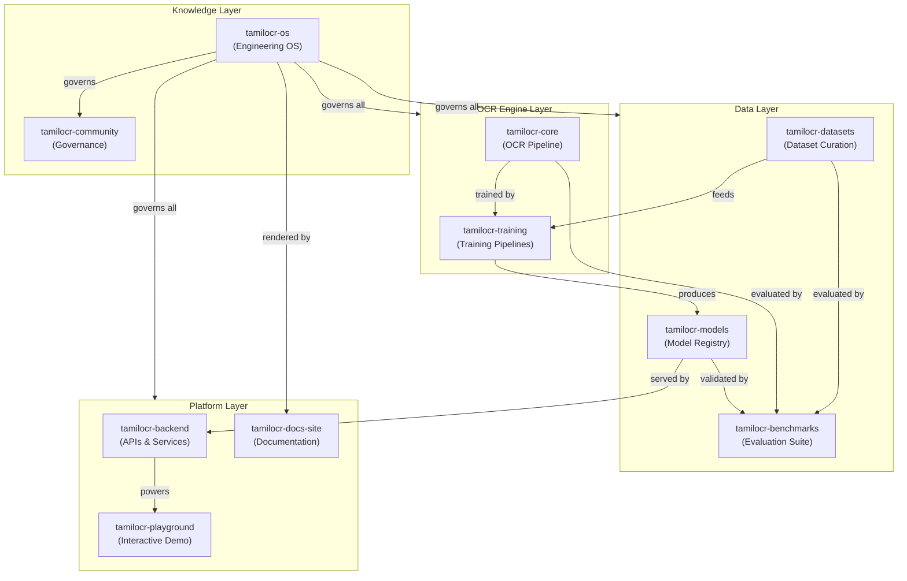
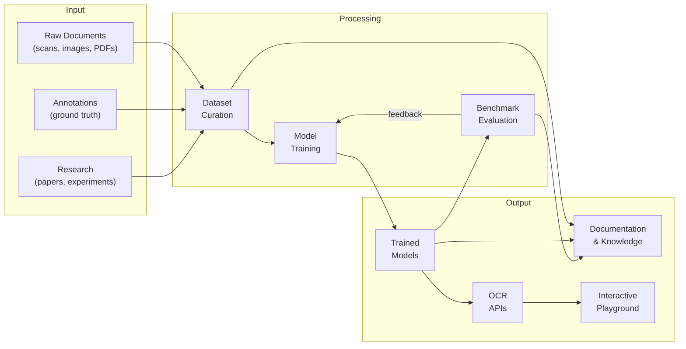
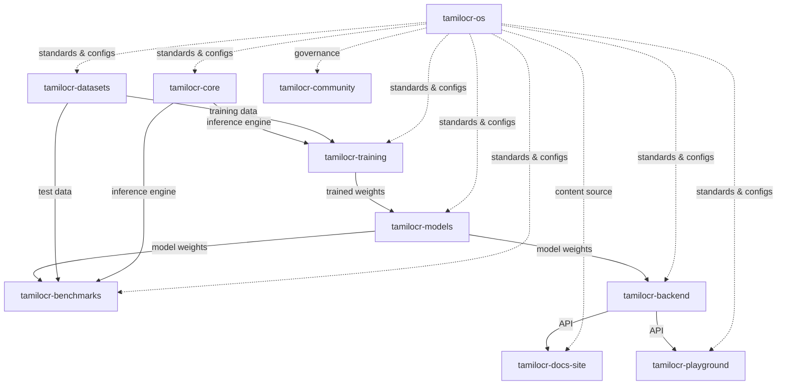
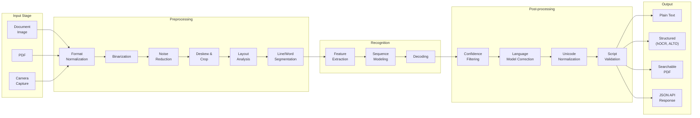
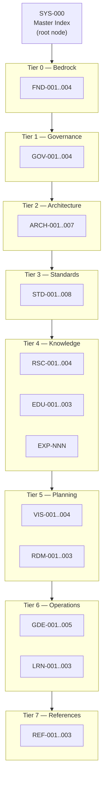
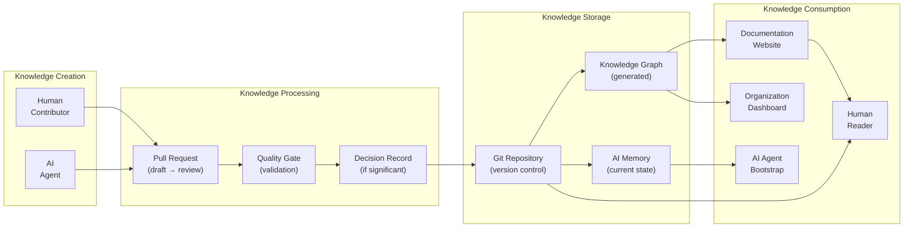
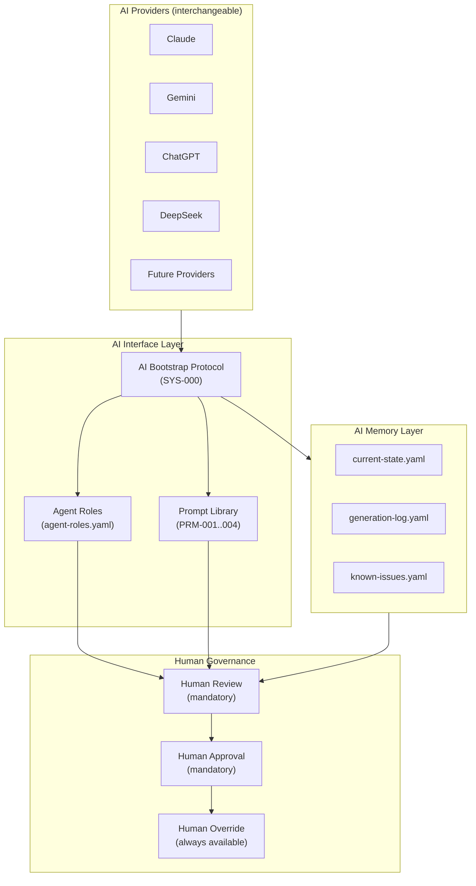
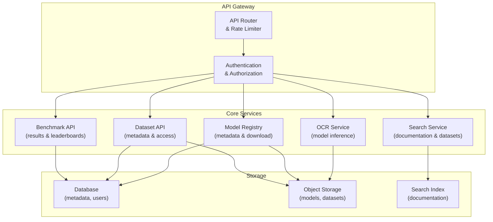
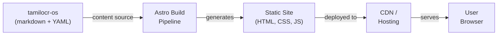

# ARCH-001 — System Architecture Overview

> **ARCH-001 · 2026.07-r1 · Tier 2 — Architecture**
>
> The definitive architectural blueprint of the OpenTamilOCR organization.
> This document governs every subsystem, repository, workflow, and service.
> All other architecture documents inherit from this one.
> Changes require an RFC, a Decision Record, and Steering Council approval.

---

## 1. Purpose

This document defines the complete high-level architecture of the OpenTamilOCR ecosystem — not merely the software, but the entire organizational machine: its repositories, data pipelines, AI workflows, knowledge systems, backend services, web platforms, security boundaries, and evolution strategy.

Every future architecture document (ARCH-002 through ARCH-007) inherits constraints from this overview.
Every repository, every contributor, every AI agent, and every future component must be consistent with the architecture defined here.

---

## 2. Scope

This document covers:

- The architectural principles that govern all design decisions.
- The ecosystem of 10 repositories and their interactions.
- The OCR pipeline at the architectural level (not implementation).
- The knowledge architecture that makes the organization AI-native.
- The AI integration architecture for multi-provider agent support.
- The backend platform and API architecture.
- The web platform architecture.
- The security architecture at the boundary level.
- The scalability model for long-term growth.
- The evolution strategy for architectural change.

This document does **not** cover:

- Implementation details (algorithms, libraries, framework APIs).
- Deployment procedures (covered in operational guides).
- Individual document specifications (covered in standards).

---

## 3. Architecture Principles

Fifteen principles govern every architectural decision in OpenTamilOCR.
These principles are permanent unless changed through RFC.

| # | Principle | Rationale |
|---|-----------|-----------|
| AP1 | **Documentation First.** | The architecture exists in documentation before it exists in code. If it isn't documented, it doesn't exist. |
| AP2 | **AI First.** | Every system is designed so that an AI agent can understand, navigate, and contribute to it without human assistance. Machine-readable metadata is mandatory. |
| AP3 | **API First.** | Internal and external interfaces are designed as stable APIs before implementation begins. This ensures loose coupling and independent evolution. |
| AP4 | **Repository Independence.** | Each repository can be understood, built, tested, and released independently. No repository requires another to compile or run its tests. |
| AP5 | **Loose Coupling.** | Subsystems interact through defined interfaces (APIs, file formats, metadata contracts), never through internal implementation details. |
| AP6 | **High Cohesion.** | Each repository and subsystem has a single, clear responsibility. If a repository does two unrelated things, it should be split. |
| AP7 | **Open Standards.** | The project uses open, documented, widely-adopted standards wherever possible. Proprietary formats are avoided. |
| AP8 | **Long-Term Maintainability.** | Every design choice considers the 10-year horizon. Favor boring, proven technology over novel, fragile technology (P5, FND-001). |
| AP9 | **Modularity.** | Components can be replaced, upgraded, or removed without cascading failures. The OCR engine, training pipeline, and serving infrastructure are independent modules. |
| AP10 | **Reproducibility.** | Every experiment, training run, benchmark, and release can be reproduced from documented inputs (P6, FND-001). |
| AP11 | **Traceability.** | Every artifact (model, dataset, release) can be traced to its source data, training configuration, and approval decision (P8, FND-001). |
| AP12 | **Scalability.** | The architecture supports growth from 1 contributor to 1,000, from 1 repository to 100, and from 1 language to many. |
| AP13 | **Community Driven.** | The architecture serves the community, not the other way around. Contributor experience is a first-class design concern. |
| AP14 | **Open Source by Default.** | Everything is open unless a specific, documented reason requires otherwise (e.g., security credentials, private reports). |
| AP15 | **Knowledge as Infrastructure.** | Organizational knowledge (decisions, research, standards) is treated as infrastructure — versioned, validated, and maintained with the same rigor as code. |

---

## 4. Ecosystem Overview

### 4.1 System Map



### 4.2 Architectural Layers

The ecosystem is organized into four layers, each with distinct responsibilities and stability characteristics.

| Layer | Responsibility | Repositories | Change Frequency |
|-------|---------------|-------------|-----------------|
| **Knowledge** | Organizational memory, governance, standards, and decision history. The brain of the organization. | `tamilocr-os`, `tamilocr-community` | Low — governed by RFC/DEC. |
| **Engine** | The OCR pipeline and training infrastructure. The technical core. | `tamilocr-core`, `tamilocr-training` | Medium — follows release governance. |
| **Data** | Dataset curation, model storage, and benchmark evaluation. The fuel and measurement system. | `tamilocr-datasets`, `tamilocr-models`, `tamilocr-benchmarks` | Medium — grows continuously. |
| **Platform** | User-facing services: APIs, documentation website, and interactive demo. The public interface. | `tamilocr-backend`, `tamilocr-docs-site`, `tamilocr-playground` | High — iterates with user feedback. |

### 4.3 Information Flow



---

## 5. Repository Architecture

### 5.1 Repository Responsibilities

| Repository | Layer | Responsibility | Primary Language | Deployment Phase |
|------------|-------|---------------|-----------------|-----------------|
| `tamilocr-os` | Knowledge | Engineering operating system. Single source of truth for all organizational knowledge. Governs all other repositories. | Markdown, YAML, Python | Phase 1 |
| `tamilocr-core` | Engine | OCR engine improvements. Preprocessing, recognition, and post-processing pipeline. | Python | Phase 1 |
| `tamilocr-datasets` | Data | Dataset collection, curation, annotation, versioning, and distribution. | Python, DVC | Phase 1 |
| `tamilocr-community` | Knowledge | Governance discussions, RFC mirrors, meeting notes, community management. | Markdown | Phase 1 |
| `tamilocr-benchmarks` | Data | Evaluation suite, metric computation, leaderboards, and benchmark result publishing. | Python | Phase 2 |
| `tamilocr-models` | Data | Model registry, model cards, weight storage, and model versioning. | Python, YAML | Phase 2 |
| `tamilocr-training` | Engine | Training pipelines, experiment tracking, hyperparameter management, and distributed training support. | Python | Phase 2 |
| `tamilocr-docs-site` | Platform | Documentation website. Renders TamilOCR OS and other docs into a searchable, browsable site. | JS/TS (Astro) | Phase 2 |
| `tamilocr-backend` | Platform | API gateway, model serving, search, and synchronization services. | Python (FastAPI) | Phase 3 |
| `tamilocr-playground` | Platform | Interactive web demo for users to test OCR on their own images. | JS/TS + Python | Phase 3 |

### 5.2 Repository Dependencies



**Dependency rules:**

- `tamilocr-os` has **no runtime dependencies** on any other repository. It is the root.
- All repositories depend on `tamilocr-os` for standards, configs, and governance (via git submodule of `shared/`).
- No circular dependencies are permitted between repositories.
- Runtime dependencies flow downward through the layers (Knowledge → Engine → Data → Platform).

### 5.3 Cross-Repository Synchronization

Each repository includes:

| File / Directory | Purpose | Source |
|-----------------|---------|--------|
| `.agents/AGENTS.md` | AI agent rules, pointing to TamilOCR OS conventions. | `tamilocr-os/shared/agents-config/` |
| `.github/` | CI workflows, issue templates, PR templates, CODEOWNERS. | `tamilocr-os/shared/ci-templates/` |
| `SECURITY.md` | Security policy. | Repository-specific, following TamilOCR OS template. |
| `DCO.md` | Developer Certificate of Origin. | Standardized. |
| Linter configs | Code formatting and linting rules. | `tamilocr-os/shared/linter-configs/` |

Synchronization mechanism: git submodules pointing to `tamilocr-os/shared/`.
Repositories pull shared configs and update them periodically.

---

## 6. OCR Ecosystem Architecture

### 6.1 Pipeline Overview



### 6.2 Pipeline Stage Responsibilities

| Stage | Responsibility | Extensibility |
|-------|---------------|---------------|
| **Input** | Accept documents in multiple formats. Normalize to a standard internal representation. | New input formats added as adapters. |
| **Preprocessing** | Improve image quality for recognition. Segment documents into recognizable units. | Each step is a pluggable module. Steps can be reordered or replaced. |
| **Recognition** | Convert image regions into character sequences. The core ML inference step. | The recognition engine is the base framework being improved. Modular architecture allows engine replacement via RFC/DEC. |
| **Post-processing** | Improve recognition output using linguistic and structural knowledge. | Each corrector is a pluggable module. Language models and dictionaries are replaceable. |
| **Output** | Format results for consumption. Support multiple output standards. | New output formats added as serializers. |

### 6.3 Architectural Constraints

- The pipeline is **modular**: each stage can be developed, tested, and benchmarked independently.
- The pipeline is **reproducible**: given the same input, configuration, and model, the output must be identical.
- The pipeline follows the **base framework improvement** strategy (FND-001, Section 3): we improve an existing framework, not build from scratch.
- Framework selection is a locked architectural decision (DEC-001, SYS-000 D6).

---

## 7. Knowledge Architecture

### 7.1 Knowledge Graph

The organizational knowledge is structured as a directed acyclic graph (DAG).



**Key properties:**

- **71 planned nodes** (excluding SYS-000, which is already approved).
- **Strict downward dependency** within tiers. No Tier 3 document may `require` a Tier 6 document.
- **Cross-cutting systems** (RFCs, Decisions, AI Memory, Dashboard, Prompts, Intelligence) may depend on any tier.
- **Every node has metadata**: YAML frontmatter with ID, dependencies, status, and quality gate.
- **The graph is navigable**: `scripts/build-knowledge-graph.py` generates a machine-readable `knowledge-graph.json` from all frontmatter.

### 7.2 Metadata as Infrastructure

Every document in TamilOCR OS carries structured YAML frontmatter (SYS-000, Section 9.2).
This metadata is not decorative — it is infrastructure:

| Metadata Field | Infrastructure Purpose |
|---------------|----------------------|
| `id` | Unique node identifier in the knowledge graph. |
| `requires` | Hard dependency edges. Enables automated dependency checking. |
| `references` | Soft dependency edges. Enables related-document discovery. |
| `status` | Lifecycle tracking. Enables progress dashboards. |
| `triggered_by` | Causal traceability. Links documents to the decisions that created them. |
| `quality_gate` | Automated quality verification. |
| `tags` | Full-text search and topic clustering. |
| `summary` | AI context loading. Enables agents to assess relevance without reading full documents. |

### 7.3 Knowledge Flow



---

## 8. AI Architecture

### 8.1 AI Integration Model

OpenTamilOCR is designed to be **AI-native** (P3, FND-001) but **human-governed**.



### 8.2 AI Design Principles

| # | Principle | Implementation |
|---|-----------|---------------|
| AI1 | **Provider independence.** | No architectural element depends on a specific AI model or provider. Any provider can be substituted. |
| AI2 | **Session independence.** | Every AI session starts from zero context and reaches full awareness via the Bootstrap Protocol. No session depends on a previous session's memory. |
| AI3 | **Human governance.** | AI agents propose; humans approve. AI never makes final decisions on governance, architecture, releases, or ethics (GOV-003, Section 13). |
| AI4 | **Structured memory.** | AI state is persisted in machine-readable YAML files, not in chat logs or ephemeral context. |
| AI5 | **Auditable contributions.** | All AI-generated content is subject to the same review and quality gates as human contributions. |
| AI6 | **Graceful degradation.** | If all AI systems become unavailable, the project continues to function using human processes alone. |

### 8.3 Agent Roles

Agent roles are defined in `ai/roles/agent-roles.yaml`.
Each role specifies what the agent is authorized to do and what it must not do.

| Role | Primary Tasks | Boundaries |
|------|--------------|------------|
| **Documentation Agent** | Generate documents, validate metadata, check consistency. | Cannot approve documents or merge PRs. |
| **Research Agent** | Survey literature, analyze benchmarks, summarize findings. | Cannot make architectural decisions. |
| **Review Agent** | Check consistency, flag contradictions, validate cross-references. | Cannot override human review decisions. |
| **Architecture Agent** | Draft RFC proposals, analyze impact, suggest improvements. | Cannot approve RFCs or record decisions. |

### 8.4 AI Memory Architecture

| File | Purpose | Update Trigger | Staleness |
|------|---------|---------------|-----------|
| `ai/memory/current-state.yaml` | Current project phase, priorities, blockers, and context. | After each significant event. | 14 days (warn), 30 days (error). |
| `ai/memory/generation-log.yaml` | Which documents have been generated, approved, or are in progress. | After each document approval. | Updated per event. |
| `ai/memory/known-issues.yaml` | Open issues, architectural debt, and unresolved questions. | As issues are discovered or resolved. | Updated per event. |

Staleness enforcement: `scripts/staleness-check.py` runs in CI and flags files exceeding thresholds.

---

## 9. Backend Architecture

### 9.1 Service Architecture



### 9.2 Service Responsibilities

| Service | Responsibility | Repository |
|---------|---------------|------------|
| **API Gateway** | Route requests, enforce rate limits, handle CORS. | `tamilocr-backend` |
| **Authentication** | API key management, optional user accounts. | `tamilocr-backend` |
| **OCR Service** | Accept images, run inference, return results. | `tamilocr-backend` (uses `tamilocr-core`) |
| **Search Service** | Full-text search across documentation and metadata. | `tamilocr-backend` |
| **Model Registry** | Model metadata, versioning, and download endpoints. | `tamilocr-backend` (uses `tamilocr-models`) |
| **Dataset API** | Dataset metadata, sample previews, and download links. | `tamilocr-backend` (uses `tamilocr-datasets`) |
| **Benchmark API** | Benchmark results, leaderboards, and comparison tools. | `tamilocr-backend` (uses `tamilocr-benchmarks`) |

### 9.3 API Design Principles

- **RESTful.** Resources are nouns, actions are HTTP methods.
- **Versioned.** URL-prefixed versioning (`/v1/`, `/v2/`). Defined in STD-005.
- **Documented.** OpenAPI specification generated from code.
- **Paginated.** All list endpoints support cursor-based pagination.
- **Idempotent.** Safe methods (GET, HEAD) are always idempotent. Unsafe methods are idempotent where possible.
- **Error-consistent.** All errors follow a standard error response format.

---

## 10. Website Architecture

### 10.1 Web Platform Overview

| Site | Purpose | Source | Technology |
|------|---------|--------|------------|
| **Documentation Site** | Render TamilOCR OS and all documentation into a searchable, browsable website. | `tamilocr-docs-site`, reading from `tamilocr-os` | Astro (static site generator) |
| **Playground** | Interactive demo where users upload images and receive OCR results. | `tamilocr-playground` | Frontend: JS/TS. Backend: `tamilocr-backend` API. |
| **Benchmark Dashboard** | Visual display of benchmark results, leaderboards, and trends. | Part of `tamilocr-docs-site` or standalone. | Data from `tamilocr-benchmarks`. |
| **Model Explorer** | Browse available models, view model cards, compare versions. | Part of `tamilocr-docs-site`. | Data from `tamilocr-models`. |
| **Dataset Explorer** | Browse available datasets, view dataset cards, preview samples. | Part of `tamilocr-docs-site`. | Data from `tamilocr-datasets`. |

### 10.2 Documentation Site Architecture



- Content is authored in `tamilocr-os` as markdown with YAML frontmatter.
- The build pipeline reads markdown, resolves `tamilocr-os://` URIs, generates navigation from the knowledge graph, and produces a static site.
- The site is deployed to a CDN or static hosting provider (Firebase Hosting, Cloudflare Pages, or equivalent).
- Search is implemented client-side (e.g., Pagefind) or via the backend Search Service.

---

## 11. Security Architecture

### 11.1 Security Boundaries

| Boundary | Protection | Mechanism |
|----------|-----------|-----------|
| **Repository access** | Prevent unauthorized code changes. | Branch protection, CODEOWNERS, required reviews, signed commits. |
| **CI/CD secrets** | Protect API keys, tokens, and credentials. | GitHub encrypted secrets, least-privilege access. |
| **Infrastructure accounts** | Prevent unauthorized infrastructure changes. | 2FA mandatory, minimum 2 owners per service (GOV-002, Section 6.2). |
| **API access** | Prevent abuse of public APIs. | Rate limiting, API keys, optional authentication. |
| **Dataset integrity** | Prevent data tampering. | Checksums in dataset cards, immutable releases. |
| **Model integrity** | Prevent model tampering. | Checksums in model cards, signed releases. |
| **Knowledge integrity** | Prevent unauthorized knowledge modification. | Git history, quality gates, peer review. |
| **AI safety** | Prevent AI agents from exceeding authority. | Role-based boundaries, human approval gates (Section 8.2). |

### 11.2 Supply Chain Security

- Dependencies are pinned to specific versions in lock files.
- Dependency updates are reviewed for security advisories.
- CI pipelines scan for known vulnerabilities.
- The tool inventory (REF-003) tracks all dependencies with versions and licenses.
- Supply chain attack response is defined in GOV-002, Section 9.5.

### 11.3 Responsible Disclosure

Security vulnerabilities are reported via `SECURITY.md` in each repository.
The coordinated disclosure process follows GOV-002, Section 9.

---

## 12. Scalability

### 12.1 Growth Dimensions

| Dimension | Current | Near-Term | Long-Term |
|-----------|---------|-----------|-----------|
| **Repositories** | 10 | 10–15 | 20–50+ |
| **Contributors** | 1 | 5–20 | 50–1,000+ |
| **Languages** | Tamil (printed) | Tamil (printed + handwritten) | Tamil + additional Indic scripts |
| **Models** | 0 | 1–3 | 10–50+ |
| **Datasets** | 0 | 1–3 | 10–30+ |
| **API requests** | 0 | Hundreds/day | Thousands–millions/day |

### 12.2 Scaling Strategy

| Growth Area | Strategy |
|-------------|---------|
| **More repositories** | Each new repository follows the standard structure (`.agents/`, `.github/`, shared configs). Governed by RFC and registered in SYS-000. |
| **More contributors** | Self-service onboarding via contributor guide (GDE-001) and learning paths (LRN-*). AI agents reduce maintainer burden. |
| **More languages** | The OCR pipeline is language-agnostic at the architectural level. Language-specific components (dictionaries, models, datasets) are modular. Adding a language does not require architectural change. |
| **More models** | The model registry is designed for unlimited models. Each model is self-describing via its model card. |
| **More traffic** | The backend uses stateless services behind a load balancer. The documentation site is static and CDN-cacheable. |
| **More complexity** | The RFC process (GOV-003) prevents uncontrolled complexity growth. New complexity requires justification. |

---

## 13. Architecture Evolution

### 13.1 Change Process

The architecture evolves through a controlled process:

```
Observation → RFC → Discussion → Decision (DEC) → Implementation → Review
```

- **No silent architectural drift.** If the implementation diverges from the architecture, either the implementation must be corrected or an RFC must be filed to update the architecture.
- **Architecture reviews** occur every 6 months or at major release boundaries (SYS-000, Section 10.4).
- **Backward compatibility** is the default. Breaking changes require explicit justification in the RFC.

### 13.2 Deprecation and Migration

When an architectural component is deprecated:

1. An RFC proposes the deprecation with a migration plan.
2. The deprecation is announced with a timeline (minimum 1 release cycle).
3. Migration tooling or documentation is provided.
4. The deprecated component is marked `status: deprecated` in its metadata.
5. After the support period, the component is archived (never deleted).
6. The decision is recorded as DEC-NNN.

### 13.3 Future Architectural Horizons

The following are anticipated future architectural extensions, not current commitments:

| Horizon | Description | Trigger |
|---------|-------------|---------|
| **Multi-engine support** | Support multiple OCR engines (not just the base framework). | Community demand + RFC. |
| **Federated evaluation** | Allow external parties to run benchmarks and submit results. | Benchmark maturity + RFC. |
| **Plugin system** | Allow community-contributed preprocessing/post-processing modules. | Core stability + RFC. |
| **Multi-language** | Extend beyond Tamil to other Indic scripts. | Tamil v1 success + RFC. |
| **Self-hosted backend** | Provide a Docker-based self-hosted deployment option. | Backend maturity + community demand. |
| **Mobile SDK** | Provide on-device OCR for mobile applications. | Core optimization + RFC. |

---

## 14. Organization Health Metrics

The architecture defines 14 metrics across 6 categories to measure organizational health.
Full metric definitions will be implemented in the organization dashboard (`ai/dashboard/org-dashboard.yaml`).

| Category | Metrics |
|----------|---------|
| **OCR Quality** | Character Error Rate (CER), Word Error Rate (WER) |
| **Data** | Dataset volume, annotation accuracy, dataset diversity |
| **Engineering** | Test coverage, CI pass rate, documentation coverage |
| **Community** | Active contributors, PR merge time, time-to-first-contribution |
| **Process** | Decision backlog, RFC throughput, release cadence |
| **Knowledge** | Knowledge graph completeness, AI Memory freshness, document approval rate |

---

## 15. Governance Relationship

| Document | Relationship |
|----------|-------------|
| FND-001 — Project Charter | Parent. Principles P1–P10 govern this architecture. Mission defines scope. |
| FND-003 — Ethics Framework | Sibling. AI architecture respects ethical boundaries. Dataset architecture respects privacy. |
| FND-004 — Licensing Policy | Sibling. All artifacts follow the dual-license strategy. |
| GOV-001 — Governance Model | Required. Roles and authority levels govern architectural change. |
| GOV-003 — Decision Process | Required. Architecture changes follow the RFC → DEC process. |
| GOV-004 — Release Governance | Required. Release lifecycle governs how architectural outputs reach users. |
| GOV-002 — Business Continuity | Reference. Infrastructure and knowledge continuity protect the architecture. |
| ARCH-002 — Repository Architecture | Child. Detailed repository structure inherits from Section 5. |
| ARCH-003 — Knowledge Architecture | Child. Detailed knowledge graph design inherits from Section 7. |
| ARCH-004 — OCR Pipeline Architecture | Child. Detailed pipeline design inherits from Section 6. |
| ARCH-005 — Data Architecture | Child. Detailed data platform design inherits from Sections 5 and 6. |
| ARCH-006 — Web & Backend Architecture | Child. Detailed platform design inherits from Sections 9 and 10. |
| ARCH-007 — AI Workflow Architecture | Child. Detailed AI integration inherits from Section 8. |

---

## 16. Related Documents

| Document | Relationship |
|----------|-------------|
| SYS-000 — Master Index | Root. This document is registered under the SYS-000 knowledge graph. |
| FND-001 — Project Charter | Required. Mission and principles. |
| GOV-001 — Governance Model | Required. Organizational authority. |
| GOV-003 — Decision Process | Required. Architectural change process. |
| GOV-004 — Release Governance | Required. Release lifecycle. |
| FND-003 — Ethics Framework | Reference. Ethical boundaries for AI and data. |
| FND-004 — Licensing Policy | Reference. Licensing strategy for all artifacts. |
| GOV-002 — Business Continuity | Reference. Infrastructure resilience. |

---

## 17. Review Policy

- **Review frequency:** Every 6 months during the Architecture Review Cycle (SYS-000, Section 10.4), or at major release boundaries.
- **Amendment process:** RFC → DEC → Steering Council approval.
- **Trigger for extraordinary review:** If a child architecture document (ARCH-002 through ARCH-007) reveals a conflict with this overview, an extraordinary review is convened.

---

## 18. Document History

| Version | Date | Summary |
|---------|------|---------|
| 2026.07-r1 | 2026-07-04 | Initial draft. Founding system architecture overview for the OpenTamilOCR organization. |

---

> **Approved by:** Pending Steering Council approval.
> **Effective date:** Upon approval.
