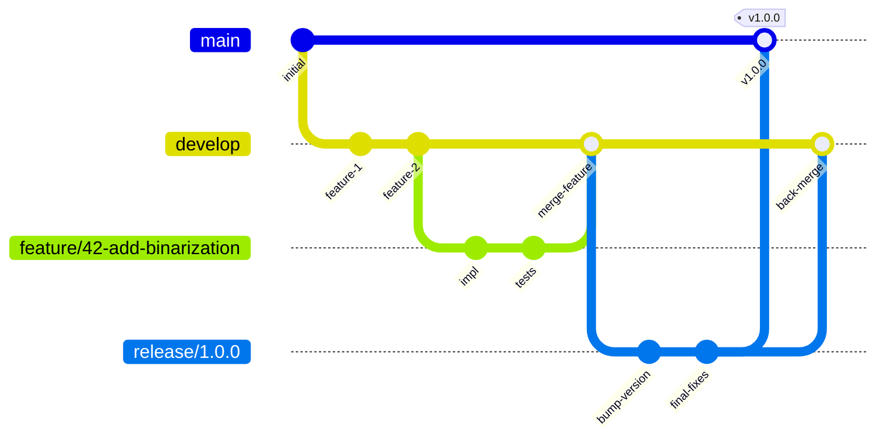
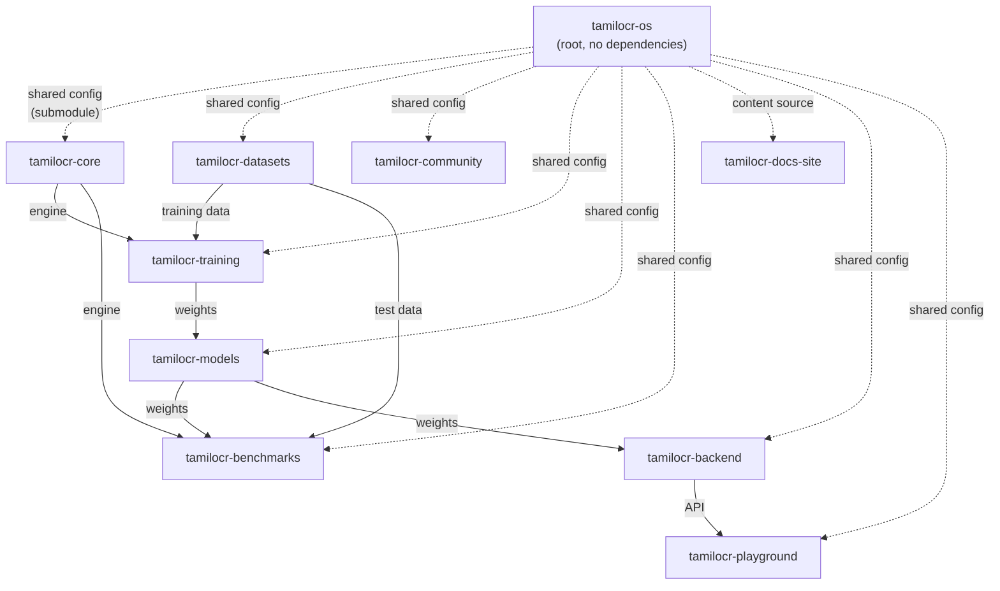
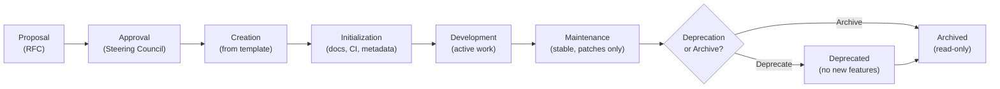

# ARCH-002 — Repository Architecture

> **ARCH-002 · 2026.07-r1 · Tier 2 — Architecture**
>
> The definitive repository architecture specification for the OpenTamilOCR organization.
> Every repository must conform to this specification.
> Changes require an RFC, a Decision Record, and Steering Council approval.

---

## 1. Purpose

This document defines the architectural contract that every repository in the OpenTamilOCR organization must satisfy.

It specifies the mandatory internal structure, naming conventions, metadata schema, branching strategy, dependency rules, shared infrastructure, lifecycle governance, AI integration, security requirements, and quality gates.

This specification inherits from ARCH-001 (System Architecture Overview, Section 5) and expands it into a complete, enforceable standard.

---

## 2. Scope

This specification applies to:

- All 10 planned repositories in the OpenTamilOCR organization.
- All future repositories created under the organization.
- Community-contributed repositories that seek official status.
- Experimental and research repositories while they are part of the organization.

---

## 3. Repository Philosophy

| # | Principle | Application |
|---|-----------|-------------|
| RR1 | **Single Responsibility.** | Each repository has one clear purpose. If a repository serves two unrelated functions, it should be split (AP6, ARCH-001). |
| RR2 | **Repository Independence.** | Each repository can be cloned, built, tested, and understood independently. No repository requires another to compile or pass its own tests (AP4, ARCH-001). |
| RR3 | **Documentation First.** | Every repository has a complete README, architecture notes, and contributor guidance before code is written (AP1, ARCH-001). |
| RR4 | **API First.** | Interfaces between repositories are designed as stable contracts (file formats, schemas, APIs) before implementation (AP3, ARCH-001). |
| RR5 | **AI First.** | Every repository is navigable by AI agents through `.agents/AGENTS.md` and structured metadata (AP2, ARCH-001). |
| RR6 | **Modularity.** | Internal components are organized into clear modules. Dependencies between modules are explicit (AP9, ARCH-001). |
| RR7 | **Long-Term Maintainability.** | Repository design choices consider the 10-year horizon. Favor simple, proven structures over novel ones (AP8, ARCH-001). |
| RR8 | **Community Friendliness.** | A new contributor should be able to understand any repository's purpose, structure, and contribution process within 30 minutes of reading its documentation. |

---

## 4. Repository Categories

### 4.1 Category Definitions

| Category | Responsibility | Repositories | Layer (ARCH-001) |
|----------|---------------|-------------|-----------------|
| **Knowledge** | Organizational memory, governance, standards, decisions. | `tamilocr-os`, `tamilocr-community` | Knowledge |
| **Engine** | OCR pipeline and training infrastructure. | `tamilocr-core`, `tamilocr-training` | Engine |
| **Data** | Dataset curation, model storage, benchmark evaluation. | `tamilocr-datasets`, `tamilocr-models`, `tamilocr-benchmarks` | Data |
| **Platform** | User-facing services: APIs, documentation, demo. | `tamilocr-backend`, `tamilocr-docs-site`, `tamilocr-playground` | Platform |
| **Experimental** | Time-limited experiments, prototypes, and proof-of-concepts. | Created as needed via RFC. | — |
| **Community** | Community-contributed tools, integrations, and extensions. | Created as needed. Not officially maintained. | — |

### 4.2 Category-Specific Rules

| Rule | Knowledge | Engine | Data | Platform | Experimental |
|------|-----------|--------|------|----------|-------------|
| RFC required to create | — (exists) | Yes | Yes | Yes | No (maintainer approval) |
| Requires full repo structure | Yes | Yes | Yes | Yes | Minimal |
| Included in releases | N/A | Yes | Yes | Yes | No |
| CI mandatory | Yes | Yes | Yes | Yes | Optional |
| CODEOWNERS mandatory | Yes | Yes | Yes | Yes | No |
| Maximum lifespan | Indefinite | Indefinite | Indefinite | Indefinite | 6 months (then archive or promote) |

---

## 5. Standard Repository Structure

### 5.1 Canonical Directory Layout

Every official repository follows this standard structure.
Not all directories are required for every category — see Section 5.2 for the applicability matrix.

```
{repository-name}/
│
├── .github/                         # GitHub-specific configuration
│   ├── workflows/                   # CI/CD GitHub Actions
│   ├── ISSUE_TEMPLATE/              # Issue templates
│   ├── PULL_REQUEST_TEMPLATE.md     # PR template
│   └── CODEOWNERS                   # Code ownership rules
│
├── .agents/                         # AI agent configuration
│   ├── AGENTS.md                    # Repository-specific AI rules
│   └── skills/                      # Optional agent skill definitions
│
├── docs/                            # Repository-specific documentation
│   ├── architecture.md              # Local architectural notes
│   ├── development.md               # Local development setup
│   └── changelog/                   # Detailed change history (if needed)
│
├── src/                             # Source code (Python packages)
│   └── {package_name}/
│       ├── __init__.py
│       └── ...
│
├── tests/                           # Test suite
│   ├── unit/
│   ├── integration/
│   └── conftest.py
│
├── scripts/                         # Utility scripts (setup, tooling)
│
├── configs/                         # Configuration files
│   ├── default.yaml                 # Default configuration
│   └── ...
│
├── examples/                        # Usage examples and tutorials
│
├── assets/                          # Static assets (images, logos)
│
├── README.md                        # Repository introduction
├── LICENSE                          # Primary license (Apache 2.0)
├── LICENSE-DOCS                     # Documentation license (CC-BY-4.0, if mixed)
├── CODE_OF_CONDUCT.md               # Points to FND-002
├── CONTRIBUTING.md                  # Contribution guide (points to GDE-001)
├── SECURITY.md                      # Security policy
├── CHANGELOG.md                     # Release changelog
├── DCO.md                           # Developer Certificate of Origin
├── CITATION.cff                     # Citation metadata
├── VERSION                          # Current version (plain text)
├── repository.yaml                  # Repository metadata (Section 7)
├── pyproject.toml                   # Python project configuration
└── Makefile                         # Common task runner
```

### 5.2 Directory Applicability

| Directory | Knowledge | Engine | Data | Platform | Experimental |
|-----------|-----------|--------|------|----------|-------------|
| `.github/` | ✓ | ✓ | ✓ | ✓ | ✓ |
| `.agents/` | ✓ | ✓ | ✓ | ✓ | Optional |
| `docs/` | ✓ | ✓ | ✓ | ✓ | Optional |
| `src/` | Scripts only | ✓ | ✓ | ✓ | ✓ |
| `tests/` | Validation scripts | ✓ | ✓ | ✓ | Optional |
| `scripts/` | ✓ | ✓ | ✓ | ✓ | Optional |
| `configs/` | Schemas/templates | ✓ | ✓ | ✓ | Optional |
| `examples/` | — | ✓ | ✓ | ✓ | Optional |
| `assets/` | — | Optional | Optional | ✓ | Optional |

---

## 6. Mandatory Repository Files

Every official repository must contain the following files.

| File | Purpose | Content Source |
|------|---------|---------------|
| `README.md` | Repository introduction, purpose, quick start, links. | Repository-specific. |
| `LICENSE` | Primary license text. | Apache 2.0 for code repos. CC-BY-4.0 for documentation repos (FND-004). |
| `CODE_OF_CONDUCT.md` | Behavioral expectations. | Brief text pointing to FND-002 in `tamilocr-os`. |
| `CONTRIBUTING.md` | How to contribute. | Brief text pointing to GDE-001. Local setup instructions if needed. |
| `SECURITY.md` | Vulnerability reporting procedure. | Standardized template from `tamilocr-os/shared/`. |
| `CHANGELOG.md` | Release history in Keep a Changelog format. | Maintained per release (GOV-004, Section 9.3). |
| `DCO.md` | Developer Certificate of Origin text. | Standard DCO 1.1 text. |
| `CITATION.cff` | Machine-readable citation metadata (CFF format). | Repository-specific. |
| `VERSION` | Current version as plain text. | Single line: e.g., `1.0.0` or `2026.07-r1`. |
| `repository.yaml` | Machine-readable repository metadata (Section 7). | Repository-specific. |
| `.github/CODEOWNERS` | Code ownership definitions. | At least 2 maintainers per critical path. |
| `.agents/AGENTS.md` | AI agent rules for this repository. | Inherited from `tamilocr-os/shared/agents-config/`, extended locally. |

### 6.1 README.md Standard

Every repository README must include these sections, in this order:

| Section | Content |
|---------|---------|
| **Title and badge** | Repository name, CI status badge, license badge. |
| **One-line description** | What this repository does, in one sentence. |
| **Status** | Current development phase (Experimental / Alpha / Beta / Stable). |
| **Quick start** | Minimum steps to install and use (≤5 steps). |
| **Documentation** | Link to full documentation in `tamilocr-docs-site` or local `docs/`. |
| **Architecture** | Brief architectural context and link to ARCH-001. |
| **Contributing** | Link to `CONTRIBUTING.md` and GDE-001. |
| **License** | License summary with link to `LICENSE` file. |
| **Citation** | How to cite this repository (link to `CITATION.cff`). |
| **Governance** | "This repository is governed by [TamilOCR OS](link)." |

---

## 7. Repository Metadata

### 7.1 repository.yaml

Every repository contains a `repository.yaml` file at its root that provides machine-readable metadata.

```yaml
# repository.yaml — Machine-readable repository metadata
name: "tamilocr-core"
display_name: "TamilOCR Core"
description: "OCR engine improvements for Tamil text recognition."
category: "engine"                    # knowledge | engine | data | platform | experimental
layer: "engine"                       # Matches ARCH-001 layer
phase: 1                              # Deployment phase (1, 2, or 3)
status: "active"                      # active | maintenance | deprecated | archived
version: "0.1.0"
license: "Apache-2.0"
license_docs: "CC-BY-4.0"            # If mixed-license repository
primary_language: "Python"
supported_platforms:
  - "linux"
  - "macos"
owner: "@founder"
maintainers:
  - "@founder"
governed_by: "tamilocr-os://architecture/ocr-pipeline-architecture"
documentation: "https://docs.opentamilocr.org/core/"
repository_url: "https://github.com/OpenTamilOCR/tamilocr-core"
ai_bootstrap: ".agents/AGENTS.md"
dependencies:
  runtime: []                          # Other OpenTamilOCR repos required at runtime
  development: []                      # Other OpenTamilOCR repos required for development
  shared_config: "tamilocr-os"         # Source of shared configurations
tags:
  - "ocr"
  - "pipeline"
  - "tamil"
created: "2026-07-04"
updated: "2026-07-04"
```

### 7.2 Metadata Validation

- `repository.yaml` is validated by CI against a schema (to be defined in SCH-001 extensions or a dedicated schema).
- Missing or invalid metadata blocks repository creation.
- Metadata is used by `scripts/build-knowledge-graph.py` to include repositories in the organizational knowledge graph.

---

## 8. Naming Standards

### 8.1 Repository Names

| Rule | Convention | Example |
|------|-----------|---------|
| Format | `tamilocr-{purpose}` | `tamilocr-core` |
| Case | All lowercase | `tamilocr-datasets` |
| Separator | Single hyphen | `tamilocr-docs-site` |
| Length | ≤30 characters | — |
| Uniqueness | Unique within the organization | — |
| Experimental prefix | `tamilocr-exp-{name}` | `tamilocr-exp-layout-detection` |

### 8.2 Directory Names

- All lowercase.
- Words separated by hyphens for multi-word directories: `learning-paths/`.
- Exception: Python packages use underscores: `tamilocr_core/`.
- Standard directory names from Section 5.1 must not be renamed.

### 8.3 File Names

| File Type | Convention | Example |
|-----------|-----------|---------|
| Markdown (TamilOCR OS) | `{ID}_{Title_With_Underscores}.md` | `ARCH-002_Repository_Architecture.md` |
| Markdown (other repos) | `lowercase-with-hyphens.md` | `development-setup.md` |
| Python source | `lowercase_with_underscores.py` | `preprocessing_pipeline.py` |
| YAML data | `lowercase-with-hyphens.yaml` | `current-state.yaml` |
| JSON schema | `lowercase-with-hyphens.schema.json` | `document-metadata.schema.json` |
| Configuration | `lowercase-with-hyphens.{ext}` | `default-config.yaml` |
| Shell scripts | `lowercase-with-hyphens.sh` | `run-benchmarks.sh` |

### 8.4 Branch Names

| Branch Type | Convention | Example |
|-------------|-----------|---------|
| Main | `main` | `main` |
| Feature | `feature/{issue}-{description}` | `feature/42-add-binarization` |
| Bugfix | `fix/{issue}-{description}` | `fix/87-unicode-normalization` |
| Release | `release/{version}` | `release/1.2.0` |
| Hotfix | `hotfix/{version}-{description}` | `hotfix/1.2.1-fix-crash` |
| Experiment | `experiment/{name}` | `experiment/layout-detection-v2` |
| RFC implementation | `rfc/{number}-{slug}` | `rfc/003-annotation-format` |

### 8.5 Tag and Release Names

| Artifact | Convention | Example |
|----------|-----------|---------|
| Version tag | `v{MAJOR}.{MINOR}.{PATCH}` | `v1.2.3` |
| Pre-release tag | `v{version}-{stage}.{N}` | `v1.0.0-beta.2` |
| CalVer tag (OS only) | `{YYYY}.{MM}-r{N}` | `2026.07-r2` |
| Release title | `v{version}: {Summary}` | `v1.2.0: Improved Binarization` |
| Dataset release | `dataset-v{version}` | `dataset-v1.0.0` |
| Model release | `model-{name}-v{version}` | `model-printed-tamil-v1.0.0` |

---

## 9. Branching Strategy

### 9.1 Branch Model



### 9.2 Branch Definitions

| Branch | Purpose | Lifetime | Protection |
|--------|---------|----------|------------|
| `main` | Stable, released code. Every commit on `main` is a release or release preparation. | Permanent | Protected: require PR, ≥1 review, CI pass, linear history. |
| `develop` | Integration branch for features. Default target for PRs. | Permanent | Protected: require PR, ≥1 review, CI pass. |
| `feature/*` | Individual feature development. | Temporary (delete after merge) | None. |
| `fix/*` | Bug fixes. | Temporary | None. |
| `release/*` | Release preparation. Version bumps, final fixes, changelog updates. | Temporary (delete after merge to `main`) | Protected: require ≥1 review. |
| `hotfix/*` | Critical fixes for released versions. Branched from `main`. | Temporary | Protected: require ≥1 review. |
| `experiment/*` | Research and experimentation. May never merge. | Temporary (≤90 days, then archive or promote) | None. |
| `rfc/*` | Implementation of accepted RFCs. | Temporary | None. |

### 9.3 Simplified Model

Small repositories or repositories in early development may use a simplified two-branch model:

- `main` — stable, released.
- Feature branches merge directly to `main` via PR.

The full model (with `develop` and `release/*`) is adopted when the repository reaches Beta stage.

### 9.4 Merge Policy

| Rule | Policy |
|------|--------|
| **Merge method** | Squash merge for feature branches. Merge commit for release branches. |
| **Commit messages** | Conventional Commits format (SYS-000, D9). |
| **DCO signoff** | Required on all commits (FND-004, Section 10.1). |
| **Linear history** | Enforced on `main`. |
| **Force push** | Prohibited on `main` and `develop`. |

---

## 10. Repository Dependencies

### 10.1 Dependency Graph



### 10.2 Dependency Rules

| Rule | Description |
|------|-------------|
| **No circular dependencies.** | If repository A depends on B, B must not depend on A (directly or transitively). |
| **Root has no dependencies.** | `tamilocr-os` depends on no other repository. It is the dependency root. |
| **Config flows downward.** | Shared configurations flow from `tamilocr-os` to all other repositories, never the reverse. |
| **Runtime isolation.** | Each repository's tests must pass without cloning or installing any other OpenTamilOCR repository. External packages are fine. |
| **Data flows through artifacts.** | Repositories communicate through published artifacts (releases, packages, files), not through direct source imports from sibling repositories. |
| **Pinned versions.** | When a repository depends on another's artifacts, it pins to a specific version, not to `latest` or `main`. |

### 10.3 Shared Configuration (Submodule)

Each repository includes `tamilocr-os/shared/` as a git submodule, providing:

| Shared Resource | Path | Purpose |
|----------------|------|---------|
| CI workflow templates | `shared/ci-templates/` | Standardized GitHub Actions workflows. |
| Linter configurations | `shared/linter-configs/` | Consistent code formatting across repos. |
| AI agent configuration | `shared/agents-config/` | Base `.agents/AGENTS.md` template. |

**Synchronization process:**

1. `tamilocr-os` updates shared configs.
2. A maintainer runs `git submodule update` in each dependent repository.
3. CI validates that the submodule is not stale (warn after 30 days, error after 90 days).

---

## 11. Shared Infrastructure

### 11.1 GitHub Actions

Shared CI/CD workflows are defined in `tamilocr-os/shared/ci-templates/` and referenced by each repository.

| Workflow | Purpose | Applicable To |
|----------|---------|---------------|
| `lint.yml` | Run linters and formatters. | All code repos. |
| `test.yml` | Run unit and integration tests. | All code repos. |
| `dco-check.yml` | Verify DCO signoff on all commits. | All repos. |
| `metadata-validate.yml` | Validate YAML frontmatter against SCH-001. | Knowledge repos. |
| `dependency-check.yml` | Verify `tamilocr-os://` URIs and `requires` links. | Knowledge repos. |
| `license-scan.yml` | Scan dependencies for license compatibility. | All code repos. |
| `security-scan.yml` | Scan for known vulnerabilities. | All code repos. |
| `release.yml` | Automated release pipeline. | All releasable repos. |

### 11.2 Issue Templates

Standardized issue templates across all repositories:

| Template | Purpose |
|----------|---------|
| `bug_report.md` | Structured bug reporting. |
| `feature_request.md` | Feature proposals with use case and alternatives. |
| `dataset_issue.md` | Dataset quality or content issues. (Data repos only.) |
| `model_issue.md` | Model quality or accuracy issues. (Model repos only.) |
| `security_advisory.md` | Private security vulnerability reporting. |

### 11.3 Labels

A standardized label taxonomy is applied across all repositories:

| Category | Labels |
|----------|--------|
| **Type** | `type:bug`, `type:feature`, `type:docs`, `type:research`, `type:infra` |
| **Priority** | `priority:critical`, `priority:high`, `priority:medium`, `priority:low` |
| **Status** | `status:triage`, `status:in-progress`, `status:blocked`, `status:needs-review` |
| **Area** | `area:preprocessing`, `area:recognition`, `area:postprocessing`, `area:training`, `area:data`, `area:benchmark` |
| **Contributor** | `good-first-issue`, `help-wanted`, `mentorship` |

Labels are synchronized via a shared label configuration file and a CI workflow.

---

## 12. Repository Lifecycle

### 12.1 Lifecycle Stages



### 12.2 Stage Definitions

| Stage | Description | Requirements |
|-------|-------------|-------------|
| **Proposal** | A new repository is proposed via RFC (or maintainer approval for experimental). | RFC-NNN with justification, scope, and governance mapping. |
| **Approval** | Steering Council (or Founder during Bootstrap) approves creation. | DEC-NNN record. SYS-000 updated with new repository. |
| **Creation** | Repository is created from the organizational template. | Standard structure, mandatory files, `repository.yaml`. |
| **Initialization** | CI is configured, CODEOWNERS set, documentation written, submodule linked. | All mandatory files present. CI passing. README complete. |
| **Development** | Active feature development and contribution. | Regular commits. Maintained CI. Responsive issue triage. |
| **Maintenance** | Repository is stable. Only bug fixes and security patches. | No new features without RFC. Reduced review burden. |
| **Deprecated** | No longer recommended for use. Migration path documented. | Deprecation notice in README. Alternative documented. |
| **Archived** | Read-only. No further changes. Preserved for historical reference. | GitHub archive flag set. README updated with archive notice. |

### 12.3 Deletion Policy

Repositories are **never deleted**.
Archived repositories remain publicly readable.
This ensures that forks, citations, and historical references remain valid.

---

## 13. AI Integration

### 13.1 .agents/ Directory

Every repository contains an `.agents/` directory with AI agent configuration.

```
.agents/
├── AGENTS.md              # Repository-specific rules
└── skills/                # Optional skill definitions
```

### 13.2 AGENTS.md Structure

The `AGENTS.md` file tells AI agents how to work within this repository.

| Section | Content |
|---------|---------|
| **Repository context** | What this repository is, its purpose, and its relationship to TamilOCR OS. |
| **Conventions** | Coding style, commit message format, PR process. |
| **Boundaries** | What the AI agent may and may not do in this repository. |
| **Knowledge loading** | Which TamilOCR OS documents to read before working in this repository. |
| **Quality requirements** | Standards the agent must follow (STD-* references). |

### 13.3 AI Bootstrap in Repositories

When an AI agent begins working in any repository:

1. Read `.agents/AGENTS.md` in the current repository.
2. Follow references to `tamilocr-os` for organizational context.
3. Load `repository.yaml` for machine-readable metadata.
4. Load the governed-by document referenced in `repository.yaml`.
5. Begin work within the defined boundaries.

### 13.4 Knowledge Synchronization

- `.agents/AGENTS.md` inherits base configuration from `tamilocr-os/shared/agents-config/`.
- Local extensions are added for repository-specific rules.
- CI validates that the base configuration is not stale.

---

## 14. Repository Security

### 14.1 Branch Protection

| Branch | Protection Rules |
|--------|-----------------|
| `main` | Require PR, ≥1 approval, CI pass, linear history, no force push, no deletion. |
| `develop` | Require PR, ≥1 approval, CI pass. |
| `release/*` | Require PR, ≥1 approval. |
| All others | No protection (contributor-managed). |

### 14.2 Access Control

| Role | Permissions |
|------|------------|
| **Organization owners** | Admin access to all repositories. Minimum 2 (GOV-002, Section 5.1). |
| **Maintainers** | Write access to assigned repositories. Cannot delete repos or modify org settings. |
| **Contributors** | Fork and PR. No direct write access. |
| **CI bots** | Write access for automated releases (scoped tokens). |

### 14.3 Secrets Management

- Secrets are stored in GitHub encrypted secrets (repository or organization level).
- Secrets are never committed to repository code.
- Secret access is scoped to specific workflows.
- Secret rotation schedule: at least annually, or upon personnel change.

### 14.4 Dependency Security

- All repositories use lock files to pin dependency versions.
- Dependabot or equivalent is enabled for automated vulnerability alerts.
- Security scan workflow runs on every PR and weekly on `main`.
- Supply chain attack response follows GOV-002, Section 9.5.

---

## 15. Repository Quality Gates

### 15.1 Creation Gate

Before a repository is created, it must have:

- [ ] Approved RFC or maintainer approval (for experimental).
- [ ] Defined scope and responsibility.
- [ ] Assigned owner and at least 1 maintainer.
- [ ] Category and layer assignment.
- [ ] Governance mapping (which TamilOCR OS document governs it).

### 15.2 Merge Gate

Before any PR is merged:

- [ ] CI passes (lint, test, DCO check).
- [ ] At least 1 maintainer approval.
- [ ] Conventional Commit messages.
- [ ] No unresolved review comments.
- [ ] Documentation updated if behavior changed.

### 15.3 Release Gate

Before any release is published:

- [ ] All quality gates from GOV-004, Section 8.
- [ ] CHANGELOG updated.
- [ ] VERSION file updated.
- [ ] `repository.yaml` version field updated.
- [ ] Release notes drafted.

### 15.4 Archive Gate

Before archiving a repository:

- [ ] Deprecation notice published for ≥30 days.
- [ ] All open issues triaged (closed, transferred, or documented).
- [ ] README updated with archive notice and alternatives.
- [ ] Final release tagged.
- [ ] SYS-000 registry updated (if applicable).

---

## 16. Repository Relationships

### 16.1 Communication Patterns

Repositories communicate through four mechanisms:

| Pattern | Description | Example |
|---------|-------------|---------|
| **Shared configuration** | Git submodule from `tamilocr-os/shared/`. | All repos inherit CI templates and linter configs. |
| **Published artifacts** | Releases, packages, and versioned files. | `tamilocr-training` consumes `tamilocr-datasets` releases. |
| **API contracts** | Stable interfaces defined by schemas and specs. | `tamilocr-playground` calls `tamilocr-backend` REST APIs. |
| **Content sourcing** | One repository reads content from another. | `tamilocr-docs-site` renders markdown from `tamilocr-os`. |

### 16.2 Forbidden Patterns

| Pattern | Why Forbidden |
|---------|--------------|
| **Direct source imports** | Breaks repository independence (RR2). |
| **Shared mutable state** | Creates hidden coupling and race conditions. |
| **Cross-repo branch dependencies** | Makes independent testing impossible. |
| **Unpinned artifact references** | Creates unreproducible builds. |

---

## 17. Future Expansion

### 17.1 Adding New Repositories

1. File an RFC proposing the repository with: name, category, scope, justification, and governance mapping.
2. Steering Council approves (or Founder during Bootstrap).
3. DEC record created. SYS-000 updated.
4. Repository created from organizational template.
5. Initialization gate passed (Section 15.1).
6. Announced to community.

### 17.2 Experimental Repositories

- Created with maintainer approval (no RFC required).
- Named `tamilocr-exp-{name}`.
- Maximum lifespan: 6 months.
- At 6 months: promote to official (via RFC) or archive.
- Minimal structure required (README, LICENSE, `.agents/`).

### 17.3 Community Repositories

- Not officially maintained by the organization.
- May use the `tamilocr-` prefix with explicit permission.
- Not subject to this architecture specification unless they seek official status.
- Promotion to official status requires RFC and full compliance with this spec.

---

## 18. Governance Relationship

| Document | Relationship |
|----------|-------------|
| FND-001 — Project Charter | Parent. Principles P4 (OCR Mission Primacy) and P5 (Progressive Complexity) guide repository design. |
| FND-004 — Licensing Policy | Required. Defines licensing for all repository artifacts. |
| GOV-001 — Governance Model | Required. Defines roles and authority for repository governance. |
| GOV-002 — Business Continuity | Sibling. Repository backup and continuity procedures. |
| GOV-003 — Decision Process | Sibling. RFC process for new repositories. DEC records for repository decisions. |
| GOV-004 — Release Governance | Sibling. Release lifecycle governs repository release process. |
| ARCH-001 — System Architecture | Required. This document inherits from ARCH-001, Section 5 (Repository Architecture). |
| STD-002 — Coding Standards | Downstream. Implements coding conventions referenced in this spec. |
| STD-007 — Commit & Review Standards | Downstream. Implements commit and review rules referenced in Section 9.4. |

---

## 19. Related Documents

| Document | Relationship |
|----------|-------------|
| SYS-000 — Master Index | Root. Repository map in Section 6. |
| ARCH-001 — System Architecture | Required. Parent architecture. |
| FND-001 — Project Charter | Required. Mission and principles. |
| FND-004 — Licensing Policy | Required. Repository licensing. |
| GOV-001 — Governance Model | Required. Role authority. |
| GOV-003 — Decision Process | Reference. RFC process for new repos. |
| GOV-004 — Release Governance | Reference. Release quality gates. |
| GOV-002 — Business Continuity | Reference. Backup and continuity. |

---

## 20. Review Policy

- **Review frequency:** Every 6 months during the Architecture Review Cycle, or when a new repository category is introduced.
- **Amendment process:** RFC → DEC → Steering Council approval.
- **Trigger for review:** Creation of a repository that does not fit existing categories, or discovery of a structural pattern that should be standardized.

---

## 21. Document History

| Version | Date | Summary |
|---------|------|---------|
| 2026.07-r1 | 2026-07-04 | Initial draft. Founding repository architecture specification for the OpenTamilOCR organization. |

---

> **Approved by:** Pending Steering Council approval.
> **Effective date:** Upon approval.
