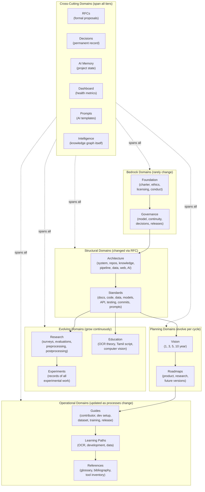
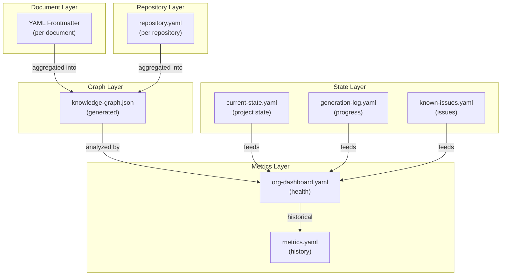
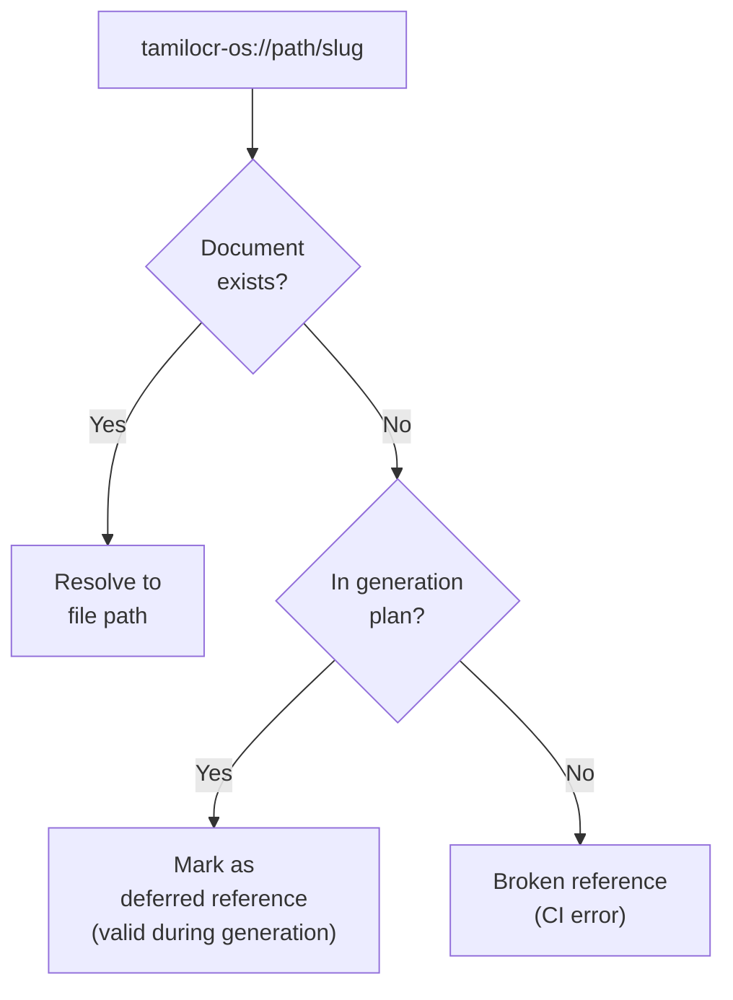
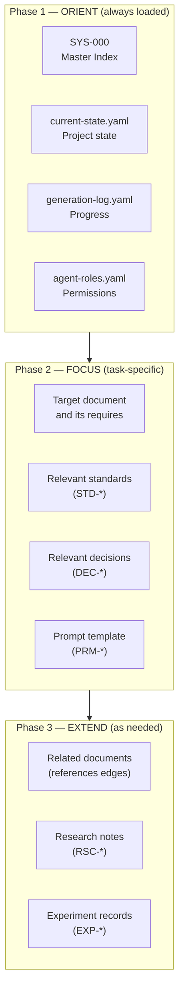
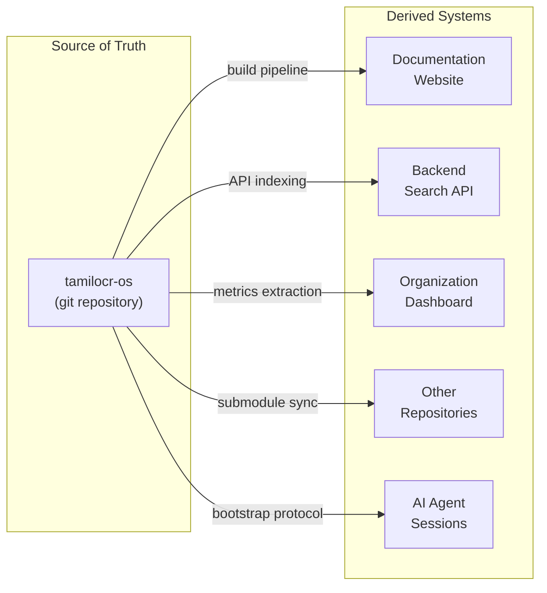
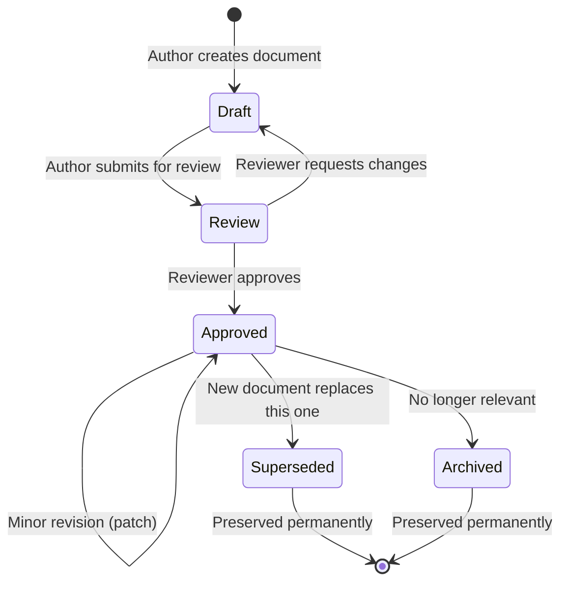

# ARCH-003 — Knowledge Architecture

> **ARCH-003 · 2026.07-r1 · Tier 2 — Architecture**
>
> The definitive knowledge architecture specification for the OpenTamilOCR organization.
> Knowledge is the primary asset of this organization. This document defines how it is structured.
> Changes require an RFC, a Decision Record, and Steering Council approval.

---

## 1. Purpose

This document defines how every piece of knowledge inside the OpenTamilOCR organization is created, connected, versioned, referenced, indexed, searched, synchronized, preserved, consumed, and evolved.

Source code is one representation of knowledge.
Trained models are another.
Datasets, benchmarks, decisions, research findings, standards, and governance policies are all forms of organizational knowledge.

This document defines the architecture that unifies all forms of knowledge into a single, navigable, machine-readable, human-readable, AI-native knowledge graph.

This specification inherits from ARCH-001 (System Architecture Overview, Section 7) and expands it into a complete architectural contract.

---

## 2. Scope

This specification governs:

- All documents in TamilOCR OS (71 planned items + SYS-000).
- All metadata, schemas, and templates.
- The knowledge graph structure and its tooling.
- AI memory files and dashboard data.
- Cross-references between all organizational artifacts.
- Knowledge discovery, search, and navigation.
- Knowledge synchronization across repositories, websites, and AI agents.
- Knowledge lifecycle from creation to archival.

---

## 3. Knowledge Philosophy

| # | Principle | Rationale |
|---|-----------|-----------|
| KP1 | **Knowledge First.** | Knowledge is the organization's primary asset. Code, models, and datasets are expressions of knowledge. The knowledge architecture precedes and governs all other architectures. |
| KP2 | **Documentation First.** | Knowledge must be documented before it is implemented. Undocumented knowledge does not exist in the organizational context (AP1, ARCH-001). |
| KP3 | **AI First.** | Every knowledge artifact must be navigable by AI agents without human assistance. Machine-readable metadata is mandatory (AP2, ARCH-001). |
| KP4 | **Human Readable.** | Every artifact must also be readable and useful to human contributors. AI-friendliness must not compromise human clarity. |
| KP5 | **Knowledge Graph Native.** | Knowledge is organized as a directed acyclic graph (DAG), not as flat files or a hierarchy. Every document is a node; every cross-reference is an edge. |
| KP6 | **Traceable.** | Every piece of knowledge can be traced to its origin, its author, and the decision that created it (P8, FND-001). |
| KP7 | **Versioned.** | Knowledge evolves. Every version is preserved. History is never destroyed. |
| KP8 | **Searchable.** | Knowledge that cannot be found is useless. Every artifact is indexed and discoverable through multiple search strategies. |
| KP9 | **Linked.** | Isolated knowledge fragments are less valuable than connected ones. Cross-references create meaning through context. |
| KP10 | **Reusable.** | Knowledge is written once and referenced everywhere. Duplication is avoided; references are preferred. |
| KP11 | **Immutable History.** | Once published, knowledge versions are preserved. Documents may be superseded but never silently modified or deleted. |
| KP12 | **Progressive Evolution.** | The knowledge base grows incrementally. Complexity is added only when earned (P5, FND-001). |
| KP13 | **Long-Term Preservation.** | The knowledge base is designed to be useful for decades. Formats, structures, and conventions are chosen for longevity. |
| KP14 | **Provenance.** | Every knowledge artifact records where it came from, who created it, and what evidence supports it. |

---

## 4. Organizational Knowledge Model

### 4.1 Knowledge Domains



### 4.2 Domain Relationships

| Relationship | Meaning | Example |
|-------------|---------|---------|
| **Authorizes** | A domain grants authority to another. | Foundation → Governance. |
| **Constrains** | A domain limits what another can define. | Architecture → Standards. |
| **Implements** | A domain provides concrete realization of another's design. | Standards → Guides. |
| **Extends** | A domain adds knowledge to another without replacing it. | Education → Learning Paths. |
| **Measures** | A domain evaluates another's outputs. | Benchmarks → Models. |
| **Records** | A domain captures decisions made in another. | Decisions → Architecture. |
| **Proposes** | A domain suggests changes to another. | RFCs → any domain. |

---

## 5. Knowledge Graph

### 5.1 Graph Structure

The organizational knowledge graph is a **directed acyclic graph (DAG)** where:

- **Nodes** are knowledge artifacts (documents, data files, schemas, templates).
- **Edges** are typed relationships between artifacts.
- **The root node** is SYS-000 (Master Index).
- **The graph is acyclic**: no circular dependencies are permitted within `requires` edges.

### 5.2 Node Properties

Every node in the knowledge graph carries these properties, derived from its YAML frontmatter:

| Property | Source | Purpose |
|----------|--------|---------|
| `id` | Frontmatter | Unique identifier. Primary key. |
| `title` | Frontmatter | Human-readable name. |
| `type` | Frontmatter | Category classification. |
| `tier` | Frontmatter | Position in the stability hierarchy (0–7, null for cross-cutting). |
| `status` | Frontmatter | Lifecycle state (draft, review, approved, superseded, archived). |
| `version` | Frontmatter | Knowledge version (CalVer or SemVer). |
| `owner` | Frontmatter | Accountable individual. |
| `tags` | Frontmatter | Searchable keywords for discovery. |
| `summary` | Frontmatter | One-paragraph description for AI context loading. |
| `quality_gate` | Frontmatter | Validation status. |
| `freshness` | Computed | Days since last update. Used for staleness detection. |
| `depth` | Computed | Distance from root (SYS-000). |
| `in_degree` | Computed | Number of documents that depend on this node. |
| `out_degree` | Computed | Number of documents this node depends on. |

### 5.3 Edge Types

| Edge Type | Frontmatter Field | Semantics | Constraint |
|-----------|------------------|-----------|------------|
| `requires` | `requires: []` | Hard dependency. Target must be understood first. | Must not form cycles. Must not point upward within tiers. |
| `references` | `references: []` | Soft dependency. Target provides context but is not prerequisite. | No structural constraint. |
| `supersedes` | `obsoletes` | This node replaces the target. | Target must exist. Target status becomes `superseded`. |
| `triggered_by` | `triggered_by` | This node was created because of a decision. | Target must be a DEC-NNN. |
| `proposed_by` | `source_rfc` | This node was proposed by an RFC. | Target must be an RFC-NNN. |

### 5.4 Graph Invariants

The knowledge graph must satisfy these invariants at all times.
`scripts/check-dependencies.py` enforces them automatically.

| # | Invariant | Enforcement |
|---|-----------|------------|
| G1 | **Acyclicity.** No cycles in `requires` edges. | CI check. |
| G2 | **Tier ordering.** No `requires` edge from a lower tier to a higher tier (e.g., Tier 3 → Tier 6). | CI check. |
| G3 | **Referential integrity.** Every `requires` and `references` target must exist or be planned in the registry. | CI check (warning for planned, error for unknown). |
| G4 | **ID uniqueness.** No two nodes share the same `id`. | CI check. |
| G5 | **ID permanence.** IDs are never reused after assignment. | Policy (enforced by review). |
| G6 | **Root reachability.** Every node is reachable from SYS-000 via `requires` or `references` edges. | CI check. |
| G7 | **Supersession chain integrity.** If A supersedes B, B's status must be `superseded` with a pointer to A. | CI check. |

### 5.5 Graph Generation

The knowledge graph is generated by `scripts/build-knowledge-graph.py`:

1. Scan all markdown files in TamilOCR OS.
2. Parse YAML frontmatter from each file.
3. Extract nodes (id, title, type, tier, status, tags, summary).
4. Extract edges (requires, references, obsoletes, triggered_by, source_rfc).
5. Validate graph invariants (G1–G7).
6. Output `knowledge-graph.json` — a machine-readable graph representation.
7. Optionally generate a Mermaid visualization.

This JSON file is consumed by:

- The documentation website (for navigation and search).
- The organization dashboard (for completeness metrics).
- AI agents (for context discovery).

---

## 6. Document Identity

### 6.1 ID Format

```
{PREFIX}-{NNN}
```

- **PREFIX**: 3-character uppercase type code.
- **NNN**: Zero-padded sequential number, starting at 001.
- IDs are **permanent**: once assigned, never reused or reassigned.
- Superseded documents retain their ID with `status: superseded`.

### 6.2 Registered Prefixes

| Prefix | Domain | Tier | Count | Namespace Authority |
|--------|--------|------|-------|-------------------|
| `SYS` | System | null | 1 | Steering Council |
| `FND` | Foundation | 0 | 4 | Steering Council |
| `GOV` | Governance | 1 | 4 | Steering Council |
| `ARCH` | Architecture | 2 | 7 | Steering Council |
| `STD` | Standards | 3 | 8 | Maintainers + SC |
| `RFC` | Proposals | Cross | Variable | Any contributor |
| `DEC` | Decisions | Cross | Variable | Decision makers |
| `RSC` | Research | 4 | 4+ | Maintainers |
| `EDU` | Education | 4 | 3+ | Maintainers |
| `EXP` | Experiments | 4 | Variable | Maintainers |
| `VIS` | Vision | 5 | 4 | Steering Council |
| `RDM` | Roadmaps | 5 | 3 | Steering Council |
| `GDE` | Guides | 6 | 5+ | Maintainers |
| `LRN` | Learning Paths | 6 | 3+ | Maintainers |
| `REF` | References | 7 | 3+ | Any contributor |
| `PRM` | Prompts | Cross | 4+ | Maintainers |
| `SCH` | Schemas | Infra | 6+ | Maintainers |
| `TPL` | Templates | Infra | 5+ | Maintainers |

**18 prefixes total.** New prefixes require RFC and Steering Council approval.

### 6.3 URI Scheme

Stable cross-references use the `tamilocr-os://` URI scheme:

```
tamilocr-os://{directory-path}/{document-slug}
```

| URI | Resolves To |
|-----|-------------|
| `tamilocr-os://foundation/charter` | `foundation/FND-001_Project_Charter.md` |
| `tamilocr-os://decisions/DEC-001-base-framework` | `decisions/DEC-001-base-framework.md` |
| `tamilocr-os://ai/memory/current-state` | `ai/memory/current-state.yaml` |
| `tamilocr-os://schemas/document-metadata` | `schemas/document-metadata.schema.json` |

**Resolution rules:**

1. Replace `tamilocr-os://` with the repository root path.
2. Append `.md` for documents, `.yaml` for data files, `.schema.json` for schemas.
3. If the target does not exist, check the generation log for planned status.
4. Unresolved URIs pointing to planned documents are not errors during the generation phase.

---

## 7. Metadata Architecture

### 7.1 Metadata Layers

Knowledge metadata exists at multiple layers, each serving a distinct purpose.



### 7.2 Document Metadata (Frontmatter)

The canonical metadata schema is defined in SCH-001 (`schemas/document-metadata.schema.json`).

| Category | Fields | Purpose |
|----------|--------|---------|
| **Identity** | `id`, `title`, `type` | Unique identification and classification. |
| **Version** | `version`, `revision` | Change tracking. |
| **Lifecycle** | `status`, `created`, `updated` | Lifecycle management. |
| **Ownership** | `owner`, `reviewers` | Accountability and review responsibility. |
| **Position** | `tier` | Location in the stability hierarchy. |
| **Relationships** | `requires`, `references`, `triggered_by`, `obsoletes`, `source_rfc` | Graph edges. |
| **Discovery** | `tags`, `summary` | Search and AI context loading. |
| **Quality** | `quality_gate` | Validation status tracking. |

### 7.3 Repository Metadata

Defined in ARCH-002, Section 7. Provides machine-readable metadata for each repository including category, layer, phase, owner, maintainers, dependencies, and AI bootstrap references.

### 7.4 AI State Metadata

| File | Fields | Purpose |
|------|--------|---------|
| `current-state.yaml` | Phase, priorities, blockers, active work, recent decisions. | AI session orientation. |
| `generation-log.yaml` | Per-document: ID, status, date approved, file path. | Progress tracking, duplicate prevention. |
| `known-issues.yaml` | Per-issue: description, severity, affected documents, status. | Persistent awareness. |

### 7.5 Metrics Metadata

| File | Fields | Purpose |
|------|--------|---------|
| `org-dashboard.yaml` | 14 metrics across 6 categories (ARCH-001, Section 14). | Current health snapshot. |
| `metrics.yaml` | Historical metric values with timestamps. | Trend analysis. |

### 7.6 Metadata Validation

- All document metadata is validated against SCH-001 by `scripts/validate-metadata.py`.
- Repository metadata is validated by CI against its schema.
- AI state files are validated for freshness by `scripts/staleness-check.py`.
- Graph-level validation is performed by `scripts/check-dependencies.py`.
- Validation runs automatically in CI on every PR.

---

## 8. Cross-Reference Architecture

### 8.1 Reference Types

| Type | Notation | Semantics | Example |
|------|----------|-----------|---------|
| **Hard dependency** | `requires: [ID]` | Cannot understand this document without the target. | ARCH-003 requires ARCH-001. |
| **Soft reference** | `references: [ID]` | Related context, not prerequisite. | ARCH-003 references GOV-002. |
| **Supersession** | `obsoletes: ID` | This document replaces the target. | A new charter obsoletes FND-001. |
| **Causal link** | `triggered_by: DEC-NNN` | This document exists because of a decision. | STD-003 triggered by DEC-002. |
| **Proposal link** | `source_rfc: RFC-NNN` | This document was proposed by an RFC. | DEC-001 proposed by RFC-001. |
| **Inline reference** | `tamilocr-os://path/slug` | In-text URI pointing to another document. | "See `tamilocr-os://standards/documentation-standards`." |
| **ID mention** | `as defined in ARCH-004` | Human-readable in-text reference by document ID. | Informal but traceable. |

### 8.2 Reference Rules

| Rule | Description |
|------|-------------|
| **R1: Forward references are allowed.** | Documents may reference planned (not yet generated) documents using `tamilocr-os://` URIs. |
| **R2: Backward references are encouraged.** | When a new document relates to an existing one, both should reference each other (forward in `references`, backward in an update). |
| **R3: No orphan nodes.** | Every document must be reachable from SYS-000 (invariant G6). |
| **R4: Stable URIs only.** | In-text references use `tamilocr-os://` URIs or document IDs. Never raw file paths. |
| **R5: Reference, don't duplicate.** | If knowledge exists in another document, reference it. Never copy substantial content. |
| **R6: External references use bibliography.** | References to external sources (papers, websites, tools) use the bibliography (REF-002). |

### 8.3 Reference Resolution



---

## 9. AI Knowledge Architecture

### 9.1 AI Knowledge Loading Strategy

AI agents interact with organizational knowledge through a structured loading protocol.



### 9.2 Loading Strategies

| Strategy | Description | Use Case |
|----------|-------------|----------|
| **Bootstrap loading** | Load Phase 1 (orient) files. Minimum context for any session. | Every AI session start. |
| **Focused loading** | Load the target document + its `requires` dependencies + relevant standards. | Document generation, review. |
| **Lazy loading** | Load additional context only when the task reveals a need. | Complex research, multi-document analysis. |
| **Snapshot loading** | Load `current-state.yaml` for a point-in-time project understanding. | Status reporting, dashboard updates. |

### 9.3 Session Independence

Every AI session must be independently functional:

- No session depends on a previous session's context or memory.
- All project state is persisted in AI Memory files, not in chat history.
- If an AI provider becomes unavailable, another can substitute without knowledge loss.
- The Bootstrap Protocol (SYS-000) ensures any agent can reach full awareness from zero context.

### 9.4 Cross-Session Consistency

Consistency across AI sessions is maintained through:

| Mechanism | Description |
|-----------|-------------|
| **AI Memory files** | Persistent YAML files capture project state between sessions. |
| **Generation log** | Tracks which documents have been generated, preventing duplicate work. |
| **Quality gates** | Each document is validated against the same schema regardless of which session created it. |
| **Frontmatter contracts** | Every document declares its dependencies, ensuring any agent can verify consistency. |

### 9.5 Context Window Management

Large knowledge bases may exceed AI context windows. The architecture addresses this through:

| Technique | Application |
|-----------|-------------|
| **Summary fields** | Every document's `summary` provides a one-paragraph overview for quick relevance assessment. |
| **Tiered loading** | Load high-tier (stable) documents as trusted references without re-analysis. |
| **Selective section reading** | Load specific sections of large documents rather than entire files. |
| **Tag-based discovery** | Use `tags` to identify relevant documents without reading them. |
| **Graph traversal** | Follow `requires` edges to load only the dependency chain needed for a specific task. |

### 9.6 Hallucination Prevention

| Safeguard | Mechanism |
|-----------|-----------|
| **Source verification** | AI agents cite specific document IDs and sections, not paraphrased knowledge. |
| **Consistency checking** | AI outputs are validated against existing approved documents. |
| **Human review** | All AI-generated content requires human approval before becoming permanent knowledge. |
| **Contradiction detection** | AI agents are instructed to flag contradictions with approved documents rather than silently resolving them. |
| **Knowledge boundaries** | AI agents declare when they are operating beyond documented knowledge. |

---

## 10. Search Architecture

### 10.1 Search Strategies

| Strategy | Description | Implementation |
|----------|-------------|---------------|
| **Keyword search** | Full-text search across document content. | Search index (Pagefind, Algolia, or backend Search Service). |
| **Metadata search** | Query documents by frontmatter fields (type, tier, status, tags, owner). | `knowledge-graph.json` + filtering. |
| **Graph traversal** | Navigate the knowledge graph by following edges. "What depends on ARCH-001?" | `scripts/build-knowledge-graph.py` output. |
| **ID lookup** | Resolve a document ID to its file path and content. | Registry in SYS-000, Section 4. |
| **URI resolution** | Resolve a `tamilocr-os://` URI to a file. | URI resolver (Section 6.3). |
| **Tag-based discovery** | Find documents by topic tags. | Tag index from frontmatter. |
| **Relationship search** | "What was triggered by DEC-001?" | Graph query on `triggered_by` edges. |
| **Version search** | Find a specific version of a document. | Git history + version metadata. |
| **Semantic search** | Find conceptually related documents using embeddings. | Future: vector index (when scale warrants it). |

### 10.2 Search Interfaces

| Interface | Audience | Strategy |
|-----------|----------|----------|
| **Documentation website** | Human users | Keyword + tag + navigation. |
| **CLI tools** | Developers | `grep`, metadata queries, graph traversal scripts. |
| **Backend API** | Applications | REST endpoints for keyword, metadata, and graph queries. |
| **AI agents** | AI sessions | Summary scanning + graph traversal + focused loading. |

---

## 11. Knowledge Synchronization

### 11.1 Synchronization Flow



### 11.2 Synchronization Rules

| Rule | Description |
|------|-------------|
| **Single source of truth.** | `tamilocr-os` is the canonical origin. All derived systems are read-only consumers. |
| **Pull, not push.** | Derived systems pull updates from the source. The source never pushes to consumers. |
| **Eventual consistency.** | Derived systems may be temporarily behind the source. Staleness thresholds are defined per system. |
| **Idempotent sync.** | Synchronization operations can be safely repeated without side effects. |
| **Version-aware.** | Consumers track which version of `tamilocr-os` they are synchronized to. |

### 11.3 Synchronization Mechanisms

| Consumer | Mechanism | Frequency |
|----------|-----------|-----------|
| **Documentation website** | Build pipeline triggered by git push to `main`. | Per commit to `main`. |
| **Backend Search API** | Indexing pipeline reads `knowledge-graph.json` and document content. | Per release or on-demand. |
| **Organization Dashboard** | Metrics extraction script reads frontmatter and AI Memory files. | Per significant event or weekly. |
| **Other repositories** | Git submodule update for shared configs. | Maintainer-initiated, staleness-checked by CI. |
| **AI agents** | Bootstrap Protocol reads current files at session start. | Per session. |

---

## 12. Knowledge Lifecycle

### 12.1 Lifecycle States



### 12.2 State Definitions

| State | Meaning | Visibility | Modifiability |
|-------|---------|------------|--------------|
| **Draft** | Work in progress. Not yet reviewed. | Author and reviewers. | Freely modifiable. |
| **Review** | Submitted for peer review. | All contributors. | Modifiable based on review feedback. |
| **Approved** | Ratified and authoritative. | Public. | Only through formal revision process. |
| **Superseded** | Replaced by a newer document. Preserved for historical reference. | Public (marked as superseded). | Not modifiable. Read-only. |
| **Archived** | No longer relevant. Preserved for reference. | Public (marked as archived). | Not modifiable. Read-only. |

### 12.3 State Transitions

| Transition | Trigger | Authority | Required |
|------------|---------|-----------|----------|
| Draft → Review | Author submits PR. | Author. | Complete content, valid metadata. |
| Review → Draft | Reviewer requests changes. | Reviewer. | Review comments. |
| Review → Approved | Reviewer approves. | Per GOV-001 authority matrix. | Quality gate passed. |
| Approved → Approved (revision) | Content update within scope. | Per GOV-001 authority matrix. | PR + review. Version increment. |
| Approved → Superseded | New document with `obsoletes: OLD-ID`. | Per GOV-001 authority matrix. | RFC (if major), DEC record. |
| Approved → Archived | Content no longer relevant. | Steering Council. | DEC record. |

### 12.4 Preservation Policy

- **No knowledge is deleted.** Superseded and archived documents remain in the repository.
- **Git history is preserved.** All versions are recoverable from git history.
- **Decision rationale persists.** DEC records explain why knowledge was superseded or archived.
- **Links remain valid.** Superseded documents include a pointer to their replacement. URIs continue to resolve.

---

## 13. Knowledge Versioning

### 13.1 Versioning Strategies

| Artifact Type | Strategy | Format | Example |
|---------------|----------|--------|---------|
| **TamilOCR OS documents** | CalVer with revision | `YYYY.MM-rN` | `2026.07-r2` |
| **Software** | Semantic Versioning | `MAJOR.MINOR.PATCH` | `1.2.3` |
| **Datasets** | Semantic Versioning | `MAJOR.MINOR.PATCH` | `1.0.0` |
| **Models** | Semantic Versioning | `MAJOR.MINOR.PATCH` | `1.0.0` |
| **Knowledge graph snapshot** | Timestamp | ISO 8601 | `2026-07-04T10:00:00Z` |
| **AI Memory snapshot** | Timestamp | ISO 8601 | `2026-07-04T10:00:00Z` |

### 13.2 Version Increment Rules

| Change Type | Increment | Example |
|-------------|-----------|---------|
| Substantive content change | Revision (`rN`) or MINOR | `2026.07-r1` → `2026.07-r2` |
| Major restructuring | CalVer month or MAJOR | `2026.07` → `2026.08` |
| Formatting/typo fix | No version change | — |
| Registry status update | No version change | — |
| Metadata-only correction | No version change | `updated` field refreshed |

### 13.3 Compatibility

- **Within a CalVer month:** All revisions are backward-compatible. No structural changes.
- **Across CalVer months:** Structural changes are possible but documented in the changelog.
- **SemVer MAJOR:** Breaking changes. Migration guide required (GOV-004, Section 5.5).

---

## 14. Knowledge Governance

### 14.1 Ownership Model

| Knowledge Tier | Owner | Change Authority |
|----------------|-------|-----------------|
| Tier 0 (Bedrock) | Steering Council | Ratification vote |
| Tier 1 (Governance) | Steering Council | Steering Council approval |
| Tier 2 (Architecture) | Steering Council | RFC → DEC → SC approval |
| Tier 3 (Standards) | Maintainers + SC | RFC → maintainer + SC member |
| Tier 4 (Knowledge) | Maintainers | 1 maintainer |
| Tier 5 (Planning) | Steering Council | Steering Council |
| Tier 6 (Operations) | Maintainers | 1 maintainer |
| Tier 7 (References) | Any contributor | Any contributor |
| Cross-cutting | Variable | Per system definition |

### 14.2 Knowledge Quality Framework

| Quality Dimension | Measurement | Tooling |
|-------------------|-------------|---------|
| **Completeness** | % of planned documents approved. | `scripts/generate-index.py` |
| **Freshness** | Age of AI Memory files. | `scripts/staleness-check.py` |
| **Consistency** | Number of broken references. | `scripts/check-dependencies.py` |
| **Validity** | Number of metadata validation errors. | `scripts/validate-metadata.py` |
| **Connectivity** | Average node degree in knowledge graph. | `scripts/build-knowledge-graph.py` |
| **Accessibility** | Documentation website uptime and search quality. | Monitoring. |

---

## 15. Governance Relationship

| Document | Relationship |
|----------|-------------|
| FND-001 — Project Charter | Parent. Principles P1 (Single Source of Truth), P2 (Knowledge Graph First), P3 (AI-Native Design), and P8 (Decision Traceability) are implemented by this architecture. |
| GOV-001 — Governance Model | Required. Defines ownership and authority for knowledge management. |
| GOV-002 — Business Continuity | Sibling. Knowledge preservation is a continuity requirement. |
| GOV-003 — Decision Process | Required. RFC and DEC systems are knowledge infrastructure. |
| GOV-004 — Release Governance | Sibling. Release lifecycle governs knowledge publication. |
| ARCH-001 — System Architecture | Required. Section 7 defines the high-level knowledge architecture this document expands. |
| ARCH-002 — Repository Architecture | Required. Repository metadata and structure support knowledge infrastructure. |
| ARCH-007 — AI Workflow Architecture | Child. AI knowledge loading is expanded in the AI workflow specification. |
| STD-001 — Documentation Standards | Downstream. Writing standards implement the conventions defined here. |

---

## 16. Related Documents

| Document | Relationship |
|----------|-------------|
| SYS-000 — Master Index | Root. The knowledge graph root node. |
| ARCH-001 — System Architecture | Required. Parent architecture. |
| ARCH-002 — Repository Architecture | Required. Repository metadata. |
| FND-001 — Project Charter | Required. Knowledge principles. |
| GOV-001 — Governance Model | Required. Knowledge ownership. |
| GOV-003 — Decision Process | Required. RFC and DEC systems. |
| GOV-002 — Business Continuity | Reference. Knowledge preservation. |
| GOV-004 — Release Governance | Reference. Knowledge publication. |
| FND-003 — Ethics Framework | Reference. Ethical knowledge management. |

---

## 17. Review Policy

- **Review frequency:** Every 6 months during the Architecture Review Cycle, or when a new knowledge domain is introduced.
- **Amendment process:** RFC → DEC → Steering Council approval.
- **Trigger for review:** Introduction of a new document prefix, new cross-cutting system, or new synchronization consumer.

---

## 18. Document History

| Version | Date | Summary |
|---------|------|---------|
| 2026.07-r1 | 2026-07-04 | Initial draft. Founding knowledge architecture specification for the OpenTamilOCR organization. |

---

> **Approved by:** Pending Steering Council approval.
> **Effective date:** Upon approval.
