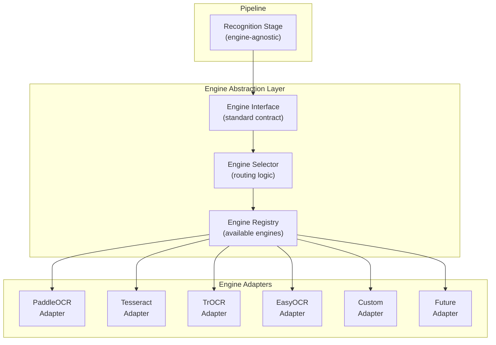
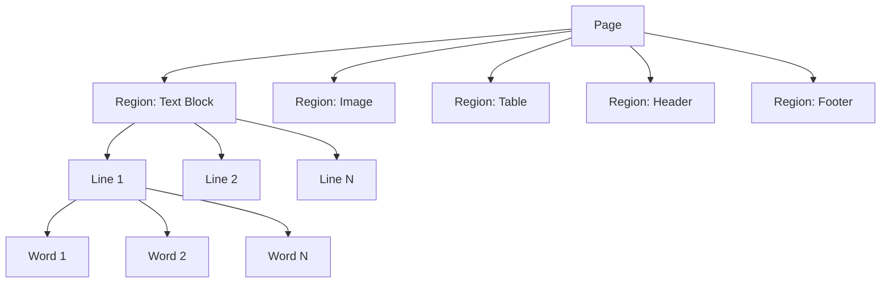
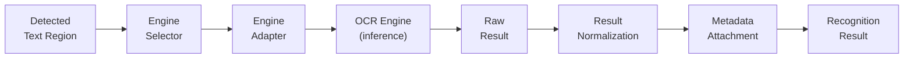
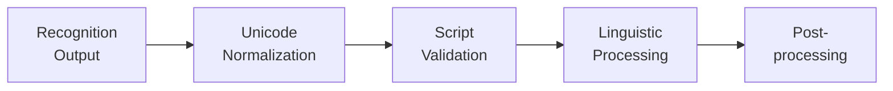
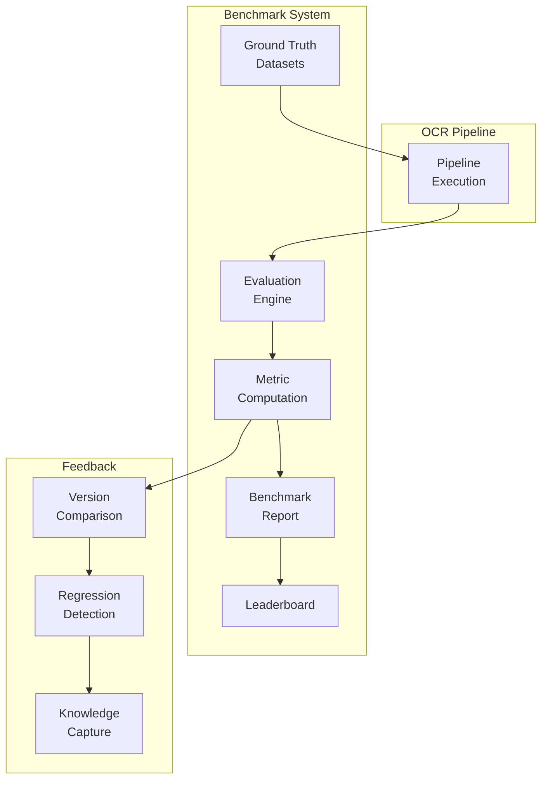
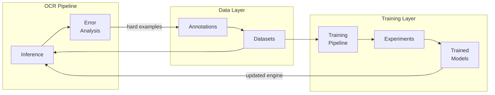
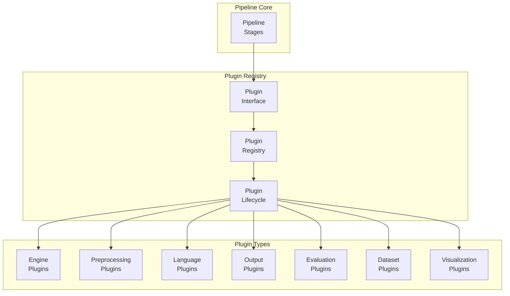

# ARCH-004 — OCR Pipeline Architecture

> **ARCH-004 · 2026.07-r1 · Tier 2 — Architecture**
>
> The definitive OCR pipeline architecture specification for the OpenTamilOCR organization.
> This architecture is engine-independent. The pipeline is permanent; engines are interchangeable.
> Changes require an RFC, a Decision Record, and Steering Council approval.

---

## 1. Purpose

This document defines the complete logical architecture of the OpenTamilOCR recognition pipeline — from document input through image processing, layout analysis, text detection, character recognition, Tamil-specific post-processing, quality validation, and structured output.

This is an architecture document, not an implementation guide.

- It does **not** define algorithms.
- It does **not** define model internals.
- It does **not** recommend one OCR engine over another.
- It defines the **structural contracts** between pipeline stages, the **plugin interfaces** that allow each stage to be replaced, and the **integration points** that connect the pipeline to datasets, benchmarks, training, and the knowledge system.

The pipeline is permanent. Engines come and go. This architecture outlasts any individual engine.

---

## 2. Scope

This specification covers:

- The end-to-end logical pipeline (17 stages).
- The OCR engine abstraction layer (engine-independent).
- Input, preprocessing, layout, detection, recognition, and output architectures.
- Tamil language processing layer.
- Plugin architecture for extensibility.
- Benchmark and training integration points.
- Error handling, observability, security, and scalability.

This specification does **not** cover:

- Specific algorithms (covered in research documents RSC-001 through RSC-004).
- Training configurations (covered in ARCH-005 and operational guides).
- API endpoints for serving (covered in ARCH-006).

---

## 3. Pipeline Philosophy

| # | Principle | Rationale |
|---|-----------|-----------|
| PP1 | **Modular.** | Each pipeline stage is an independent module with defined inputs, outputs, and contracts. Stages can be developed, tested, and benchmarked in isolation. |
| PP2 | **Engine-Independent.** | The pipeline does not depend on any specific OCR engine. Engines are plugged in through an abstraction layer. The architecture survives engine replacement. |
| PP3 | **Replaceable.** | Every stage can be replaced with an alternative implementation without affecting adjacent stages. |
| PP4 | **Language-Aware.** | The pipeline has a dedicated Tamil language processing layer. Language-specific logic is isolated from engine-agnostic stages. |
| PP5 | **Plugin-Based.** | Extension points are defined at every major stage. Third-party and community modules integrate through plugin interfaces. |
| PP6 | **Benchmark-Driven.** | Every stage is measurable. Benchmark integration is a first-class architectural concern, not an afterthought. |
| PP7 | **Dataset-Driven.** | The pipeline is designed to consume, produce, and validate against structured datasets. |
| PP8 | **Observable.** | Processing metrics, quality scores, and confidence values are emitted at every stage. The pipeline is transparent, not a black box. |
| PP9 | **Reproducible.** | Given the same input, configuration, and engine version, the pipeline produces identical output (P6, FND-001). |
| PP10 | **Extensible.** | New stages, engines, languages, and output formats can be added without modifying the core pipeline architecture. |
| PP11 | **Testable.** | Every stage has a defined test interface. Unit, integration, and end-to-end testing are architecturally supported. |
| PP12 | **AI-Assisted.** | AI agents can analyze pipeline behavior, suggest improvements, and interpret benchmark results. AI never replaces human validation. |

---

## 4. End-to-End Pipeline Overview

### 4.1 Complete Pipeline

```mermaid
graph TD
    subgraph INPUT["1. Input Layer"]
        I1["1a. Document\nAcquisition"]
        I2["1b. Input\nValidation"]
        I3["1c. Format\nNormalization"]
    end

    subgraph ANALYSIS["2. Image Analysis Layer"]
        A1["2a. Quality\nEstimation"]
        A2["2b. Image\nCharacterization"]
    end

    subgraph PREPROCESS["3. Preprocessing Layer"]
        P1["3a. Enhancement"]
        P2["3b. Binarization"]
        P3["3c. Noise\nReduction"]
        P4["3d. Geometric\nCorrection"]
    end

    subgraph LAYOUT["4. Layout Analysis Layer"]
        L1["4a. Page\nSegmentation"]
        L2["4b. Region\nClassification"]
        L3["4c. Reading Order\nDetermination"]
    end

    subgraph DETECT["5. Text Detection Layer"]
        D1["5a. Text Region\nDetection"]
        D2["5b. Line\nSegmentation"]
        D3["5c. Word\nSegmentation"]
    end

    subgraph RECOGNIZE["6. Recognition Layer"]
        R1["6a. Engine\nAbstraction"]
        R2["6b. Character\nRecognition"]
        R3["6c. Recognition\nMetadata"]
    end

    subgraph LANGUAGE["7. Tamil Language Layer"]
        T1["7a. Unicode\nNormalization"]
        T2["7b. Script\nValidation"]
        T3["7c. Linguistic\nProcessing"]
    end

    subgraph POST["8. Post-processing Layer"]
        Q1["8a. Confidence\nAnalysis"]
        Q2["8b. Error\nCorrection"]
        Q3["8c. Quality\nValidation"]
    end

    subgraph OUTPUT["9. Output Layer"]
        O1["9a. Format\nSerialization"]
        O2["9b. Metadata\nAttachment"]
        O3["9c. Export"]
    end

    I1 --> I2 --> I3
    I3 --> A1 --> A2
    A2 --> P1 --> P2 --> P3 --> P4
    P4 --> L1 --> L2 --> L3
    L3 --> D1 --> D2 --> D3
    D3 --> R1 --> R2 --> R3
    R3 --> T1 --> T2 --> T3
    T3 --> Q1 --> Q2 --> Q3
    Q3 --> O1 --> O2 --> O3
```

### 4.2 Stage Responsibilities

| Layer | Stage | Responsibility | Input | Output |
|-------|-------|---------------|-------|--------|
| **Input** | 1a. Acquisition | Accept documents from files, APIs, or streams. | Raw file, URL, or byte stream. | Validated file reference. |
| | 1b. Validation | Verify file integrity, format, and size limits. | File reference. | Validated input with format metadata. |
| | 1c. Normalization | Convert to standard internal representation. | Any supported format. | Normalized image array + source metadata. |
| **Analysis** | 2a. Quality Estimation | Assess input quality (resolution, contrast, noise level). | Image array. | Quality score + quality metadata. |
| | 2b. Characterization | Detect document type, orientation, and properties. | Image array + quality metadata. | Document characterization profile. |
| **Preprocessing** | 3a. Enhancement | Improve contrast, brightness, and sharpness. | Image array + characterization. | Enhanced image. |
| | 3b. Binarization | Convert to binary (black/white) where needed. | Image array. | Binarized image. |
| | 3c. Noise Reduction | Remove artifacts, speckles, and background noise. | Image array. | Cleaned image. |
| | 3d. Geometric Correction | Deskew, de-warp, crop, and rotate. | Image array. | Geometrically corrected image. |
| **Layout** | 4a. Segmentation | Divide page into regions (text, image, table, etc.). | Processed image. | List of regions with bounding coordinates. |
| | 4b. Classification | Classify each region by type. | Region list. | Typed region list. |
| | 4c. Reading Order | Determine logical reading sequence of regions. | Typed region list. | Ordered region list. |
| **Detection** | 5a. Text Regions | Identify text-containing areas. | Ordered text regions. | Text bounding structures. |
| | 5b. Lines | Segment text regions into lines. | Text bounding structures. | Line objects with coordinates. |
| | 5c. Words | Segment lines into words. | Line objects. | Word objects with coordinates. |
| **Recognition** | 6a. Engine Abstraction | Route to the configured OCR engine. | Word/line images. | Engine-specific call. |
| | 6b. Character Recognition | Perform inference. | Image region. | Raw character sequence + confidence. |
| | 6c. Metadata | Attach recognition metadata (engine, model, timing). | Raw output. | Annotated recognition result. |
| **Tamil Language** | 7a. Unicode Normalization | Normalize Tamil Unicode (NFC/NFD). | Text string. | Normalized text. |
| | 7b. Script Validation | Validate Tamil character sequences against script rules. | Text string. | Validation result + flagged issues. |
| | 7c. Linguistic Processing | Apply Tamil morphology, lexicon lookup, and contextual rules. | Text string. | Linguistically processed text. |
| **Post-processing** | 8a. Confidence Analysis | Aggregate and analyze per-character and per-word confidence. | Recognition results. | Confidence report. |
| | 8b. Error Correction | Apply spelling, grammar, and contextual corrections. | Text + confidence. | Corrected text. |
| | 8c. Quality Validation | Validate final output against quality thresholds. | Corrected text + metadata. | Quality-validated result. |
| **Output** | 9a. Serialization | Format result into requested output format. | Validated result. | Formatted output. |
| | 9b. Metadata | Attach provenance, pipeline config, engine info, and quality metadata. | Formatted output. | Output with full metadata. |
| | 9c. Export | Write to file, return via API, or stream to consumer. | Final output. | Delivered result. |

---

## 5. OCR Engine Abstraction Layer

### 5.1 Architecture

### 5.2 Engine Interface Contract

Every OCR engine adapter must implement a standard interface:

| Method | Input | Output | Description |
|--------|-------|--------|-------------|
| `recognize(image, config)` | Image region + configuration. | Recognition result with text, confidence, and bounding boxes. | Core recognition. |
| `capabilities()` | None. | Capability descriptor. | Report what this engine can do (languages, input types, features). |
| `version()` | None. | Version string + metadata. | Return engine and model version for reproducibility. |
| `health()` | None. | Health status. | Report if the engine is operational. |

### 5.3 Engine Registry

The engine registry tracks all available engines:

| Field | Description |
|-------|-------------|
| `engine_id` | Unique identifier (e.g., `paddleocr`, `tesseract`). |
| `adapter_class` | The adapter implementation. |
| `version` | Engine version. |
| `capabilities` | Supported languages, input types, and features. |
| `status` | `active`, `deprecated`, `experimental`. |
| `benchmark_results` | Link to latest benchmark results for this engine. |
| `license` | Engine license (must be compatible with Apache 2.0, per FND-004, Section 9). |

### 5.4 Engine Selection

Engine selection is configuration-driven:

| Strategy | Description |
|----------|-------------|
| **Explicit** | Configuration specifies a single engine. Default for production. |
| **Capability-based** | Select the engine that matches required capabilities (language, input type). |
| **Benchmark-based** | Select the engine with the best benchmark score for the task. |
| **Fallback chain** | If the primary engine fails, try the next engine in a configured chain. |
| **Ensemble** | Run multiple engines and fuse results. Research mode. |

### 5.5 Base Framework Relationship

OpenTamilOCR improves an existing open-source OCR framework (FND-001, Section 3).
The base framework is selected through DEC-001 (Base Framework Selection).

- The base framework is the **default engine**, not the only engine.
- The abstraction layer ensures that improving the base framework does not prevent supporting alternatives.
- Framework selection is an architectural decision. Changing the base framework requires RFC → DEC → Steering Council approval.

---

## 6. Input Architecture

### 6.1 Supported Input Types

| Category | Formats | Notes |
|----------|---------|-------|
| **Raster images** | PNG, JPEG, TIFF, BMP, WebP | Primary input type. |
| **Documents** | PDF (image-based and text-based) | Multi-page support. |
| **Archives** | ZIP, TAR (containing supported images) | Batch processing. |
| **Streams** | Byte stream via API | Real-time processing. |
| **Future** | Camera capture, video frames, DICOM | Added via input plugins. |

### 6.2 Input Validation

| Check | Description | Failure Action |
|-------|-------------|---------------|
| **Format recognition** | Verify the file is a supported format. | Reject with descriptive error. |
| **Integrity** | Verify the file is not corrupted. | Reject. |
| **Size limits** | Enforce maximum file size and resolution limits. | Reject with limit information. |
| **Safety** | Verify no embedded malicious content (for PDF). | Reject. |
| **Metadata extraction** | Extract EXIF, DPI, color space, and page count. | Proceed with defaults if metadata is missing. |

### 6.3 Format Normalization

All inputs are normalized to a standard internal representation:

| Property | Standard |
|----------|----------|
| **Color space** | RGB (or grayscale where appropriate). |
| **Bit depth** | 8-bit per channel. |
| **Coordinate system** | Origin at top-left, x-right, y-down. |
| **Multi-page** | Each page processed as an independent image with page index metadata. |
| **Metadata** | Source format, original resolution, page count, file provenance. |

---

## 7. Image Processing Architecture

### 7.1 Processing Pipeline

Image processing stages are **configurable** and **optional**.
Each stage can be enabled, disabled, or replaced based on input quality and use case.

| Stage | Responsibility | Configurable? | Skippable? |
|-------|---------------|---------------|------------|
| **Quality estimation** | Assess input quality before processing. Recommend processing steps. | Parameters tunable. | No (always runs). |
| **Enhancement** | Improve contrast, brightness, and sharpness for low-quality inputs. | Algorithm and parameters. | Yes (for high-quality inputs). |
| **Binarization** | Convert to binary for engines that require it. | Algorithm selection. | Yes (if engine handles color). |
| **Noise reduction** | Remove artifacts and background noise. | Aggressiveness level. | Yes (for clean inputs). |
| **Geometric correction** | Deskew, crop, de-warp. | Correction thresholds. | Yes (for already-aligned inputs). |

### 7.2 Adaptive Processing

The pipeline supports **adaptive processing** based on the quality estimation stage:

- High-quality input → skip enhancement and noise reduction.
- Low-quality input → apply full preprocessing chain.
- Degraded historical document → apply specialized historical document profile.

Processing profiles are defined in configuration, not in code.

---

## 8. Layout Analysis Architecture

### 8.1 Region Model

The layout analysis stage produces a hierarchical region model:

### 8.2 Region Types

| Type | Description | Processing Path |
|------|-------------|----------------|
| **Text block** | Paragraph or continuous text. | → Text detection → Recognition. |
| **Table** | Tabular data with rows and columns. | → Table structure analysis → Cell-level recognition. |
| **Image** | Non-text visual content. | → Skip recognition. Preserve as metadata. |
| **Header / Footer** | Page-level metadata regions. | → Recognition (optional, based on config). |
| **Caption** | Text associated with an image. | → Recognition. |
| **Mixed** | Region containing both text and non-text elements. | → Decompose into sub-regions. |

### 8.3 Reading Order

- Reading order is determined by the layout analysis stage, not hardcoded.
- Default reading order: top-to-bottom, left-to-right (standard for Tamil printed text).
- Alternative reading orders (multi-column, right-to-left) are configurable.
- Reading order is stored as an ordered list of region references.

---

## 9. Text Detection Architecture

### 9.1 Detection Hierarchy

| Level | Object | Properties |
|-------|--------|------------|
| **Region** | Text block | Bounding polygon, type, confidence. |
| **Line** | Text line | Bounding box, baseline, line height, line index. |
| **Word** | Word | Bounding box, word index within line. |
| **Character** | Individual character (optional, engine-dependent) | Bounding box, character index. |

### 9.2 Bounding Structures

| Structure | Use Case |
|-----------|----------|
| **Axis-aligned bounding box** | Standard for printed, well-aligned text. `[x, y, width, height]`. |
| **Oriented bounding box** | For rotated text. `[cx, cy, width, height, angle]`. |
| **Polygon** | For irregular text regions. `[[x1,y1], [x2,y2], ..., [xn,yn]]`. |

All bounding structures use pixel coordinates relative to the processed image, with origin at top-left.

---

## 10. Recognition Architecture

### 10.1 Recognition Flow

### 10.2 Recognition Result Contract

Every engine adapter returns results conforming to this contract:

| Field | Type | Description |
|-------|------|-------------|
| `text` | String | Recognized text (raw, before post-processing). |
| `confidence` | Float [0.0, 1.0] | Recognition confidence score. |
| `bounding_box` | BoundingStructure | Location of the recognized text in the image. |
| `level` | Enum | `character`, `word`, `line`, `region`. |
| `engine_id` | String | Which engine produced this result. |
| `engine_version` | String | Engine version for reproducibility. |
| `model_id` | String (optional) | Which model within the engine was used. |
| `processing_time_ms` | Integer | Inference time in milliseconds. |
| `alternatives` | List (optional) | Alternative recognition hypotheses with confidence scores. |

### 10.3 Error Handling

| Failure Mode | Response |
|-------------|----------|
| Engine unavailable | Try fallback engine from the fallback chain. If all fail, return error with diagnostic. |
| Engine timeout | Return partial result with timeout flag. Log warning. |
| Low confidence | Return result with confidence below threshold flagged. Post-processing decides whether to accept. |
| Invalid output | Log error. Skip region. Include in quality report. |

---

## 11. Tamil Language Layer

### 11.1 Architecture

The Tamil language layer is a dedicated processing stage between recognition and general post-processing. It encapsulates all Tamil-specific logic.

### 11.2 Unicode Normalization

| Concern | Approach |
|---------|----------|
| **NFC/NFD normalization** | Normalize to NFC (Canonical Decomposition followed by Canonical Composition) as the standard form. |
| **Tamil Unicode range** | U+0B80 to U+0BFF (Tamil block). |
| **Combining characters** | Validate proper ordering of base characters and combining marks. |
| **Zero-Width characters** | Handle Zero-Width Joiner (ZWJ) and Zero-Width Non-Joiner (ZWNJ) correctly. |

### 11.3 Script Validation

| Rule | Description |
|------|-------------|
| **Valid Tamil sequences** | Verify that character sequences follow Tamil script rules (e.g., consonant + vowel sign, not two vowel signs in sequence). |
| **Grantha characters** | Handle Grantha script extensions used in Tamil (ஜ, ஷ, ஸ, ஹ). |
| **Tamil numerals** | Support both Tamil numerals (௧, ௨, ...) and Arabic numerals. |
| **Tamil symbols** | Handle Tamil-specific symbols (ௐ, currency, fractions). |
| **Mixed script** | Detect and handle mixed Tamil-English text. Apply language-appropriate processing to each segment. |

### 11.4 Linguistic Processing

| Component | Responsibility |
|-----------|---------------|
| **Lexicon** | Dictionary of Tamil words for spell-checking and validation. Loadable, versioned, replaceable. |
| **Morphological analysis** | Tamil agglutinative morphology awareness for compound word validation. |
| **Contextual rules** | Language-specific rules for common OCR errors in Tamil (e.g., confusable character pairs). |
| **Transliteration support** | Optional romanization of Tamil text (architectural hook, not mandatory). |

### 11.5 Future Multilingual Support

The Tamil language layer is designed as one instance of a **language processing plugin**:

- The pipeline defines a `LanguageProcessor` interface.
- Tamil is the first (and currently only) implementation.
- Adding a new language means implementing a new `LanguageProcessor`, not modifying the pipeline.
- Language detection at the input stage routes text to the appropriate processor.

---

## 12. Post-Processing Architecture

### 12.1 Post-Processing Pipeline

| Stage | Responsibility |
|-------|---------------|
| **Confidence analysis** | Aggregate character-level, word-level, and line-level confidence scores. Flag low-confidence regions. |
| **Spell correction** | Apply dictionary-based and statistical spell correction. |
| **Grammar rules** | Apply Tamil grammar rules for common OCR error patterns. |
| **Contextual correction** | Use surrounding context to resolve ambiguous recognitions. |
| **Confidence fusion** | Combine recognition confidence with correction confidence for a final quality score. |
| **Quality validation** | Compare final output against quality thresholds. Pass/fail/flag. |

### 12.2 Human Review Integration

The pipeline supports an optional human review stage:

- Low-confidence results can be flagged for human review.
- Human corrections feed back into training data.
- Review hooks are architectural extension points, not mandatory pipeline stages.
- The review interface is defined in the platform layer (ARCH-006), not here.

---

## 13. Benchmark Integration

### 13.1 Integration Architecture

### 13.2 Integration Points

| Point | Description |
|-------|-------------|
| **Dataset consumption** | The pipeline processes benchmark datasets from `tamilocr-datasets`. |
| **Metric emission** | The pipeline emits per-sample metrics (CER, WER, confidence, timing). |
| **Version tagging** | Benchmark runs are tagged with pipeline version, engine version, and model version. |
| **Regression detection** | Automated comparison against previous benchmark runs detects performance regressions. |
| **Report generation** | Structured benchmark reports are generated for release quality gates (GOV-004, Section 8). |
| **Leaderboard updates** | Results feed into the benchmark leaderboard on the documentation website. |

### 13.3 Core Metrics

| Metric | Level | Description |
|--------|-------|-------------|
| **CER** | Character | Character Error Rate — primary accuracy metric. |
| **WER** | Word | Word Error Rate — secondary accuracy metric. |
| **Accuracy** | Character/Word | 1 - error rate. |
| **Confidence calibration** | Character/Word | How well confidence scores predict actual accuracy. |
| **Processing time** | Page/Document | Wall-clock time per page. |
| **Throughput** | System | Pages processed per second. |

---

## 14. Training Integration

### 14.1 Training Feedback Loop

### 14.2 Integration Points

| Point | Data Flow |
|-------|-----------|
| **Error analysis → Active learning** | Pipeline errors identify hard examples for targeted annotation. |
| **Inference → Training data** | Corrected OCR output becomes training data (with human validation). |
| **Model update → Pipeline** | New trained models are loaded into the engine abstraction layer. |
| **Experiment tracking** | Training experiments are recorded as EXP-NNN records. |
| **Continuous improvement** | The benchmark → training → inference cycle drives iterative improvement. |

---

## 15. Output Architecture

### 15.1 Supported Output Formats

| Format | Standard | Use Case |
|--------|----------|----------|
| **Plain text** | UTF-8 | Simple text extraction. |
| **JSON** | Custom schema | API responses, programmatic consumption. |
| **hOCR** | W3C standard | Web-compatible OCR output with bounding boxes. |
| **ALTO XML** | Library of Congress | Digital library and archival workflows. |
| **PAGE XML** | PRImA | Research and benchmarking. |
| **Searchable PDF** | PDF/A | Document archival with invisible text layer. |
| **COCO-Text** | COCO format | Object detection evaluation format. |
| **Custom** | User-defined | Via output plugins. |

### 15.2 Output Contract

Every output format includes:

| Component | Description |
|-----------|-------------|
| **Recognized text** | The final processed text. |
| **Confidence scores** | Per-character, per-word, or per-line confidence. |
| **Bounding structures** | Spatial coordinates for each recognized element. |
| **Pipeline metadata** | Engine used, model version, processing time, pipeline configuration. |
| **Provenance** | Input source, processing date, pipeline version. |
| **Quality indicators** | Overall quality score and any flags from quality validation. |

### 15.3 Output Extensibility

New output formats are added through the **output plugin interface** (Section 16).
The pipeline core emits a structured internal result. Output plugins serialize this into specific formats.

---

## 16. Plugin Architecture

### 16.1 Plugin Interface Model

### 16.2 Plugin Types

| Plugin Type | Extension Point | Example |
|-------------|----------------|---------|
| **Engine plugin** | Recognition stage. Adds a new OCR engine. | PaddleOCR adapter, Tesseract adapter. |
| **Preprocessing plugin** | Image processing stage. Adds a new preprocessing step. | Custom binarization, historical document enhancer. |
| **Language plugin** | Tamil language layer. Adds support for a new language. | Hindi processor, Sinhala processor. |
| **Output plugin** | Output stage. Adds a new export format. | ALTO XML serializer, LaTeX exporter. |
| **Evaluation plugin** | Benchmark stage. Adds a new metric or evaluation method. | Layout evaluation metric, table detection metric. |
| **Dataset plugin** | Input/benchmark. Adds support for a new dataset format. | IAM dataset loader, custom dataset format. |
| **Visualization plugin** | Output. Adds a new way to visualize results. | Bounding box overlay, confidence heatmap. |

### 16.3 Plugin Lifecycle

| State | Description |
|-------|-------------|
| **Registered** | Plugin is known to the registry but not loaded. |
| **Loaded** | Plugin is loaded into memory. Dependencies verified. |
| **Active** | Plugin is available for use in the pipeline. |
| **Disabled** | Plugin is registered but not available (e.g., missing dependency). |
| **Deprecated** | Plugin is active but marked for future removal. |

### 16.4 Plugin Safety

- Plugins must not modify the pipeline core.
- Plugins communicate only through defined interfaces.
- Plugin failures must not crash the pipeline. Failed plugins are bypassed with a warning.
- Third-party plugins are not trusted by default. They require review before inclusion in official releases.

---

## 17. Error Handling Architecture

### 17.1 Error Categories

| Category | Examples | Response |
|----------|---------|----------|
| **Input errors** | Unsupported format, corrupted file, oversized input. | Reject with descriptive error message. |
| **Processing errors** | Preprocessing failure, layout analysis failure. | Skip affected stage. Proceed with best-effort result. Log warning. |
| **Engine errors** | Engine crash, timeout, invalid output. | Try fallback engine. Return partial result with error flag. |
| **Language errors** | Invalid Unicode sequence, unknown character. | Flag and include in output. Do not silently drop. |
| **Output errors** | Serialization failure, write failure. | Retry or return error to caller. |
| **System errors** | Out of memory, disk full. | Abort with system error. Log for diagnostics. |

### 17.2 Partial Results

The pipeline supports **partial results**:

- If one page in a multi-page document fails, the remaining pages are still processed.
- If one region fails recognition, the remaining regions are still processed.
- Partial results include metadata indicating which elements failed and why.

---

## 18. Observability Architecture

### 18.1 Metrics

| Category | Metrics |
|----------|---------|
| **Processing** | Pages processed, processing time per page, throughput. |
| **Quality** | Average CER, average WER, confidence distribution. |
| **Engine** | Engine selection frequency, fallback frequency, engine error rate. |
| **Pipeline** | Stage duration breakdown, skip frequency per stage. |
| **Resource** | Memory usage, CPU usage, GPU utilization (if applicable). |

### 18.2 Logging

| Level | Use |
|-------|-----|
| **ERROR** | Failures that prevent processing. |
| **WARNING** | Degraded processing (fallbacks, skipped stages, low confidence). |
| **INFO** | Normal pipeline events (start, complete, page count). |
| **DEBUG** | Detailed stage-level processing information. |

### 18.3 Tracing

- Each pipeline execution is assigned a unique **trace ID**.
- The trace ID propagates through all stages.
- Traces enable end-to-end latency analysis and debugging.

---

## 19. Security Architecture

| Concern | Mitigation |
|---------|-----------|
| **Malicious input** | Input validation rejects malformed files. PDF parsing uses sandboxed libraries. |
| **Resource exhaustion** | Size limits and timeout controls prevent denial-of-service via large inputs. |
| **Plugin isolation** | Plugins run within the pipeline process but communicate only through defined interfaces. |
| **Model integrity** | Model weights are verified via checksums from model cards. |
| **Data privacy** | Processed documents are not persisted beyond the processing session unless explicitly configured. |
| **Output sanitization** | Output does not include internal pipeline state or debug information unless explicitly requested. |

---

## 20. Scalability Architecture

| Dimension | Strategy |
|-----------|---------|
| **Large documents** | Multi-page documents are processed page-by-page. Memory is released per page. |
| **Batch processing** | The pipeline supports batch mode: process a directory of documents sequentially or in parallel. |
| **Parallel processing** | Individual pages can be processed in parallel (process-level or thread-level). |
| **Distributed processing** | The pipeline can be wrapped in a task queue (Celery, Ray) for distributed execution. The architecture does not prescribe the distribution framework. |
| **GPU acceleration** | Engine adapters may use GPU acceleration internally. The pipeline is GPU-aware but does not require GPU. |
| **Cloud deployment** | The stateless pipeline design supports containerized cloud deployment. |
| **Local / Offline** | The pipeline runs fully offline once models and dependencies are installed. |

---

## 21. AI Integration

AI assists the OCR pipeline in advisory and analysis roles, never as the final authority.

| Activity | AI Role |
|----------|---------|
| **Error analysis** | AI analyzes recognition errors to identify patterns and suggest improvements. |
| **Benchmark interpretation** | AI summarizes benchmark results and highlights regressions. |
| **Dataset improvement** | AI suggests additional training samples based on error analysis. |
| **Configuration tuning** | AI suggests preprocessing configurations based on document characteristics. |
| **Documentation** | AI documents pipeline behavior, configuration options, and known issues. |
| **Human validation** | AI flags uncertain results for human review but never overrides human decisions. |

---

## 22. Future Evolution

The pipeline architecture is designed to accommodate future capabilities without structural redesign.

| Future Capability | Architectural Support |
|-------------------|----------------------|
| **Handwritten Tamil OCR** | New engine plugin + new preprocessing plugins + new training data. No pipeline changes. |
| **Scene text recognition** | New input type + new preprocessing profile + new detection model. No pipeline changes. |
| **Form recognition** | New layout analysis plugin for form structure. New output format for form data. |
| **Table extraction** | New layout analysis plugin for table structure. New output format for tabular data. |
| **Mathematical OCR** | New language plugin for mathematical notation. New output format. |
| **Multilingual OCR** | New language plugins per language. Language detection at input stage. |
| **Vision-language models** | New engine plugin wrapping a VLM. Same interface contract. |
| **Real-time OCR** | Streaming input plugin + optimized engine configuration. Pipeline core unchanged. |

---

## 23. Governance Relationship

| Document | Relationship |
|----------|-------------|
| FND-001 — Project Charter | Parent. Mission: improve open-source Tamil OCR (Section 3). Principle P6: Reproducibility. |
| ARCH-001 — System Architecture | Required. Section 6 defines the high-level OCR ecosystem this document expands. |
| ARCH-005 — Data Architecture | Sibling. Defines dataset and model structures consumed and produced by the pipeline. |
| ARCH-006 — Web & Backend Architecture | Sibling. Defines the API layer that wraps the pipeline for serving. |
| GOV-003 — Decision Process | Sibling. DEC-001 (Base Framework Selection) governs engine choice. |
| GOV-004 — Release Governance | Sibling. Pipeline releases follow release governance. |
| STD-002 — Coding Standards | Downstream. Pipeline code follows coding standards. |
| STD-004 — Model Standards | Downstream. Models used by the pipeline conform to model standards. |
| STD-006 — Testing Standards | Downstream. Pipeline testing follows testing standards. |

---

## 24. Related Documents

| Document | Relationship |
|----------|-------------|
| SYS-000 — Master Index | Root. Pipeline registered in Section 4. |
| ARCH-001 — System Architecture | Required. Parent architecture (Section 6). |
| FND-001 — Project Charter | Required. Mission and principles. |
| FND-003 — Ethics Framework | Reference. Ethical data and model use. |
| FND-004 — Licensing Policy | Reference. Engine license compatibility. |
| GOV-003 — Decision Process | Reference. DEC-001 governs base framework. |
| GOV-004 — Release Governance | Reference. Release quality gates. |
| ARCH-002 — Repository Architecture | Reference. `tamilocr-core` structure. |
| ARCH-003 — Knowledge Architecture | Reference. Knowledge capture from pipeline. |

---

## 25. Review Policy

- **Review frequency:** Every 6 months during the Architecture Review Cycle, or when a new engine, language, or pipeline stage is proposed.
- **Amendment process:** RFC → DEC → Steering Council approval.
- **Trigger for review:** New engine adoption, new language support, or pipeline performance issues.

---

## 26. Document History

| Version | Date | Summary |
|---------|------|---------|
| 2026.07-r1 | 2026-07-04 | Initial draft. Founding OCR pipeline architecture for the OpenTamilOCR organization. |

---

> **Approved by:** Pending Steering Council approval.
> **Effective date:** Upon approval.
