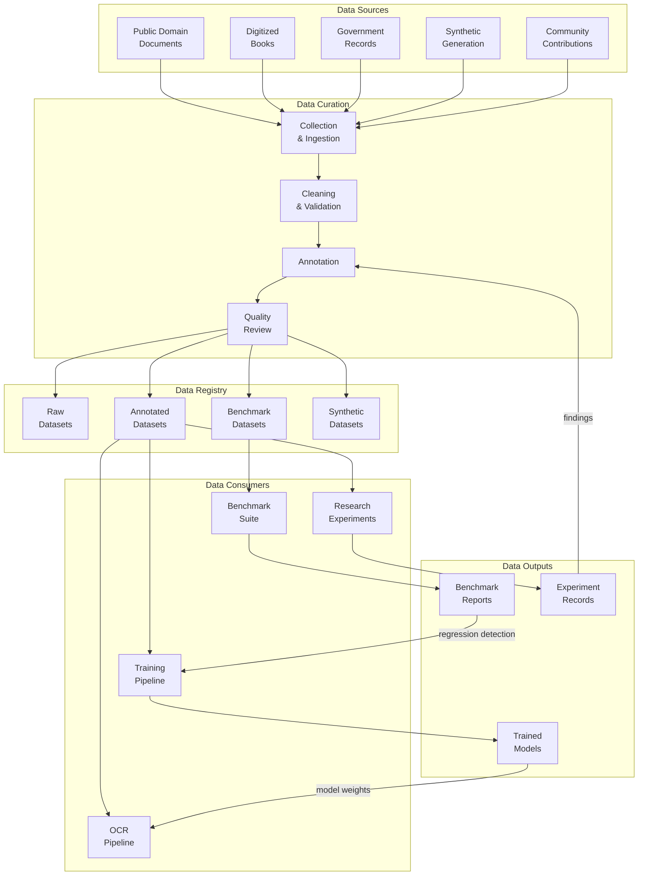
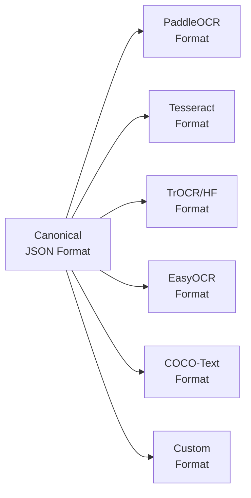
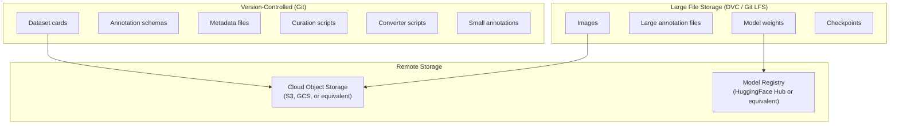
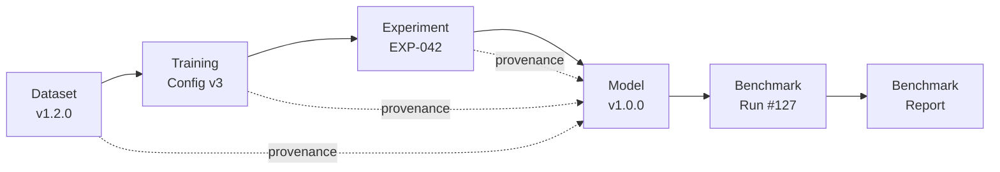
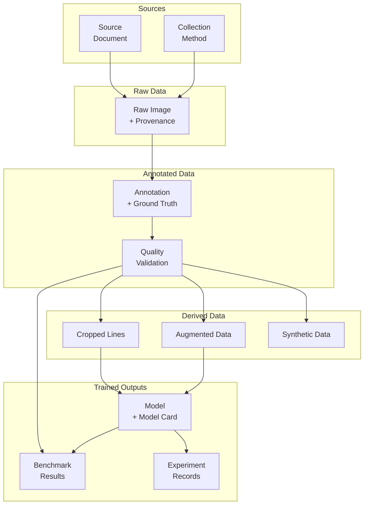
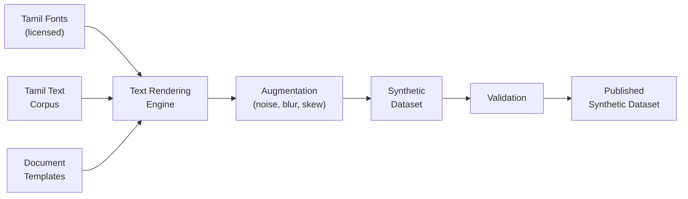

# ARCH-005 — Data Architecture

> **ARCH-005 · 2026.07-r1 · Tier 2 — Architecture**
>
> The definitive data architecture specification for the OpenTamilOCR organization.
> Data is the organization's primary long-term competitive advantage.
> This architecture treats datasets as assets designed to outlast any individual OCR engine.
> Changes require an RFC, a Decision Record, and Steering Council approval.

---

## 1. Purpose

This document defines how every dataset, annotation, ground truth, model artifact, benchmark dataset, training corpus, synthetic dataset, validation split, experiment output, and derived dataset is structured, versioned, validated, stored, governed, and evolved across the OpenTamilOCR organization.

### 1.1 Strategic Context

OpenTamilOCR does not compete on proprietary recognition algorithms.
It competes on the **quality, governance, traceability, reproducibility, and continuous improvement of its data.**

A world-class dataset — well-annotated, well-governed, and engine-independent — is more valuable than any single model because:

- Models deprecate. Datasets endure.
- Engines change. Data standards persist.
- Algorithms evolve. Ground truth remains authoritative.
- Any OCR engine — PaddleOCR, Tesseract, TrOCR, EasyOCR, or future systems — can be improved by better data.

Therefore, this architecture treats datasets as **long-term organizational assets** designed for decades of reuse.

---

## 2. Scope

This specification covers:

- Dataset categories and their relationships.
- Annotation architecture (format, schema, quality).
- Ground truth standards.
- Dataset versioning and immutability.
- Storage and distribution architecture.
- Model artifact architecture (weights, checkpoints, cards).
- Benchmark dataset architecture.
- Experiment data architecture.
- Data lineage and provenance.
- Data quality framework.
- Data governance and ethics integration.

This specification does **not** cover:

- Training pipeline implementation (covered in operational guides).
- Specific annotation guidelines (covered in STD-003).
- Model training configurations (covered in STD-004).

---

## 3. Data Philosophy

| # | Principle | Rationale |
|---|-----------|-----------|
| DP1 | **Data as organizational asset.** | Datasets are long-term investments. They are designed to survive for decades, across engine changes, contributor turnover, and technology shifts. |
| DP2 | **Engine independence.** | Every dataset is usable by any OCR engine. No dataset is structured for a single framework. Annotation formats are engine-agnostic. |
| DP3 | **Immutable releases.** | Published dataset versions are never silently modified. Corrections produce a new version. Consumers can trust that a versioned dataset is stable. |
| DP4 | **Complete provenance.** | Every sample traces to its origin — source document, collection method, annotator, processing history, and legal basis (FND-003, Section 5.1). |
| DP5 | **Reproducibility.** | Any experiment, benchmark, or training run can be reproduced exactly by referencing a specific dataset version, split, and configuration (P6, FND-001). |
| DP6 | **Quality over quantity.** | A smaller, perfectly annotated dataset is more valuable than a larger, noisy one. Quality is measured, not assumed. |
| DP7 | **Bias awareness.** | Dataset biases are measured, documented, and mitigated — not ignored (FND-003, Section 5.5). |
| DP8 | **Separation of concerns.** | Raw data, annotations, derived data, and metadata are stored separately. Each can evolve on its own schedule. |
| DP9 | **Open standards.** | Data formats use open, documented, widely-adopted standards. Proprietary formats are prohibited. |
| DP10 | **Progressive growth.** | The data ecosystem starts small and grows incrementally. The architecture supports 100 samples as well as 10 million. |

---

## 4. Data Ecosystem Overview

### 4.1 Data Flow



### 4.2 Repository Mapping

| Repository | Data Responsibility |
|-----------|-------------------|
| `tamilocr-datasets` | Raw data, annotations, dataset cards, curation scripts, quality tooling. |
| `tamilocr-models` | Model weights, checkpoints, model cards, serving configurations. |
| `tamilocr-benchmarks` | Benchmark datasets, evaluation scripts, benchmark reports, leaderboard data. |
| `tamilocr-training` | Training configurations, experiment tracking, data loading pipelines. |
| `tamilocr-os` | Data standards (STD-003, STD-004), schemas (SCH-002, SCH-003), and governance. |

---

## 5. Dataset Architecture

### 5.1 Dataset Categories

| Category | Purpose | Typical Size | Lifetime | Versioning |
|----------|---------|-------------|----------|------------|
| **Raw** | Unprocessed source images collected from original documents. | Large | Permanent | SemVer |
| **Annotated** | Raw images paired with ground truth text annotations. The core training asset. | Medium–Large | Permanent | SemVer |
| **Benchmark** | Curated subsets with verified ground truth for standardized evaluation. | Small–Medium | Permanent | SemVer |
| **Synthetic** | Programmatically generated image-text pairs for augmentation. | Variable | Replaceable | SemVer |
| **Validation** | Held-out splits used exclusively for validation. Never used in training. | Small | Permanent | Tied to parent dataset version |
| **Derived** | Datasets produced by processing other datasets (e.g., cropped line images from page-level annotations). | Variable | Regenerable | SemVer |

### 5.2 Dataset Structure

Every dataset follows a canonical directory structure:

```
{dataset-name}/
│
├── dataset-card.yaml              # Machine-readable metadata (SCH-003)
├── LICENSE                        # Dataset license (CC-BY-4.0)
├── README.md                      # Human-readable description
├── CHANGELOG.md                   # Version history
├── VERSION                        # Current version
│
├── images/                        # Source images
│   ├── {split}/                   # train/ | val/ | test/
│   │   ├── {sample-id}.png
│   │   └── ...
│   └── ...
│
├── annotations/                   # Ground truth and metadata
│   ├── {split}/
│   │   ├── {sample-id}.json      # Per-sample annotation
│   │   └── ...
│   ├── manifest.json              # Complete sample listing
│   └── schema.json                # Annotation schema for this dataset
│
├── metadata/                      # Dataset-level metadata
│   ├── provenance.yaml            # Source tracking
│   ├── statistics.yaml            # Distribution statistics
│   ├── bias-report.yaml           # Bias evaluation results
│   └── quality-report.yaml        # Quality metrics
│
└── scripts/                       # Dataset-specific tooling
    ├── validate.py                # Validation script
    ├── statistics.py              # Statistics generation
    └── convert/                   # Format converters
        ├── to_paddleocr.py
        ├── to_tesseract.py
        └── to_coco.py
```

### 5.3 Split Strategy

| Split | Purpose | Typical Proportion | Rules |
|-------|---------|-------------------|-------|
| **train** | Model training. | 70–80% | May be used for data augmentation. |
| **val** | Hyperparameter tuning and validation during training. | 10–15% | Never used for training. Fixed across experiments. |
| **test** | Final evaluation and benchmarking. | 10–15% | Never used for training or tuning. Sacred ground truth. |

**Split integrity rules:**

- Splits are defined at the dataset version level and are immutable within a version.
- No sample appears in more than one split.
- Split assignment is deterministic (based on sample ID hash or explicit assignment).
- Split ratios are documented in the dataset card.

---

## 6. Annotation Architecture

### 6.1 Annotation Format

Annotations use a **canonical JSON format** that is engine-agnostic.

The annotation format selection is recorded as DEC-002 (Annotation Format Selection, SYS-000 D7).

```json
{
  "sample_id": "doc-0001-page-003-line-042",
  "image_path": "images/train/doc-0001-page-003-line-042.png",
  "text": "தமிழ் இலக்கிய வரலாறு",
  "language": "tam",
  "script": "Tamil",
  "level": "line",
  "bounding_box": {
    "type": "axis_aligned",
    "coordinates": [120, 340, 890, 395]
  },
  "metadata": {
    "source_document": "doc-0001",
    "page": 3,
    "line_index": 42,
    "annotator": "annotator-007",
    "annotation_date": "2026-07-15",
    "confidence": 1.0,
    "verified": true,
    "tags": ["printed", "modern", "book"]
  }
}
```

### 6.2 Annotation Levels

| Level | Granularity | Use Case |
|-------|-------------|----------|
| **Page** | Entire page image + full page text. | Baseline testing, layout evaluation. |
| **Region** | Text block within a page. | Layout analysis evaluation. |
| **Line** | Single text line. | Primary training unit for most OCR engines. |
| **Word** | Single word. | Word-level recognition training. |
| **Character** | Single character. | Character-level analysis, font studies. |

The primary annotation level is **line**, as it is the most common input format for OCR engine training across PaddleOCR, Tesseract, TrOCR, and EasyOCR.

### 6.3 Bounding Box Types

| Type | Format | Use Case |
|------|--------|----------|
| **Axis-aligned** | `[x, y, width, height]` | Printed, well-aligned text. |
| **Oriented** | `[cx, cy, width, height, angle]` | Rotated text. |
| **Polygon** | `[[x1,y1], ..., [xn,yn]]` | Irregular regions, curved text. |

### 6.4 Engine-Specific Converters

The canonical JSON format converts to engine-specific formats via converter scripts:



- Converters are stored in `scripts/convert/` within each dataset.
- Converters are **lossless to engine-required fields** and **lossy only for unsupported metadata**.
- Converter correctness is validated by round-trip testing where possible.

### 6.5 Annotation Quality

| Metric | Description | Target |
|--------|-------------|--------|
| **Accuracy** | % of annotations that match the actual text. | ≥99% for benchmark datasets, ≥97% for training datasets. |
| **Inter-annotator agreement** | Agreement rate between independent annotators on the same samples. | ≥95% (measured on a representative subset). |
| **Coverage** | % of text regions in the image that have annotations. | 100% for annotated datasets. |
| **Consistency** | Uniformity of annotation conventions across annotators and batches. | Measured by automated validation against annotation schema. |

---

## 7. Ground Truth Standards

### 7.1 Ground Truth Properties

| Property | Requirement |
|----------|-------------|
| **Correctness** | Ground truth text must exactly match the text in the source image. |
| **Unicode normalization** | All text is stored in NFC (Canonical Composition) form. |
| **Whitespace** | Leading and trailing whitespace is trimmed. Internal whitespace matches the source. |
| **Punctuation** | All punctuation is preserved exactly as it appears in the source. |
| **Tamil numerals** | Both Tamil and Arabic numerals are preserved as they appear. |
| **Mixed script** | Tamil, English, and other scripts are preserved as they appear. Language tags are applied per segment where feasible. |
| **Verification** | Benchmark ground truth requires double verification (two independent annotators agree). |

### 7.2 Ground Truth Hierarchy

| Tier | Verification Level | Use |
|------|-------------------|-----|
| **Gold** | Double-verified by independent annotators. Adjudicated disagreements. | Benchmark datasets (test split). |
| **Silver** | Single human annotator with automated validation. | Training datasets. |
| **Bronze** | Automated annotation (OCR output) with spot-check verification. | Large-scale synthetic and semi-supervised datasets. |

Ground truth tier is recorded in the annotation metadata.

---

## 8. Document Type Architecture

### 8.1 Supported Document Types

| Type | Examples | Challenges | Priority |
|------|---------|------------|----------|
| **Printed books** | Modern Tamil literature, textbooks. | Clean print, standard fonts. | v1 (highest) |
| **Newspapers** | Daily newspapers, periodicals. | Multi-column, small text, varied quality. | v1 |
| **Government documents** | Forms, certificates, gazettes. | Mixed Tamil-English, structured layout. | v1 |
| **Academic papers** | Research publications, theses. | Technical terminology, equations, citations. | v1 |
| **Historical documents** | Pre-1950 printed Tamil. | Degraded print, archaic fonts, paper aging. | v1.x |
| **Magazines** | Illustrated periodicals. | Mixed text and images, varied layouts. | v1.x |
| **Signage** | Street signs, shop signs. | Scene text, varied backgrounds, perspective. | v2+ |
| **Handwritten** | Personal letters, manuscripts. | Highly variable, cursive Tamil. | v2+ |
| **Forms** | Application forms, surveys. | Structured fields, checkboxes, mixed content. | v2+ |

### 8.2 Document Metadata

Every source document carries provenance metadata:

| Field | Description |
|-------|-------------|
| `document_id` | Unique identifier. |
| `source` | Where the document was obtained. |
| `document_type` | Category from Section 8.1. |
| `language` | Primary language(s). |
| `date_estimate` | Approximate date of original publication. |
| `condition` | Physical condition (clean, degraded, heavily degraded). |
| `scan_resolution` | DPI of the digitized image. |
| `license` | License of the source document. |
| `rights_holder` | Copyright holder (if applicable). |
| `collection_method` | How the document was obtained (scanned, donated, purchased, scraped). |
| `collector` | Person or organization that collected the document. |

---

## 9. Dataset Versioning

### 9.1 Versioning Rules

Datasets use **Semantic Versioning** (SemVer):

| Change | Version Increment | Example |
|--------|------------------|---------|
| Annotation schema change (breaking) | MAJOR | `1.0.0` → `2.0.0` |
| New samples added | MINOR | `1.0.0` → `1.1.0` |
| Annotation corrections | PATCH | `1.0.0` → `1.0.1` |
| Split ratio change | MAJOR | Breaking for reproducibility. |
| Metadata-only update | PATCH | `1.0.0` → `1.0.1` |

### 9.2 Immutability

- Once a dataset version is published, its contents are **frozen**.
- Corrections, additions, or removals produce a **new version**.
- Consumers can pin to a specific version and be certain it will not change.
- Checksums (SHA-256) for every file are recorded in the dataset card.

### 9.3 Version Manifests

Each dataset version includes a `manifest.json`:

```json
{
  "dataset": "tamil-printed-v1",
  "version": "1.2.0",
  "created": "2026-09-15",
  "total_samples": 15420,
  "splits": {
    "train": { "count": 10794, "checksum": "sha256:abc..." },
    "val": { "count": 2313, "checksum": "sha256:def..." },
    "test": { "count": 2313, "checksum": "sha256:ghi..." }
  },
  "annotation_schema_version": "1.0.0",
  "files_checksum": "sha256:xyz..."
}
```

---

## 10. Storage Architecture

### 10.1 Storage Strategy



### 10.2 Storage Decision (DEC-003)

The dataset storage strategy is determined by DEC-003 (Dataset Storage Strategy, SYS-000 D8).

| Approach | Description | Trade-offs |
|----------|-------------|------------|
| **DVC (Data Version Control)** | Git-like versioning for large files. Pointers in Git, data in remote storage. | Best for large datasets. Requires DVC tooling. |
| **Git LFS** | Git extension for large files. Managed by GitHub. | Simpler setup. GitHub storage limits apply. |
| **Direct remote** | Files stored directly in cloud storage. Metadata in Git. | Maximum flexibility. Requires custom tooling. |

The selected approach must satisfy:

- Version pinning (consumers can pin to a specific version).
- Checksums for every file.
- Free or affordable hosting for open-source projects.
- CLI-accessible for contributors and CI.

### 10.3 Storage Layout

```
Remote Storage/
├── datasets/
│   ├── tamil-printed-v1/
│   │   ├── v1.0.0/
│   │   │   ├── images/
│   │   │   ├── annotations/
│   │   │   └── manifest.json
│   │   ├── v1.1.0/
│   │   └── ...
│   └── tamil-historical-v1/
│       └── ...
├── models/
│   ├── printed-tamil-paddleocr-v1/
│   │   ├── v1.0.0/
│   │   │   ├── model.pdparams (or equivalent)
│   │   │   ├── config.yaml
│   │   │   └── model-card.yaml
│   │   └── ...
│   └── ...
└── benchmarks/
    ├── results/
    └── reports/
```

---

## 11. Model Artifact Architecture

### 11.1 Model Artifact Structure

```
{model-name}/
│
├── model-card.yaml                # Machine-readable metadata (SCH-002)
├── LICENSE                        # Model license (Apache 2.0)
├── README.md                      # Human-readable description
├── CHANGELOG.md                   # Version history
├── VERSION                        # Current version
│
├── weights/                       # Model weights and checkpoints
│   ├── model.{ext}               # Engine-specific weight format
│   ├── config.yaml                # Model configuration
│   └── checksums.sha256           # Integrity verification
│
├── evaluation/                    # Evaluation results
│   ├── benchmark-results.yaml     # Standardized benchmark scores
│   ├── bias-report.yaml           # Bias evaluation results
│   └── confusion-analysis/        # Detailed error analysis
│
└── metadata/                      # Model-level metadata
    ├── training-config.yaml       # Training configuration snapshot
    ├── dataset-reference.yaml     # Which dataset versions were used
    └── environment.yaml           # Hardware, software, and dependency versions
```

### 11.2 Model Card (SCH-002)

Every released model must include a model card containing:

| Section | Content |
|---------|---------|
| **Identity** | Model name, version, engine, license. |
| **Intended use** | What the model is designed for. |
| **Out-of-scope uses** | Explicitly stated misuse cases (FND-003, Section 6.6). |
| **Training data** | Dataset name, version, split, and checksums used for training. |
| **Training configuration** | Hyperparameters, optimizer, learning rate, epochs, batch size. |
| **Evaluation results** | CER, WER, and other metrics on benchmark datasets. |
| **Bias evaluation** | Performance across document types, quality levels, and font categories (FND-003, Section 6.4). |
| **Known limitations** | Conditions under which performance degrades. |
| **Environmental impact** | Training compute time, hardware used, estimated carbon footprint. |
| **Reproducibility** | Exact steps to reproduce training from documented inputs. |

### 11.3 Model Lineage



Every model traces to:

- The exact dataset version used for training.
- The exact training configuration.
- The experiment record (EXP-NNN) that produced it.
- The benchmark results that validated it.

---

## 12. Benchmark Data Architecture

### 12.1 Benchmark Dataset Properties

Benchmark datasets are special datasets with elevated quality requirements:

| Property | Requirement |
|----------|-------------|
| **Ground truth tier** | Gold (double-verified). |
| **Immutability** | Benchmark datasets are versioned and frozen. Never modified after release. |
| **Coverage** | Must include representative samples across all supported document types. |
| **Balance** | Must document and justify any imbalance across categories. |
| **Reproducibility** | Same benchmark + same model + same configuration = same results. |
| **Public availability** | Benchmark datasets are always publicly available. |

### 12.2 Benchmark Result Schema

```json
{
  "benchmark_id": "tamil-printed-bench-v1.0.0",
  "model_id": "printed-tamil-paddleocr-v1.0.0",
  "engine": "paddleocr",
  "engine_version": "2.7.0",
  "date": "2026-10-01",
  "environment": {
    "hardware": "NVIDIA A100 40GB",
    "os": "Ubuntu 22.04",
    "python": "3.11.0"
  },
  "results": {
    "overall": { "cer": 0.032, "wer": 0.089, "accuracy": 0.968 },
    "by_document_type": {
      "books": { "cer": 0.021, "wer": 0.058 },
      "newspapers": { "cer": 0.045, "wer": 0.112 },
      "government": { "cer": 0.038, "wer": 0.095 }
    },
    "by_quality": {
      "clean": { "cer": 0.015, "wer": 0.042 },
      "degraded": { "cer": 0.058, "wer": 0.148 }
    }
  },
  "processing_time_seconds": 342,
  "reproducibility_seed": 42
}
```

### 12.3 Leaderboard Architecture

| Field | Description |
|-------|-------------|
| **Ranking** | Models ranked by primary metric (CER) on the standard benchmark. |
| **Multi-dimensional** | Separate leaderboards per document type and quality level. |
| **Version-tagged** | Each entry is tagged with model version, engine version, and benchmark version. |
| **Historical** | Previous entries are preserved. Leaderboards show trends over time. |
| **Reproducible** | Each entry links to the exact configuration needed to reproduce the result. |

---

## 13. Experiment Data Architecture

### 13.1 Experiment Record Structure

Every experiment produces an EXP-NNN record with structured data:

| Component | Description |
|-----------|-------------|
| **Hypothesis** | What the experiment aims to test. |
| **Configuration** | Training config, dataset version, model architecture, hyperparameters. |
| **Environment** | Hardware, software versions, dependency versions. |
| **Results** | Metrics, loss curves, evaluation scores. |
| **Analysis** | Interpretation of results, comparison to baseline. |
| **Artifacts** | Model checkpoints, logs, visualizations. |
| **Conclusion** | Whether the hypothesis was supported. Next steps. |

### 13.2 Experiment Reproducibility

| Requirement | Mechanism |
|-------------|-----------|
| Exact dataset version | Referenced by dataset name + SemVer. |
| Exact model configuration | Stored as `training-config.yaml` snapshot. |
| Exact random seed | Recorded in experiment record. |
| Exact software versions | `environment.yaml` with pinned dependency versions. |
| Exact hardware | Recorded (affects floating-point reproducibility). |

---

## 14. Data Lineage Architecture

### 14.1 Lineage Graph



### 14.2 Lineage Properties

Every data artifact records:

| Property | Description |
|----------|-------------|
| **Origin** | The source data or process that created this artifact. |
| **Transformation** | The processing steps applied. |
| **Tool versions** | The software versions used for processing. |
| **Timestamp** | When the artifact was created. |
| **Author** | Who (or what AI agent) created the artifact. |
| **Checksum** | Integrity verification hash. |
| **License** | The applicable license (FND-004). |

### 14.3 Lineage Tracing

Given any model, a contributor can trace backward to answer:

- What dataset version was used for training?
- What annotation standard was applied?
- What source documents were included?
- What collection method was used?
- Who annotated the data?
- What quality verification was performed?
- What license covers the source material?

This traceability is a core requirement of the ethics framework (FND-003, Section 5.1).

---

## 15. Data Quality Framework

### 15.1 Quality Dimensions

| Dimension | Measurement | Tooling |
|-----------|-------------|---------|
| **Accuracy** | Annotation error rate (measured by spot-check or double-annotation). | Quality review scripts. |
| **Completeness** | % of images with complete annotations. | `scripts/validate.py` per dataset. |
| **Consistency** | Annotation convention uniformity across annotators. | Schema validation + inter-annotator agreement. |
| **Freshness** | Time since last quality audit. | Metadata timestamp. |
| **Diversity** | Distribution across document types, fonts, quality levels, time periods. | `scripts/statistics.py` per dataset. |
| **Bias** | Imbalance across categories. | Bias report in metadata. |
| **Integrity** | File corruption, missing references, checksum mismatches. | CI validation. |

### 15.2 Quality Gates

| Gate | Trigger | Checks |
|------|---------|--------|
| **Ingestion gate** | New data is added to a dataset. | Format validation, provenance documentation, license verification. |
| **Annotation gate** | Annotations are completed for a batch. | Schema validation, completeness check, automated spot-check. |
| **Release gate** | A new dataset version is about to be published. | Full quality report, bias evaluation, checksum generation, dataset card review. |
| **Benchmark gate** | A benchmark dataset is about to be published. | Gold-tier ground truth verification, inter-annotator agreement, diversity analysis. |

---

## 16. Synthetic Data Architecture

### 16.1 Synthetic Data Pipeline



### 16.2 Synthetic Data Requirements

| Requirement | Description |
|-------------|-------------|
| **Font licensing** | All fonts used for generation must have licenses compatible with CC-BY-4.0 (FND-004, Section 7.4). |
| **Text corpus licensing** | Source text must be public domain or compatibly licensed. |
| **Diversity** | Synthetic data must cover multiple fonts, sizes, noise levels, and degradation types. |
| **Realism** | Augmentation should produce realistic degradation, not random noise. |
| **Labeled** | Synthetic data is clearly labeled as synthetic in the dataset card. |
| **Generation reproducibility** | The generation script, parameters, fonts, and corpus version must be documented for reproduction. |

---

## 17. Data Governance

### 17.1 Governance Integration

| Governance Concern | Governing Document | Implementation |
|-------------------|-------------------|----------------|
| **Privacy** | FND-003, Section 5.3 | No PII in datasets. Automated PII scanning. |
| **Consent** | FND-003, Section 5.2 | Source-specific consent documentation. |
| **Bias** | FND-003, Section 5.5 | Mandatory bias evaluation before release. |
| **Licensing** | FND-004, Section 7 | CC-BY-4.0 default. Third-party compatibility matrix. |
| **Quality** | STD-003 (Dataset Standards) | Annotation accuracy targets. Quality gates. |
| **Versioning** | GOV-004 (Release Governance) | SemVer. Immutable releases. Checksums. |
| **Decisions** | GOV-003 (Decision Process) | DEC-002 (Annotation Format), DEC-003 (Storage Strategy). |

### 17.2 Data Retention

| Data Type | Retention Policy |
|-----------|-----------------|
| **Raw source images** | Permanent. Never deleted. |
| **Published annotations** | Permanent. Versioned. Corrections produce new versions. |
| **Benchmark datasets** | Permanent. Foundational to reproducibility. |
| **Synthetic datasets** | Replaceable. Old versions may be archived when superseded by better generation. |
| **Intermediate processing files** | Temporary. May be deleted after derived dataset is published. |
| **Experiment artifacts** | Retained for the duration specified in the experiment record (minimum 1 year). |

### 17.3 Data Access

| Audience | Access Level |
|----------|-------------|
| **Public** | All released datasets, models, benchmarks, and their documentation. |
| **Contributors** | All of the above + work-in-progress data in development branches. |
| **Maintainers** | All of the above + raw source data awaiting curation + internal quality reports. |
| **Steering Council** | All of the above + sensitive provenance details if applicable. |

---

## 18. Scalability

| Dimension | Current | Near-Term | Long-Term |
|-----------|---------|-----------|-----------|
| **Samples** | 0 | 1,000–10,000 | 100,000–1,000,000+ |
| **Datasets** | 0 | 1–3 | 10–30+ |
| **Models** | 0 | 1–3 | 10–50+ |
| **Document types** | 0 | 3–5 | 10+ |
| **Languages** | Tamil (printed) | Tamil (printed + handwritten) | Tamil + additional Indic scripts |
| **Storage** | 0 | ~10 GB | 100 GB – 1 TB+ |

The architecture handles growth through:

- Modular dataset structure (each dataset is independent).
- Versioned storage (old versions are never removed, but can be archived to cold storage).
- Scalable remote storage (cloud object storage).
- Horizontal expansion (new datasets are added, not merged into one monolithic dataset).

---

## 19. Future Evolution

| Future Capability | Architectural Support |
|-------------------|----------------------|
| **Handwritten Tamil** | New dataset category. Same structure. New annotation guidelines in STD-003. |
| **Multilingual** | New datasets per language. Same structure. Language tag in annotations. |
| **Video OCR** | New input format. Frame extraction produces standard images. Same annotation format. |
| **3D document scanning** | New input format. Flattened images enter standard pipeline. |
| **Active learning** | Pipeline error analysis → annotation priority queue. Architecture already supports feedback loop (Section 4.1). |
| **Federated datasets** | Multiple institutions contribute datasets following the same standard. Federation is a policy extension, not an architectural change. |

---

## 20. Governance Relationship

| Document | Relationship |
|----------|-------------|
| FND-001 — Project Charter | Parent. Mission: improve Tamil OCR through better data. |
| FND-003 — Ethics Framework | Required. Sections 5 (Dataset Ethics) governs all data practices. |
| FND-004 — Licensing Policy | Required. Section 7 governs dataset licensing. |
| ARCH-001 — System Architecture | Required. Section 4.2 defines the Data layer. |
| ARCH-004 — OCR Pipeline Architecture | Required. Pipeline consumes datasets and produces model artifacts. |
| GOV-003 — Decision Process | Sibling. DEC-002 and DEC-003 govern annotation format and storage strategy. |
| GOV-004 — Release Governance | Sibling. Dataset releases follow release governance. |
| STD-003 — Dataset Standards | Downstream. Implements annotation guidelines and quality requirements. |
| STD-004 — Model Standards | Downstream. Implements model card and model quality requirements. |

---

## 21. Related Documents

| Document | Relationship |
|----------|-------------|
| SYS-000 — Master Index | Root. Data repositories in Section 6. |
| ARCH-001 — System Architecture | Required. Data layer definition. |
| ARCH-004 — OCR Pipeline Architecture | Required. Pipeline-data integration. |
| FND-001 — Project Charter | Required. Mission and principles. |
| FND-003 — Ethics Framework | Required. Data ethics. |
| FND-004 — Licensing Policy | Required. Data licensing. |
| GOV-003 — Decision Process | Reference. Data decisions. |
| GOV-004 — Release Governance | Reference. Data releases. |
| ARCH-002 — Repository Architecture | Reference. Repository structure for data repos. |
| ARCH-003 — Knowledge Architecture | Reference. Data knowledge integration. |

---

## 22. Review Policy

- **Review frequency:** Every 6 months during the Architecture Review Cycle, or when a new dataset category or annotation format is proposed.
- **Amendment process:** RFC → DEC → Steering Council approval.
- **Trigger for review:** New document type, new language, new annotation level, or storage strategy change.

---

## 23. Document History

| Version | Date | Summary |
|---------|------|---------|
| 2026.07-r1 | 2026-07-04 | Initial draft. Founding data architecture specification for the OpenTamilOCR organization. |

---

> **Approved by:** Pending Steering Council approval.
> **Effective date:** Upon approval.
