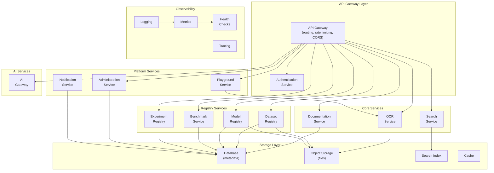
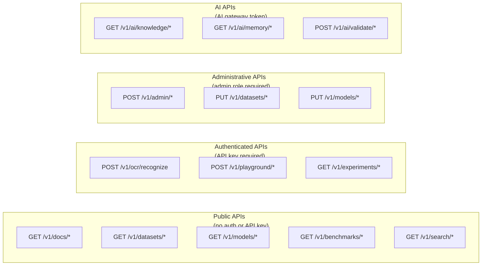
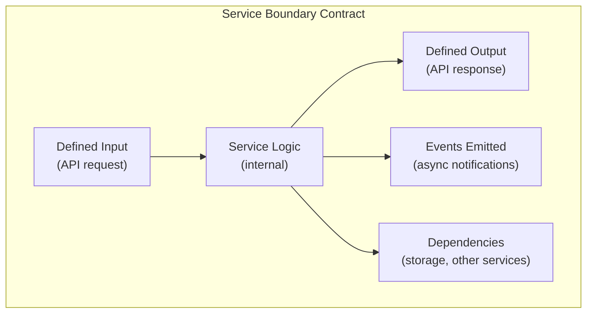
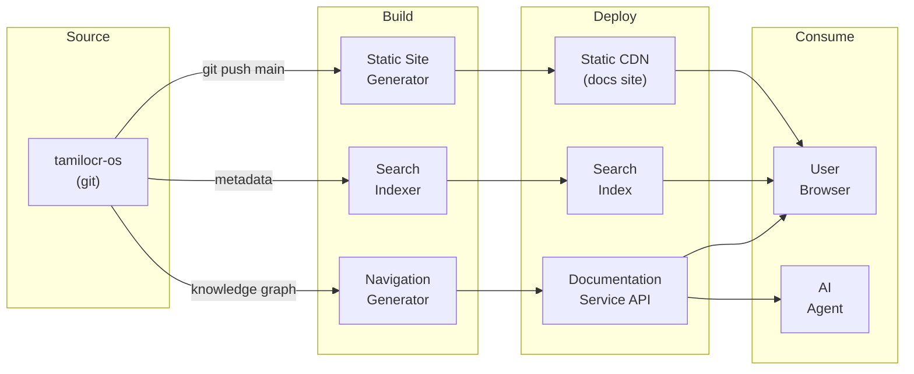
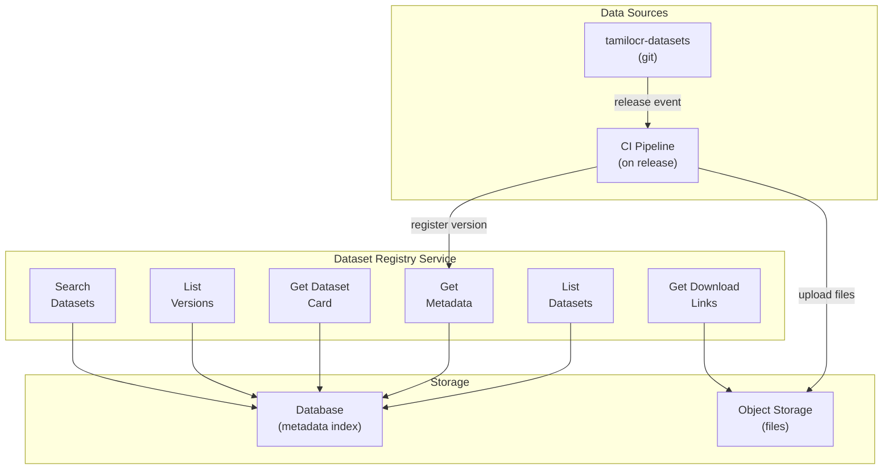
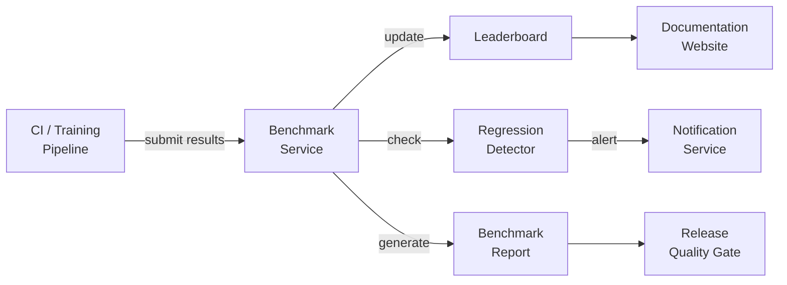
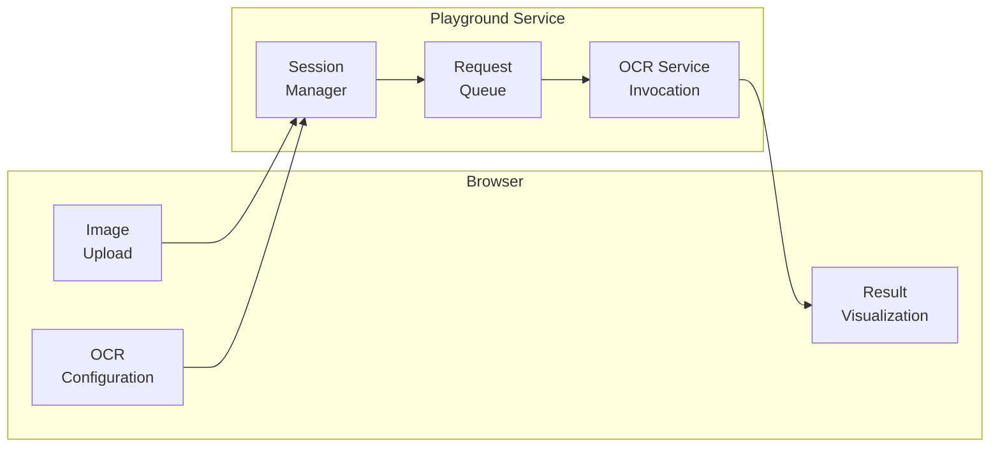
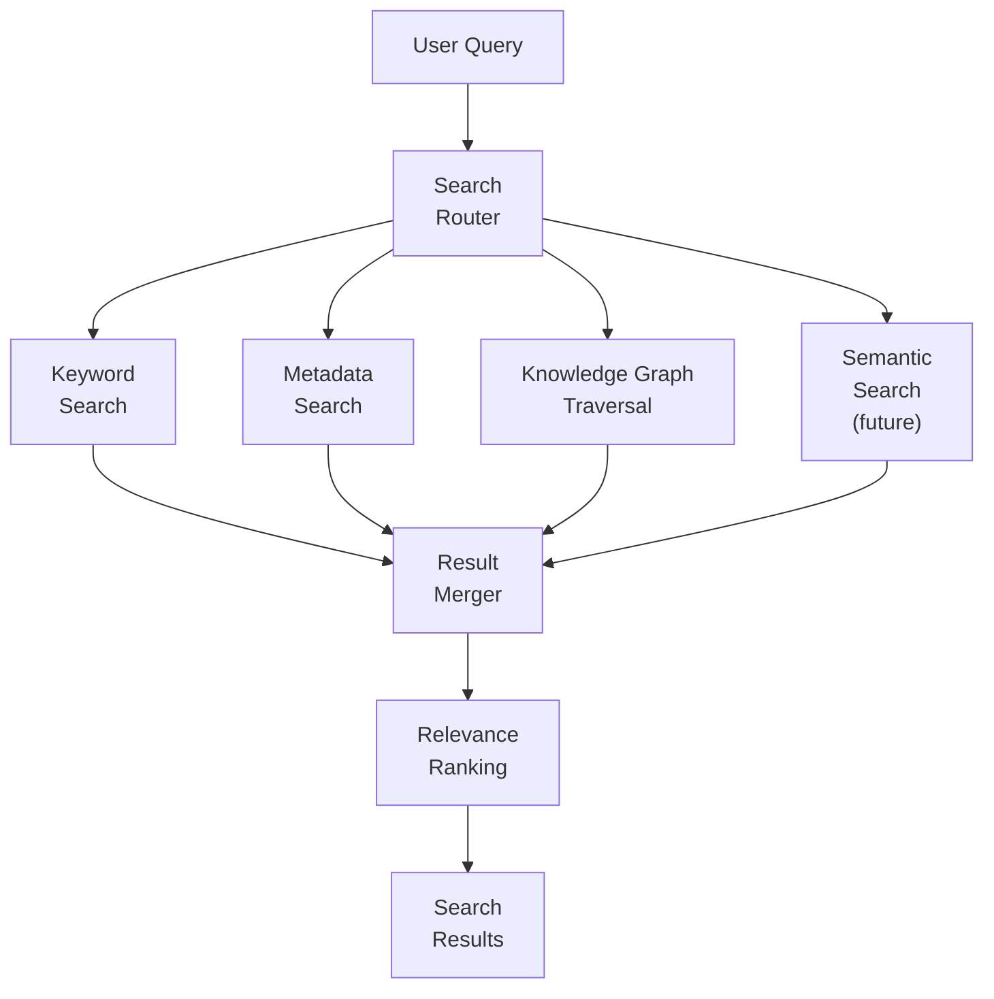
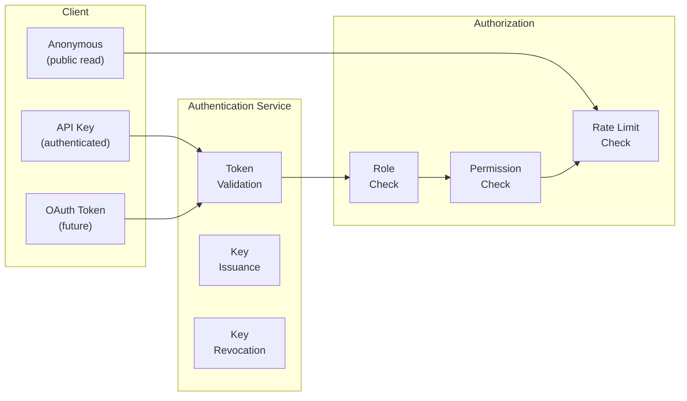
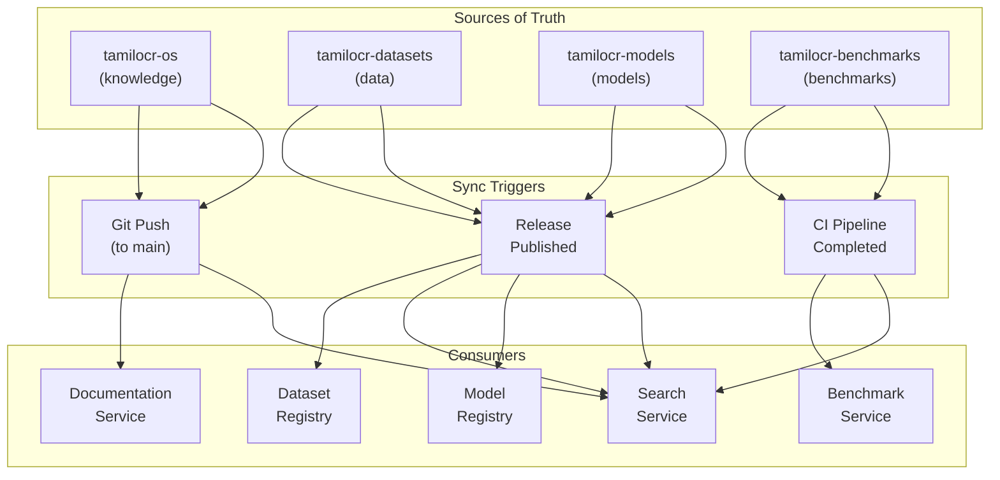

# ARCH-006 — Platform & Backend Architecture

> **ARCH-006 · 2026.07-r1 · Tier 2 — Architecture**
>
> The definitive platform and backend architecture specification for the OpenTamilOCR organization.
> The platform is infrastructure that enables the ecosystem — not the product itself.
> Changes require an RFC, a Decision Record, and Steering Council approval.

---

## 1. Purpose

This document defines the logical architecture of the platform that connects every repository, website, API, AI service, benchmark, dataset, model, documentation page, contributor workflow, and future system within the OpenTamilOCR ecosystem.

The backend is not the product.
The OCR pipeline, datasets, models, and knowledge base are the product.
The backend is the **infrastructure that enables the ecosystem** — it coordinates knowledge, serves models, indexes documentation, powers the playground, and exposes the organization's assets to the world through well-defined APIs.

This specification is **implementation-independent**.
It defines service responsibilities, API contracts, and interaction patterns — not frameworks, languages, or deployment configurations.

---

## 2. Scope

This specification covers:

- Platform philosophy and design principles.
- Logical service decomposition (16 services).
- API architecture (public, internal, administrative).
- Documentation, dataset, model, benchmark, and playground platforms.
- Search architecture.
- Authentication and authorization.
- Cross-system synchronization.
- Observability, security, and scalability.
- AI integration at the platform level.

This specification does **not** cover:

- Specific technology choices (covered in DEC records and operational guides).
- Deployment procedures (covered in GDE-005).
- OCR pipeline internals (covered in ARCH-004).
- Data formats and standards (covered in ARCH-005 and STD-003/STD-004).

---

## 3. Platform Philosophy

| # | Principle | Rationale |
|---|-----------|-----------|
| PL1 | **API First.** | Every platform capability is exposed through a well-defined API before any UI is built. APIs are the primary interface; UIs are consumers (AP3, ARCH-001). |
| PL2 | **Service Oriented.** | The platform is decomposed into services with clear responsibilities and boundaries. Services can be developed, deployed, and scaled independently. |
| PL3 | **Event Driven.** | Services communicate through events where appropriate. Loose coupling through events enables independent evolution. |
| PL4 | **Knowledge Driven.** | The platform is aware of the organizational knowledge graph. Services can query, index, and navigate organizational knowledge. |
| PL5 | **Repository Independent.** | The platform does not directly access repository internals. It consumes published artifacts (releases, APIs, metadata files) from repositories. |
| PL6 | **Modular.** | Services can be added, removed, or replaced without affecting the platform core. |
| PL7 | **Extensible.** | New services, API endpoints, and integrations can be added through defined extension points. |
| PL8 | **Cloud Native.** | The platform is designed for containerized, stateless, horizontally scalable deployment. |
| PL9 | **Self-Host Friendly.** | The platform can be deployed locally or on-premises for research, development, or institutional use. |
| PL10 | **AI Ready.** | The platform provides structured data, metadata, and APIs that AI agents can consume. AI-friendly does not mean AI-dependent. |
| PL11 | **Security First.** | Authentication, authorization, rate limiting, and audit logging are architectural concerns, not afterthoughts. |
| PL12 | **Documentation First.** | Every API is documented with an OpenAPI specification. Every service has an architecture description. |

---

## 4. Platform Architecture Overview

### 4.1 Logical Architecture

### 4.2 Service Summary

| # | Service | Responsibility | Consumers |
|---|---------|---------------|-----------|
| 1 | **API Gateway** | Route requests, enforce rate limits, handle CORS, version routing. | All external consumers. |
| 2 | **Authentication** | Identity management, API key issuance, token validation. | All authenticated endpoints. |
| 3 | **OCR Service** | Accept images, invoke pipeline, return results. | Playground, external API consumers. |
| 4 | **Search Service** | Index and search documentation, datasets, models, and benchmarks. | Documentation site, playground, AI agents. |
| 5 | **Documentation Service** | Serve documentation metadata, navigation, and content. | Documentation website. |
| 6 | **Dataset Registry** | Manage dataset metadata, versions, and download links. | Training pipeline, researchers, website. |
| 7 | **Model Registry** | Manage model metadata, versions, cards, and download links. | OCR service, researchers, website. |
| 8 | **Benchmark Service** | Store results, generate leaderboards, detect regressions. | Benchmark pipeline, website, researchers. |
| 9 | **Experiment Registry** | Track experiment records, configurations, and results. | Training pipeline, researchers. |
| 10 | **Playground Service** | Manage interactive OCR demo sessions. | Website users. |
| 11 | **Notification Service** | Send event notifications (release, benchmark, security). | Contributors, maintainers. |
| 12 | **Administration Service** | Organization settings, user management, system configuration. | Admins, Steering Council. |
| 13 | **AI Gateway** | Proxy and manage AI agent access to platform APIs. | AI agents (documentation, research, review). |
| 14 | **Logging** | Centralized log collection and retention. | All services. |
| 15 | **Metrics** | Performance and business metric collection. | Dashboard, alerts. |
| 16 | **Health Checks** | Service availability monitoring. | Operations, load balancer. |

---

## 5. API Architecture

### 5.1 API Categories

### 5.2 API Design Principles

| # | Principle | Application |
|---|-----------|-------------|
| A1 | **RESTful.** | Resources are nouns. Actions are HTTP methods. Standard HTTP status codes. |
| A2 | **Versioned.** | URL-prefixed versioning: `/v1/`, `/v2/`. Old versions supported for ≥1 minor release cycle. |
| A3 | **Documented.** | Every API has an OpenAPI 3.x specification, generated from code. |
| A4 | **Paginated.** | All list endpoints use cursor-based pagination. |
| A5 | **Filterable.** | List endpoints support filtering by metadata fields. |
| A6 | **Consistent errors.** | All errors follow a standard format: `{ "error": { "code": "...", "message": "...", "details": {...} } }`. |
| A7 | **Idempotent.** | GET, HEAD, PUT, DELETE are idempotent. POST is idempotent where possible (with idempotency keys). |
| A8 | **Rate limited.** | All endpoints enforce rate limits. Limits vary by authentication level. |
| A9 | **CORS enabled.** | Public APIs allow cross-origin requests for browser-based consumers. |

### 5.3 API Responsibilities by Domain

| Domain | Read (GET) | Write (POST/PUT) | Delete |
|--------|-----------|-----------------|--------|
| **Documentation** | Browse docs, navigation, metadata. | Sync from repository (admin/CI). | Archive (admin). |
| **Datasets** | List, metadata, download links, cards. | Register new version (admin/CI). | Archive (admin). |
| **Models** | List, metadata, download links, cards. | Register new version (admin/CI). | Archive (admin). |
| **Benchmarks** | Results, leaderboards, comparisons. | Submit result (CI/maintainer). | — |
| **OCR** | Status, capabilities. | Submit image for recognition. | — |
| **Search** | Query with filters. | Re-index (admin). | — |
| **Experiments** | List, details, configs, results. | Register experiment (CI/training). | — |
| **Users** | Profile, API keys. | Create, update profile. | Delete account. |

---

## 6. Service Architecture

### 6.1 Service Boundaries

### 6.2 Service Design Rules

| Rule | Description |
|------|-------------|
| **Single responsibility.** | Each service has one primary domain. |
| **Defined contract.** | Service inputs and outputs are documented in OpenAPI specs. |
| **Failure isolation.** | One service's failure does not cascade to others. Graceful degradation is the default. |
| **Stateless processing.** | Services store state in the storage layer, not in memory between requests. |
| **Independent deployment.** | Each service can be deployed, updated, and rolled back independently. |
| **Owned by one team.** | Each service has a designated maintainer in CODEOWNERS. |

### 6.3 Service Dependencies

| Service | Depends On | Depended On By |
|---------|-----------|----------------|
| API Gateway | Authentication | All external consumers |
| Authentication | Database | All authenticated services |
| OCR Service | Model Registry, Object Storage | Playground, external consumers |
| Search Service | Search Index | Documentation site, playground |
| Documentation Service | Database, Search Index | Documentation website |
| Dataset Registry | Database, Object Storage | Training, benchmarks, website |
| Model Registry | Database, Object Storage | OCR Service, benchmarks, website |
| Benchmark Service | Database, Dataset Registry, Model Registry | Website, training feedback |
| Experiment Registry | Database | Training pipeline, researchers |
| Playground Service | OCR Service | Website users |
| AI Gateway | Authentication, all read APIs | AI agents |

---

## 7. Documentation Platform

### 7.1 Publishing Flow

### 7.2 Documentation Service Responsibilities

| Responsibility | Description |
|---------------|-------------|
| **Metadata API** | Serve document metadata (frontmatter) for navigation, filtering, and AI context loading. |
| **Navigation** | Provide tiered, hierarchical navigation generated from the knowledge graph. |
| **Version history** | Expose document version history from git. |
| **Cross-reference resolution** | Resolve `tamilocr-os://` URIs to web URLs. |
| **Dashboard data** | Serve organizational health metrics for the dashboard view. |

### 7.3 Static Site Architecture

- Content is authored in `tamilocr-os` as markdown with YAML frontmatter.
- A static site generator (e.g., Astro) builds HTML from markdown.
- The build pipeline generates navigation from `knowledge-graph.json`.
- Client-side search (e.g., Pagefind) provides instant local search.
- The Documentation Service API supplements static content with dynamic features.

---

## 8. Dataset Platform

### 8.1 Dataset Registry

### 8.2 Registry Responsibilities

| Responsibility | Description |
|---------------|-------------|
| **Version management** | Track all published dataset versions with metadata and checksums. |
| **Discovery** | Enable browsing and searching datasets by type, language, size, license, and quality. |
| **Dataset cards** | Serve machine-readable dataset cards (SCH-003, ARCH-005). |
| **Download management** | Provide stable download links. Track download statistics. |
| **Lineage** | Expose provenance and lineage metadata (ARCH-005, Section 14). |
| **Validation** | Validate dataset metadata on registration. |

---

## 9. Model Platform

### 9.1 Model Registry Responsibilities

| Responsibility | Description |
|---------------|-------------|
| **Version management** | Track all published model versions with metadata and checksums. |
| **Model cards** | Serve machine-readable model cards (SCH-002, ARCH-005). |
| **Compatibility** | Track which engine versions are compatible with each model. |
| **Download management** | Provide stable download links. Track download statistics. |
| **Benchmark integration** | Link each model to its benchmark results. |
| **Training lineage** | Link each model to the dataset version and experiment that produced it. |

### 9.2 Model Serving

The OCR Service loads models from the Model Registry at startup or on-demand:

| Mode | Description |
|------|-------------|
| **Static loading** | Model is loaded at service startup. Fast inference. |
| **Dynamic loading** | Model is loaded on first request for that model version. Supports multi-model serving. |
| **Warm cache** | Frequently used models are kept in memory. Least-recently-used eviction. |

---

## 10. Benchmark Platform

### 10.1 Benchmark Service Responsibilities

| Responsibility | Description |
|---------------|-------------|
| **Result storage** | Store structured benchmark results (ARCH-005, Section 12.2). |
| **Leaderboard** | Generate ranked leaderboards by metric, document type, and quality level. |
| **Regression detection** | Compare new results against baselines. Flag regressions. |
| **Historical trends** | Store and visualize metric trends over time. |
| **Reports** | Generate structured benchmark reports for release quality gates (GOV-004). |
| **Comparison** | Enable side-by-side comparison of models, engines, and configurations. |

### 10.2 Benchmark Workflow

---

## 11. Playground

### 11.1 Playground Architecture

### 11.2 Playground Capabilities

| Feature | Description |
|---------|-------------|
| **Image upload** | Accept user-uploaded images for OCR processing. |
| **Engine selection** | Choose which OCR engine to use (if multiple are available). |
| **Model selection** | Choose which model version to use. |
| **Result visualization** | Display recognized text with bounding box overlays on the source image. |
| **Confidence display** | Color-coded confidence visualization (high = green, low = red). |
| **Side-by-side comparison** | Compare results from different engines or models. |
| **Export** | Download results as JSON, hOCR, plain text, or searchable PDF. |
| **Session management** | Temporary sessions with automatic cleanup. No persistent user data without authentication. |

### 11.3 Resource Protection

- Processing is rate-limited per session and per IP.
- Maximum image size and resolution limits are enforced.
- Sessions expire after inactivity.
- No user-uploaded images are stored beyond the session unless explicitly opted in.

---

## 12. Search Architecture

### 12.1 Search Strategy

### 12.2 Search Domains

| Domain | Indexed Content | Search Fields |
|--------|----------------|--------------|
| **Documentation** | TamilOCR OS documents. | Title, content, tags, summary, tier, type. |
| **Datasets** | Dataset cards and metadata. | Name, description, type, language, tags, version. |
| **Models** | Model cards and metadata. | Name, engine, description, metrics, version. |
| **Benchmarks** | Benchmark results and reports. | Model, engine, metric values, date. |
| **Decisions** | DEC records. | Title, category, status, date. |
| **RFCs** | RFC proposals. | Title, status, author, date. |

### 12.3 Search Interfaces

| Interface | Implementation |
|-----------|---------------|
| **Documentation website** | Client-side search (Pagefind) + optional backend Search API. |
| **API** | `GET /v1/search?q={query}&domain={domain}&filters={...}` |
| **AI agents** | Search API with structured metadata responses for context loading. |

---

## 13. Authentication & Authorization

### 13.1 Authentication Architecture

### 13.2 Authentication Levels

| Level | Mechanism | Access |
|-------|-----------|--------|
| **Anonymous** | No authentication. | Public read APIs only. Rate-limited. |
| **API Key** | API key in request header. | Authenticated APIs (OCR, playground, experiments). Higher rate limits. |
| **Admin** | API key with admin role. | Administrative APIs (registry updates, user management). |
| **Service** | Service-to-service token. | Internal API calls between services. |
| **AI Agent** | AI gateway token. | AI-specific APIs (knowledge, memory, validation). |

### 13.3 Authorization Model

| Role | Permissions |
|------|------------|
| **anonymous** | Read public documentation, datasets, models, benchmarks. |
| **user** | All anonymous permissions + OCR API, playground, experiment viewing. |
| **contributor** | All user permissions + experiment submission, benchmark submission. |
| **maintainer** | All contributor permissions + registry updates, admin read access. |
| **admin** | All permissions including user management and system configuration. |

### 13.4 Future Authentication

- **OAuth 2.0 / OIDC** will be added when the platform requires user accounts beyond API keys.
- **Organization accounts** will be added when institutional users need team management.
- These additions will be proposed through RFC and will not require architectural changes to the service boundary model.

---

## 14. Synchronization Architecture

### 14.1 Synchronization Flow

### 14.2 Synchronization Rules

| Rule | Description |
|------|-------------|
| **Source of truth.** | Repositories are always the source of truth. The platform never modifies source repositories. |
| **Event-driven.** | Synchronization is triggered by events (push, release, CI completion), not by polling. |
| **Idempotent.** | Sync operations can be safely retried without duplication. |
| **Eventually consistent.** | The platform may be temporarily behind the source. Staleness is bounded and monitored. |
| **Version-aware.** | Every synced record tracks the source version (commit hash, release tag). |
| **Auditable.** | Every sync operation is logged with timestamp, source, and outcome. |

---

## 15. Observability

### 15.1 Observability Stack

| Pillar | Purpose | What is Collected |
|--------|---------|------------------|
| **Logging** | Record service events for debugging and audit. | Request logs, error logs, audit events, sync events. |
| **Metrics** | Measure system performance and business health. | Request latency, error rates, throughput, queue depth, cache hit rate. |
| **Tracing** | Track request flow across services. | Distributed traces with trace ID propagation. |
| **Health checks** | Monitor service availability. | Per-service liveness and readiness probes. |
| **Alerts** | Notify operators of anomalies. | Error rate spikes, latency degradation, service unavailability, disk usage. |
| **Audit logs** | Record security-relevant events. | Authentication, authorization failures, administrative actions, data modifications. |

### 15.2 Business Metrics

| Metric | Description | Source |
|--------|-------------|--------|
| **OCR requests/day** | Number of OCR API calls. | OCR Service. |
| **Dataset downloads** | Download count per dataset version. | Dataset Registry. |
| **Model downloads** | Download count per model version. | Model Registry. |
| **Search queries/day** | Number of search queries. | Search Service. |
| **Playground sessions/day** | Number of interactive sessions. | Playground Service. |
| **API key issuances** | New API keys created. | Authentication Service. |
| **Benchmark submissions** | New benchmark results submitted. | Benchmark Service. |

---

## 16. Security Architecture

### 16.1 Security Layers

| Layer | Mechanism |
|-------|-----------|
| **Network** | HTTPS everywhere. No unencrypted traffic. |
| **Authentication** | API keys, service tokens, future OAuth. Multi-factor for admin accounts. |
| **Authorization** | Role-based access control (Section 13.3). Least-privilege principle. |
| **Rate limiting** | Per-endpoint, per-key, per-IP rate limits to prevent abuse. |
| **Input validation** | All inputs validated against schemas. Maximum sizes enforced. Malformed requests rejected. |
| **Secrets management** | Secrets stored in encrypted secret managers. Never in code or configuration files. Rotated regularly. |
| **Supply chain** | Dependency scanning, lock files, automated vulnerability alerts (ARCH-002, Section 14.4). |
| **Audit trail** | All administrative and data-modifying actions are logged with actor, timestamp, and details. |
| **AI safety** | AI agents access only read APIs through the AI Gateway. No write access without human approval (ARCH-001, Section 8.2). |
| **Data privacy** | No user-uploaded images retained beyond session. No PII collection without consent. |

### 16.2 Threat Model (High-Level)

| Threat | Mitigation |
|--------|-----------|
| **Unauthorized access** | Authentication + authorization + rate limiting. |
| **Data exfiltration** | Access control on non-public data. Audit logging. |
| **Denial of service** | Rate limiting, request size limits, auto-scaling. |
| **Malicious input** | Input validation, sandboxed processing, resource limits. |
| **Credential compromise** | Secret rotation, audit logging, revocation capability. |
| **Supply chain attack** | Dependency scanning, pinned versions, signed releases. |

---

## 17. Scalability Architecture

### 17.1 Scaling Dimensions

| Dimension | Strategy |
|-----------|---------|
| **Request volume** | Stateless services behind load balancer. Horizontal scaling. |
| **Data volume** | Object storage (unlimited). Database partitioning by domain. |
| **Search volume** | Search index replication. Caching of frequent queries. |
| **OCR throughput** | OCR Service scales independently. GPU resources added as needed. |
| **Documentation volume** | Static CDN caching. Pre-built pages. |
| **Geographic distribution** | CDN for static content. Regional API deployment when needed. |

### 17.2 Deployment Modes

| Mode | Description | Use Case |
|------|-------------|----------|
| **Minimal** | Single-process deployment with all services in one application. | Development, small self-hosted. |
| **Standard** | Services deployed as separate containers behind a gateway. | Production, cloud deployment. |
| **Distributed** | Services deployed across multiple nodes with load balancing. | High-traffic production. |
| **Offline** | Core services only (OCR, search), no external connectivity. | Research, air-gapped environments. |

---

## 18. AI Integration

### 18.1 AI Gateway

The AI Gateway provides a structured interface for AI agents to interact with the platform.

| Endpoint Category | Purpose |
|-------------------|---------|
| **Knowledge APIs** | Access document metadata, summaries, and the knowledge graph. |
| **Memory APIs** | Read AI Memory files (current state, generation log, known issues). |
| **Search APIs** | Query documentation, datasets, and models with structured filters. |
| **Validation APIs** | Submit documents or metadata for automated consistency checking. |

### 18.2 AI Boundaries

| Permitted | Prohibited |
|-----------|-----------|
| Read all public APIs. | Write to any registry without human approval. |
| Submit validation requests. | Modify platform configuration. |
| Query knowledge graph. | Access private audit logs. |
| Search across all domains. | Create or revoke API keys. |
| Draft content for human review. | Approve releases or decisions. |

---

## 19. Future Evolution

| Future Capability | Architectural Support |
|-------------------|----------------------|
| **Federated deployments** | Stateless services and event-driven sync enable multi-site deployment. |
| **Multiple organizations** | Multi-tenancy can be added at the authentication/authorization layer. |
| **Plugin marketplace** | The extensible service model supports registering third-party plugins. |
| **Webhook integrations** | Event-driven architecture naturally supports webhook delivery. |
| **GraphQL API** | Can be added alongside REST without architectural change. |
| **Real-time features** | WebSocket support can be added to the gateway for live OCR, notifications. |
| **Mobile SDK** | REST APIs are consumable by mobile clients without platform changes. |
| **External OCR services** | The OCR Service can proxy to external OCR APIs through the engine abstraction (ARCH-004). |

---

## 20. Governance Relationship

| Document | Relationship |
|----------|-------------|
| FND-001 — Project Charter | Parent. Platform serves the mission of accessible Tamil OCR. |
| FND-003 — Ethics Framework | Sibling. Data privacy and AI safety requirements. |
| FND-004 — Licensing Policy | Sibling. API terms of use and content licensing. |
| GOV-001 — Governance Model | Required. Defines roles for platform administration. |
| GOV-003 — Decision Process | Sibling. Platform decisions follow decision process. |
| GOV-004 — Release Governance | Sibling. Platform releases follow release governance. |
| ARCH-001 — System Architecture | Required. Sections 9 and 10 define the platform and web architecture this document expands. |
| ARCH-004 — OCR Pipeline Architecture | Required. The OCR Service wraps the pipeline. |
| ARCH-005 — Data Architecture | Required. Dataset and model registries serve data platform assets. |
| ARCH-002 — Repository Architecture | Reference. `tamilocr-backend`, `tamilocr-docs-site`, `tamilocr-playground` structure. |
| ARCH-003 — Knowledge Architecture | Reference. Knowledge synchronization with platform. |
| STD-005 — API Standards | Downstream. Implements API design conventions. |

---

## 21. Related Documents

| Document | Relationship |
|----------|-------------|
| SYS-000 — Master Index | Root. Platform repositories in Section 6. |
| ARCH-001 — System Architecture | Required. Parent architecture (Sections 9, 10). |
| ARCH-004 — OCR Pipeline Architecture | Required. Pipeline served by OCR Service. |
| ARCH-005 — Data Architecture | Required. Data served by registries. |
| FND-001 — Project Charter | Required. Mission. |
| GOV-001 — Governance Model | Required. Administrative authority. |
| GOV-004 — Release Governance | Reference. Platform release process. |
| FND-003 — Ethics Framework | Reference. Data privacy and AI safety. |
| FND-004 — Licensing Policy | Reference. API and content licensing. |
| ARCH-002 — Repository Architecture | Reference. Repository structure. |
| ARCH-003 — Knowledge Architecture | Reference. Knowledge sync. |

---

## 22. Review Policy

- **Review frequency:** Every 6 months during the Architecture Review Cycle, or when a new service is proposed.
- **Amendment process:** RFC → DEC → Steering Council approval.
- **Trigger for review:** New service addition, authentication model change, or scaling strategy change.

---

## 23. Document History

| Version | Date | Summary |
|---------|------|---------|
| 2026.07-r1 | 2026-07-05 | Initial draft. Founding platform and backend architecture for the OpenTamilOCR organization. |

---

> **Approved by:** Pending Steering Council approval.
> **Effective date:** Upon approval.
