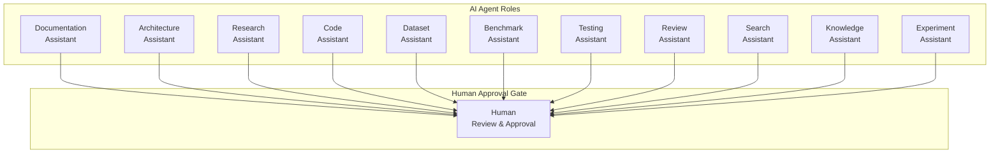
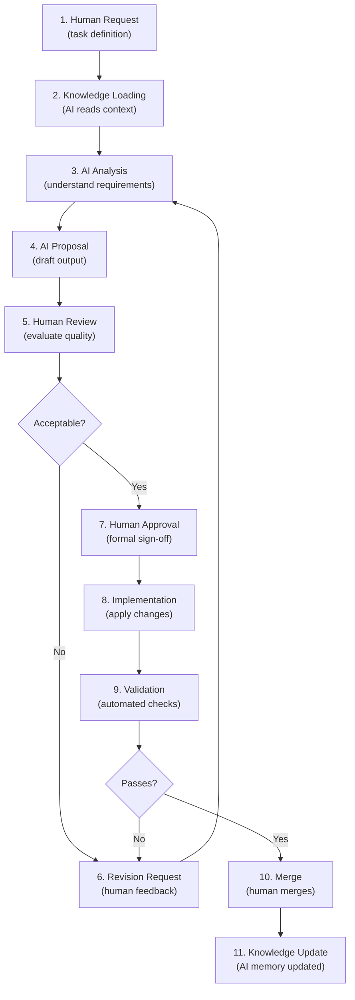
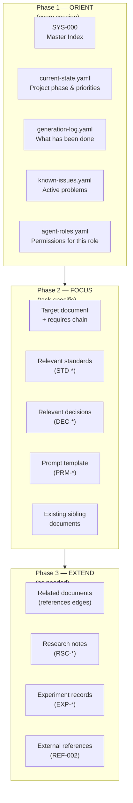
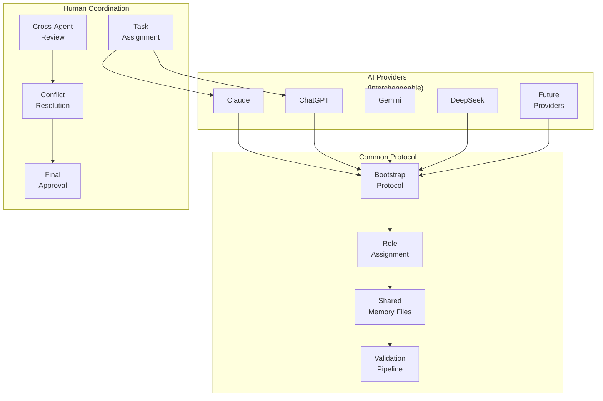
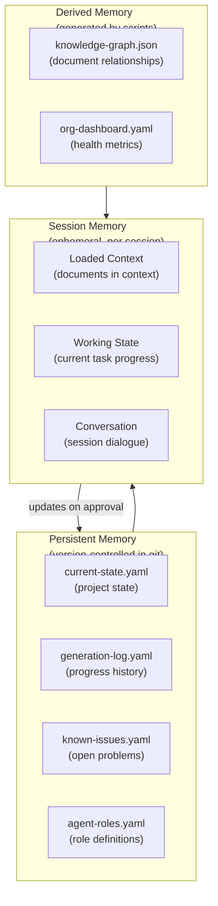
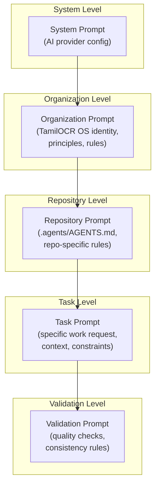
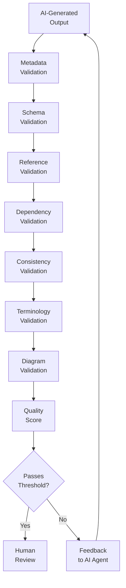
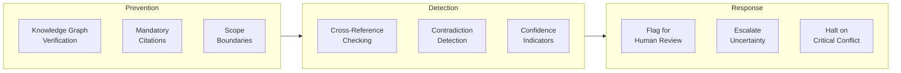
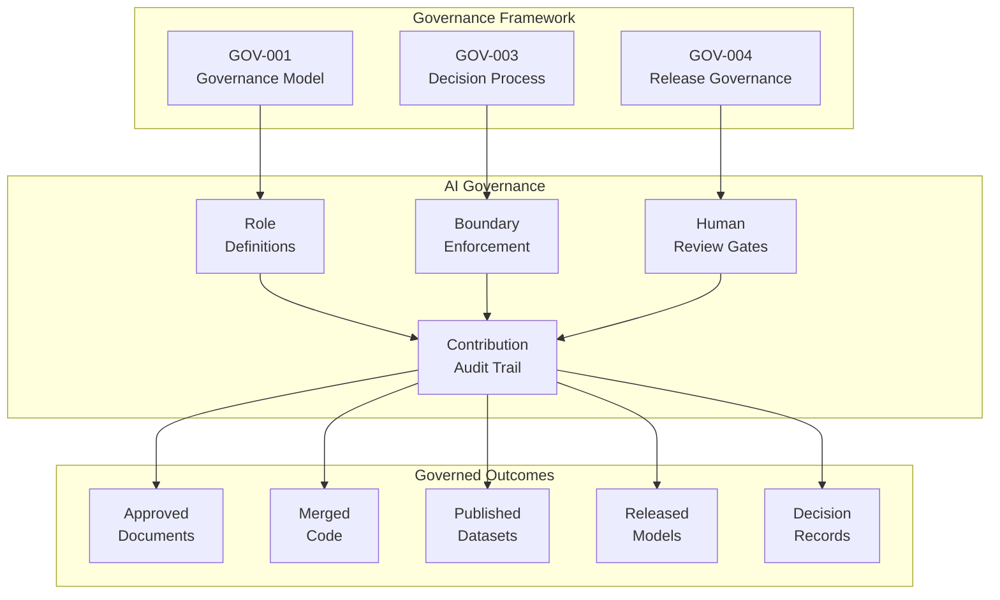
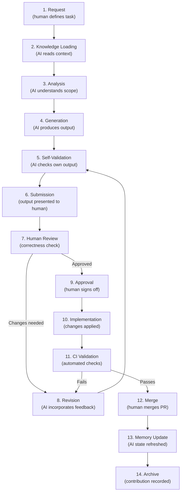

# ARCH-007 — AI Workflow Architecture

> **ARCH-007 · 2026.07-r1 · Tier 2 — Architecture**
>
> The definitive AI workflow architecture specification for the OpenTamilOCR organization.
> AI augments human contributors. Humans govern every decision.
> This architecture is provider-independent and designed for the long term.
> Changes require an RFC, a Decision Record, and Steering Council approval.

---

## 1. Purpose

This document defines how artificial intelligence systems collaborate with human contributors across the OpenTamilOCR organization.

The goal is **not** to automate software development.
The goal is to **augment human contributors** through structured, governed, transparent, and reproducible AI collaboration.

AI is an engineering assistant.
Humans remain responsible for every architectural decision, merge, release, governance action, and public artifact.

This specification inherits from ARCH-001 (System Architecture Overview, Section 8) and expands it into a complete architectural contract for AI integration across the ecosystem.

---

## 2. Scope

This specification covers:

- AI design philosophy and principles.
- Logical AI roles and their boundaries.
- Human roles and approval authority.
- Human-AI collaboration workflows.
- Knowledge loading architecture.
- Multi-agent collaboration across providers.
- AI memory architecture.
- Prompt hierarchy and inheritance.
- Validation pipelines.
- Hallucination prevention safeguards.
- AI safety and security.
- AI governance integration.
- AI contribution lifecycle.
- Future evolution.

This specification does **not** cover:

- Specific AI provider configurations (covered in operational guides).
- Individual prompt templates (covered in PRM-001 through PRM-004).
- AI agent implementation details (covered in repository-level `.agents/` configurations).

---

## 3. AI Design Philosophy

| # | Principle | Rationale |
|---|-----------|-----------|
| AIP1 | **Human First.** | Humans are the final authority on every decision, merge, release, and governance action. AI proposals are always subject to human review and approval. |
| AIP2 | **AI Assisted.** | AI accelerates contributor work — drafting, analyzing, validating, researching — but never operates autonomously on critical paths. |
| AIP3 | **Provider Independence.** | No architectural element depends on a specific AI model, provider, or API. Claude, ChatGPT, Gemini, DeepSeek, and future systems are all interchangeable at the workflow level. |
| AIP4 | **Transparency.** | Every AI action is visible to human reviewers. AI does not make hidden changes. All AI-generated content is attributable and reviewable. |
| AIP5 | **Traceability.** | Every AI contribution is recorded: which agent, which role, which session, which prompt, which knowledge was loaded. |
| AIP6 | **Explainability.** | AI agents explain their reasoning and cite specific documents. Contributors can understand why AI proposed a particular output. |
| AIP7 | **Reviewability.** | AI output is structured for efficient human review. Diffs, summaries, and validation reports accompany every AI contribution. |
| AIP8 | **Reproducibility.** | Given the same knowledge state, prompt, and configuration, any AI agent should produce a structurally consistent result — even if the exact wording differs. |
| AIP9 | **Security.** | AI agents never access secrets, credentials, or private security reports. AI agents operate with least-privilege access. |
| AIP10 | **Privacy.** | AI agents do not process personally identifiable information (PII) unless explicitly authorized (FND-003, Section 5.3). |
| AIP11 | **Accountability.** | The human who initiates, reviews, and approves an AI contribution is accountable for its correctness — not the AI. |
| AIP12 | **Continuous Learning.** | Organizational knowledge evolves. AI workflows adapt by loading updated knowledge, not by remembering previous sessions. |
| AIP13 | **Knowledge Driven.** | AI agents operate within the organizational knowledge graph. They do not rely on general training data for organization-specific facts. |
| AIP14 | **Documentation First.** | AI workflows are documented before they are implemented. New AI capabilities require documentation updates. |

---

## 4. AI Roles

### 4.1 Role Definitions



### 4.2 Role Responsibilities and Boundaries

| Role | Primary Tasks | Boundaries (Must NOT) |
|------|--------------|----------------------|
| **Documentation Assistant** | Generate documents, validate metadata, check consistency, format content. | Approve documents, merge PRs, assign reviewers. |
| **Architecture Assistant** | Draft RFC proposals, analyze impact, suggest improvements, generate diagrams. | Approve RFCs, record decisions, override human design choices. |
| **Research Assistant** | Survey literature, analyze benchmarks, summarize findings, identify trends. | Make architectural decisions based on research alone. |
| **Code Assistant** | Write code, refactor, debug, suggest optimizations, generate tests. | Commit directly to protected branches, approve PRs. |
| **Dataset Assistant** | Analyze datasets, identify quality issues, suggest improvements, generate statistics. | Modify published datasets, delete annotations, bypass quality gates. |
| **Benchmark Assistant** | Run benchmarks, interpret results, generate reports, detect regressions. | Override benchmark results, modify leaderboards without human review. |
| **Testing Assistant** | Generate test cases, run test suites, analyze failures, suggest fixes. | Mark tests as passing without execution, skip security tests. |
| **Review Assistant** | Check consistency, flag contradictions, validate cross-references, verify metadata. | Override human review decisions, approve contributions. |
| **Search Assistant** | Help contributors find relevant documents, navigate the knowledge graph. | Access non-public data, bypass access controls. |
| **Knowledge Assistant** | Explain organizational context, answer questions about TamilOCR OS, guide onboarding. | Fabricate organizational facts, contradict approved documents. |
| **Experiment Assistant** | Design experiments, analyze results, suggest next steps, document findings. | Modify training configurations without human approval, delete experiment data. |

### 4.3 Role Configuration

Roles are defined in `ai/roles/agent-roles.yaml`:

```yaml
roles:
  documentation_assistant:
    description: "Generate and validate organizational documentation."
    permitted_actions:
      - "read_documents"
      - "generate_content"
      - "validate_metadata"
      - "check_consistency"
    prohibited_actions:
      - "approve_documents"
      - "merge_pull_requests"
      - "modify_governance"
    knowledge_loading:
      required: ["SYS-000", "current-state.yaml", "generation-log.yaml"]
      task_specific: true
    max_scope: "single_document"
```

---

## 5. Human Roles

### 5.1 Authority Matrix

| Human Role | AI Oversight Authority |
|------------|----------------------|
| **Founder** | Full authority during Bootstrap Phase. Can assign any AI task. Approves all AI-generated governance and architecture. |
| **Steering Council** | Approves AI-generated Tier 0–2 documents. Approves RFC and DEC records involving AI workflow changes. |
| **Maintainers** | Approve AI-generated Tier 3–6 documents. Approve AI-generated code, datasets, and model changes in their repositories. |
| **Reviewers** | Review AI-generated content for correctness. Flag issues. Cannot approve alone for Tier 0–2. |
| **Contributors** | Request AI assistance. Review AI suggestions in their own contributions. Cannot approve AI work. |
| **Researchers** | Direct AI research assistants. Approve experiment designs. Validate AI-generated research summaries. |

### 5.2 Approval Rules

| Artifact Type | Minimum Human Approval |
|--------------|----------------------|
| Governance documents (Tier 0–1) | Steering Council (or Founder during Bootstrap). |
| Architecture documents (Tier 2) | Steering Council (or Founder during Bootstrap). |
| Standards (Tier 3) | 1 Maintainer + 1 SC member. |
| Knowledge/Planning (Tier 4–5) | 1 Maintainer. |
| Operations/References (Tier 6–7) | 1 Maintainer (or Founder). |
| Source code | 1 Maintainer with write access. |
| Dataset modifications | 1 Maintainer of `tamilocr-datasets`. |
| Model releases | 1 Maintainer of `tamilocr-models` + benchmark validation. |
| RFC proposals | Any contributor can submit; Steering Council decides. |
| Decision records | Decision maker as defined in GOV-003. |

---

## 6. Human-AI Collaboration Model

### 6.1 Collaboration Workflow



### 6.2 Stage Responsibilities

| Stage | Human Responsibility | AI Responsibility |
|-------|---------------------|------------------|
| **1. Request** | Define the task clearly. Specify scope and constraints. | — |
| **2. Knowledge Loading** | — | Load bootstrap context + task-specific documents from knowledge graph. |
| **3. Analysis** | — | Analyze requirements, identify dependencies, assess consistency with existing knowledge. |
| **4. Proposal** | — | Generate draft output with citations, rationale, and confidence indicators. |
| **5. Review** | Evaluate correctness, completeness, consistency, and quality. | — |
| **6. Revision** | Provide specific, actionable feedback. | Revise based on feedback. Explain what changed and why. |
| **7. Approval** | Formally approve the output. | — |
| **8. Implementation** | Monitor implementation. | Apply approved changes to files. |
| **9. Validation** | Review validation results. | Run automated checks (metadata, references, consistency). |
| **10. Merge** | Merge PR (human action). | — |
| **11. Knowledge Update** | — | Update AI Memory files (generation log, known issues, current state). |

### 6.3 Collaboration Modes

| Mode | Description | Human Involvement |
|------|-------------|------------------|
| **Interactive** | Real-time dialogue between human and AI. Iterative refinement. | Continuous. |
| **Batch** | Human defines a batch of tasks. AI processes sequentially. Human reviews results. | At start and end. |
| **Review-only** | Human submits existing content. AI reviews for consistency and quality. | Submits and evaluates. |
| **Research** | AI conducts literature survey or analysis. Human interprets findings. | Directs and interprets. |

---

## 7. Knowledge Loading Architecture

### 7.1 Loading Protocol



### 7.2 Loading Strategies

| Strategy | When Used | What Is Loaded |
|----------|----------|----------------|
| **Bootstrap** | Every AI session start. | Phase 1 files only. Minimum viable context (~5 files). |
| **Focused** | Task-specific work (document generation, code review). | Phase 1 + Phase 2. Target document's full dependency chain. |
| **Deep** | Complex analysis, cross-document consistency review. | Phase 1 + Phase 2 + Phase 3. Full knowledge graph traversal. |
| **Incremental** | Continuation of previous work within a session. | Load only new or changed files since last loading. |
| **Snapshot** | Status reporting, dashboard updates. | Phase 1 only. Point-in-time state assessment. |

### 7.3 Knowledge Graph Navigation

AI agents navigate the knowledge graph through:

| Mechanism | Description |
|-----------|-------------|
| **Dependency chain** | Follow `requires` edges to load prerequisites before the target document. |
| **Related expansion** | Follow `references` edges to discover contextually related documents. |
| **Summary scanning** | Read `summary` fields from frontmatter to assess relevance without loading full documents. |
| **Tag filtering** | Use `tags` to discover documents by topic. |
| **Tier filtering** | Load documents from the same or lower tier for context. |
| **ID lookup** | Resolve any document ID to its file path via the registry in SYS-000. |

### 7.4 Context Window Management

| Technique | Application |
|-----------|-------------|
| **Summary-first loading** | Load document summaries before full content. Discard irrelevant documents early. |
| **Tiered priority** | Higher-tier (more stable) documents are loaded with higher priority. |
| **Section-level loading** | For large documents, load specific sections rather than entire files. |
| **Compression** | Represent stable, well-understood documents as brief summaries in context. |
| **Overflow handling** | If context window is exhausted, preserve Phase 1 (orient) and the target document. Discard Phase 3 (extend) first. |

### 7.5 Session Independence

- Every AI session starts from zero context and reaches full awareness via the loading protocol.
- No session depends on a previous session's memory, conversation history, or internal state.
- All persistent knowledge is stored in AI Memory files (Section 9), not in chat logs.
- If an AI provider is replaced, the new provider follows the same loading protocol and achieves the same organizational awareness.

---

## 8. Multi-Agent Collaboration

### 8.1 Multi-Provider Architecture



### 8.2 Multi-Agent Strategies

| Strategy | Description | Use Case |
|----------|-------------|----------|
| **Sequential** | One agent works, then another takes over. Both read the same memory files. | Long-running projects spanning multiple sessions. |
| **Parallel independent** | Multiple agents work on different tasks simultaneously. No direct interaction. | Generating independent documents, parallel reviews. |
| **Cross-review** | One agent generates content, another reviews it. | Quality assurance, consistency checking. |
| **Consensus** | Multiple agents independently analyze the same problem. Human compares outputs. | Critical architectural decisions, risk assessments. |

### 8.3 Conflict Detection and Resolution

| Conflict Type | Detection | Resolution |
|--------------|-----------|------------|
| **Contradictory proposals** | Two agents propose conflicting changes. | Human reviews both. Selects one. Records decision in DEC-NNN. |
| **Inconsistent terminology** | Agents use different terms for the same concept. | Human aligns to the approved glossary (REF-001). |
| **Dependency conflicts** | Agent proposes a change that breaks a dependency. | Validation pipeline detects the break. Human decides how to resolve. |
| **Scope disagreements** | Agent proposes work outside its assigned scope. | Role boundary enforcement. Human redirects. |

### 8.4 Provider Independence Enforcement

| Rule | Enforcement |
|------|-------------|
| No provider-specific features in workflows. | Workflow documentation uses generic terms (e.g., "AI agent" not "Claude"). |
| No provider-specific memory formats. | AI Memory uses YAML files readable by any agent. |
| No provider-specific APIs in the platform. | AI Gateway (ARCH-006) provides a provider-neutral interface. |
| Graceful degradation if a provider is unavailable. | All workflows function with any single provider, or without AI entirely. |

---

## 9. AI Memory Architecture

### 9.1 Memory Layers



### 9.2 Persistent Memory Files

| File | Purpose | Update Trigger | Staleness Threshold |
|------|---------|---------------|-------------------|
| `ai/memory/current-state.yaml` | Current project phase, priorities, blockers, active work, recent decisions. | After each significant event (document approval, decision, release). | 14 days (warn), 30 days (error). |
| `ai/memory/generation-log.yaml` | Which documents have been generated, reviewed, approved, or are in progress. | After each document status change. | Updated per event. |
| `ai/memory/known-issues.yaml` | Open issues, architectural debt, unresolved questions, and workarounds. | As issues are discovered or resolved. | Updated per event. |
| `ai/roles/agent-roles.yaml` | Role definitions, permissions, and boundaries for each AI role. | When roles are added or modified (via RFC). | Reviewed every 6 months. |

### 9.3 Memory Update Protocol

1. AI agent proposes memory updates as part of its output.
2. Human reviews and approves the memory update.
3. Memory file is updated in a git commit with a descriptive message.
4. Other AI agents read the updated memory at their next session start.

**Memory is never silently modified.** All changes go through git with review.

### 9.4 Memory Staleness Detection

`scripts/staleness-check.py` runs in CI and checks:

- Age of each memory file against its staleness threshold.
- Consistency between `generation-log.yaml` and actual file system state.
- Consistency between `current-state.yaml` phase and the documents that exist.

Staleness warnings appear in CI logs. Staleness errors block PR merges.

---

## 10. Prompt Architecture

### 10.1 Prompt Hierarchy



### 10.2 Prompt Layer Descriptions

| Layer | Source | Purpose | Overridable |
|-------|--------|---------|-------------|
| **System** | AI provider configuration. | Provider-specific system instructions. | By admin only. |
| **Organization** | `ai/prompts/organization-prompt.md` | OpenTamilOCR identity, principles, knowledge loading protocol, universal rules. | By Steering Council (via RFC). |
| **Repository** | `.agents/AGENTS.md` per repository | Repository-specific conventions, coding style, boundaries. | By repository maintainer. |
| **Task** | Human contributor request or PRM-* templates. | Specific work: "Generate ARCH-007", "Review this PR", "Analyze this dataset". | By the requesting human. |
| **Validation** | `ai/prompts/validation-prompts/` | Post-generation quality checks: metadata, references, consistency. | By maintainer. |

### 10.3 Prompt Inheritance Rules

| Rule | Description |
|------|-------------|
| **Additive** | Each layer adds context. Lower layers do not remove constraints from higher layers. |
| **Non-contradictory** | If a task prompt contradicts an organization prompt, the organization prompt takes precedence. |
| **Explicit override** | Overrides are only permitted when explicitly documented and reviewed. |
| **Version-controlled** | All prompt templates are stored in git and subject to the same review process as code. |
| **Provider-neutral** | Prompts are written in plain language, not provider-specific markup. |

### 10.4 Prompt Templates (PRM-*)

| Template | Purpose |
|----------|---------|
| PRM-001 | Document generation prompts — structure, metadata requirements, quality expectations. |
| PRM-002 | Code review prompts — checklist, standards references, common issues. |
| PRM-003 | Research prompts — survey methodology, citation requirements, analysis structure. |
| PRM-004 | Validation prompts — metadata checks, cross-reference validation, consistency verification. |

---

## 11. AI Validation Pipeline

### 11.1 Validation Architecture



### 11.2 Validation Checks

| Check | Description | Tooling |
|-------|-------------|---------|
| **Metadata validation** | YAML frontmatter conforms to SCH-001 schema. | `scripts/validate-metadata.py` |
| **Schema validation** | Document structure matches expected sections. | Template-based validation. |
| **Reference validation** | All `requires` and `references` targets exist or are planned. | `scripts/check-dependencies.py` |
| **Dependency validation** | No circular dependencies. Tier ordering respected. | `scripts/check-dependencies.py` |
| **Consistency validation** | No contradictions with approved documents. | AI-assisted + human review. |
| **Terminology validation** | Terms match the approved glossary (REF-001). | Automated term checking. |
| **Diagram validation** | Mermaid diagrams render correctly. Syntax is valid. | Mermaid CLI validation. |
| **Quality score** | Composite score based on all checks. | Aggregation script. |

### 11.3 Validation Timing

| When | What Is Validated |
|------|------------------|
| **Pre-review** | AI runs self-validation before presenting output to human. |
| **PR creation** | CI runs full validation pipeline on the PR. |
| **Pre-merge** | All validation checks must pass before merge is allowed. |
| **Post-merge** | Knowledge graph is regenerated and re-validated. |

---

## 12. Hallucination Prevention

### 12.1 Safeguard Architecture



### 12.2 Prevention Mechanisms

| Mechanism | Description |
|-----------|-------------|
| **Knowledge graph verification** | AI verifies facts against approved documents before asserting them. Claims about the organization are checked against the knowledge graph. |
| **Mandatory citations** | AI must cite specific document IDs and sections when referencing organizational knowledge. Unsupported claims are flagged. |
| **Scope boundaries** | AI operates within the scope of its assigned role and task. Out-of-scope assertions are blocked. |
| **Cross-reference checking** | Every cross-reference in AI output is verified against the document registry. Broken references are flagged. |
| **Contradiction detection** | AI output is compared against approved documents for contradictions. Contradictions are escalated to human review, not silently resolved. |
| **Confidence indicators** | AI declares confidence levels for its outputs. Low-confidence sections are marked for closer human review. |
| **Unknown state declaration** | When AI lacks sufficient knowledge, it explicitly states uncertainty rather than inventing answers. |
| **Escalation protocol** | When AI encounters ambiguity that cannot be resolved from organizational knowledge, it escalates to the requesting human. |

### 12.3 Anti-Hallucination Rules

| Rule | Description |
|------|-------------|
| **AH1: No invented facts.** | AI must not assert organizational facts that are not documented in approved TamilOCR OS documents. |
| **AH2: No fabricated references.** | AI must not create references to documents, decisions, or RFCs that do not exist or are not planned. |
| **AH3: No silent corrections.** | If AI detects an error in an approved document, it must flag it — not silently correct it in a new document. |
| **AH4: No assumed decisions.** | AI must not assume that an undocumented decision has been made. All decisions require DEC records. |
| **AH5: No implied authority.** | AI must not claim authority it does not have. All AI outputs are proposals subject to human approval. |

---

## 13. AI Safety

### 13.1 Safety Architecture

| Domain | Safeguard |
|--------|-----------|
| **Sensitive information** | AI agents never access, process, or output credentials, API keys, private keys, or security tokens. |
| **Licensing compliance** | AI agents verify license compatibility before suggesting third-party dependencies (FND-004, Section 9). |
| **Copyright** | AI agents do not reproduce copyrighted content. When referencing external works, proper attribution is required (FND-003, Section 5.4). |
| **Privacy** | AI agents do not process PII. If PII is encountered in data, the agent flags it for human handling (FND-003, Section 5.3). |
| **Repository permissions** | AI agents cannot push directly to protected branches, merge PRs, create releases, or modify repository settings. |
| **Responsible use** | AI is used for legitimate engineering purposes only. Use for generating misleading content, spam, or harmful outputs is prohibited (FND-003, Section 6). |

### 13.2 AI Incident Response

| Incident Type | Response |
|--------------|---------|
| AI generates incorrect content that passes review. | Post-merge correction via patch. DEC record if significant. Validation rules updated to prevent recurrence. |
| AI accesses unauthorized data. | Immediate investigation. Access revoked. Incident logged. Steering Council notified. |
| AI output contains harmful content. | Content removed. Prompt and role configuration reviewed. Safeguard added. |
| AI provider experiences data breach. | Assess impact. Rotate any potentially exposed credentials. Notify community if affected. Follow GOV-002, Section 9. |

---

## 14. AI Governance

### 14.1 Governance Integration



### 14.2 AI-Governance Relationships

| Governance Concern | AI Constraint |
|-------------------|--------------|
| **Decision authority** | AI proposes; humans decide. AI never creates DEC records autonomously (GOV-003, Section 13). |
| **RFC process** | AI may draft RFCs. Human submits, reviews, and decides (GOV-003, Section 6). |
| **Release quality gates** | AI assists with release validation. Human signs off on every release (GOV-004, Section 8). |
| **Architectural changes** | AI may propose changes. Approval requires RFC → DEC → SC approval (ARCH-001, Section 13). |
| **Ethics** | AI must operate within the ethics framework (FND-003). AI flags ethical concerns; humans resolve them. |

---

## 15. AI Contribution Lifecycle

### 15.1 Complete Lifecycle



### 15.2 Lifecycle Stage Details

| Stage | Actor | Output |
|-------|-------|--------|
| 1. Request | Human | Task definition with scope and constraints. |
| 2. Knowledge Loading | AI | Loaded context (documents, standards, state). |
| 3. Analysis | AI | Requirements assessment, dependency identification, consistency check. |
| 4. Generation | AI | Draft document, code, analysis, or review. |
| 5. Self-Validation | AI | Validation report (metadata, references, consistency). |
| 6. Submission | AI | Output + validation report + confidence indicators. |
| 7. Human Review | Human | Review comments, approval, or revision request. |
| 8. Revision | AI | Revised output incorporating human feedback. |
| 9. Approval | Human | Formal sign-off. |
| 10. Implementation | AI + Human | Changes applied to files (AI) and committed (human or CI). |
| 11. CI Validation | Automated | CI pipeline results (lint, test, metadata, dependencies). |
| 12. Merge | Human | PR merged to target branch. |
| 13. Memory Update | AI (human-approved) | Updated generation log, current state, known issues. |
| 14. Archive | Automated | Contribution recorded in git history and generation log. |

---

## 16. Future Evolution

| Future Capability | Architectural Support |
|-------------------|----------------------|
| **Local LLMs** | Provider-independent protocol supports any inference endpoint — cloud or local. |
| **Offline AI** | Loading protocol reads from local files. No network dependency for knowledge loading. |
| **Specialized OCR agents** | New AI role in `agent-roles.yaml`. Same workflow, new permissions. |
| **Autonomous research** | AI conducts research surveys with human supervision. Results are always human-reviewed. |
| **Multi-modal AI** | Image and document analysis through AI agents. Same approval workflow. |
| **AI code generation** | Code assistant role already defined. Future expansion follows the same boundary model. |
| **AI-assisted training** | Experiment assistant role supports training workflow. Human approves training configurations. |
| **Future foundation models** | Provider independence ensures any future model works with the same protocol. |

---

## 17. Governance Relationship

| Document | Relationship |
|----------|-------------|
| FND-001 — Project Charter | Parent. Principles P3 (AI-Native Design) and P10 (Human-AI Collaboration) govern this architecture. |
| FND-003 — Ethics Framework | Required. Section 6 (Responsible AI) defines ethical constraints for AI workflows. |
| GOV-001 — Governance Model | Required. Defines human authority levels for AI oversight. |
| GOV-003 — Decision Process | Required. AI contributes through the RFC → DEC process. AI never decides alone. |
| GOV-002 — Business Continuity | Sibling. AI provider loss is a continuity scenario (GOV-002, Section 7.8). |
| GOV-004 — Release Governance | Sibling. AI-assisted releases follow release governance. |
| ARCH-001 — System Architecture | Required. Section 8 defines the high-level AI architecture this document expands. |
| ARCH-003 — Knowledge Architecture | Required. AI knowledge loading depends on the knowledge graph. |
| ARCH-006 — Platform Architecture | Sibling. AI Gateway in the platform serves AI agents. |
| STD-008 — Prompt Engineering Standards | Downstream. Implements prompt conventions defined here. |

---

## 18. Related Documents

| Document | Relationship |
|----------|-------------|
| SYS-000 — Master Index | Root. AI systems registered in Section 5. |
| ARCH-001 — System Architecture | Required. AI architecture (Section 8). |
| ARCH-003 — Knowledge Architecture | Required. Knowledge graph for AI loading. |
| FND-001 — Project Charter | Required. AI principles. |
| FND-003 — Ethics Framework | Required. Responsible AI. |
| GOV-001 — Governance Model | Required. Human authority. |
| GOV-003 — Decision Process | Required. AI decision boundaries. |
| FND-002 — Code of Conduct | Reference. AI interactions follow conduct rules. |
| GOV-002 — Business Continuity | Reference. AI provider continuity. |
| GOV-004 — Release Governance | Reference. AI-assisted releases. |
| ARCH-002 — Repository Architecture | Reference. `.agents/` configuration. |
| ARCH-004 — OCR Pipeline Architecture | Reference. AI-assisted pipeline optimization. |
| ARCH-005 — Data Architecture | Reference. AI-assisted data analysis. |
| ARCH-006 — Platform Architecture | Reference. AI Gateway. |

---

## 19. Review Policy

- **Review frequency:** Every 6 months during the Architecture Review Cycle, or when a new AI role, provider integration, or workflow pattern is proposed.
- **Amendment process:** RFC → DEC → Steering Council approval.
- **Trigger for review:** New AI provider adoption, new role definition, AI incident, or changes to the ethics framework.

---

## 20. Document History

| Version | Date | Summary |
|---------|------|---------|
| 2026.07-r1 | 2026-07-05 | Initial draft. Founding AI workflow architecture for the OpenTamilOCR organization. |

---

> **Approved by:** Pending Steering Council approval.
> **Effective date:** Upon approval.
