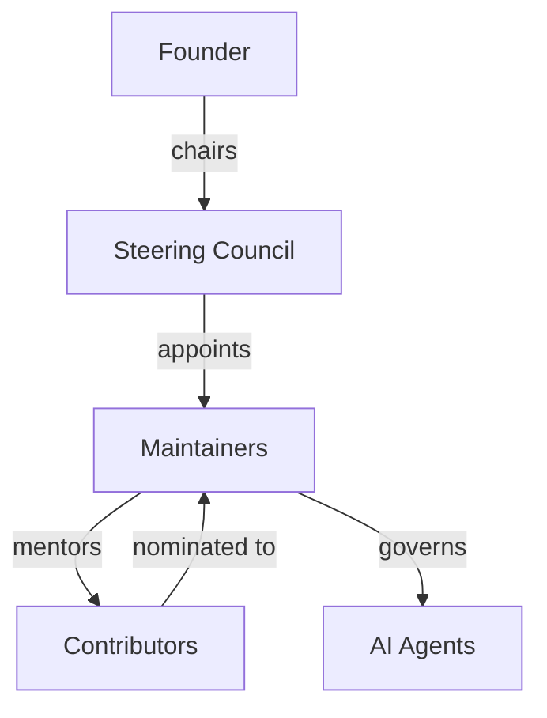

# GOV-001 — Governance Model

> **GOV-001 · 2026.07-r1 · Tier 1 — Governance**
>
> The official governance model for the OpenTamilOCR organization.
> Changes require Steering Council approval.

---

## 1. Purpose

This document defines how the OpenTamilOCR organization is structured, how authority is distributed, how decisions are made, and how individuals move between roles.

It implements the governance authority granted by the Project Charter (FND-001, Section 12) and operates within the ethical and behavioral boundaries established by FND-002 and FND-003.

---

## 2. Scope

This governance model applies to:

- All repositories under the OpenTamilOCR organization.
- All organizational processes, including releases, reviews, and community management.
- All individuals holding formal roles within the organization.
- All AI agents operating under defined organizational roles.

---

## 3. Governance Principles

| # | Principle | Application |
|---|-----------|-------------|
| G1 | **Merit-based authority.** | Roles are earned through sustained, quality contributions — not tenure, affiliation, or seniority alone. |
| G2 | **Transparent process.** | Governance decisions are documented, publicly visible, and traceable through the Decision Database. |
| G3 | **Minimal viable governance.** | The governance structure is the simplest that can effectively serve the project's needs. Complexity is added only when earned (P5, FND-001). |
| G4 | **Separation of concerns.** | Technical decisions, community decisions, and governance decisions have distinct authority paths. |
| G5 | **Resilient succession.** | No single individual is a point of failure. The organization must survive personnel changes (P9, FND-001). |

---

## 4. Organizational Structure

### 4.1 Overview

### 4.2 Organizational Phases

The governance structure evolves as the project matures.

| Phase | Trigger | Structure |
|-------|---------|-----------|
| **Bootstrap** | Project founding (current phase) | Founder holds all authority. Operates as benevolent dictator. |
| **Growth** | ≥3 active maintainers | Steering Council is formed. Founder chairs the Council. Authority begins distributing. |
| **Maturity** | ≥10 active maintainers, ≥50 contributors | Full governance model is active. Steering Council operates independently. Founder transitions to advisory role if desired. |
| **Foundation** | Community decision via RFC | Project may incorporate as a legal foundation. Governance model is revised via RFC. |

The current phase is **Bootstrap**.
Phase transitions are recorded as decision records (DEC-NNN).

---

## 5. Roles and Responsibilities

### 5.1 Founder

| Attribute | Description |
|-----------|-------------|
| **Authority** | All organizational authority during the Bootstrap phase. Chairs the Steering Council after its formation. |
| **Responsibilities** | Set strategic direction. Establish foundational documents. Make architectural decisions. Build the initial contributor community. |
| **Limitations** | Must follow the processes defined in TamilOCR OS once they are established. Cannot override ratified Tier 0 documents without RFC. |
| **Succession** | Defined in GOV-002 (Business Continuity Plan). |
| **Count** | 1 |

### 5.2 Steering Council

| Attribute | Description |
|-----------|-------------|
| **Authority** | Highest collective authority in the organization. Approves RFCs, architecture changes, release milestones, new repositories, and role appointments. |
| **Composition** | Minimum 3 members, maximum 7. Must include the Founder (as chair) and at least 2 elected maintainers. Odd number preferred for tie-breaking. |
| **Formation trigger** | ≥3 active maintainers exist. |
| **Term** | 2 years, renewable. Staggered terms to ensure continuity. |
| **Meetings** | At least quarterly. Meeting notes published in `tamilocr-community`. |
| **Quorum** | Majority of seated members. |
| **Recusal** | Members must recuse themselves from decisions where they have a personal conflict of interest. |

### 5.3 Maintainers

| Attribute | Description |
|-----------|-------------|
| **Authority** | Merge pull requests. Approve standard and operational changes. Enforce coding, documentation, and data standards. Triage issues. |
| **Scope** | Maintainers are scoped to one or more repositories. A maintainer's authority extends only to their designated repositories. |
| **Appointment** | Nominated by an existing maintainer, approved by the Steering Council (or Founder during Bootstrap). |
| **Requirements** | Sustained quality contributions over ≥3 months. Demonstrated understanding of project standards. Adherence to FND-002. |
| **Responsibilities** | Review PRs within 7 days. Mentor contributors. Enforce quality gates. Participate in release processes. Maintain CODEOWNERS. |
| **Removal** | Voluntary resignation, extended inactivity (>6 months without communication), or Code of Conduct violation. Removal for cause requires Steering Council vote. |

### 5.4 Contributors

| Attribute | Description |
|-----------|-------------|
| **Authority** | Submit issues, pull requests, RFCs, and discussion topics. Vote in community polls. Participate in RFC discussions. |
| **Requirements** | Agreement to DCO (FND-004, Section 10.1). Adherence to FND-002. |
| **Recognition** | Contributors are listed in repository CONTRIBUTORS files and release notes. |
| **Progression** | Contributors who demonstrate sustained quality work may be nominated for maintainer status. |

### 5.5 AI Agents

| Attribute | Description |
|-----------|-------------|
| **Authority** | Execute tasks within defined agent roles. Suggest updates to AI Memory, generation log, and metrics. Flag inconsistencies. |
| **Governance** | Governed by `tamilocr-os://ai/roles/agent-roles`. Must follow the AI Bootstrap Protocol (SYS-000). |
| **Limitations** | Cannot approve documents, merge PRs, make governance decisions, or override human decisions. All significant AI outputs require human review. |
| **Accountability** | AI agent actions are accountable through their human operators and the review processes in TamilOCR OS. |

---

## 6. Decision Authority Matrix

| Decision Type | Bootstrap Phase | Growth Phase | Maturity Phase |
|---------------|----------------|--------------|----------------|
| Tier 0 changes | Founder | Steering Council vote | Steering Council vote |
| Tier 1 changes | Founder | Steering Council | Steering Council |
| Tier 2 changes (architecture) | Founder | RFC → Steering Council | RFC → Steering Council |
| Tier 3 changes (standards) | Founder | RFC → 1 maintainer + SC member | RFC → 1 maintainer + SC member |
| Tier 4 additions (knowledge) | Founder | 1 maintainer | 1 maintainer |
| Tier 5 updates (planning) | Founder | Steering Council | Steering Council |
| Tier 6 updates (operations) | Founder | 1 maintainer | 1 maintainer |
| Tier 7 updates (references) | Founder | Any contributor | Any contributor |
| New repository | Founder | RFC → Steering Council | RFC → Steering Council |
| New maintainer | Founder | Nomination → Steering Council | Nomination → Steering Council |
| Release authorization | Founder | Steering Council | Release manager + Steering Council |
| Ethics decision | Founder | Steering Council + Ethics Reviewer | Steering Council + Ethics Reviewer |
| Code of Conduct enforcement | Founder | Conduct Committee | Conduct Committee |

---

## 7. Steering Council Operations

### 7.1 Elections

Once the Growth phase is reached:

- Maintainers may self-nominate or be nominated by other maintainers.
- Election is by simple majority vote of all active maintainers.
- The Founder holds a permanent seat (unless voluntarily relinquished).
- Elected seats serve 2-year staggered terms.
- Initial terms are staggered: half serve 1-year terms in the first cycle to establish rotation.

### 7.2 Voting Procedures

| Decision Category | Voting Method | Threshold |
|-------------------|---------------|-----------|
| Tier 0 amendments | Roll-call vote, recorded | Supermajority (⅔ of seated members) |
| Architecture changes | Roll-call vote, recorded | Simple majority |
| Role appointments | Roll-call vote, recorded | Simple majority |
| Operational decisions | Lazy consensus (7-day window) | No objection = approved |
| Emergency decisions | Any available quorum | Simple majority; must be ratified at next regular meeting |

### 7.3 Lazy Consensus

For routine decisions, the Steering Council uses lazy consensus:

1. A proposal is posted to the Council's communication channel.
2. Members have 7 days to object.
3. If no objections are raised, the proposal is approved.
4. If any member objects, the proposal moves to a formal vote.
5. All lazy consensus decisions are logged in meeting notes.

### 7.4 Conflict of Interest

- Members must disclose any personal, financial, or professional interest in a decision.
- Disclosed conflicts require recusal from the vote.
- Undisclosed conflicts, if discovered, are treated as a governance violation.
- Conflicts are recorded in meeting notes.

---

## 8. Role Transitions

### 8.1 Contributor → Maintainer

| Step | Action | Actor |
|------|--------|-------|
| 1 | Contributor demonstrates sustained quality contributions over ≥3 months. | Contributor |
| 2 | Existing maintainer nominates the contributor. | Maintainer |
| 3 | Nomination is reviewed against criteria (Section 5.3). | Steering Council / Founder |
| 4 | Approved: contributor is granted maintainer access to designated repositories. | Steering Council / Founder |
| 5 | Onboarding: new maintainer reviews all Tier 0–3 documents. | New maintainer |
| 6 | Announcement: community is notified. | Steering Council |

### 8.2 Maintainer → Steering Council

| Step | Action |
|------|--------|
| 1 | Maintainer self-nominates or is nominated during an election cycle. |
| 2 | Candidates present their vision for the project (brief written statement). |
| 3 | Active maintainers vote. |
| 4 | Elected member is seated at the next Council meeting. |

### 8.3 Role Removal

| Reason | Process |
|--------|---------|
| **Voluntary resignation** | Written notice to Steering Council. Access revoked within 7 days. Acknowledged in community communication. |
| **Extended inactivity** | >6 months without contribution or communication. Maintainer is contacted. If no response within 30 days, emeritus status is granted and active access is revoked. |
| **Code of Conduct violation** | Handled through FND-002 enforcement process. Steering Council vote required for maintainer or Council member removal. |
| **Loss of trust** | Demonstrated pattern of decisions that harm the project. Requires RFC-level discussion and Steering Council supermajority vote. |

### 8.4 Emeritus Status

Former maintainers and Steering Council members who step down in good standing receive emeritus status.

- Listed in the project's contributor history.
- May be re-appointed without the standard waiting period if they return.
- Do not retain active merge or vote authority.

---

## 9. Communication Channels

| Channel | Purpose | Governance Level |
|---------|---------|-----------------|
| **GitHub Issues** | Bug reports, feature requests, task tracking | All participants |
| **GitHub Discussions** | Community Q&A, open-ended topics, RFC discussions | All participants |
| **Pull Requests** | Code, documentation, and data review | Contributors, maintainers |
| **tamilocr-community repo** | Meeting notes, RFC mirrors, governance discussions | All participants |
| **Steering Council channel** | Council deliberations (may be private for sensitive topics) | Steering Council |
| **conduct@opentamilocr.org** | Code of Conduct reports (FND-002, Section 8) | Conduct Committee |

---

## 10. Accountability and Transparency

### 10.1 Decision Records

All significant governance decisions are recorded as DEC-NNN entries in the Decision Database (`tamilocr-os://decisions/`).

This includes:

- Role appointments and removals.
- Phase transitions.
- RFC outcomes.
- Governance process changes.
- Architecture review outcomes.

### 10.2 Public Records

The following are always public:

- All TamilOCR OS documents.
- All RFC discussions and outcomes.
- All decision records (with redaction for privacy-sensitive content per FND-002).
- Steering Council meeting notes.
- Release decisions and criteria.

### 10.3 Private Records

The following may be kept private:

- Code of Conduct investigation details.
- Security vulnerability details (until disclosure).
- Personnel-related discussions during role transitions.

Private records are accessible to the Steering Council and are archived for organizational continuity (GOV-002).

---

## 11. Governance Relationship

| Document | Relationship |
|----------|-------------|
| FND-001 — Project Charter | Parent. Section 12 grants authority for this governance model. Section 9 defines initial organizational structure. |
| FND-002 — Code of Conduct | Sibling. Defines behavioral expectations enforced through governance processes. |
| FND-003 — Ethics Framework | Sibling. Defines ethical obligations that governance must uphold. |
| FND-004 — Licensing Policy | Sibling. Defines IP and contributor rights governed by this model. |
| GOV-002 — Business Continuity Plan | Child. Implements succession planning referenced in this document. |
| GOV-003 — Decision Process | Child. Implements the RFC and decision recording processes referenced throughout. |
| GOV-004 — Release Governance | Child. Implements release authorization referenced in Section 6. |

---

## 12. Related Documents

| Document | Relationship |
|----------|-------------|
| SYS-000 — Master Index | Root. This document is registered under the SYS-000 knowledge graph. |
| FND-001 — Project Charter | Required. Grants governance authority. |
| FND-002 — Code of Conduct | Reference. Behavioral standards enforced through governance. |
| FND-003 — Ethics Framework | Reference. Ethical obligations for governance decisions. |
| FND-004 — Licensing Policy | Reference. Contributor rights and IP governance. |

---

## 13. Review Policy

- **Review frequency:** Annually or upon a phase transition.
- **Amendment process:** Steering Council approval. Major structural changes require RFC.
- **Phase transition reviews:** When the project transitions from Bootstrap to Growth or from Growth to Maturity, this document must be reviewed and updated.

---

## 14. Document History

| Version | Date | Summary |
|---------|------|---------|
| 2026.07-r1 | 2026-07-04 | Initial draft. Founding governance model for the OpenTamilOCR organization. |

---

> **Approved by:** Pending Steering Council approval.
> **Effective date:** Upon approval.
