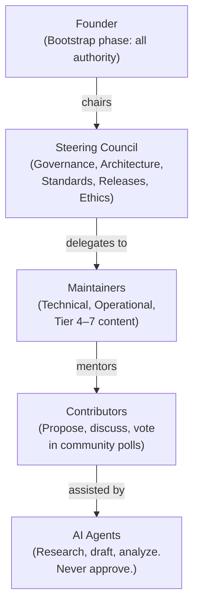
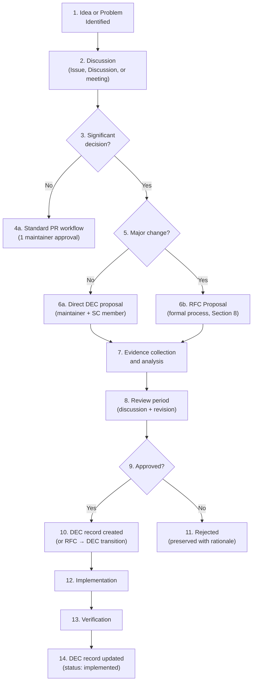

# GOV-003 — Decision Process

> **GOV-003 · 2026.07-r1 · Tier 1 — Governance**
>
> The official decision process for the OpenTamilOCR organization.
> Changes require Steering Council approval.

---

## 1. Purpose

This document defines how every significant decision in the OpenTamilOCR organization is proposed, evaluated, approved, documented, implemented, reviewed, and archived.

No significant decision should exist only in conversations, meetings, or AI chat sessions.
Every important choice must be transparent, traceable, evidence-based, and permanently recorded in the Decision Database.

---

## 2. Scope

This process governs all decisions that affect:

- Organizational governance and structure.
- Technical architecture and design.
- Standards and conventions.
- Datasets, models, and benchmarks.
- Infrastructure and tooling.
- Community policies and processes.
- Security and incident response.
- Releases and versioning.

Trivial decisions (typo fixes, formatting, routine issue triage) are excluded from this process.
The threshold for what constitutes a "significant decision" is defined in Section 5.

---

## 3. Decision Philosophy

| # | Principle | Application |
|---|-----------|-------------|
| DP1 | **Transparency.** | All significant decisions are publicly documented with full reasoning. |
| DP2 | **Evidence-based.** | Decisions are grounded in data, research, benchmarks, or documented experience — not opinion alone. |
| DP3 | **Consensus first.** | Seek agreement through discussion before resorting to votes. |
| DP4 | **Document before implement.** | The decision record is written before the implementation begins. |
| DP5 | **Community participation.** | Affected stakeholders have the opportunity to participate in the decision. |
| DP6 | **Reversibility awareness.** | Every decision explicitly states whether it is reversible, and at what cost. |
| DP7 | **Long-term sustainability.** | Decisions consider 5+ year impact, not just immediate convenience. |
| DP8 | **Accountability.** | Every decision has a named owner responsible for its implementation and review. |
| DP9 | **Traceability.** | Every decision can be traced back to its proposal, discussion, evidence, and approval. |

---

## 4. Decision Categories

| Category | Description | Authority | RFC Required? |
|----------|-------------|-----------|---------------|
| **Governance** | Changes to organizational structure, roles, processes, or policies. | Steering Council | Yes, for structural changes. No, for minor process clarifications. |
| **Architecture** | Changes to system design, repository structure, knowledge graph, or pipeline design. | Steering Council | Yes |
| **Technical** | Implementation choices within established architecture (libraries, algorithms, configurations). | Maintainers | No, unless it affects architecture. |
| **Standards** | New or modified coding, documentation, dataset, model, or testing standards. | 1 maintainer + SC member | Yes |
| **Dataset** | Dataset format, annotation strategy, storage, or licensing decisions. | Maintainers | Yes, for format/strategy. No, for individual dataset additions. |
| **Model** | Base framework selection, training strategy, evaluation methodology. | Steering Council | Yes, for framework/strategy. No, for hyperparameter tuning. |
| **Infrastructure** | CI/CD, hosting, tooling, or vendor choices. | Maintainers | Yes, for new vendors or significant tooling changes. |
| **Security** | Security policies, vulnerability response, access control. | Steering Council | Yes, for policy changes. No, for incident response actions. |
| **Release** | Release milestones, version strategies, deprecation. | Steering Council | Yes, for lifecycle changes. No, for individual releases. |
| **Community** | Community policies, communication channels, events. | Steering Council | Yes, for policy changes. No, for operational decisions. |
| **Operational** | Day-to-day process improvements, documentation updates. | Maintainers | No |
| **Emergency** | Urgent actions during incidents (see Section 12). | Available authority | No (documented retroactively). |

---

## 5. Decision Authority

### 5.1 Authority Hierarchy



### 5.2 Authority Matrix

| Action | Founder (Bootstrap) | Steering Council | Maintainers | Contributors | AI Agents |
|--------|-------------------|-----------------|-------------|-------------|-----------|
| Approve Tier 0 changes | ✓ | ✓ (vote) | — | — | — |
| Approve Tier 1 changes | ✓ | ✓ | — | — | — |
| Approve architecture changes | ✓ | ✓ (after RFC) | — | — | — |
| Approve standard changes | ✓ | ✓ (with maintainer) | Co-approve | — | — |
| Approve knowledge additions | ✓ | ✓ | ✓ | — | — |
| Approve operational updates | ✓ | ✓ | ✓ | — | — |
| Approve reference updates | ✓ | ✓ | ✓ | ✓ | — |
| Propose RFC | ✓ | ✓ | ✓ | ✓ | Draft only |
| Create DEC record | ✓ | ✓ | ✓ | — | Draft only |
| Merge pull requests | ✓ | ✓ | ✓ | — | — |
| Vote in elections | ✓ | ✓ | ✓ | — | — |
| Participate in RFC discussion | ✓ | ✓ | ✓ | ✓ | ✓ (advisory) |

---

## 6. Decision Workflow

### 6.1 Standard Workflow



### 6.2 Workflow Stages

| Stage | Description | Output |
|-------|-------------|--------|
| **1. Identification** | A problem, opportunity, or improvement is identified. | GitHub Issue or Discussion. |
| **2. Discussion** | Stakeholders discuss the problem and potential solutions. | Discussion thread with community input. |
| **3. Significance check** | Determine if the decision meets the threshold for formal documentation. | Go/no-go determination. |
| **4. Evidence collection** | Gather data, benchmarks, research, or precedents to inform the decision. | Evidence summary (may be a research note RSC-NNN or experiment EXP-NNN). |
| **5. Proposal** | A formal proposal is written (RFC for major changes, direct DEC for others). | RFC-NNN or draft DEC-NNN. |
| **6. Review** | The proposal is reviewed by the appropriate authority. | Review comments and revisions. |
| **7. Approval** | The decision is approved, rejected, or deferred. | Approved/rejected status. |
| **8. Documentation** | The decision record is finalized with full reasoning. | DEC-NNN record. |
| **9. Implementation** | The approved decision is implemented in code, documentation, or process. | PRs, commits, document updates. |
| **10. Verification** | Implementation is verified against the decision criteria. | Quality gate passage. |
| **11. Archive** | The decision record is permanent. It is never deleted. | Permanent DEC-NNN in the Decision Database. |

---

## 7. Significance Threshold

Not every choice requires a formal decision record.

### 7.1 Requires DEC Record

- Any change to Tier 0, 1, or 2 documents.
- Any change to a standard (Tier 3).
- Base framework selection or change.
- New repository creation.
- New organizational role or role change.
- Dataset format or annotation strategy changes.
- Model training strategy changes.
- Infrastructure vendor changes.
- Security policy changes.
- Release lifecycle changes.
- Ethics-impacting decisions.
- Any decision that required an RFC.

### 7.2 Does NOT Require DEC Record

- Bug fixes.
- Typo and formatting corrections.
- Individual dataset sample additions.
- Routine dependency updates (unless security-related).
- Issue triage and labeling.
- Individual PR approvals within established standards.
- Hyperparameter tuning within approved ranges.
- Routine CI/CD configuration changes.

---

## 8. RFC System

### 8.1 Purpose

The Request for Comments (RFC) system provides a structured process for proposing, discussing, and deciding on major changes.

An RFC is a formal written proposal that:

- Describes the problem or opportunity.
- Proposes a specific solution.
- Analyzes alternatives.
- Assesses impact.
- Invites community discussion.

### 8.2 When RFC Is Required

| Change Type | RFC Required? |
|-------------|---------------|
| Bug fix | No |
| Minor feature (single repo) | No |
| New standard or standard change | Yes |
| Architecture change | Yes |
| New repository | Yes |
| Base framework change | Yes |
| Ethics-impacting change | Yes |
| Governance structural change | Yes |
| New document prefix | Yes |
| Tier structure change | Yes |
| Release lifecycle change | Yes |

### 8.3 RFC Lifecycle

```
DRAFT → DISCUSSION → FINAL-COMMENT → ACCEPTED / REJECTED / WITHDRAWN
```

| Stage | Duration | Description |
|-------|----------|-------------|
| **DRAFT** | Variable | Author writes the RFC. May share early for informal feedback. |
| **DISCUSSION** | 7–14 days | RFC is formally posted. Community discusses and suggests revisions. Author may revise the RFC during this period. |
| **FINAL-COMMENT** | 3 days | No further revisions. Final opportunity for objections. |
| **ACCEPTED** | — | Approved by the appropriate authority (see Section 5.2). Generates a DEC record. |
| **REJECTED** | — | Not approved. Preserved permanently with rejection rationale. |
| **WITHDRAWN** | — | Author withdraws the RFC. Preserved permanently. |

### 8.4 RFC Structure

Every RFC must include:

| Section | Content |
|---------|---------|
| **Title** | Clear, descriptive title. |
| **Author** | Name and GitHub handle. |
| **Status** | Current lifecycle stage. |
| **Created** | Date the RFC was created. |
| **Problem Statement** | What problem does this RFC address? |
| **Proposal** | The proposed solution in detail. |
| **Alternatives Considered** | At least 2 alternatives with analysis of trade-offs. |
| **Impact Assessment** | What documents, repositories, processes, and stakeholders are affected? |
| **Migration Plan** | If applicable, how existing systems transition to the new approach. |
| **Risks** | What could go wrong? How are risks mitigated? |
| **Open Questions** | Unresolved issues for community input. |

The full RFC template is defined in TPL-005 (`tamilocr-os://templates/rfc-template`).
The RFC schema is defined in SCH-006 (`tamilocr-os://schemas/rfc`).

### 8.5 RFC Storage

- RFCs are stored in `rfcs/RFC-NNN-{slug}.md`.
- The RFC index is maintained in `rfcs/index.yaml`.
- Accepted RFCs generate corresponding DEC records.
- Rejected and withdrawn RFCs are preserved permanently as institutional memory.

---

## 9. Decision Records (DEC-NNN)

### 9.1 Purpose

Decision records are the permanent archive of every significant organizational decision.
They replace traditional Architecture Decision Records (ADRs) with a unified format that covers all decision categories (SYS-000, Section 12, D12).

### 9.2 DEC Record Structure

Every decision record must include:

| Field | Description |
|-------|-------------|
| **id** | `DEC-NNN` — permanent, sequential, never reused. |
| **title** | Clear, descriptive title of the decision. |
| **category** | `architecture`, `governance`, `process`, `research`, `ethics`, `security`, `release`, `infrastructure`. |
| **status** | `proposed` → `accepted` → `implemented` → `superseded` (never deleted). |
| **date** | Date the decision was finalized. |
| **decision_makers** | Who approved the decision. |
| **context** | Background and problem statement. |
| **decision** | The specific decision made. |
| **reasoning** | Why this decision was made (the most important section). |
| **alternatives** | Alternatives considered and why they were rejected. |
| **consequences** | Expected impact — positive, negative, and neutral. |
| **implementation** | How and where the decision is implemented. |
| **review_trigger** | Conditions under which this decision should be revisited. |
| **source_rfc** | RFC-NNN that proposed this decision, if applicable. |
| **related_decisions** | Other DEC records that are related. |

The full schema is defined in SCH-004 (`tamilocr-os://schemas/decision-record`).
The template is defined in TPL-001 (`tamilocr-os://templates/decision-template`).

### 9.3 Decision Lifecycle

```
PROPOSED → ACCEPTED → IMPLEMENTED → SUPERSEDED (optional)
```

- **Proposed:** A decision has been suggested but not yet approved.
- **Accepted:** The decision has been approved by the appropriate authority.
- **Implemented:** The decision has been applied in code, documentation, or process.
- **Superseded:** A newer decision replaces this one. The superseded record is preserved with a pointer to its replacement.

Decisions are **never deleted**.
The Decision Database is append-only.
This ensures that institutional memory is permanent and that future contributors can understand why past choices were made.

### 9.4 Decision Storage

- Decision records are stored in `decisions/DEC-NNN-{slug}.md`.
- The decision index is maintained in `decisions/index.yaml`.
- Decisions are cross-referenced in the `triggered_by` field of documents they affect.

### 9.5 Initial Decisions

The following decisions are pre-defined in the generation plan:

| ID | Title | Category |
|----|-------|----------|
| DEC-001 | Base Framework Selection | architecture |
| DEC-002 | Annotation Format Selection | architecture |
| DEC-003 | Dataset Storage Strategy | architecture |

---

## 10. Consensus Process

### 10.1 Consensus First

OpenTamilOCR prefers consensus over voting.
Consensus means that all stakeholders have had the opportunity to participate and no one actively objects.

### 10.2 Lazy Consensus

For routine decisions within a role's authority:

1. A proposal is posted (PR, Issue, or Discussion).
2. Stakeholders have a defined review window (typically 7 days).
3. If no objections are raised, the proposal is approved.
4. If any stakeholder objects, the proposal moves to active discussion.

### 10.3 Active Discussion

When consensus is not immediate:

1. The objection is documented with reasoning.
2. The proposer and objector discuss, seeking a compromise.
3. If compromise is reached, the modified proposal is approved.
4. If no compromise is possible within 14 days, the matter escalates.

### 10.4 Escalation Path

```
1. Direct discussion between proposer and objector.
    ↓ (no resolution within 7 days)
2. Mediated discussion with a neutral maintainer.
    ↓ (no resolution within 7 days)
3. Steering Council discussion and vote.
    ↓
4. Decision recorded as DEC-NNN.
```

### 10.5 Disagreement and Commitment

Once a decision is made through the proper process:

- All participants are expected to support the decision, even if they disagreed during discussion.
- Continued obstruction after a final decision is a governance violation.
- Participants retain the right to propose a new RFC to revisit the decision with new evidence.

---

## 11. Voting Procedures

### 11.1 When Voting Occurs

Voting is used only when consensus cannot be reached or when the decision category requires a formal vote (GOV-001, Section 7.2).

### 11.2 Eligible Voters

| Decision Type | Eligible Voters |
|---------------|----------------|
| Tier 0 amendments | Steering Council members |
| Architecture changes | Steering Council members |
| Standard changes | Steering Council members + relevant maintainers |
| Role appointments | All active maintainers |
| Steering Council elections | All active maintainers |
| Community polls | All contributors |

### 11.3 Voting Thresholds

| Vote Type | Threshold | Used For |
|-----------|-----------|----------|
| **Simple majority** | >50% of votes cast | Standard decisions, role appointments. |
| **Supermajority** | ≥⅔ of seated members | Tier 0 amendments, architecture boundary changes. |
| **Unanimous** | 100% of seated members | Not used. Reserved for future governance if needed. |

### 11.4 Voting Rules

- Votes are cast within a defined voting window (typically 7 days).
- Abstentions do not count toward the threshold but do count toward quorum.
- Quorum is a majority of eligible voters.
- If quorum is not met, the voting window is extended by 7 days (once).
- If quorum is still not met, the Steering Council chair may reduce quorum requirements for that specific vote, documenting the reason.
- All votes are recorded in meeting notes or the DEC record.

### 11.5 Tie-Breaking

- In case of a tie, the Steering Council chair casts the deciding vote.
- During the Bootstrap phase, the Founder casts the deciding vote.

---

## 12. Emergency Decisions

### 12.1 When Emergency Process Applies

The emergency process is activated when:

- A security incident requires immediate action (GOV-002, Section 9).
- A critical bug in a release requires an immediate patch.
- Infrastructure failure requires urgent remediation.
- A Code of Conduct violation requires immediate protective action.
- Legal action requires an urgent organizational response.

### 12.2 Emergency Authority

| Phase | Emergency Authority |
|-------|-------------------|
| **Bootstrap** | Founder |
| **Growth / Maturity** | Any available Steering Council quorum. If no quorum, any 2 maintainers may act jointly. |

### 12.3 Emergency Workflow

1. **Act:** Take the minimum action necessary to address the immediate threat.
2. **Notify:** Inform the Steering Council (or Founder) within 4 hours.
3. **Document:** Create a draft DEC record within 48 hours.
4. **Ratify:** The Steering Council ratifies or reverses the emergency decision at the next meeting (within 14 days).
5. **Review:** Post-incident review per GOV-002, Section 11.3.

### 12.4 Retroactive Documentation

Emergency decisions taken without prior RFC or DEC record must be retroactively documented within 14 days.
The DEC record must include:

- The emergency conditions that triggered the action.
- The action taken and by whom.
- The rationale for bypassing normal process.
- The outcome.
- Lessons learned.

---

## 13. AI Participation in Decisions

### 13.1 Permitted AI Activities

AI agents may:

- Research and summarize relevant information.
- Draft RFC proposals and DEC records for human review.
- Analyze alternatives and present trade-offs.
- Perform consistency checks against existing architecture and standards.
- Generate benchmark results and analysis.
- Draft impact assessments.

### 13.2 Prohibited AI Activities

AI agents must never:

- Approve or reject an RFC.
- Finalize a DEC record without human review.
- Cast a vote.
- Override a human decision.
- Make emergency decisions.
- Bypass the RFC process.

### 13.3 AI Contribution Attribution

When AI contributes to a decision:

- The AI's role is documented in the DEC record (e.g., "AI-assisted research," "AI-drafted proposal").
- The human who reviewed and approved the AI's contribution is the accountable decision-maker.
- AI contributions are subject to the same quality standards as human contributions.

---

## 14. Documentation Requirements

### 14.1 What Must Be Documented

Every decision that passes the significance threshold (Section 7) must produce a DEC record containing:

| Element | Required? |
|---------|-----------|
| Context and problem statement | Yes |
| Decision statement | Yes |
| Reasoning and rationale | Yes |
| Alternatives considered | Yes |
| Consequences (positive, negative, neutral) | Yes |
| Decision-makers | Yes |
| Implementation plan | Yes |
| Review trigger | Yes |
| Source RFC (if applicable) | If applicable |
| Impact assessment | For architecture and governance decisions |
| Migration plan | For breaking changes |
| Rollback plan | For reversible decisions |

### 14.2 Cross-Referencing

- Documents affected by a decision must set `triggered_by: DEC-NNN` in their frontmatter.
- DEC records must list `related_decisions` when they interact with other decisions.
- RFCs that generate decisions must be cross-referenced via `source_rfc`.

---

## 15. Decision Review

### 15.1 Periodic Review

- All active DEC records with a `review_trigger` are evaluated during the Architecture Review Cycle (SYS-000, Section 10.4) — every 6 months or at major release boundaries.
- Decisions with time-based triggers (e.g., "revisit after 1 year") are flagged by `scripts/staleness-check.py`.

### 15.2 Superseding a Decision

To change a previous decision:

1. File a new RFC (if the original required one) or a new DEC proposal.
2. Reference the original DEC record in the `related_decisions` field.
3. The new DEC record sets `status: accepted`.
4. The old DEC record is updated to `status: superseded` with a pointer to the new record.
5. The old record is never deleted.

### 15.3 Historical Preservation

- Rejected decisions are preserved with their rejection rationale.
- Superseded decisions are preserved with pointers to their replacements.
- The complete decision history is always available for future contributors to understand why past choices were made.

---

## 16. Governance Relationship

| Document | Relationship |
|----------|-------------|
| FND-001 — Project Charter | Parent. Principle P8 (Decision Traceability) mandates this process. Section 12 grants governance authority. |
| FND-002 — Code of Conduct | Sibling. All decision processes must respect behavioral standards. |
| FND-003 — Ethics Framework | Sibling. Ethics-impacting decisions follow Section 10.3 of FND-003 in addition to this process. |
| FND-004 — Licensing Policy | Sibling. Licensing decisions follow this process with Section 14 of FND-004 as additional guidance. |
| GOV-001 — Governance Model | Required. Defines roles and authority levels referenced throughout this document. |
| GOV-002 — Business Continuity | Sibling. Emergency decisions and incident response procedures are coordinated. |
| GOV-004 — Release Governance | Child. Release decisions follow this process with additional release-specific gates. |
| SYS-000 — Master Index | Root. Sections 7 and 10 define cross-cutting systems and governance pipeline that this document implements. |

---

## 17. Related Documents

| Document | Relationship |
|----------|-------------|
| SYS-000 — Master Index | Root. Governance pipeline defined in Section 10. RFC and Decision systems defined in Section 7. |
| FND-001 — Project Charter | Required. Principle P8 mandates decision traceability. |
| GOV-001 — Governance Model | Required. Defines authority structure. |
| GOV-002 — Business Continuity | Reference. Emergency decision procedures. |
| FND-002 — Code of Conduct | Reference. Behavioral standards during decision processes. |
| FND-003 — Ethics Framework | Reference. Ethics review triggers for decisions. |

---

## 18. Review Policy

- **Review frequency:** Annually or upon a governance phase transition.
- **Amendment process:** Steering Council approval. Major structural changes require RFC.
- **Threshold for RFC:** Changes to the authority matrix, voting thresholds, or RFC lifecycle require an RFC. Changes to operational details (timelines, minor clarifications) do not.

---

## 19. Document History

| Version | Date | Summary |
|---------|------|---------|
| 2026.07-r1 | 2026-07-04 | Initial draft. Founding decision process for the OpenTamilOCR organization. |

---

> **Approved by:** Pending Steering Council approval.
> **Effective date:** Upon approval.
