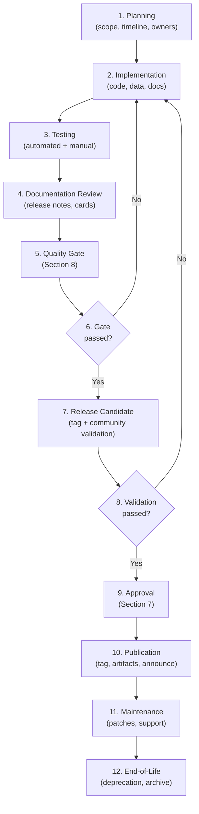

# GOV-004 — Release Governance

> **GOV-004 · 2026.07-r1 · Tier 1 — Governance**
>
> The official release governance policy for the OpenTamilOCR organization.
> Changes require Steering Council approval.

---

## 1. Purpose

This document defines how every release across the OpenTamilOCR ecosystem is planned, reviewed, approved, versioned, published, maintained, and retired.

It establishes a unified release policy that covers source code, documentation, datasets, trained models, benchmarks, APIs, backend services, and the documentation website.

Every release must be reproducible, traceable, secure, well-tested, and fully documented.

---

## 2. Scope

This policy applies to all releasable artifacts produced by the OpenTamilOCR organization:

| Artifact Type | Examples |
|---------------|---------|
| **Software** | `tamilocr-core`, `tamilocr-training`, `tamilocr-benchmarks`, `tamilocr-backend`, `tamilocr-playground` |
| **Documentation** | TamilOCR OS (this knowledge base), `tamilocr-docs-site` |
| **Datasets** | All datasets in `tamilocr-datasets` |
| **Models** | All trained models in `tamilocr-models` |
| **Benchmarks** | Evaluation suites and leaderboard results |
| **APIs** | Public-facing REST or gRPC interfaces |
| **Infrastructure** | Schemas, templates, scripts, and shared configurations |

---

## 3. Release Philosophy

| # | Principle | Application |
|---|-----------|-------------|
| RP1 | **Stability before speed.** | A delayed release is better than a broken one. Never rush a release to meet an artificial deadline. |
| RP2 | **Documentation-first.** | No artifact is released without complete, up-to-date documentation. |
| RP3 | **Reproducibility.** | Any released artifact can be rebuilt from its documented inputs (P6, FND-001). |
| RP4 | **Transparency.** | Release criteria, test results, and known issues are publicly visible. |
| RP5 | **Community trust.** | Releases establish trust. Broken releases destroy it. Protect the community's confidence. |
| RP6 | **Traceability.** | Every release is traceable to its source commits, dependencies, training data, and approval decisions. |
| RP7 | **Incremental progress.** | Prefer frequent, small releases over infrequent, large ones (P5, FND-001). |

---

## 4. Release Categories

### 4.1 Release Stages

| Stage | Stability | Breaking Changes | Support | Audience |
|-------|-----------|-----------------|---------|----------|
| **Experimental** | Unstable | Expected | None | Developers only |
| **Alpha** | Unstable | Expected | Best-effort | Early adopters |
| **Beta** | Feature-complete | Possible but discouraged | Best-effort | Broader testers |
| **Release Candidate (RC)** | Believed stable | None permitted | Bug fixes only | Validation community |
| **Stable** | Production-ready | None | Full support for current + 1 prior major | General public |
| **LTS (Long-Term Support)** | Production-ready | None | Extended maintenance (security + critical bugs) | Production users |

### 4.2 Special Release Types

| Type | Purpose | Process |
|------|---------|---------|
| **Hotfix** | Fix a critical bug in a stable release. | Branched from the release tag. Minimal change. Expedited review (1 maintainer). |
| **Security Release** | Fix a security vulnerability. | Coordinated disclosure per `SECURITY.md`. Expedited review. May skip community validation. |
| **Documentation Release** | Publish updated documentation without software changes. | Standard documentation quality gate. 1 maintainer approval. |
| **Dataset Release** | Publish a new or updated dataset version. | Dataset quality gate (Section 8.3). Maintainer approval. |
| **Model Release** | Publish a new or updated trained model. | Model quality gate (Section 8.4). Maintainer approval + benchmark validation. |

---

## 5. Versioning Strategy

### 5.1 Versioning by Artifact Type

| Artifact | Versioning Scheme | Example | Authority |
|----------|------------------|---------|-----------|
| **TamilOCR OS** | CalVer `YYYY.MM` with revision | `2026.07-r2` | SYS-000, D11 |
| **Software** | SemVer `MAJOR.MINOR.PATCH` | `1.2.3` | SYS-000, D11 |
| **Datasets** | SemVer `MAJOR.MINOR.PATCH` | `1.0.0` | Dataset card |
| **Models** | SemVer `MAJOR.MINOR.PATCH` | `1.0.0` | Model card |
| **APIs** | SemVer with URL prefix | `/v1/`, `/v2/` | API standards (STD-005) |
| **Schemas** | SemVer | `1.0.0` | Schema header |

### 5.2 Semantic Versioning Rules (Software, Datasets, Models)

| Version Component | Increment When |
|-------------------|---------------|
| **MAJOR** | Breaking changes. Incompatible API, format, or interface changes. |
| **MINOR** | New features or capabilities. Backward-compatible additions. |
| **PATCH** | Bug fixes, corrections, minor improvements. Backward-compatible. |

### 5.3 Pre-release Suffixes

| Suffix | Meaning | Example |
|--------|---------|---------|
| `-alpha.N` | Alpha release | `1.0.0-alpha.1` |
| `-beta.N` | Beta release | `1.0.0-beta.2` |
| `-rc.N` | Release candidate | `1.0.0-rc.1` |

### 5.4 Compatibility Policy

| Change Type | MAJOR | MINOR | PATCH |
|-------------|-------|-------|-------|
| Remove a public API endpoint | ✓ | — | — |
| Add a new API endpoint | — | ✓ | — |
| Fix a bug in an API response | — | — | ✓ |
| Change dataset annotation schema | ✓ | — | — |
| Add new samples to a dataset | — | ✓ | — |
| Correct annotation errors | — | — | ✓ |
| Change model architecture | ✓ | — | — |
| Retrain with more data (same arch) | — | ✓ | — |
| Fix model serving configuration | — | — | ✓ |

### 5.5 Deprecation Timeline

| Artifact | Minimum Deprecation Notice | Support After Deprecation |
|----------|---------------------------|--------------------------|
| Software API | 1 minor version cycle | 1 additional minor version |
| Dataset format | 1 major version cycle | Migration tooling provided |
| Model | No deprecation notice required | Previous version remains available |
| Documentation standard | 1 quarterly review cycle | Transition period of 90 days |

---

## 6. Release Lifecycle

### 6.1 Lifecycle Stages



### 6.2 Stage Descriptions

| Stage | Description | Output |
|-------|-------------|--------|
| **Planning** | Define release scope, assign owners, set tentative timeline. | Release plan (issue or document). |
| **Implementation** | Develop features, curate data, train models, write documentation. | Code, data, models, docs. |
| **Testing** | Execute automated tests, benchmarks, and manual validation. | Test reports, benchmark results. |
| **Documentation Review** | Verify release notes, changelogs, cards, and migration guides are complete. | Reviewed documentation. |
| **Quality Gate** | Verify all mandatory checks pass (Section 8). | Quality gate checklist. |
| **Release Candidate** | Tag an RC version. Invite community testing. | RC tag, community feedback. |
| **Community Validation** | Community tests the RC and reports issues. Minimum 7-day window for stable releases. | Community feedback. |
| **Approval** | Appropriate authority approves the release (Section 7). | Approval record. |
| **Publication** | Create release tag, publish artifacts, announce. | Published release. |
| **Maintenance** | Provide bug fixes and security patches. | Hotfix and security releases. |
| **End-of-Life** | Announce deprecation, archive, cease support. | Deprecation notice, archived release. |

---

## 7. Release Approval

### 7.1 Approval Authority

| Release Type | Approval Required |
|--------------|------------------|
| **Experimental** | 1 maintainer |
| **Alpha** | 1 maintainer |
| **Beta** | 2 maintainers |
| **Release Candidate** | 2 maintainers + Steering Council notification |
| **Stable (PATCH)** | 1 maintainer |
| **Stable (MINOR)** | 2 maintainers |
| **Stable (MAJOR)** | Steering Council |
| **LTS designation** | Steering Council |
| **Hotfix** | 1 maintainer (expedited) |
| **Security Release** | 1 maintainer (expedited) + Steering Council notification |
| **Dataset Release** | 1 maintainer with dataset expertise |
| **Model Release** | 1 maintainer + benchmark validation |
| **Documentation Release** | 1 maintainer |

During the Bootstrap phase, the Founder fulfills all approval roles.

### 7.2 Approval Checklist

Before approving any stable release, the approver must verify:

- [ ] All quality gates pass (Section 8).
- [ ] Release notes are complete and accurate.
- [ ] No known critical or high-severity issues remain unaddressed.
- [ ] Deprecation notices have been issued for removed features.
- [ ] Migration guide is provided for breaking changes.
- [ ] License compliance has been verified (FND-004).
- [ ] The release has been tested on the target platforms.

---

## 8. Quality Gates

### 8.1 Software Quality Gate

| Check | Automated? | Tool / Process | Required For |
|-------|------------|----------------|-------------|
| **Unit tests pass** | Yes | CI pipeline | All releases |
| **Integration tests pass** | Yes | CI pipeline | Beta+ |
| **Linter and formatter pass** | Yes | CI pipeline | All releases |
| **No critical security vulnerabilities** | Partial | Dependency scanner | All releases |
| **License compliance** | Partial | License scanner | All releases |
| **Code review** | No | PR review | All releases |
| **Benchmark executed** | Yes | Benchmark suite | Beta+ |
| **Documentation complete** | No | Manual review | Stable+ |
| **Changelog updated** | No | Manual review | All releases |
| **Conventional Commits** | Yes | CI check | All releases |
| **DCO signoff** | Yes | CI check | All releases |

### 8.2 Documentation Quality Gate

| Check | Automated? | Tool / Process |
|-------|------------|----------------|
| **Metadata valid** | Yes | `scripts/validate-metadata.py` |
| **Dependencies resolved** | Yes | `scripts/check-dependencies.py` |
| **Cross-references valid** | Yes | `scripts/check-dependencies.py` |
| **Peer reviewed** | No | 1 maintainer approval |
| **Formatting consistent** | Partial | Linter + manual review |
| **AI consistency check** | Optional | AI agent review |

### 8.3 Dataset Quality Gate

| Check | Automated? | Tool / Process |
|-------|------------|----------------|
| **Dataset card complete** | Partial | Schema validation (SCH-003) |
| **License documented** | No | Manual review |
| **Provenance documented** | No | Manual review |
| **Checksum generated** | Yes | Build script |
| **Annotation quality verified** | Partial | Automated + spot-check |
| **Bias evaluation documented** | No | Manual review (FND-003, Section 5.5) |
| **No PII detected** | Partial | Automated scan + manual review |
| **Format validated** | Yes | Validation script |

### 8.4 Model Quality Gate

| Check | Automated? | Tool / Process |
|-------|------------|----------------|
| **Model card complete** | Partial | Schema validation (SCH-002) |
| **Training data documented** | No | Model card review |
| **Benchmark results recorded** | Yes | Benchmark suite |
| **Meets minimum accuracy threshold** | Yes | Benchmark comparison |
| **Bias evaluation complete** | No | Manual review (FND-003, Section 6.4) |
| **Reproducibility verified** | Partial | Re-training from config |
| **License compliance** | No | Manual review (FND-004, Section 8) |
| **Checksum generated** | Yes | Build script |
| **Environmental impact documented** | No | Compute cost estimate |

---

## 9. Release Artifacts

### 9.1 Required Artifacts by Release Type

| Artifact | Software | Dataset | Model | Documentation |
|----------|----------|---------|-------|--------------|
| **Release Notes** | ✓ | ✓ | ✓ | ✓ |
| **Changelog** | ✓ | ✓ | ✓ | — |
| **Version Tag** | ✓ | ✓ | ✓ | ✓ |
| **Checksums** | ✓ | ✓ | ✓ | — |
| **Dataset Card** | — | ✓ | — | — |
| **Model Card** | — | — | ✓ | — |
| **Benchmark Report** | ✓ (if applicable) | — | ✓ | — |
| **Migration Guide** | If breaking | If format change | If arch change | — |
| **License File** | ✓ | ✓ | ✓ | ✓ |

### 9.2 Release Notes Standard

Release notes must include:

- Version number and release date.
- Summary of changes (features, fixes, improvements).
- Breaking changes with migration instructions.
- Known issues.
- Contributors credited.
- Links to full changelog and documentation.

### 9.3 Changelog Format

Changelogs follow the [Keep a Changelog](https://keepachangelog.com/) format:

```markdown
## [1.2.0] - 2026-08-15

### Added
- New preprocessing filter for degraded documents.

### Changed
- Improved binarization algorithm performance by 15%.

### Fixed
- Corrected Unicode normalization for Tamil vowel signs.

### Deprecated
- Legacy configuration format (to be removed in 2.0.0).
```

---

## 10. Rollback Policy

### 10.1 When to Roll Back

A release should be rolled back when:

- A critical bug is discovered that affects a significant portion of users.
- A security vulnerability is introduced by the release.
- Data corruption or loss is possible.
- The release fails to meet its stated quality criteria.

### 10.2 Rollback Procedure

| Step | Action | Responsibility |
|------|--------|---------------|
| 1 | Identify the issue and confirm rollback is necessary. | Maintainer who discovers the issue. |
| 2 | Notify the Steering Council (or Founder during Bootstrap). | Discovering maintainer. |
| 3 | Unpublish or mark the release as broken (GitHub: "pre-release" flag or yanked). | Release manager. |
| 4 | Point users to the previous stable version. | Release manager. |
| 5 | Communicate the rollback to the community (Section 12). | Steering Council. |
| 6 | Fix the issue and re-release through normal process. | Assigned maintainer. |
| 7 | Document the rollback as a DEC record. | Release manager. |

### 10.3 Dataset and Model Rollback

- Datasets: previous versions remain available. The new version is marked as withdrawn.
- Models: previous versions remain available. The new version is marked as withdrawn.
- Withdrawn versions are never silently deleted. They are marked with a withdrawal notice explaining the reason.

---

## 11. Deprecation Policy

### 11.1 Deprecation Process

```
1. Announce deprecation with timeline.
    ↓
2. Mark as deprecated in documentation and release notes.
    ↓
3. Provide migration path or alternative.
    ↓
4. Maintain deprecated artifact for the specified support period.
    ↓
5. Archive (never delete) the deprecated artifact.
    ↓
6. Remove from active listings but preserve in repository history.
```

### 11.2 Deprecation Communication

- Deprecation is announced in release notes, documentation, and community channels.
- Deprecated features emit warnings in software (where applicable).
- Deprecated APIs return deprecation headers.
- A minimum notice period is observed (Section 5.5).

### 11.3 End-of-Life (EOL)

When a release reaches End-of-Life:

- No further patches, bug fixes, or security updates are provided.
- The release remains available for download but is clearly marked as unsupported.
- Users are directed to the current supported version.
- The EOL date is recorded in release notes and the version manifest.

---

## 12. Communication Strategy

### 12.1 Release Announcements

| Channel | Audience | Timing |
|---------|----------|--------|
| **GitHub Releases** | Developers, contributors | At release time |
| **Documentation website** | All users | Within 24 hours of release |
| **tamilocr-community repo** | Community members | At release time |
| **Social media** | Broader public | Within 48 hours for major releases |
| **Mailing list** (when established) | Subscribers | At release time for stable releases |

### 12.2 Communication Content

Every release announcement must include:

- Version number and release stage.
- Summary of what changed.
- Link to full release notes and changelog.
- Known issues.
- How to upgrade (or migrate, for breaking changes).
- How to report issues.

### 12.3 Incident Communication

For rollbacks, security releases, and emergency patches:

- Follow the incident communication procedures in GOV-002, Section 11.
- Acknowledge the issue within 4 hours.
- Provide status updates every 24 hours during active remediation.
- Publish a post-incident summary within 14 days.

---

## 13. Governance Relationship

| Document | Relationship |
|----------|-------------|
| FND-001 — Project Charter | Parent. Principles P5 (Progressive Complexity) and P6 (Reproducibility) govern release philosophy. |
| FND-004 — Licensing Policy | Sibling. License compliance is a release quality gate. |
| GOV-001 — Governance Model | Required. Defines roles and authority levels for release approval. |
| GOV-002 — Business Continuity | Sibling. Rollback and incident communication procedures are coordinated. |
| GOV-003 — Decision Process | Required. Release decisions follow the decision process. Major releases require DEC records. |
| ARCH-004 — OCR Pipeline Architecture | Downstream. Defines the OCR pipeline that software releases implement. |
| ARCH-005 — Data Architecture | Downstream. Defines dataset structures that dataset releases conform to. |
| STD-003 — Dataset Standards | Downstream. Implements dataset quality gates referenced in Section 8.3. |
| STD-004 — Model Standards | Downstream. Implements model quality gates referenced in Section 8.4. |
| STD-006 — Testing Standards | Downstream. Defines testing requirements referenced in Section 8.1. |
| STD-007 — Commit & Review Standards | Downstream. Defines commit conventions referenced in Section 8.1. |

---

## 14. Related Documents

| Document | Relationship |
|----------|-------------|
| SYS-000 — Master Index | Root. Release lifecycle stages defined in Section 10.3. |
| FND-001 — Project Charter | Required. Foundational principles governing releases. |
| GOV-001 — Governance Model | Required. Authority structure for release approval. |
| GOV-003 — Decision Process | Required. Decision workflow for major releases. |
| GOV-002 — Business Continuity | Reference. Incident communication and rollback coordination. |
| FND-004 — Licensing Policy | Reference. License compliance in releases. |

---

## 15. Review Policy

- **Review frequency:** Annually or upon a major release milestone.
- **Amendment process:** Steering Council approval. Changes to versioning strategy or approval authority require RFC.
- **Trigger for review:** If a rollback or release incident occurs, this policy must be reviewed within 30 days.

---

## 16. Document History

| Version | Date | Summary |
|---------|------|---------|
| 2026.07-r1 | 2026-07-04 | Initial draft. Founding release governance policy for the OpenTamilOCR organization. |

---

> **Approved by:** Pending Steering Council approval.
> **Effective date:** Upon approval.
