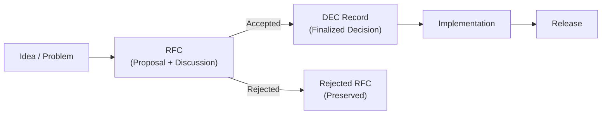
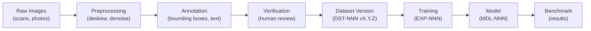
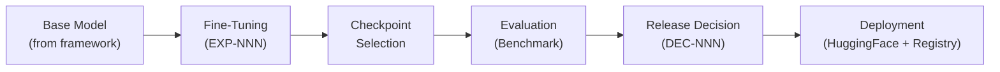
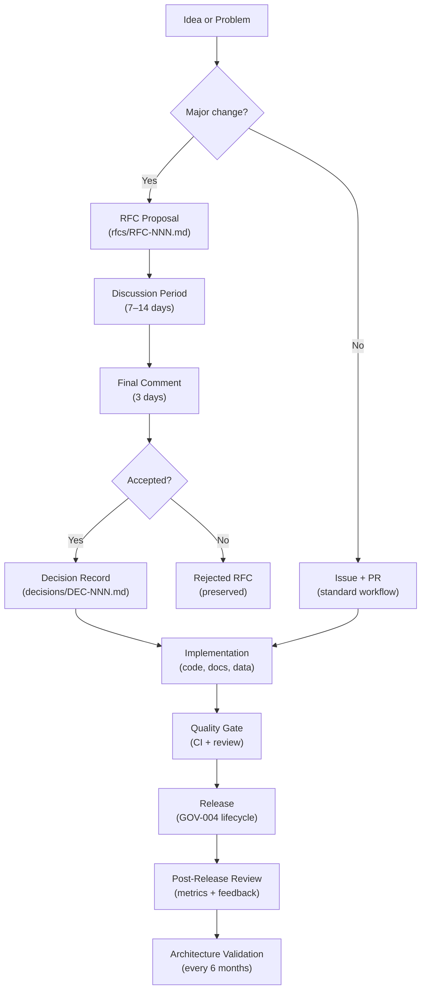

# OpenTamilOCR — Architectural Reasoning Report v3 (FINAL)

> **Status**: Final Draft for Approval
> **Date**: 2026-07-04
> **Author**: Chief Systems Architect
> **Scope**: Complete engineering architecture for the OpenTamilOCR organization
> **Revision**: v3 — final refinement integrating 12 new systems (RFC, Vision, Timeline, Metrics, Release Governance, Architecture Review, Dashboard, Dataset Lineage, Model Lineage, Research Roadmap, AI Agent Roles, Architecture Validation), plus governance pipeline unification

---

## Changelog from v2

| Area | v2 State | v3 Change |
|------|----------|-----------|
| Pre-decision process | Decisions recorded after the fact | **RFC System** for formal proposals before decisions |
| Strategic planning | 2 roadmap docs | **4 Vision Documents** (1/3/5/10 year) + **separated research roadmap** |
| Decision history | Flat list of decisions | **Architecture Decision Timeline** (generated chronological view) |
| Org health | No measurement system | **14 organizational metrics** with targets + **machine-readable dashboard** |
| Release process | Release guide (operational) | **Release Governance** (GOV-004) with formal lifecycle stages |
| Architecture currency | No review cycle | **6-month Architecture Validation** cycle |
| Data traceability | Dataset card with provenance | **Full dataset lineage** (raw → clean → annotate → verify → train → evaluate) |
| Model traceability | Model card with training info | **Full model lineage** (base → fine-tune → checkpoint → evaluate → release) |
| AI agent design | Generic AI protocol | **7 named AI Agent Roles** with scoped responsibilities |
| Governance flow | Separate systems | **Unified Governance Pipeline** (Idea → RFC → Decision → Implement → Release → Review) |
| Directory structure | `roadmaps/` | **`planning/`** with `vision/` and `roadmaps/` subdirectories |
| Document IDs | 15 prefixes | **17 prefixes** (added RFC, VIS) |
| Generation items | 60 items, 11 phases | **71 items, 11 phases** |
| Lock-in decisions | 13 | **15** |
| Risks | 12 | **14** |
| Open questions | 10 | **12** |

---

## Table of Contents

**Part I — Foundations**
1. [Executive Summary](#1-executive-summary)
2. [Foundational Principles](#2-foundational-principles)
3. [Organization Architecture](#3-organization-architecture)
4. [Repository Architecture](#4-repository-architecture)

**Part II — Knowledge Systems**
5. [Knowledge Architecture](#5-knowledge-architecture)
6. [Project Intelligence Layer](#6-project-intelligence-layer)
7. [Decision Database](#7-decision-database)
8. [RFC System](#8-rfc-system)
9. [AI Memory Layer](#9-ai-memory-layer)
10. [Organization Dashboard & Metrics](#10-organization-dashboard--metrics)
11. [Prompt Engineering Layer](#11-prompt-engineering-layer)

**Part III — Dependency & Versioning**
12. [Document Dependency Model](#12-document-dependency-model)
13. [Versioning Strategy](#13-versioning-strategy)
14. [Metadata Strategy](#14-metadata-strategy)
15. [Quality Gate System](#15-quality-gate-system)

**Part IV — AI Architecture**
16. [AI Workflow Architecture](#16-ai-workflow-architecture)
17. [AI Agent Roles](#17-ai-agent-roles)

**Part V — OCR Architecture**
18. [OCR Architecture](#18-ocr-architecture)
19. [Tamil-Specific Technical Analysis](#19-tamil-specific-technical-analysis)

**Part VI — Data & Model Architecture**
20. [Dataset Architecture & Lineage](#20-dataset-architecture--lineage)
21. [Model Architecture & Lineage](#21-model-architecture--lineage)
22. [Benchmark Architecture](#22-benchmark-architecture)
23. [Experiment Knowledge Layer](#23-experiment-knowledge-layer)

**Part VII — Web & Backend**
24. [Website Architecture](#24-website-architecture)
25. [Backend Architecture](#25-backend-architecture)
26. [Website / Knowledge / API Synchronization](#26-website--knowledge--api-synchronization)

**Part VIII — People & Process**
27. [Contributor Workflow](#27-contributor-workflow)
28. [OCR Theory & Education Layer](#28-ocr-theory--education-layer)
29. [Learning Path Layer](#29-learning-path-layer)
30. [Knowledge Synchronization](#30-knowledge-synchronization)
31. [Engineering Standards](#31-engineering-standards)

**Part IX — Governance**
32. [Community Governance](#32-community-governance)
33. [Governance Pipeline](#33-governance-pipeline)
34. [Release Governance](#34-release-governance)
35. [Architecture Review & Validation](#35-architecture-review--validation)
36. [Ethics & Responsible AI Layer](#36-ethics--responsible-ai-layer)
37. [Business Continuity Layer](#37-business-continuity-layer)

**Part X — Planning**
38. [Vision Documents](#38-vision-documents)
39. [Roadmap Architecture](#39-roadmap-architecture)
40. [Architecture Decision Timeline](#40-architecture-decision-timeline)

**Part XI — Execution**
41. [Document Generation Order](#41-document-generation-order)
42. [Risks and Open Questions](#42-risks-and-open-questions)
43. [Assumptions](#43-assumptions)
44. [Decisions to Lock In Immediately](#44-decisions-to-lock-in-immediately)
45. [Architecture Improvements Summary](#45-architecture-improvements-summary)

---

# Part I — Foundations

## 1. Executive Summary

OpenTamilOCR is a long-term, non-profit, open-source organization whose mission is to produce one of the best Tamil OCR systems available — not by building an engine from scratch, but by systematically improving an existing open-source OCR framework through superior datasets, preprocessing, training, post-processing, benchmarking, documentation, and engineering.

This report is the **third and final revision** of the architectural reasoning that will govern the organization. It builds on v2's knowledge-graph-first design and adds the governance, measurement, lineage, planning, and review systems required for a project that must remain healthy for many years.

### Core Axiom (Unchanged)

> **TamilOCR OS is a knowledge graph that happens to be stored in Git — not a folder of markdown files that happens to have metadata.**

### v3 Architectural Evolution

v2 solved the **knowledge and intelligence** problem: how to store, connect, and retrieve organizational knowledge.

v3 solves three additional problems:

| Problem | v2 Gap | v3 Solution |
|---------|--------|-------------|
| **How do ideas become decisions?** | Decisions appeared fully formed | **RFC System** provides a formal proposal → discussion → decision pipeline |
| **How do we know if we are healthy?** | No measurement | **Metrics + Dashboard** provide quantitative organizational health indicators |
| **How do we trace outputs to inputs?** | Cards with basic provenance | **Full lineage tracking** for datasets and models, from raw input to deployed output |

Additionally, v3 introduces the **Governance Pipeline** — the end-to-end flow from an initial idea through RFC, decision, implementation, quality gate, release, and periodic review. This pipeline is the operational backbone of the organization.

---

## 2. Foundational Principles

Ten principles govern all decisions. **P10** is new in v3.

| # | Principle | Rationale |
|---|-----------|-----------|
| **P1** | **Single Source of Truth** | TamilOCR OS is the canonical origin of all organizational knowledge. |
| **P2** | **Knowledge Graph First** | Every document is a node, every cross-reference is an edge. |
| **P3** | **AI-Native Design** | Any AI agent can understand the project by reading TamilOCR OS and resume from the last known state. |
| **P4** | **OCR Mission Primacy** | Everything exists to serve the OCR engine. |
| **P5** | **Progressive Complexity** | Start simple, add complexity only when earned. |
| **P6** | **Reproducibility** | Every experiment, benchmark, training run, and dataset version must be reproducible. |
| **P7** | **Language Inclusivity** | English-primary with Tamil as a first-class supported language. |
| **P8** | **Decision Traceability** | Every significant choice is recorded with alternatives, rationale, and consequences. |
| **P9** | **Organizational Resilience** | The project survives changes in personnel, infrastructure, and funding. |
| **P10** | **Measurable Progress** | Organizational health, OCR quality, and project maturity are quantified and tracked over time. *(New in v3)* |

---

## 3. Organization Architecture

### 3.1 Governance Tiers (Unchanged from v2)

| Tier | Responsibilities | Entry |
|------|-----------------|-------|
| **Steering Council** (3–5) | Vision, roadmap, architecture, conflict resolution, releases, continuity | Founding / elected |
| **Ethics Reviewer** (1–2) | Dataset/model ethics, bias review, responsible release | Appointed by SC |
| **Maintainers** (per-repo) | Code review, merge authority, triage, AI memory updates | Sustained contributions + nomination |
| **Contributors** | Code, data, docs, research, experiments | Signed DCO |
| **Community** | Bug reports, features, translations, testing | Open to all |

### 3.2 Decision Model (Revised)

- **Lazy consensus** for routine changes.
- **RFC required** for major or critical changes (multi-repo impact, hard to reverse, new repos, new standards).
- **Steering Council approval** for architecture and governance changes.
- **Ethics review** for dataset and model releases.
- **All significant decisions** recorded as DEC records.

---

## 4. Repository Architecture

### 4.1 Repository Map (Unchanged from v2)

| Repository | Purpose | Phase |
|------------|---------|-------|
| `tamilocr-os` | Engineering operating system | **Phase 1** |
| `tamilocr-core` | OCR engine improvements | **Phase 1** |
| `tamilocr-datasets` | Dataset curation and versioning | **Phase 1** |
| `tamilocr-community` | Governance discussions, RFCs (mirror), meeting notes | **Phase 1** |
| `tamilocr-benchmarks` | Evaluation suite and leaderboards | **Phase 2** |
| `tamilocr-models` | Model registry and cards | **Phase 2** |
| `tamilocr-training` | Training pipelines | **Phase 2** |
| `tamilocr-docs-site` | Documentation website | **Phase 2** |
| `tamilocr-backend` | APIs and sync services | **Phase 3** |
| `tamilocr-playground` | Interactive web demo | **Phase 3** |

### 4.2 Standard Repository Layout (Unchanged from v2)

All repos include `.github/`, `.agents/`, `SECURITY.md`, `CODEOWNERS`, `DCO.md`.

---

# Part II — Knowledge Systems

## 5. Knowledge Architecture

### 5.1 Tier Model (Revised from v2)

The tier model is expanded with one structural change: **Tier 5 is renamed from "Planning" and split into Vision + Roadmaps** within a unified `planning/` directory.

```
TIER 0: BEDROCK              ← Immutable after ratification
  Charter, Code of Conduct, Ethics Framework, Licensing Policy

TIER 1: GOVERNANCE            ← Changes rarely, high ceremony
  Governance Model, Business Continuity, Decision Process, Release Governance

TIER 2: ARCHITECTURE          ← Changes via RFC → Decision Record
  System Overview, Repo Arch, Knowledge Arch, OCR Pipeline,
  Data Arch, Web/Backend Arch, AI Workflow Arch

TIER 3: STANDARDS             ← Versioned, reviewed quarterly
  Documentation, Coding, Dataset, Model, API, Testing,
  Commit/Review, Prompt Engineering

TIER 4: KNOWLEDGE             ← Grows continuously
  Research, Education, Experiments

TIER 5: PLANNING              ← Vision (evolves yearly) + Roadmaps (evolve per release)
  1/3/5/10-year Visions, Product Roadmap, Research Roadmap

TIER 6: OPERATIONS            ← Updated as tools/processes change
  Guides, Learning Paths

TIER 7: REFERENCES            ← Living documents, always current
  Glossary, Bibliography, Tool Inventory

CROSS-CUTTING SYSTEMS (span all tiers):
  ├── RFC System               ← Formal proposals before decisions ★NEW
  ├── Decision Database        ← Record of every significant choice
  ├── AI Memory                ← Machine-readable current-state snapshot
  ├── Organization Dashboard   ← Health metrics and status ★NEW
  ├── Prompt Library           ← Reusable AI interaction templates
  └── Project Intelligence     ← The knowledge graph (built from metadata)
```

**Change from v2**: Cross-cutting systems expanded from 4 to 6 (added RFC System and Organization Dashboard).

### 5.2 TamilOCR OS Directory Structure (Revised)

```
tamilocr-os/
├── README.md                              # Knowledge graph index + AI entry point
├── LICENSE                                # Apache 2.0
├── CONTRIBUTING.md
├── SECURITY.md
│
├── foundation/                            # Tier 0: Immutable bedrock
│   ├── charter.md                         # FND-001
│   ├── code-of-conduct.md                 # FND-002
│   ├── ethics-framework.md                # FND-003
│   └── licensing-policy.md                # FND-004
│
├── governance/                            # Tier 1: Organizational governance
│   ├── governance-model.md                # GOV-001 (includes arch review cycle)
│   ├── business-continuity.md             # GOV-002
│   ├── decision-process.md                # GOV-003 (includes RFC → DEC flow)
│   └── release-governance.md              # GOV-004 ★NEW
│
├── architecture/                          # Tier 2: System design
│   ├── system-overview.md                 # ARCH-001 (includes metrics definitions)
│   ├── repository-architecture.md         # ARCH-002
│   ├── knowledge-architecture.md          # ARCH-003
│   ├── ocr-pipeline-architecture.md       # ARCH-004
│   ├── data-architecture.md               # ARCH-005 (includes lineage design)
│   ├── web-backend-architecture.md        # ARCH-006
│   └── ai-workflow-architecture.md        # ARCH-007 (includes agent roles)
│
├── standards/                             # Tier 3: Engineering rules
│   ├── documentation-standards.md         # STD-001
│   ├── coding-standards.md                # STD-002
│   ├── dataset-standards.md               # STD-003 (includes lineage reqs)
│   ├── model-standards.md                 # STD-004 (includes lineage reqs)
│   ├── api-standards.md                   # STD-005
│   ├── testing-standards.md               # STD-006
│   ├── commit-review-standards.md         # STD-007
│   └── prompt-standards.md                # STD-008
│
├── rfcs/                                  # Cross-cutting: Proposals ★NEW
│   ├── index.yaml                         # Machine-readable RFC index
│   ├── RFC-001-base-framework.md          # Example: framework proposal
│   └── ...
│
├── decisions/                             # Cross-cutting: Decision Database
│   ├── index.yaml
│   └── ...
│
├── knowledge/                             # Tier 4: Research + Education
│   ├── research/
│   │   ├── tamil-ocr-landscape.md         # RSC-001
│   │   ├── framework-evaluation.md        # RSC-002
│   │   ├── preprocessing-research.md      # RSC-003
│   │   └── postprocessing-research.md     # RSC-004
│   ├── education/
│   │   ├── ocr-theory.md                  # EDU-001
│   │   ├── tamil-script-structure.md      # EDU-002
│   │   └── computer-vision-for-ocr.md     # EDU-003
│   └── experiments/
│       ├── index.yaml
│       └── ...
│
├── planning/                              # Tier 5: Vision + Roadmaps ★RENAMED
│   ├── vision/                            # ★NEW
│   │   ├── one-year.md                    # VIS-001
│   │   ├── three-year.md                  # VIS-002
│   │   ├── five-year.md                   # VIS-003
│   │   └── ten-year.md                    # VIS-004
│   └── roadmaps/
│       ├── v1-product.md                  # RDM-001
│       ├── future-versions.md             # RDM-002
│       └── research.md                    # RDM-003 ★NEW
│
├── operations/                            # Tier 6: Guides + Learning
│   ├── guides/
│   │   ├── contributor-guide.md           # GDE-001
│   │   ├── development-setup.md           # GDE-002
│   │   ├── dataset-creation-guide.md      # GDE-003
│   │   ├── training-guide.md              # GDE-004
│   │   └── release-guide.md               # GDE-005
│   └── learning-paths/
│       ├── path-ocr-fundamentals.md       # LRN-001
│       ├── path-development.md            # LRN-002
│       └── path-data.md                   # LRN-003
│
├── references/                            # Tier 7: Living reference material
│   ├── glossary.md                        # REF-001
│   ├── bibliography.md                    # REF-002
│   └── tool-inventory.md                  # REF-003
│
├── ai/                                    # Cross-cutting: AI systems
│   ├── memory/
│   │   ├── current-state.yaml             # Live project state snapshot
│   │   ├── generation-log.yaml            # Document generation tracking
│   │   └── known-issues.yaml              # Current known issues
│   ├── dashboard/                         # ★NEW
│   │   ├── org-dashboard.yaml             # Comprehensive org status
│   │   └── metrics.yaml                   # Health metrics with history
│   ├── prompts/
│   │   ├── architecture-prompts.md        # PRM-001
│   │   ├── documentation-prompts.md       # PRM-002
│   │   ├── research-prompts.md            # PRM-003
│   │   └── review-prompts.md              # PRM-004
│   └── roles/                             # ★NEW
│       └── agent-roles.yaml               # AI agent role definitions
│
├── schemas/
│   ├── document-metadata.schema.json      # SCH-001
│   ├── model-card.schema.json             # SCH-002 (expanded: lineage)
│   ├── dataset-card.schema.json           # SCH-003 (expanded: lineage)
│   ├── decision-record.schema.json        # SCH-004
│   ├── experiment-record.schema.json      # SCH-005
│   └── rfc.schema.json                    # SCH-006 ★NEW
│
├── templates/
│   ├── decision-template.md               # TPL-001
│   ├── experiment-template.md             # TPL-002
│   ├── model-card-template.md             # TPL-003
│   ├── dataset-card-template.md           # TPL-004
│   ├── research-note-template.md          # TPL-005
│   └── rfc-template.md                    # TPL-006 ★NEW
│
├── shared/                                # Distributable configs for other repos
│   ├── ci-templates/
│   ├── linter-configs/
│   └── agents-config/
│
├── scripts/
│   ├── validate-metadata.py
│   ├── build-knowledge-graph.py
│   ├── check-dependencies.py
│   ├── generate-index.py
│   ├── staleness-check.py
│   └── generate-timeline.py              # ★NEW: Decision timeline generator
│
└── .agents/
    ├── AGENTS.md
    └── skills/
```

### 5.3 Knowledge Node Types (Revised)

| Node Type | Prefix | Tier | Lifecycle | Count in Generation Plan |
|-----------|--------|------|-----------|--------------------------|
| Foundation | `FND` | 0 | Immutable | 4 |
| Governance | `GOV` | 1 | Stable, high ceremony | 4 |
| Architecture | `ARCH` | 2 | Stable, changed via RFC→DEC | 7 |
| Standard | `STD` | 3 | Versioned, quarterly review | 8 |
| RFC | `RFC` | Cross | Full lifecycle ★NEW | variable |
| Decision | `DEC` | Cross | Append-only | variable |
| Research | `RSC` | 4 | Append-only | 4 |
| Education | `EDU` | 4 | Updated as understanding deepens | 3 |
| Experiment | `EXP` | 4 | Full lifecycle | variable |
| Vision | `VIS` | 5 | Updated annually ★NEW | 4 |
| Roadmap | `RDM` | 5 | Updated per release cycle | 3 |
| Guide | `GDE` | 6 | Updated as processes change | 5 |
| Learning Path | `LRN` | 6 | Updated with education content | 3 |
| Reference | `REF` | 7 | Living document | 3 |
| Prompt | `PRM` | Cross | Versioned with standards | 4 |
| Schema | `SCH` | Infra | Versioned with standards | 6 |
| Template | `TPL` | Infra | Versioned with standards | 6 |

**17 prefixes** total (up from 15 in v2). Each is 3 characters, unique, and memorable.

---

## 6. Project Intelligence Layer

Unchanged from v2. The Project Intelligence Layer is the emergent capability from four subsystems working together: Decision Database, Knowledge Graph, AI Memory, and Git History.

v3 adds two enhancements:
1. **RFC records** feed into the intelligence layer — rejected RFCs explain why certain paths were NOT taken.
2. **Metrics history** provides quantitative trends alongside qualitative decision records.

The layer can now answer:
- *Why was X decided?* → Decision Database
- *What alternatives were rejected?* → RFC records (rejected RFCs) + DEC alternatives
- *Is the project getting better?* → Metrics history
- *What depends on what?* → Knowledge Graph
- *Where are we right now?* → AI Memory + Dashboard

---

## 7. Decision Database

Unchanged from v2. Key points preserved:

- Unified Decision Database replaces ADRs.
- `DEC-NNN` format with categories (architecture, governance, process, research, ethics).
- Decisions are append-only (superseded, never deleted).
- Every DEC has a `review_trigger` for future re-evaluation.
- `decisions/index.yaml` provides machine-readable index.

**v3 addition**: Every accepted RFC generates a corresponding DEC record. The DEC references the RFC (`source_rfc: "RFC-001"`). This creates a clear audit trail: RFC → DEC → triggered documents.

---

## 8. RFC System

### 8.1 Why RFCs Are Needed

v2 had a Decision Database but no formal mechanism for *proposing* and *discussing* ideas before they became decisions. In practice, this means:

- Decisions appeared as fully formed DEC records, skipping community input.
- Rejected ideas left no trace unless someone wrote them up retroactively.
- There was no structured discussion period with clear timelines.

The RFC System fills this gap. It separates **"I think we should do X"** (RFC) from **"We decided to do X"** (DEC).

### 8.2 RFC Lifecycle

```
DRAFT → DISCUSSION → FINAL-COMMENT → ACCEPTED / REJECTED / WITHDRAWN
```

| Stage | Duration | Purpose |
|-------|----------|---------|
| **Draft** | No limit | Author writes the proposal |
| **Discussion** | Min 7 days (minor) / 14 days (major/critical) | Open community review |
| **Final Comment** | 3 days | Last chance for objections |
| **Accepted** | — | Generates DEC record; triggers implementation |
| **Rejected** | — | Recorded with rationale; preserved permanently |
| **Withdrawn** | — | Author withdrew; recorded for history |

### 8.3 When an RFC Is Required

| Change Type | RFC Required? | Approval |
|-------------|---------------|----------|
| Bug fix | No | 1 maintainer |
| Minor feature (single repo) | No | 1 maintainer |
| New standard or standard change | **Yes** | 1 maintainer + SC member |
| Architecture change | **Yes** | Steering Council |
| New repository | **Yes** | Steering Council |
| Base framework change | **Yes** | Steering Council |
| Ethics-impacting change | **Yes** | Steering Council + Ethics Reviewer |

### 8.4 RFC Record Schema

```yaml
---
id: "RFC-001"
title: "Adopt PaddleOCR as base framework"
type: rfc
status: accepted                          # draft | discussion | final-comment | accepted | rejected | withdrawn
severity: critical                        # critical | major | minor
created: "2026-07-10"
author: "@founder"
champion: "@architect"                    # Person shepherding the RFC
discussion_start: "2026-07-10"
discussion_end: "2026-07-24"
final_comment_end: "2026-07-27"
decided: "2026-07-27"
generates_decision: "DEC-001"             # null if rejected/withdrawn
problem: >
  The project needs a base OCR framework to improve.
  Choosing the wrong framework wastes months of engineering.
proposal: >
  Adopt PaddleOCR v2.7 as the base framework.
alternatives:
  - "Tesseract 5"
  - "EasyOCR"
  - "Surya"
impact_analysis: >
  Affects ARCH-004, STD-003, GDE-004, tamilocr-core dependency tree.
  All training documentation must be PaddleOCR-specific.
acceptance_criteria:
  - "Framework evaluation (RSC-002) completed"
  - "Steering Council approval"
  - "No blocking objections during final comment"
tags:
  - "framework"
  - "critical-decision"
---
```

### 8.5 Relationship to Decision Database



- **Not all DECs require an RFC.** Minor decisions (single-repo, easily reversible) can go directly to DEC via maintainer approval.
- **All rejected RFCs are preserved.** They explain why certain paths were NOT taken — invaluable institutional memory.

---

## 9. AI Memory Layer

Unchanged from v2. Key components:
- `ai/memory/current-state.yaml` — live project snapshot
- `ai/memory/generation-log.yaml` — document generation tracking
- `ai/memory/known-issues.yaml` — current known issues
- CI staleness check (14-day warning, 30-day error)

---

## 10. Organization Dashboard & Metrics

### 10.1 Why Metrics Are Needed

v2 had no way to answer *"Is the project getting better?"* The AI Memory tracks *what is happening now*, but not *whether things are improving over time*. Metrics provide quantitative health signals.

### 10.2 Defined Metrics

| Category | Metric | Target (v1) | Source | Update Frequency |
|----------|--------|-------------|--------|-----------------|
| **OCR Quality** | CER (printed Tamil) | < 5% | Benchmark suite | Per model release |
| **OCR Quality** | WER (printed Tamil) | < 10% | Benchmark suite | Per model release |
| **Data** | Training dataset size (images) | > 50,000 | DVC metadata | Per dataset release |
| **Data** | Tamil character coverage | > 95% of 247 chars | Quality pipeline | Per dataset release |
| **Engineering** | Test coverage (tamilocr-core) | > 80% | CI | Every PR |
| **Community** | Active contributors (30 day) | ≥ 3 | GitHub API | Monthly |
| **Community** | Open issues (unresolved > 30d) | < 20 | GitHub API | Monthly |
| **Process** | PR review turnaround | < 48 hours | GitHub API | Monthly |
| **Process** | Issue resolution time (median) | < 14 days | GitHub API | Monthly |
| **Releases** | Release frequency | ≥ 1 per quarter | Release log | Per release |
| **Knowledge** | Documentation coverage | > 90% planned docs | Generation log | Per document |
| **Knowledge** | AI Memory freshness | < 14 days stale | CI | Daily |
| **Knowledge** | Decision backlog (open RFCs) | < 5 | RFC index | Weekly |
| **Benchmark** | Benchmark rank (vs baselines) | Top quartile | Leaderboard | Per benchmark run |

### 10.3 Organization Dashboard

`ai/dashboard/org-dashboard.yaml`:

```yaml
# GENERATED by scripts or updated manually
# Consumed by: AI agents, website dashboard page, backend API

last_updated: "2026-07-04"

project_phase: "Phase 1 - Foundation"
latest_release:
  software: null                          # No release yet
  model: null
  dataset: null

ocr_metrics:
  cer: null                               # No model yet
  wer: null
  benchmark_rank: null

data_metrics:
  dataset_images: 0
  character_coverage: null

engineering_metrics:
  test_coverage: null
  open_issues_30d: 0
  pr_review_turnaround_hours: null

community_metrics:
  active_contributors_30d: 1
  total_contributors: 1

knowledge_metrics:
  total_planned_docs: 71
  total_completed_docs: 0
  doc_coverage_percent: 0
  ai_memory_age_days: 0
  open_rfcs: 0
  open_decisions: 0

release_metrics:
  releases_this_quarter: 0

risks:
  - "No base framework selected yet"
  - "No datasets curated yet"
  - "Single contributor (bus factor = 1)"
```

### 10.4 Metrics History

`ai/dashboard/metrics.yaml` tracks historical values:

```yaml
history:
  - date: "2026-07-04"
    cer: null
    dataset_images: 0
    test_coverage: null
    active_contributors: 1
    doc_coverage: 0
  # Future entries appended here
```

### 10.5 Metrics Update Protocol

| Metric | Updated By | Trigger |
|--------|-----------|---------|
| CER, WER | Automated (benchmark CI) | Model release or benchmark run |
| Dataset size | Automated (DVC metadata) | Dataset release |
| Test coverage | Automated (CI) | Every PR merge |
| Contributors | Script or manual | Monthly |
| PR turnaround | Script or manual | Monthly |
| Doc coverage | Automated (generation log) | Per document merge |
| AI Memory freshness | Automated (CI) | Daily |

---

## 11. Prompt Engineering Layer

Unchanged from v2. Key components:
- STD-008: Prompt Engineering Standards
- PRM-001 through PRM-004: Prompt template libraries
- Each template has ID, purpose, inputs, outputs, quality criteria, and examples

---

# Part III — Dependency & Versioning

## 12. Document Dependency Model

### 12.1 Dependency Types (Revised)

| Type | Notation | Meaning |
|------|----------|---------|
| **requires** | `→` | Hard dependency. Cannot be understood without target. |
| **references** | `⇢` | Soft dependency. Cites target but stands alone. |
| **supersedes** | `⊳` | Replaces target (target becomes archived). |
| **implements** | `⊨` | Concrete implementation of target's abstract design. |
| **extends** | `⊕` | Adds to target without replacing it. |
| **triggered_by** | `⊲` | Created/updated because of a decision. |
| **proposed_by** | `⊲r` | Decision proposed by this RFC. *(New in v3)* |

### 12.2 Dependency Rules (Unchanged from v2)

1. No upward dependencies within tiers.
2. No circular dependencies.
3. Superseded documents are never deleted.
4. Cross-repo references use `tamilocr-os://` URIs.
5. Cross-cutting documents may depend on any tier.
6. Causal links (`triggered_by`) are explicit.

---

## 13. Versioning Strategy

Unchanged from v2. Summary:

| Entity | Scheme | Example |
|--------|--------|---------|
| Software | SemVer | `1.2.3` |
| Models | `v{N}-{framework}-{YYYYMMDD}` | `v3-paddle-20260704` |
| Datasets | SemVer | `2.1.0` |
| Documents | Integer `v{N}` | `v3` |
| Decisions | Immutable | N/A |
| RFCs | Immutable | N/A (new in v3) |
| TamilOCR OS | CalVer `YYYY.MM` | `2026.07` |
| Experiments | Sequential | `EXP-015` |

---

## 14. Metadata Strategy

### 14.1 Document Frontmatter (Revised)

All v2 fields preserved. One new field added:

```yaml
---
id: "ARCH-001"
title: "System Architecture Overview"
type: architecture
version: 3
status: approved                        # draft | review | approved | superseded | archived
created: "2026-07-04"
updated: "2026-07-04"
owner: "@username"
reviewers: ["@reviewer1"]
tier: 2
requires: ["FND-001", "GOV-001"]
references: ["RSC-001"]
triggered_by: null
obsoletes: null
source_rfc: null                        # ★NEW: RFC that proposed this (if any)
tags: ["architecture", "system-design"]
summary: >
  High-level architecture of the entire OpenTamilOCR organization.
quality_gate:
  metadata_valid: true
  dependencies_resolved: true
  peer_reviewed: true
  ai_consistency_checked: false
---
```

### 14.2 Dataset Card Lineage (New in v3)

```yaml
lineage:
  raw_sources:
    - source: "Government gazette scans"
      license: "Public domain"
      collection_date: "2026-06"
  preprocessing:
    - step: "deskew"
      tool: "tamilocr.preprocessing.deskew v1.0.0"
    - step: "denoise"
      tool: "tamilocr.preprocessing.denoise v1.0.0"
  annotation:
    method: "semi-automatic + human-verified"
    tool: "Label Studio 1.8"
    annotators: 3
    inter_annotator_agreement: 0.95
  verification:
    method: "sample-based human review"
    sample_rate: 0.05
    verifier: "@reviewer"
  parent_version: "DST-001 v2.0.0"       # null if first version
```

### 14.3 Model Card Lineage (New in v3)

```yaml
lineage:
  base_model:
    name: "PaddleOCR PP-OCRv4"
    version: "2.7.0"
    source: "https://github.com/PaddlePaddle/PaddleOCR"
  fine_tuning:
    dataset_id: "DST-001"
    dataset_version: "2.1.0"
    config_path: "configs/v3-printed.yaml"
    experiment_id: "EXP-015"
    duration_hours: 48
    hardware: "1x A100 80GB"
    framework: "PaddlePaddle 2.5"
  checkpoint:
    selected: "epoch_150"
    selection_criteria: "lowest CER on validation set"
    total_checkpoints_evaluated: 5
  evaluation:
    benchmark_suite: "tamilocr-benchmarks v1.0.0"
    benchmark_dataset: "DST-002 v1.0.0"
    results:
      cer: 0.032
      wer: 0.089
  release_decision: "DEC-005"
  deployment:
    huggingface_url: "https://huggingface.co/OpenTamilOCR/..."
    onnx_available: true
```

---

## 15. Quality Gate System

Unchanged from v2. Documents pass through: metadata validation → dependency check → cross-reference check → completeness check → peer review → (optional) AI consistency check.

---

# Part IV — AI Architecture

## 16. AI Workflow Architecture

### 16.1 AI Agent Protocol (Revised)

The three-phase protocol from v2 is enhanced with dashboard loading:

```
Phase 1: ORIENT
  1. Read .agents/AGENTS.md (repo-specific rules)
  2. Read ai/memory/current-state.yaml (project state)
  3. Read ai/dashboard/org-dashboard.yaml (health metrics) ★NEW
  4. Read ai/memory/generation-log.yaml (what's been done)
  5. Identify role from ai/roles/agent-roles.yaml ★NEW

Phase 2: EXECUTE
  6. Load relevant architecture/standards documents
  7. Follow requires links for prerequisites
  8. Load relevant decisions and RFCs ★NEW
  9. Select appropriate prompt template
  10. Execute the task within constraints

Phase 3: UPDATE
  11. Suggest updates to current-state.yaml
  12. Suggest updates to generation-log.yaml
  13. Suggest metrics updates if applicable ★NEW
  14. Flag inconsistencies discovered
```

---

## 17. AI Agent Roles

### 17.1 Why Roles Matter

v2 treated all AI interactions uniformly. In practice, an AI agent generating documentation needs different context, constraints, and output formats than one reviewing code or designing experiments. Named roles with scoped responsibilities produce higher-quality, more consistent outputs.

### 17.2 Defined Roles

| Role | ID | Responsibility Scope | Primary Context | Primary Prompts |
|------|----|---------------------|-----------------|-----------------|
| **Architect Agent** | `ROLE-ARCH` | System design, RFC evaluation, architecture reviews | ARCH-*, DEC-*, RFC-* | PRM-001 |
| **Documentation Agent** | `ROLE-DOCS` | Document generation, editing, consistency | STD-001, ARCH-003, generation-log | PRM-002 |
| **Research Agent** | `ROLE-RSC` | Literature surveys, experiment proposals, analysis | RSC-*, EDU-*, bibliography | PRM-003 |
| **Engineering Agent** | `ROLE-ENG` | Code implementation, bug fixes, refactoring | STD-002, ARCH-004, ARCH-002 | (repo .agents/) |
| **Data Agent** | `ROLE-DATA` | Dataset curation, annotation review, quality | STD-003, ARCH-005, dataset cards | PRM-002 |
| **Review Agent** | `ROLE-REV` | Code review, doc review, standards compliance | STD-*, commit-review standards | PRM-004 |
| **Benchmark Agent** | `ROLE-BENCH` | Benchmark execution, result analysis, regression | STD-006, ARCH-005, benchmark results | PRM-003 |

### 17.3 Role Definitions File

`ai/roles/agent-roles.yaml`:

```yaml
roles:
  - id: "ROLE-ARCH"
    name: "Architect Agent"
    description: >
      Designs system architecture, evaluates RFCs, conducts architecture
      reviews, and ensures all components fit the unified design.
    required_context:
      - "ai/memory/current-state.yaml"
      - "architecture/*.md"
      - "decisions/index.yaml"
      - "rfcs/index.yaml"
    output_format: "Structured analysis with trade-offs, recommendations, and impact"
    quality_criteria:
      - "No contradictions with existing ARCH-* documents"
      - "All trade-offs explicitly documented"
      - "Impact on other repos assessed"
    prompt_templates: ["PRM-001"]

  - id: "ROLE-DOCS"
    name: "Documentation Agent"
    description: >
      Generates, edits, and validates documents within TamilOCR OS.
      Ensures consistency with approved architecture and standards.
    required_context:
      - "ai/memory/current-state.yaml"
      - "ai/memory/generation-log.yaml"
      - "standards/documentation-standards.md"
      - "All previously approved documents in dependency chain"
    output_format: "Markdown with valid YAML frontmatter per SCH-001"
    quality_criteria:
      - "Frontmatter validates against schema"
      - "No contradictions with approved documents"
      - "All cross-references use tamilocr-os:// URIs"
      - "One sentence per line"
    prompt_templates: ["PRM-002"]

  # ... (remaining roles follow same structure)
```

### 17.4 Role Assignment

Roles are **guidance, not rigid constraints**. An AI agent may take on multiple roles in a single session. The role system ensures that context loading and output expectations are appropriate for the task at hand.

---

# Part V — OCR Architecture

## 18. OCR Architecture

Unchanged from v2. Key elements preserved:

- Base framework selection deferred to DEC-001 (preliminary recommendation: PaddleOCR).
- Pipeline: Preprocessing → Detection → Recognition → Post-Processing.
- Adapter pattern for framework isolation (`adapters/` package).
- Tamil-specific utilities (`tamil/` package with charset, Unicode, transliteration).
- Script detection module for mixed Tamil/English documents.
- Unicode normalization in post-processing.

---

## 19. Tamil-Specific Technical Analysis

Unchanged from v2. Key findings preserved:

- 247 active characters (12 vowels + 18 consonants + 216 compounds + ஃ).
- Complex glyph shapes with visually similar characters.
- Mixed-script documents (Tamil + English + numerals).
- Unicode normalization to NFC required in all post-processing.
- Training data must cover all 247 characters with balanced frequency.
- CER must be computed on normalized text.

---

# Part VI — Data & Model Architecture

## 20. Dataset Architecture & Lineage

### 20.1 Dataset Categories and Standards

Unchanged from v2 (training, validation, test/benchmark, synthetic, wild).

### 20.2 Dataset Lineage (New in v3)

Every dataset version must be traceable through its complete lineage:



**Every link in this chain is recorded in metadata:**
- Dataset cards include `lineage.raw_sources`, `lineage.preprocessing`, `lineage.annotation`, `lineage.verification` (Section 14.2).
- Model cards include `lineage.dataset_id`, `lineage.dataset_version`, `lineage.experiment_id` (Section 14.3).
- Benchmark results include `model_id`, `model_version`, `dataset_id`, `dataset_version`.

**Why this matters**: If a dataset quality issue is discovered after model release, the lineage allows tracing every affected model and benchmark result.

### 20.3 Data Quality Pipeline

Enhanced from v2 with lineage validation:

1. Format validation (schema)
2. Coverage analysis (247 Tamil characters)
3. Balance analysis (character, word, font distribution)
4. Duplicate detection (perceptual hashing)
5. Unicode validation (NFC normalization)
6. Annotation verification (human review, ≥5% sample)
7. Ethics review (PII, consent, cultural sensitivity)
8. Provenance verification (source licensing)
9. **Lineage completeness check** — all lineage fields populated *(New in v3)*

---

## 21. Model Architecture & Lineage

### 21.1 Model Lifecycle (New in v3)



### 21.2 Model Release Criteria

A model cannot be released unless:

1. Model card is complete (conforms to SCH-002 with full lineage).
2. Benchmark results meet minimum thresholds (defined in RDM-001).
3. Training experiment is fully documented (EXP-NNN record).
4. Dataset lineage is complete (DST card with full lineage).
5. Ethics review sign-off (for new model architectures or data sources).
6. Release decision recorded (DEC-NNN).

### 21.3 Model Deprecation

When a model is superseded:
- Status changes to `deprecated` in model card.
- Deprecation notice published.
- Weights remain available for 12 months minimum.
- Deprecation date and replacement model documented.

---

## 22. Benchmark Architecture

Unchanged from v2. Key additions from v2 preserved:
- CER computed on NFC-normalized text.
- Per-font-family breakdown to detect font bias.
- Mixed Tamil/English test set included.

---

## 23. Experiment Knowledge Layer

Unchanged from v2. Key elements:
- Separate from research notes.
- Full lifecycle (proposed → approved → running → completed/failed/abandoned).
- Failed experiments recorded with lessons learned.
- `knowledge/experiments/index.yaml` for machine-readable index.

---

# Part VII — Web & Backend

## 24. Website Architecture

Unchanged from v2. Astro with Islands Architecture, Cytoscape.js for knowledge graph, Pagefind for search.

**v3 addition**: The website includes a **Metrics Dashboard page** rendering `ai/dashboard/org-dashboard.yaml` and a **Decision Timeline page** rendering the output of `generate-timeline.py`.

---

## 25. Backend Architecture

Unchanged from v2. Phase 3 infrastructure. Serverless where possible.

**v3 addition**: Backend includes a **Metrics API** endpoint serving `ai/dashboard/metrics.yaml` for external dashboards or status pages.

---

## 26. Website / Knowledge / API Synchronization

Unchanged from v2. 6-stage pipeline: Source → Validate → Extract → Transform → Build → Deploy.

---

# Part VIII — People & Process

## 27. Contributor Workflow

Unchanged from v2. Contribution types include code, documentation, research, experiment, data, model, decision, and education.

**v3 addition**: RFC-level contributions added:

| Type | Repo | Process |
|------|------|---------|
| **RFC Proposal** | tamilocr-os/rfcs/ | Issue → Draft RFC → Discussion period → Final comment → SC vote → DEC record |

---

## 28. OCR Theory & Education Layer

Unchanged from v2. Three education documents: EDU-001 (OCR Theory), EDU-002 (Tamil Script), EDU-003 (Computer Vision for OCR).

---

## 29. Learning Path Layer

Unchanged from v2. Three tracks: LRN-001 (OCR Fundamentals), LRN-002 (Development), LRN-003 (Data).

---

## 30. Knowledge Synchronization

Unchanged from v2. Git submodules, CI validation, template sync, staleness checks, dependency graph checks.

---

## 31. Engineering Standards

Unchanged from v2. Eight standards (STD-001 through STD-008).

---

# Part IX — Governance

## 32. Community Governance

### 32.1 Governance Documents (Revised)

| Document | ID | Purpose |
|----------|----|---------|
| Charter | FND-001 | Mission, values, scope |
| Code of Conduct | FND-002 | Behavioral expectations |
| Ethics Framework | FND-003 | Ethics & Responsible AI |
| Licensing Policy | FND-004 | License choices |
| Governance Model | GOV-001 | Roles, elections, authority, arch review cycle |
| Business Continuity | GOV-002 | Succession, recovery |
| Decision Process | GOV-003 | RFC → DEC flow, decision thresholds |
| Release Governance | GOV-004 | Release lifecycle stages ★NEW |

### 32.2 License Strategy (Unchanged)

Code: Apache 2.0. Documentation: CC-BY-4.0. Datasets: CC-BY-4.0 or CC-BY-SA-4.0. Models: Apache 2.0.

---

## 33. Governance Pipeline

### 33.1 The Unified Flow

This is the single most important process in the organization. It describes how any change — from a bug fix to a new repository — flows through the system.



### 33.2 Flow by Change Type

| Change | Path | Approval |
|--------|------|----------|
| Bug fix | Issue → PR → Review → Merge → Release | 1 maintainer |
| Minor feature | Issue → PR → Review → Merge → Release | 1 maintainer |
| New standard | Issue → RFC → Discussion → DEC → PR → Review → Merge | 1 maintainer + SC member |
| Architecture change | Issue → RFC → Discussion → SC Vote → DEC → PR → Review → Merge | Steering Council |
| New repository | Issue → RFC → Discussion → SC Vote → DEC → Repo creation | Steering Council |
| Dataset release | PR → Quality pipeline → Ethics review → DEC → Release | 1 maintainer + ethics reviewer |
| Model release | PR → Benchmark → Model card → DEC → Release | 1 maintainer |

---

## 34. Release Governance

### 34.1 Why This Is Needed

v2 had a Release Guide (GDE-005) that described *how* to release, but no formal *governance* of release lifecycle stages. Without defined stages, there is no shared understanding of what "alpha" or "stable" means, and no criteria for when an artifact can progress.

### 34.2 Release Lifecycle Stages

| Stage | Meaning | Entry Criteria | Exit Criteria |
|-------|---------|----------------|---------------|
| **Alpha** | Early development, breaking changes expected | Feature partially implemented | Core functionality works |
| **Beta** | Feature-complete, bugs expected | All planned features implemented | No critical bugs remaining |
| **Release Candidate (RC)** | Believed ready for stable | All bugs from beta fixed, benchmarks pass | No regressions in 7-day soak period |
| **Stable** | Production-ready, supported | RC passed soak period | Superseded by next stable or becomes LTS |
| **LTS** (Long-Term Support) | Extended maintenance | Stable release with significant adoption | End-of-life announced 6 months in advance |
| **Deprecated** | No longer recommended | Superseded by newer version | Removed after 12 months |

### 34.3 Per-Artifact Release Stages

| Artifact | Available Stages | Notes |
|----------|-----------------|-------|
| **Software** (tamilocr-core) | Alpha → Beta → RC → Stable → LTS | Full lifecycle |
| **Models** | Experimental → Staging → Released → Deprecated | Simplified; no LTS for models |
| **Datasets** | Draft → Verified → Released → Deprecated | Quality pipeline gates Draft → Verified |
| **Documents** | Draft → Review → Approved → Superseded | Quality gate system |
| **Benchmarks** | Draft → Validated → Published | Reproducibility gate |
| **Website** | Follows TamilOCR OS CalVer | Rebuilt on OS release |

### 34.4 Release Cadence

| Artifact | Target Cadence |
|----------|---------------|
| Software (stable) | Quarterly (minimum) |
| Models | Per significant improvement |
| Datasets | Per significant data addition |
| TamilOCR OS | Monthly CalVer |
| Website | Rebuilt on every TamilOCR OS release |

---

## 35. Architecture Review & Validation

### 35.1 Recurring Review Cycle

Architecture reviews occur every **6 months** or at **major release boundaries** (whichever comes first).

### 35.2 Review Process

```
1. PREPARE (Week 1)
   - Maintainers compile list of architecture concerns
   - Scripts check all decision review triggers
   - Metrics dashboard reviewed for trends

2. REVIEW (Week 2)
   - Steering Council reviews:
     a. All ARCH-* documents for currency
     b. All triggered DEC review_triggers
     c. Metrics trends (improving or degrading?)
     d. Architectural debt inventory
     e. Upcoming requirements vs current design

3. ACT (Week 3)
   - File RFCs for any needed changes
   - Update architecture documents if needed
   - Record review outcome as DEC record (category: architecture-review)

4. COMMUNICATE (Week 4)
   - Publish review summary to community
   - Update AI Memory with review outcomes
   - Update metrics dashboard
```

### 35.3 Architecture Review Record

Each review produces a DEC record with `category: architecture-review`:

```yaml
id: "DEC-NNN"
title: "Architecture Review — 2027-H1"
category: architecture-review
summary: >
  Semi-annual architecture review. PaddleOCR reaffirmed.
  Dataset lineage tooling identified as gap. RFC-005 filed
  for automated lineage generation.
```

---

## 36. Ethics & Responsible AI Layer

Unchanged from v2. Ethics Framework (FND-003) at Tier 0 bedrock. Covers dataset consent, representation bias, privacy, responsible release, misuse mitigation, cultural sensitivity, accessibility, and contributor consent.

---

## 37. Business Continuity Layer

Unchanged from v2. GOV-002 covers bus factor analysis, succession plan, infrastructure access registry, emergency contacts, knowledge preservation, handover protocol, repository survival, and backup strategy. Reviewed annually.

---

# Part X — Planning

## 38. Vision Documents

### 38.1 Why Vision Documents Are Needed

v2 had a Long-Term Vision (RDM-002) but it was a single document mixing strategic vision with tactical roadmapping. v3 separates **where we want to be** (vision) from **how we plan to get there** (roadmap) and **what we plan to investigate** (research roadmap).

### 38.2 Vision Document Scope

| ID | Horizon | Detail Level | Purpose |
|----|---------|-------------|---------|
| VIS-001 | 1 Year | Concrete goals and metrics | What does success look like in 12 months? |
| VIS-002 | 3 Years | Strategic directions | What capabilities should the organization have? |
| VIS-003 | 5 Years | Aspirational goals | What is the desired position in the Tamil OCR ecosystem? |
| VIS-004 | 10 Years | North Star | What is the ultimate impact this project should have? |

### 38.3 Detail Proportionality

Longer horizons require less detail:
- **1-year**: 3–5 pages. Specific milestones, quantified targets (CER < 5%, dataset > 50K images).
- **3-year**: 2–3 pages. Strategic directions (handwritten support, multi-script, mobile deployment).
- **5-year**: 1–2 pages. Aspirational positioning (recognized reference for Tamil OCR).
- **10-year**: 1 page. North Star statement (what the world looks like if this project fully succeeds).

### 38.4 Vision Update Cycle

| Document | Update Frequency |
|----------|-----------------|
| VIS-001 | Annually (refreshed each January) |
| VIS-002 | Every 2 years |
| VIS-003 | Every 3 years |
| VIS-004 | Only if mission changes |

### 38.5 Relationship to Roadmaps

```
Vision (where we want to be)
    ↓ informs
Roadmap (how we plan to get there)
    ↓ decomposes into
Sprint / Phase tasks (what we do now)
```

---

## 39. Roadmap Architecture

### 39.1 Roadmap Separation (New in v3)

v2 had two roadmap documents. v3 has three, cleanly separated:

| ID | Title | Scope | Updates |
|----|-------|-------|---------|
| RDM-001 | V1 Product Roadmap | Engineering milestones, features, and release plan for v1 (printed Tamil) | Per release cycle |
| RDM-002 | Future Versions | Overview of v2 (handwritten), v3 (mixed), and beyond | Updated when vision changes |
| RDM-003 | Research Roadmap ★NEW | What to investigate next — preprocessing techniques, post-processing approaches, new architectures, evaluation methods | Updated per research cycle |

### 39.2 Why Separate Research from Product

Research and product have different rhythms:
- **Product roadmap**: "Ship detection improvement by Q3."
- **Research roadmap**: "Investigate transformer-based Tamil recognition — timeline uncertain."

Conflating them leads to either: (a) research being rushed to meet product deadlines, or (b) product being delayed by open-ended research. Separating them allows each to move at its natural pace while coordinating through the Decision Database.

---

## 40. Architecture Decision Timeline

### 40.1 What This Is

A **chronological view** of all organizational decisions, showing how the project's architecture evolved over time. This is a **generated artifact**, not a manually maintained document.

### 40.2 Generation

`scripts/generate-timeline.py` reads all `decisions/*.md` files, sorts by `decided` date, and produces:

1. **Markdown timeline** (for the website):
```markdown
## 2026

### July
- **DEC-001** (architecture, critical): Selected PaddleOCR as base framework
- **DEC-002** (research, major): Adopted COCO-Text-extended annotation format

### August
- **DEC-003** (architecture, major): Chose DVC for dataset versioning

## 2027

### January
- **DEC-008** (architecture-review): H2 2026 architecture review — all decisions reaffirmed
- **DEC-009** (architecture, major): Added transformer-based recognition pathway
  - Supersedes: DEC-001 partially (recognition module only)
```

2. **JSON timeline** (for the website visualization and API):
```json
{
  "timeline": [
    {
      "date": "2026-07-27",
      "id": "DEC-001",
      "title": "Selected PaddleOCR as base framework",
      "category": "architecture",
      "severity": "critical",
      "superseded_by": null,
      "source_rfc": "RFC-001"
    }
  ]
}
```

### 40.3 What This Answers

- What was decided and when?
- What replaced earlier decisions?
- How did the architecture evolve over 6, 12, 24 months?
- Which decisions came from RFCs vs. direct maintainer action?
- Which decisions were reviewed and reaffirmed during architecture reviews?

---

# Part XI — Execution

## 41. Document Generation Order

Documents are generated in strict dependency order across **11 phases**. Total: **71 items** (up from 60 in v2).

### Phase A — Bedrock (Tier 0: Foundation)

| # | ID | Document | Dependencies |
|---|----|----------|--------------|
| 1 | FND-001 | Charter | None |
| 2 | FND-002 | Code of Conduct | None |
| 3 | FND-003 | Ethics Framework | FND-001 |
| 4 | FND-004 | Licensing Policy | FND-001 |

### Phase B — Governance (Tier 1)

| # | ID | Document | Dependencies |
|---|----|----------|--------------|
| 5 | GOV-001 | Governance Model | FND-001 |
| 6 | GOV-002 | Business Continuity Plan | FND-001, GOV-001 |
| 7 | GOV-003 | Decision Process (includes RFC flow) | GOV-001 |
| 8 | GOV-004 | Release Governance ★NEW | GOV-001 |

### Phase C — Architecture (Tier 2)

| # | ID | Document | Dependencies |
|---|----|----------|--------------|
| 9 | ARCH-001 | System Architecture Overview | FND-001, GOV-001 |
| 10 | ARCH-002 | Repository Architecture | ARCH-001 |
| 11 | ARCH-003 | Knowledge Architecture | ARCH-001 |
| 12 | ARCH-004 | OCR Pipeline Architecture | ARCH-001 |
| 13 | ARCH-005 | Data Architecture (with lineage) | ARCH-001, FND-003 |
| 14 | ARCH-006 | Web & Backend Architecture | ARCH-001 |
| 15 | ARCH-007 | AI Workflow Architecture (with agent roles) | ARCH-001, ARCH-003 |

### Phase D — Standards (Tier 3)

| # | ID | Document | Dependencies |
|---|----|----------|--------------|
| 16 | STD-001 | Documentation Standards | ARCH-003 |
| 17 | STD-002 | Coding Standards | ARCH-002 |
| 18 | STD-003 | Dataset Standards (with lineage) | ARCH-005 |
| 19 | STD-004 | Model Standards (with lineage) | ARCH-005 |
| 20 | STD-005 | API Standards | ARCH-006 |
| 21 | STD-006 | Testing Standards | STD-002 |
| 22 | STD-007 | Commit & Review Standards | ARCH-002 |
| 23 | STD-008 | Prompt Engineering Standards | ARCH-007 |

### Phase E — Knowledge: Research (Tier 4)

| # | ID | Document | Dependencies |
|---|----|----------|--------------|
| 24 | RSC-001 | Tamil OCR Landscape Survey | ARCH-004 |
| 25 | RSC-002 | Framework Evaluation Report | ARCH-004, RSC-001 |
| 26 | RSC-003 | Preprocessing Research | ARCH-004 |
| 27 | RSC-004 | Post-Processing Research | ARCH-004 |

### Phase F — Decisions (Cross-cutting)

| # | ID | Document | Dependencies |
|---|----|----------|--------------|
| 28 | DEC-001 | Base Framework Selection | RSC-001, RSC-002 |
| 29 | DEC-002 | Annotation Format Selection | STD-003 |
| 30 | DEC-003 | Dataset Storage Strategy | ARCH-005 |

### Phase G — Knowledge: Education (Tier 4)

| # | ID | Document | Dependencies |
|---|----|----------|--------------|
| 31 | EDU-001 | OCR Theory Fundamentals | ARCH-004 |
| 32 | EDU-002 | Tamil Script Structure | None (domain knowledge) |
| 33 | EDU-003 | Computer Vision for OCR | ARCH-004 |

### Phase H — Vision & Roadmaps (Tier 5)

| # | ID | Document | Dependencies |
|---|----|----------|--------------|
| 34 | VIS-001 | One-Year Vision ★NEW | FND-001, ARCH-001 |
| 35 | VIS-002 | Three-Year Vision ★NEW | VIS-001 |
| 36 | VIS-003 | Five-Year Vision ★NEW | VIS-002 |
| 37 | VIS-004 | Ten-Year Vision ★NEW | VIS-003, FND-001 |
| 38 | RDM-001 | V1 Product Roadmap | ARCH-001 through ARCH-007, DEC-001 |
| 39 | RDM-002 | Future Versions | RDM-001, VIS-002 |
| 40 | RDM-003 | Research Roadmap ★NEW | RSC-001, RDM-001 |

### Phase I — Operations (Tier 6)

| # | ID | Document | Dependencies |
|---|----|----------|--------------|
| 41 | GDE-001 | Contributor Guide | STD-001, STD-002, STD-007 |
| 42 | GDE-002 | Development Setup | STD-002, ARCH-002 |
| 43 | GDE-003 | Dataset Creation Guide | STD-003, FND-003 |
| 44 | GDE-004 | Training Guide | STD-004, ARCH-004, DEC-001 |
| 45 | GDE-005 | Release Guide | RDM-001, STD-007, GOV-004 |
| 46 | LRN-001 | Learning Path: OCR Fundamentals | EDU-001, EDU-002 |
| 47 | LRN-002 | Learning Path: Development | GDE-002, EDU-001 |
| 48 | LRN-003 | Learning Path: Data | GDE-003, EDU-002 |

### Phase J — References (Tier 7)

| # | ID | Document | Dependencies |
|---|----|----------|--------------|
| 49 | REF-001 | Glossary | All above |
| 50 | REF-002 | Bibliography | RSC-* |
| 51 | REF-003 | Tool & Infrastructure Inventory | ARCH-002, ARCH-006 |

### Phase K — Infrastructure (AI + Schemas + Templates)

| # | ID/Type | Item | Dependencies |
|---|---------|------|--------------|
| 52 | YAML | AI Memory: `current-state.yaml` | All above (snapshot) |
| 53 | YAML | AI Memory: `generation-log.yaml` | All above (tracking) |
| 54 | YAML | AI Dashboard: `org-dashboard.yaml` ★NEW | ARCH-001 (metrics defs) |
| 55 | YAML | AI Dashboard: `metrics.yaml` ★NEW | ARCH-001 (metrics defs) |
| 56 | YAML | AI Roles: `agent-roles.yaml` ★NEW | ARCH-007 |
| 57 | PRM-001 | Architecture Prompt Templates | STD-008 |
| 58 | PRM-002 | Documentation Prompt Templates | STD-008, STD-001 |
| 59 | PRM-003 | Research Prompt Templates | STD-008 |
| 60 | PRM-004 | Review Prompt Templates | STD-008, STD-007 |
| 61 | SCH-001 | Document Metadata JSON Schema | STD-001 |
| 62 | SCH-002 | Model Card JSON Schema (with lineage) | STD-004 |
| 63 | SCH-003 | Dataset Card JSON Schema (with lineage) | STD-003 |
| 64 | SCH-004 | Decision Record JSON Schema | GOV-003 |
| 65 | SCH-005 | Experiment Record JSON Schema | STD-001 |
| 66 | SCH-006 | RFC JSON Schema ★NEW | GOV-003 |
| 67 | TPL-001 | Decision Record Template | SCH-004 |
| 68 | TPL-002 | Experiment Report Template | SCH-005 |
| 69 | TPL-003 | Model Card Template | SCH-002 |
| 70 | TPL-004 | Dataset Card Template | SCH-003 |
| 71 | TPL-005 | RFC Template ★NEW | SCH-006 |

### Critical Path Summary

Minimum documents before writing OCR code: **~20** (Phases A–D core subset).
Minimum documents before training first model: **~30** (through Phase F).
Full document set: **71 items** across all phases.

---

## 42. Risks and Open Questions

### 42.1 Critical Risks

| # | Risk | Severity | Mitigation |
|---|------|----------|------------|
| R1 | **Over-engineering** — 71 items and 17 ID types may overwhelm a small team. | HIGH | Progressive complexity (P5). Only Phases A–D (~23 docs) are needed before code. AI agents draft documents from templates. Many Phase K items are short schemas/templates. |
| R2 | **Base framework lock-in** | MEDIUM | Adapter pattern in tamilocr-core. |
| R3 | **Knowledge rot** — Documents become stale. | MEDIUM | Quarterly reviews, CI staleness checks, document ownership. |
| R4 | **Contributor barrier** — Too many standards. | HIGH | Standards enforced by automation. Learning paths ease onboarding. |
| R5 | **Single-maintainer risk** | HIGH | Business Continuity (GOV-002). Bus factor ≥2 target. |
| R6 | **Tamil NLP tooling gaps** | MEDIUM | Research phase investigates. Fallback: build minimal tools. |
| R7 | **Dataset quality** | HIGH | 9-step quality pipeline. Ethics review. Lineage tracking. |
| R8 | **Scope creep** | MEDIUM | OCR Mission Primacy (P4). |
| R9 | **AI Memory staleness** | MEDIUM | CI staleness check (14-day warn, 30-day error). |
| R10 | **Prompt drift** | LOW | Quality criteria in templates. Periodic validation. |
| R11 | **Ethics gaps** | MEDIUM | Ethics review required for data/model releases. |
| R12 | **Decision Database overhead** | LOW | Only significant decisions require DEC records. |
| R13 | **RFC process slowing velocity** — Formal proposal process delays urgent changes. | LOW | RFCs required only for major/critical changes. Minor changes bypass RFC. Emergency fast-track defined in GOV-003. *(New in v3)* |
| R14 | **Metrics gaming** — Optimizing for metrics rather than actual quality. | LOW | Metrics are health indicators, not targets. Architecture reviews check for metric-gaming. *(New in v3)* |

### 42.2 Open Questions

| # | Question | Impact | Recommended Path |
|---|----------|--------|------------------|
| Q1 | **Which base OCR framework?** | All downstream engineering. | RSC-002 → RFC-001 → DEC-001. Preliminary: PaddleOCR. |
| Q2 | **Where to host model weights?** | Cost, discoverability. | Hugging Face Hub. |
| Q3 | **Primary communication platform?** | Community building. | Discord + GitHub Discussions. |
| Q4 | **Bilingual documentation?** | Accessibility. | English primary. Tamil for user-facing docs. |
| Q5 | **Website hosting?** | Cost, pipeline. | Cloudflare Pages. |
| Q6 | **GPU infrastructure?** | Training velocity. | Colab/Kaggle initially. |
| Q7 | **GitHub organization structure?** | Discoverability. | Single org `OpenTamilOCR`. |
| Q8 | **Ethics reviewer appointment?** | Dataset/model ethics. | Founding member initially. |
| Q9 | **Decision threshold?** | What needs a DEC? | Define in GOV-003: >1 repo or hard to reverse. |
| Q10 | **Experiment approval process?** | How formal? | Lightweight for small; full proposal for large. |
| Q11 | **RFC discussion venue?** | Where do people comment on RFCs? | GitHub PR comments on the RFC file, with summary in GitHub Discussions. *(New in v3)* |
| Q12 | **Metrics automation priority?** | Which metrics to automate first? | CER/WER (benchmark CI), test coverage (CI), doc coverage (generation log). Manual for community metrics initially. *(New in v3)* |

---

## 43. Assumptions

| # | Assumption | Confidence | If Wrong |
|---|------------|------------|----------|
| A1 | Team starts with 1–5 active contributors. | HIGH | Accelerate Phase 2. |
| A2 | Primary platform is GitHub. | HIGH | Adapt CI templates. |
| A3 | Base OCR framework is Python-based. | HIGH | Wrapper complexity increases. |
| A4 | Budget is near-zero. | HIGH | Adopt paid services earlier. |
| A5 | V1 targets printed Tamil only. | CONFIRMED | Mission statement. |
| A6 | AI agents can read YAML frontmatter. | HIGH | Simplify if not. |
| A7 | Contributors are Git-comfortable. | MEDIUM | Add web editing path. |
| A8 | Tamil Unicode is well-supported in Python 3.10+. | HIGH | Document in research. |
| A9 | Documents generated incrementally over weeks/months. | HIGH | Quality suffers if rushed. |
| A10 | AI agents are primary consumers of AI Memory. | HIGH | Adapt format if tooling changes. |
| A11 | RFC process adds value even for a small team. | MEDIUM | Can be simplified to "discussion issue + DEC" if overhead proves too high. *(New in v3)* |
| A12 | Quantitative metrics are meaningful before the first model release. | MEDIUM | Focus on process metrics (doc coverage, review turnaround) until OCR metrics are available. *(New in v3)* |

---

## 44. Decisions to Lock In Immediately

| # | Decision | Rationale | Reversibility |
|---|----------|-----------|---------------|
| **D1** | TamilOCR OS is the single source of truth. | Core axiom. | Irreversible. |
| **D2** | Document ID schema: `{TYPE}-{NNN}` with 17 defined prefixes. IDs are permanent. | Stable cross-references. | Irreversible after first docs. |
| **D3** | YAML frontmatter is the metadata format. | Machine-readable, AI-parseable, Git-friendly. | Very costly to change. |
| **D4** | Knowledge graph: 8 tiers (0–7) + 6 cross-cutting systems, strict downward dependencies within tiers. | Prevents circular dependencies. | Costly to change. |
| **D5** | Apache 2.0 for code, CC-BY-4.0 for docs and datasets. | Industry standard, non-profit friendly. | Legally complex. |
| **D6** | Multi-repo with TamilOCR OS as governance hub. | Community norms. | Costly to migrate. |
| **D7** | Git submodules for cross-repo sync. | Simple, transparent. | Moderate. |
| **D8** | Python as primary language for ML components. | Ecosystem alignment. | Irreversible for ML. |
| **D9** | Conventional Commits for all repos. | Automated changelogs. | Easy early, hard later. |
| **D10** | DCO for contributor agreement. | Lightweight, proven. | Easy to switch. |
| **D11** | CalVer `YYYY.MM` for TamilOCR OS. SemVer for software. | Knowledge vs code distinction. | Moderate. |
| **D12** | Unified Decision Database replaces ADRs. | Single system, no fragmentation. | Moderate. |
| **D13** | AI Memory Layer maintained manually with CI staleness. | Session continuity. | Easy to change format. |
| **D14** | RFC required for major/critical changes. Minor changes bypass RFC. | Balances thoroughness with velocity. *(New in v3)* | Easy to adjust threshold. |
| **D15** | Dataset and model lineage required for all releases. | Full traceability from input to output. *(New in v3)* | Moderate (schema change). |

---

## 45. Architecture Improvements Summary

### 45.1 New Systems Added in v3

| System | Why It Was Added |
|--------|-----------------|
| **RFC System** | v2 had no mechanism for proposing and discussing ideas before they became decisions. RFCs separate "proposal" from "decision" and create space for community input. |
| **Vision Documents** | v2 mixed strategic vision with tactical roadmaps. Separating them allows clear thinking about *where we want to be* (vision) vs *how we get there* (roadmap). |
| **Architecture Decision Timeline** | v2 stored decisions as a flat list. The timeline shows how the project's architecture evolved chronologically, making it easy to understand the project's history. |
| **Organizational Metrics** | v2 had no way to answer *"Is the project getting better?"* Metrics provide quantitative health indicators tracked over time. |
| **Release Governance** | v2 had an operational release guide but no formal lifecycle stages. GOV-004 defines what alpha, beta, RC, stable, and LTS mean for every artifact type. |
| **Architecture Review Process** | v2 had no recurring mechanism to check whether the architecture still fits the project. Semi-annual reviews prevent architectural drift. |
| **Organization Dashboard** | v2's AI Memory tracked project state but not health. The dashboard combines state + metrics for a comprehensive organizational view. |
| **Dataset Lineage** | v2's dataset cards had basic provenance. Full lineage traces every step from raw images to final benchmark results, enabling root-cause analysis of quality issues. |
| **Model Lineage** | v2's model cards had training info. Full lineage connects every model to its exact training data, experiment, checkpoint, and release decision. |
| **Research Roadmap** | v2 conflated research priorities with product priorities. Separating them allows research to proceed at its natural pace without product deadline pressure. |
| **AI Agent Roles** | v2 treated all AI interactions uniformly. Named roles with scoped responsibilities and prompt mappings produce more consistent, higher-quality outputs. |
| **Architecture Validation Cycle** | v2 had no recurring process to check decision review triggers or assess architectural debt. The 6-month cycle ensures decisions are periodically re-evaluated. |

### 45.2 Structural Changes from v2

| Area | v2 | v3 | Why |
|------|----|----|-----|
| Directory `roadmaps/` | Flat with 2 docs | **`planning/`** with `vision/` + `roadmaps/` subdirs | Clean separation of vision from roadmap |
| Cross-cutting systems | 4 | **6** (added RFC, Dashboard) | New governance and measurement needs |
| Document prefixes | 15 | **17** (added RFC, VIS) | New document types |
| `ai/` directory | memory + prompts | **+ dashboard + roles** | New measurement and agent systems |
| `governance/` | 3 docs | **4 docs** (added GOV-004) | Release lifecycle governance |
| `scripts/` | 5 scripts | **6 scripts** (added generate-timeline.py) | Timeline generation |
| `schemas/` | 5 schemas | **6 schemas** (added rfc.schema.json) | RFC validation |
| `templates/` | 5 templates | **5 templates** (TPL-005 becomes RFC template, research-note-template renumbered) | RFC template needed |
| Generation items | 60 | **71** | New docs, schemas, templates, YAML files |

### 45.3 What Was NOT Changed from v2

All v2 systems and decisions were reviewed and reaffirmed:

- 8-tier knowledge hierarchy
- Decision Database design
- AI Memory Layer design
- Prompt Engineering Layer
- Experiment Knowledge Layer
- OCR Education Layer
- Learning Path Layer
- Business Continuity Layer
- Ethics & Responsible AI Layer
- Website/Knowledge/API Synchronization (6-stage pipeline)
- Tamil-specific technical analysis
- OCR pipeline architecture
- tamilocr-core repository structure
- Multi-repo strategy
- Git submodules for sync
- Astro for website
- DVC for datasets
- COCO-Text-extended annotations
- CalVer/SemVer versioning
- DCO over CLA
- Apache 2.0 / CC-BY-4.0 licensing

### 45.4 Governance Pipeline: The Unifying Contribution

The most important addition in v3 is not any single system — it is the **Governance Pipeline** (Section 33) that connects all systems into one coherent end-to-end flow:

```
Idea → RFC → Decision → Implementation → Quality Gate → Release → Review
```

This pipeline answers: *"How does anything get changed in this organization?"* Every change type — from a bug fix to a new repository — follows a clearly defined path through the pipeline with appropriate ceremony for its scope and risk.

---

> [!IMPORTANT]
> **Next Step**: Review this Architectural Reasoning Report v3. This is the **final architectural revision**. Once approved, I will begin generating documents one at a time in the order specified in Section 41, starting with **FND-001: Charter**. No further architectural revisions will be made unless you explicitly request them.
