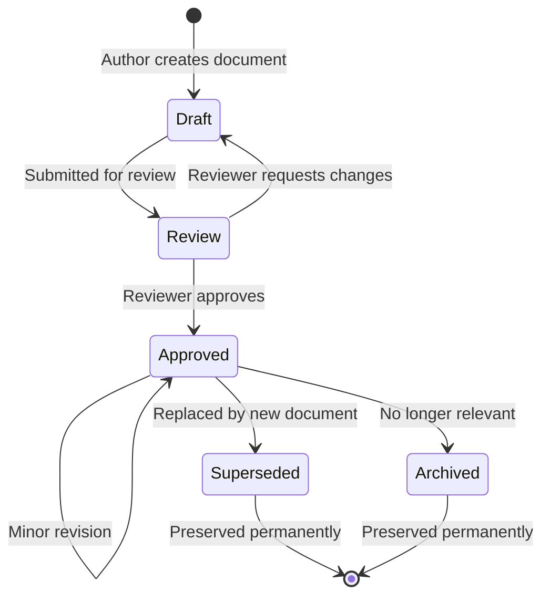
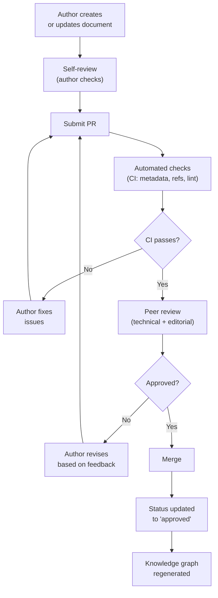

# STD-001 — Documentation Standards

> **STD-001 · 2026.07-r1 · Tier 3 — Standards**
>
> The definitive documentation standards for the OpenTamilOCR organization.
> Documentation is production code. Poor documentation is a quality defect.
> Changes require an RFC and maintainer approval.

---

## 1. Purpose

This document defines how every document across every repository in the OpenTamilOCR organization must be written, structured, reviewed, versioned, referenced, maintained, and published.

Documentation is the organization's permanent memory.
Repositories, source code, websites, APIs, datasets, benchmarks, AI agents, and contributors all depend upon accurate documentation.
Therefore, documentation is treated as a **first-class engineering artifact** — with the same rigor applied to code reviews, testing, and releases.

---

## 2. Scope

This standard applies to:

- All documents in TamilOCR OS (71 planned items + SYS-000).
- All README, CONTRIBUTING, CHANGELOG, and SECURITY files in every repository.
- Dataset cards, model cards, and benchmark reports.
- RFCs, decision records, and experiment records.
- API documentation.
- Guides, tutorials, and learning paths.

This standard does **not** cover:

- Source code comments (covered in STD-002 — Coding Standards).
- Commit messages (covered in STD-007 — Commit & Review Standards).
- Prompt templates (covered in STD-008 — Prompt Engineering Standards).

---

## 3. Documentation Philosophy

| # | Principle | Rationale |
|---|-----------|-----------|
| DP1 | **Documentation First.** | Knowledge must be documented before it is implemented. Undocumented knowledge does not exist in the organizational context (AP1, ARCH-001). |
| DP2 | **Single Source of Truth.** | Every fact is documented in exactly one place. Other documents reference it, never duplicate it (KP10, ARCH-003). |
| DP3 | **Human Readable.** | Every document must be clear, well-organized, and useful to a human reader without tooling. |
| DP4 | **Machine Readable.** | Every document carries structured YAML frontmatter that can be parsed by scripts and AI agents. |
| DP5 | **AI Friendly.** | Documents must be navigable by AI agents: clear sections, explicit cross-references, summary fields, and consistent terminology. |
| DP6 | **Version Controlled.** | All documentation lives in git. Every change is tracked, attributable, and reversible. |
| DP7 | **Traceable.** | Every document can be traced to its creation decision, its author, and its dependencies. |
| DP8 | **Reviewable.** | Every document passes through a review process before becoming authoritative. |
| DP9 | **Reproducible.** | Given the same source files, the documentation website can be rebuilt identically. |
| DP10 | **Consistent.** | All documents follow the same structure, naming, formatting, and terminology rules. |
| DP11 | **Searchable.** | Every document is indexed and discoverable through keywords, tags, metadata, and knowledge graph navigation. |
| DP12 | **Knowledge Graph Native.** | Every document is a node in the organizational knowledge graph with typed edges to related documents (ARCH-003). |

---

## 4. Documentation Categories

### 4.1 Category Definitions

| Category | ID Prefix | Tier | Purpose | Example |
|----------|-----------|------|---------|---------|
| **System** | SYS | — | Master index and cross-cutting system documents. | SYS-000 |
| **Foundation** | FND | 0 | Charter, ethics, licensing, conduct — bedrock principles. | FND-001 |
| **Governance** | GOV | 1 | Governance model, decisions, releases, continuity. | GOV-001 |
| **Architecture** | ARCH | 2 | System, repository, knowledge, pipeline, data, platform, AI. | ARCH-001 |
| **Standards** | STD | 3 | Coding, documentation, data, model, API, testing, commit, prompt standards. | STD-001 |
| **Research** | RSC | 4 | Literature surveys, evaluation reports, technical analysis. | RSC-001 |
| **Education** | EDU | 4 | OCR theory, Tamil script, computer vision fundamentals. | EDU-001 |
| **Experiments** | EXP | 4 | Experiment records with hypothesis, config, results, analysis. | EXP-001 |
| **Vision** | VIS | 5 | 1-year, 3-year, 5-year, 10-year organizational vision. | VIS-001 |
| **Roadmaps** | RDM | 5 | Product, research, and future-version roadmaps. | RDM-001 |
| **Guides** | GDE | 6 | Contributor, development, dataset, training, release guides. | GDE-001 |
| **Learning Paths** | LRN | 6 | OCR, development, and data science learning journeys. | LRN-001 |
| **References** | REF | 7 | Glossary, bibliography, tool inventory. | REF-001 |
| **RFCs** | RFC | Cross | Formal change proposals. | RFC-001 |
| **Decisions** | DEC | Cross | Permanent decision records. | DEC-001 |
| **Prompts** | PRM | Cross | AI prompt templates. | PRM-001 |
| **Dataset Cards** | — | — | Machine-readable dataset metadata. | `dataset-card.yaml` |
| **Model Cards** | — | — | Machine-readable model metadata. | `model-card.yaml` |
| **Changelogs** | — | — | Per-repository release history. | `CHANGELOG.md` |
| **README** | — | — | Repository introduction and quick start. | `README.md` |

### 4.2 Category-Specific Rules

| Category | Required Frontmatter | Required Sections | Review Authority |
|----------|---------------------|-------------------|-----------------|
| FND / GOV / ARCH | Full metadata schema | Full structure (Section 5) | Steering Council |
| STD | Full metadata schema | Full structure | Maintainer + SC member |
| RSC / EDU / EXP | Full metadata schema | Flexible (domain-dependent) | Maintainer |
| VIS / RDM | Full metadata schema | Full structure | Steering Council |
| GDE / LRN | Full metadata schema | Full structure | Maintainer |
| REF | Full metadata schema | Flexible | Any contributor |
| RFC / DEC | RFC/DEC-specific schema | RFC/DEC template (GOV-003) | Per GOV-003 |
| README | Minimal (no frontmatter) | ARCH-002, Section 6.1 | Repository maintainer |
| Dataset/Model Cards | Card-specific schema (SCH-002/003) | Card template | Data/model maintainer |

---

## 5. Mandatory Document Structure

### 5.1 Standard Structure (Tiered Documents)

Every tiered document (FND, GOV, ARCH, STD, RSC, EDU, VIS, RDM, GDE, LRN, REF) must include:

| Section | Purpose | Required |
|---------|---------|----------|
| **YAML Frontmatter** | Machine-readable metadata (Section 8). | Yes |
| **Title** | `# {ID} — {Title}` format. | Yes |
| **Banner** | Blockquote with ID, version, tier, and summary. | Yes |
| **Purpose** | Why this document exists. What problem it solves. | Yes |
| **Scope** | What this document covers and does not cover. | Yes |
| **Body sections** | Domain-specific content organized by numbered headings. | Yes |
| **Governance Relationship** | How this document relates to governance documents. | Yes (Tier 0–3) |
| **Related Documents** | Table of related documents with relationship types. | Yes |
| **Review Policy** | How and when this document is reviewed. | Yes |
| **Document History** | Version table with date and summary. | Yes |
| **Approval footer** | Approval status and effective date. | Yes |

### 5.2 Title Format

```markdown
# {ID} — {Title}
```

- The document ID is always included in the H1 heading.
- An em dash (—) separates ID from title.
- Example: `# ARCH-003 — Knowledge Architecture`

### 5.3 Banner Format

```markdown
> **{ID} · {version}-r{revision} · Tier {N} — {Tier Name}**
>
> {One-paragraph summary.}
> {Change governance note.}
```

### 5.4 Approval Footer

```markdown
> **Approved by:** {Approver or "Pending Steering Council approval."}
> **Effective date:** {Date or "Upon approval."}
```

---

## 6. Writing Standards

### 6.1 General Rules

| Rule | Standard |
|------|----------|
| **Language** | American English. |
| **Tense** | Present tense for current state. Future tense for planned work. Past tense for history. |
| **Voice** | Active voice preferred. Passive voice permitted for standards and rules. |
| **Person** | Third person for standards ("The contributor must..."). Second person for guides ("You should..."). |
| **Sentence length** | Maximum 30 words per sentence. Prefer shorter sentences. |
| **Paragraph length** | Maximum 5 sentences per paragraph. |
| **Jargon** | Define technical terms on first use. Reference the glossary (REF-001). |
| **Abbreviations** | Spell out on first use: "Character Error Rate (CER)." Use abbreviation thereafter. |
| **Consistency** | Use the same term for the same concept throughout. Never use synonyms for technical terms. |

### 6.2 Headings

| Rule | Standard |
|------|----------|
| **H1** | One per document. The document title. |
| **H2** | Major sections. Numbered: `## 1. Purpose`, `## 2. Scope`. |
| **H3** | Subsections. Numbered: `### 2.1 Category Definitions`. |
| **H4** | Sub-subsections. Numbered or unnumbered depending on depth. |
| **Depth** | Maximum 4 heading levels (H1–H4). |
| **Capitalization** | Title Case for H1 and H2. Sentence case for H3 and H4. |

### 6.3 Lists

| Rule | Standard |
|------|----------|
| **Bullet lists** | For unordered items. Use `-` as the bullet marker. |
| **Numbered lists** | For sequential steps or ordered items. Use `1.` for all items (Markdown auto-numbers). |
| **Nesting** | Maximum 2 levels of nesting. |
| **Consistency** | All items in a list use the same grammatical structure (parallel construction). |
| **Punctuation** | Full sentences in lists end with periods. Fragments do not. |

### 6.4 Tables

| Rule | Standard |
|------|----------|
| **Use** | Use tables for structured, multi-dimensional information. Prefer tables over long lists of key-value pairs. |
| **Headers** | Every table must have a header row. |
| **Alignment** | Left-align text columns. Right-align numeric columns. |
| **Width** | Keep tables readable in plain markdown (≤120 character lines where possible). |
| **Empty cells** | Use `—` for intentionally empty cells, not blank. |

### 6.5 Mermaid Diagrams

| Rule | Standard |
|------|----------|
| **Use** | Use Mermaid diagrams to visualize relationships, flows, and architectures. |
| **Labeling** | Every node must have a descriptive label. |
| **Complexity** | Maximum ~20 nodes per diagram. Split complex diagrams. |
| **Quoting** | Quote labels containing special characters: `id["Label (detail)"]`. |
| **No HTML** | Do not use HTML tags in Mermaid labels. |
| **Syntax validation** | Validate diagrams render correctly before submission. |
| **Caption** | Add a descriptive heading (H3 or H4) before each diagram. |

### 6.6 Code Blocks

| Rule | Standard |
|------|----------|
| **Fencing** | Use triple backticks with language identifier: ` ```yaml `. |
| **Language** | Always specify the language for syntax highlighting. |
| **Length** | Maximum 30 lines per code block. Use ellipsis (`...`) for longer examples. |
| **Comments** | Include inline comments for non-obvious code. |
| **Runnable** | Example code should be syntactically correct and runnable where possible. |

### 6.7 Callouts and Emphasis

| Element | Markdown | Use |
|---------|----------|-----|
| **Bold** | `**text**` | Key terms, important concepts on first mention. |
| **Italic** | `*text*` | Emphasis, document titles in prose. |
| **Inline code** | `` `text` `` | File names, commands, field names, variable names. |
| **Blockquote** | `>` | Document banner, approval footer, important notes. |
| **Horizontal rule** | `---` | Major section separators. |

---

## 7. Naming Standards

### 7.1 Document Files

| Context | Convention | Example |
|---------|-----------|---------|
| **TamilOCR OS tiered documents** | `{ID}_{Title_With_Underscores}.md` | `ARCH-003_Knowledge_Architecture.md` |
| **RFCs** | `RFC-{NNN}-{slug}.md` | `RFC-001-annotation-format.md` |
| **Decisions** | `DEC-{NNN}-{slug}.md` | `DEC-001-base-framework.md` |
| **Experiments** | `EXP-{NNN}-{slug}.md` | `EXP-001-binarization-comparison.md` |
| **Other repository docs** | `lowercase-with-hyphens.md` | `development-setup.md` |
| **README** | `README.md` (uppercase) | `README.md` |
| **CHANGELOG** | `CHANGELOG.md` (uppercase) | `CHANGELOG.md` |
| **Root config files** | `UPPERCASE.ext` for standard files | `LICENSE`, `SECURITY.md` |

### 7.2 Directories

| Context | Convention | Example |
|---------|-----------|---------|
| **TamilOCR OS tier directories** | `lowercase` | `foundation/`, `governance/`, `architecture/` |
| **Subdirectories** | `lowercase-with-hyphens` | `learning-paths/` |
| **Python packages** | `lowercase_with_underscores` | `tamilocr_core/` |

### 7.3 Images and Diagrams

| Type | Convention | Example |
|------|-----------|---------|
| **Images** | `{document-id}-{description}.{ext}` | `arch-001-ecosystem-overview.png` |
| **Diagrams** | Prefer Mermaid (inline). If raster needed: `{document-id}-{diagram-name}.png` | `arch-004-pipeline-flow.png` |
| **Location** | `assets/` directory within the document's tier directory. | `architecture/assets/` |

---

## 8. Metadata Standards

### 8.1 Required Frontmatter Fields

Every tiered document must include the following YAML frontmatter:

```yaml
---
id: "ARCH-003"                        # Unique document ID (permanent)
title: "Knowledge Architecture"        # Human-readable title
type: architecture                     # Document type (foundation, governance, architecture, standard, ...)
version: "2026.07"                     # CalVer version
revision: 1                           # Revision within the CalVer month
status: draft                         # draft | review | approved | superseded | archived
created: "2026-07-04"                 # Creation date (ISO 8601)
updated: "2026-07-04"                 # Last update date (ISO 8601)
owner: "@founder"                     # Accountable individual
reviewers: []                         # List of reviewers
tier: 2                               # Tier number (0-7) or null for cross-cutting
requires:                             # Hard dependencies (must be understood first)
  - "FND-001"
  - "ARCH-001"
references:                           # Soft references (related context)
  - "SYS-000"
  - "GOV-003"
triggered_by: null                    # DEC-NNN that triggered this document
obsoletes: null                       # ID of document this supersedes
source_rfc: null                      # RFC-NNN that proposed this document
tags:                                 # Searchable keywords
  - "architecture"
  - "knowledge"
summary: >                            # One-paragraph summary for AI context loading
  Brief description of the document.
quality_gate:                          # Validation status
  metadata_valid: true
  dependencies_resolved: true
  peer_reviewed: false
  ai_consistency_checked: false
---
```

### 8.2 Field Constraints

| Field | Type | Constraint |
|-------|------|------------|
| `id` | String | Must be unique across the organization. Format: `{PREFIX}-{NNN}`. |
| `title` | String | Must match the H1 title (without the ID prefix). |
| `type` | Enum | One of: `foundation`, `governance`, `architecture`, `standard`, `research`, `education`, `experiment`, `vision`, `roadmap`, `guide`, `learning-path`, `reference`, `rfc`, `decision`, `prompt`. |
| `version` | String | CalVer `YYYY.MM` for TamilOCR OS docs. SemVer for software docs. |
| `revision` | Integer | ≥1. Incremented for each revision within a version. |
| `status` | Enum | One of: `draft`, `review`, `approved`, `superseded`, `archived`. |
| `created` | Date | ISO 8601 format. Never changes after initial creation. |
| `updated` | Date | ISO 8601 format. Updated on every revision. |
| `owner` | String | GitHub handle with `@` prefix. |
| `tier` | Integer or null | 0–7 for tiered documents. `null` for cross-cutting. |
| `requires` | List of strings | Document IDs. Must not form cycles. Must not point to higher tiers. |
| `references` | List of strings | Document IDs. No structural constraint. |
| `tags` | List of strings | Lowercase, hyphenated. Minimum 2 tags. |
| `summary` | String | 1–3 sentences. Must be meaningful for AI context loading. |
| `quality_gate` | Object | Four boolean fields tracking validation status. |

### 8.3 Metadata Validation

- All metadata is validated by `scripts/validate-metadata.py` against the schema in SCH-001.
- Validation runs in CI on every PR.
- Invalid metadata blocks PR merge.

---

## 9. Cross-Reference Standards

### 9.1 Reference Types

| Type | Syntax | Example |
|------|--------|---------|
| **Frontmatter dependency** | `requires: ["ARCH-001"]` | Hard dependency in YAML. |
| **Frontmatter reference** | `references: ["GOV-003"]` | Soft reference in YAML. |
| **In-text ID reference** | `as defined in ARCH-004` | Human-readable in-text mention. |
| **In-text URI reference** | `tamilocr-os://path/slug` | Machine-resolvable URI. |
| **Section reference** | `ARCH-001, Section 8` | Reference to a specific section. |
| **External reference** | Standard URL or bibliography entry (REF-002). | `https://example.org` or `[Smith2024]`. |

### 9.2 Reference Rules

| Rule | Standard |
|------|----------|
| **R1: Use document IDs, not file paths.** | Write `ARCH-001` not `architecture/ARCH-001_System_Architecture_Overview.md`. |
| **R2: Reference, don't duplicate.** | If knowledge exists in another document, reference it. Never copy substantial content (KP10, ARCH-003). |
| **R3: Verify references.** | All `requires` and `references` targets must exist or be planned in SYS-000. |
| **R4: Use stable URIs for machine links.** | Use `tamilocr-os://` URIs for machine-resolvable references. |
| **R5: External references use bibliography.** | References to external sources use the bibliography (REF-002). Include author, year, title, and URL. |
| **R6: No orphan documents.** | Every document must be reachable from SYS-000 (invariant G6, ARCH-003). |

---

## 10. Versioning Standards

### 10.1 Version Scheme

| Artifact | Scheme | Format | Example |
|----------|--------|--------|---------|
| TamilOCR OS documents | CalVer + revision | `YYYY.MM-rN` | `2026.07-r2` |
| Software repositories | SemVer | `MAJOR.MINOR.PATCH` | `1.2.3` |
| Datasets | SemVer | `MAJOR.MINOR.PATCH` | `1.0.0` |
| Models | SemVer | `MAJOR.MINOR.PATCH` | `1.0.0` |

### 10.2 Version Increment Rules

| Change | Increment |
|--------|-----------|
| Substantive content change | Revision (`rN → rN+1`) or MINOR. |
| Major restructuring or breaking change | CalVer month or SemVer MAJOR. |
| Typo/formatting fix | No version change. `updated` date refreshed. |
| Metadata-only correction | No version change. |

### 10.3 Document Lifecycle States



### 10.4 Supersession Rules

- Superseded documents retain their ID and are marked `status: superseded`.
- The superseding document sets `obsoletes: {old-ID}`.
- Superseded documents include a notice: "This document has been superseded by {new-ID}."
- References to superseded documents are updated in the next review cycle.

---

## 11. Review Workflow

### 11.1 Review Process



### 11.2 Review Roles

| Role | Responsibility |
|------|---------------|
| **Author** | Write the document. Self-review for completeness and accuracy. Address review feedback. |
| **Technical reviewer** | Verify technical correctness, architecture consistency, and dependency accuracy. |
| **Editorial reviewer** | Check writing quality, formatting, naming conventions, and accessibility. |
| **Approver** | Final sign-off per the authority matrix (GOV-001). |

### 11.3 Review Checklist

| Category | Checks |
|----------|--------|
| **Metadata** | Frontmatter is complete and valid. ID is unique. Version is correct. |
| **Structure** | All required sections present. Heading hierarchy correct. |
| **Content** | Accurate, complete, clear, concise. No contradictions with approved documents. |
| **References** | All cross-references valid. No orphan references. No circular dependencies. |
| **Formatting** | Follows writing standards (Section 6). Tables, lists, and diagrams well-formed. |
| **Diagrams** | Mermaid syntax valid. Diagrams render correctly. Labels are descriptive. |
| **Terminology** | Consistent with glossary (REF-001). No undefined jargon. |
| **Accessibility** | Clear language. Abbreviations expanded on first use. No ambiguous pronouns. |

---

## 12. AI Documentation Standards

### 12.1 AI Generation Rules

| Rule | Standard |
|------|----------|
| **AG1: Follow the loading protocol.** | AI must load bootstrap context (Phase 1) and task-specific context (Phase 2) before generating any document (ARCH-007, Section 7). |
| **AG2: Use the validation pipeline.** | AI must self-validate output against the validation pipeline before presenting to humans (ARCH-007, Section 11). |
| **AG3: Cite sources.** | AI must reference specific document IDs and sections for any organizational claim. |
| **AG4: Preserve approved content.** | AI must not contradict, modify, or reinterpret approved documents unless explicitly instructed. |
| **AG5: Use consistent terminology.** | AI must use the approved glossary (REF-001) and never introduce synonyms for defined terms. |
| **AG6: Declare uncertainty.** | When AI lacks sufficient knowledge, it must state uncertainty explicitly rather than inventing an answer. |
| **AG7: Produce reviewable output.** | AI output must be structured for efficient human review: clear diffs, validation reports, and confidence indicators. |
| **AG8: Never self-approve.** | AI-generated documentation requires human approval before becoming authoritative. No exceptions. |

### 12.2 AI Review Rules

| Rule | Standard |
|------|----------|
| **AR1: Check metadata.** | Verify frontmatter against SCH-001 schema. |
| **AR2: Check references.** | Verify all `requires` and `references` targets exist or are planned. |
| **AR3: Check consistency.** | Compare new document against approved documents for contradictions. |
| **AR4: Check terminology.** | Flag undefined terms and inconsistent naming. |
| **AR5: Check diagrams.** | Verify Mermaid syntax renders correctly. |
| **AR6: Flag issues.** | Present findings as suggestions, not corrections. Human decides. |

---

## 13. Documentation Quality Gates

### 13.1 Gate Definitions

| Gate | When | Checks | Enforcement |
|------|------|--------|-------------|
| **Pre-submission** | Before PR is created. | Author self-review against Section 11.3 checklist. | Manual. |
| **CI validation** | On PR creation. | Metadata validation, reference checking, dependency checking, Mermaid lint. | Automated (blocks merge on failure). |
| **Peer review** | During PR review. | Technical accuracy, editorial quality, consistency with approved docs. | Human (required approval). |
| **Post-merge** | After merge to `main`. | Knowledge graph regenerated, search index updated, staleness check. | Automated. |

### 13.2 Automated Checks

| Check | Script | Failure Action |
|-------|--------|---------------|
| Metadata validity | `scripts/validate-metadata.py` | Block merge. |
| Reference integrity | `scripts/check-dependencies.py` | Block merge. |
| Cycle detection | `scripts/check-dependencies.py` | Block merge. |
| Tier ordering | `scripts/check-dependencies.py` | Block merge. |
| Staleness | `scripts/staleness-check.py` | Warn (14 days), Error (30 days). |
| Knowledge graph | `scripts/build-knowledge-graph.py` | Warn on disconnected nodes. |

---

## 14. Search and Discoverability

### 14.1 Search Optimization

Every document must be optimized for search through:

| Mechanism | Standard |
|-----------|----------|
| **Tags** | Minimum 2 tags. Tags are lowercase, hyphenated. Drawn from a controlled vocabulary. |
| **Summary** | 1–3 sentences that accurately describe the document's content. Used by AI for relevance assessment. |
| **Title** | Descriptive and specific. Avoid generic titles. |
| **Headings** | Section headings should be descriptive and searchable. |
| **Terminology** | Use the approved term from the glossary. Consistent terminology improves search precision. |

### 14.2 Knowledge Graph Integration

- Every document is a node in the knowledge graph (ARCH-003).
- `requires` and `references` create edges.
- `tags` enable topic-based discovery.
- `summary` enables AI context scanning.
- `scripts/build-knowledge-graph.py` generates the navigable graph.

---

## 15. Document Templates

### 15.1 Required Templates

Templates are stored in `templates/` within TamilOCR OS and provide starter content for each document type.

| Template | Purpose | Required Sections |
|----------|---------|-------------------|
| `TPL-001-tiered-document.md` | Standard tiered document (FND, GOV, ARCH, STD, etc.). | Full frontmatter, purpose, scope, body, governance, related, review, history. |
| `TPL-002-rfc.md` | RFC proposal. | Problem, proposal, alternatives, impact, decision. |
| `TPL-003-decision.md` | Decision record. | Context, decision, rationale, consequences, status. |
| `TPL-004-experiment.md` | Experiment record. | Hypothesis, configuration, results, analysis, conclusion. |
| `TPL-005-dataset-card.yaml` | Dataset card. | Identity, description, splits, annotation format, quality, license, provenance. |
| `TPL-006-model-card.yaml` | Model card. | Identity, intended use, training data, evaluation, bias, limitations, reproducibility. |
| `TPL-007-readme.md` | Repository README. | Title, description, status, quick start, docs, contributing, license, citation. |
| `TPL-008-changelog.md` | Changelog. | Keep a Changelog format. |
| `TPL-009-guide.md` | Contributor or operational guide. | Full frontmatter, purpose, prerequisites, steps, troubleshooting. |

### 15.2 Template Usage Rules

- New documents should start from the appropriate template.
- Templates are guidelines, not rigid forms. Sections may be added or reordered as needed.
- Template updates are proposed through the standard review process.

---

## 16. Future Evolution

Documentation standards evolve through the RFC process (GOV-003):

1. A contributor identifies a gap or improvement in the documentation standards.
2. An RFC is filed proposing the change.
3. The RFC is reviewed, discussed, and decided.
4. If approved, STD-001 is updated with the new standard.
5. Existing documents are updated in the next review cycle.
6. A DEC record captures the decision.

**Backward compatibility:** Changes to documentation standards must not invalidate existing approved documents. Existing documents are updated to match new standards during regular review cycles, not retroactively in bulk.

---

## 17. Governance Relationship

| Document | Relationship |
|----------|-------------|
| FND-001 — Project Charter | Parent. Principle P1 (Single Source of Truth) and P2 (Knowledge Graph First) are implemented by this standard. |
| ARCH-001 — System Architecture | Required. AP1 (Documentation First) and AP2 (AI First) govern these standards. |
| ARCH-003 — Knowledge Architecture | Required. Knowledge graph structure, metadata schema, and cross-reference rules are inherited. |
| ARCH-007 — AI Workflow Architecture | Sibling. AI documentation rules implement the AI validation and hallucination prevention frameworks. |
| GOV-001 — Governance Model | Reference. Review authority matrix. |
| GOV-003 — Decision Process | Reference. RFC process for standards changes. |
| GOV-004 — Release Governance | Reference. Documentation release quality gates. |
| STD-002 — Coding Standards | Sibling. Code comments and docstrings complement documentation standards. |
| STD-007 — Commit & Review Standards | Sibling. Commit messages and PR descriptions follow related conventions. |
| STD-008 — Prompt Engineering | Sibling. Prompt templates follow documentation structure. |

---

## 18. Related Documents

| Document | Relationship |
|----------|-------------|
| SYS-000 — Master Index | Root. All documents registered here. |
| ARCH-001 — System Architecture | Required. Documentation principles. |
| ARCH-003 — Knowledge Architecture | Required. Knowledge graph and metadata. |
| FND-001 — Project Charter | Required. Mission and principles. |
| FND-002 — Code of Conduct | Reference. Communication standards. |
| FND-004 — Licensing Policy | Reference. Documentation licensing (CC-BY-4.0). |
| GOV-001 — Governance Model | Reference. Review authority. |
| GOV-003 — Decision Process | Reference. Standards change process. |
| ARCH-002 — Repository Architecture | Reference. README and file standards. |
| ARCH-007 — AI Workflow Architecture | Reference. AI documentation workflow. |

---

## 19. Review Policy

- **Review frequency:** Every 6 months during the Standards Review Cycle, or when a new document category is introduced.
- **Amendment process:** RFC → DEC → Maintainer + SC member approval.
- **Trigger for review:** New document category, new metadata field, community feedback on documentation quality.

---

## 20. Document History

| Version | Date | Summary |
|---------|------|---------|
| 2026.07-r1 | 2026-07-05 | Initial draft. Founding documentation standards for the OpenTamilOCR organization. |

---

> **Approved by:** Pending Steering Council approval.
> **Effective date:** Upon approval.
