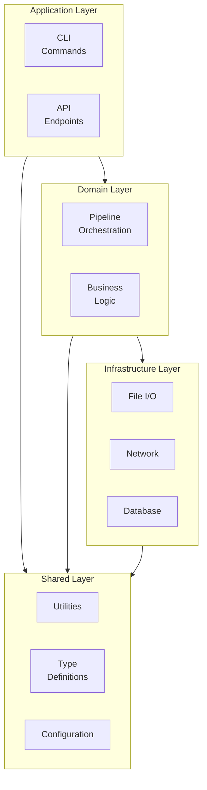
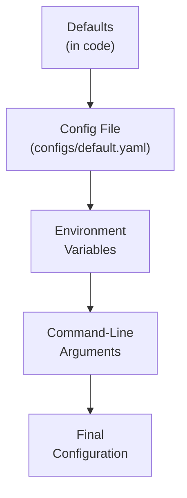
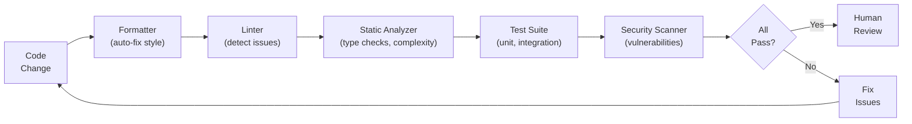
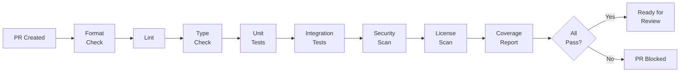
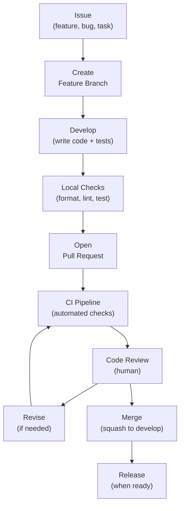

# STD-002 — Coding Standards

> **STD-002 · 2026.07-r1 · Tier 3 — Standards**
>
> The definitive coding standards for the OpenTamilOCR organization.
> Source code is a long-term organizational asset — written for future contributors, not its original author.
> Changes require an RFC and maintainer approval.

---

## 1. Purpose

This document defines the engineering principles, coding practices, quality requirements, and software craftsmanship standards that apply across every OpenTamilOCR repository containing source code.

These standards are **language-independent**.
Language-specific conventions (Python, TypeScript, etc.) may extend these standards through supplementary guides but must never contradict them.

Contributors will come and go over many years.
Code must be written for the contributor who reads it three years from now — not for the person writing it today.

---

## 2. Scope

This standard applies to:

- All source code in every OpenTamilOCR repository.
- Scripts, tools, and utilities in TamilOCR OS.
- CI/CD workflow definitions.
- Configuration-as-code.
- Test code (held to the same quality standard as production code).

This standard does **not** cover:

- Markdown documentation (covered in STD-001).
- Commit messages and PR descriptions (covered in STD-007).
- Dataset and model file formats (covered in STD-003 and STD-004).
- Prompt templates (covered in STD-008).

---

## 3. Engineering Philosophy

| # | Principle | Rationale |
|---|-----------|-----------|
| EP1 | **Readability First.** | Code is read far more often than it is written. Optimize for the reader, not the writer. |
| EP2 | **Simplicity Over Cleverness.** | Simple code is easier to understand, debug, and maintain. Clever code creates maintenance debt. |
| EP3 | **Correctness Before Performance.** | A correct, slow program is infinitely more valuable than an incorrect, fast one. Optimize only after profiling proves necessity. |
| EP4 | **Explicit Over Implicit.** | State intent clearly. Avoid hidden side effects, magic values, and implicit type conversions. |
| EP5 | **Modular Design.** | Break systems into small, focused modules with well-defined interfaces. Each module should be independently understandable (AP9, ARCH-001). |
| EP6 | **Separation of Concerns.** | Each component handles one concern. Business logic, I/O, configuration, and error handling are distinct. |
| EP7 | **Single Responsibility.** | Each function does one thing. Each class represents one concept. Each module owns one domain. |
| EP8 | **Reusability.** | Extract common patterns into shared utilities. Avoid duplicating logic across repositories. |
| EP9 | **Testability.** | Design code so that it can be tested in isolation. Prefer dependency injection over hard-coded dependencies. |
| EP10 | **Documentation First.** | Public APIs are documented before implementation. If the documentation is unclear, the API design needs improvement (AP1, ARCH-001). |
| EP11 | **Defensive Programming.** | Validate inputs. Check preconditions. Handle edge cases. Assume nothing about external data. |
| EP12 | **Secure by Default.** | Security is not a feature — it is a property. Default configurations must be secure. Secrets must never appear in code. |
| EP13 | **Observable Systems.** | Production code emits logs, metrics, and traces. Debugging in production requires observability, not code changes. |
| EP14 | **Fail Predictably.** | When failures occur, they must be clear, diagnosable, and recoverable. Silent failures are forbidden. |
| EP15 | **Deterministic Behavior.** | Given the same inputs and configuration, the system produces the same outputs. Non-determinism is confined and documented (P6, FND-001). |
| EP16 | **AI-Friendly Code.** | Code is structured so that AI agents can read, understand, and contribute to it. Clear naming, modular structure, and inline documentation support AI-assisted development. |

---

## 4. Repository Coding Rules

### 4.1 Source Directory Layout

Every repository follows the standard structure defined in ARCH-002, Section 5.1.
Code-specific directories:

| Directory | Purpose | Rules |
|-----------|---------|-------|
| `src/` | Production source code. | Organized as importable packages. |
| `tests/` | Test code. | Mirrors `src/` structure. Same quality standards. |
| `scripts/` | Utility scripts (setup, tooling, one-off tasks). | Executable. Documented. Idempotent where possible. |
| `configs/` | Configuration files. | Version-controlled. No secrets. Validated by schema. |
| `examples/` | Usage examples and tutorials. | Must be runnable and tested. |

### 4.2 Code Categories

| Category | Rules |
|----------|-------|
| **Production code** (`src/`) | Full standards apply. Must pass all quality gates. |
| **Test code** (`tests/`) | Same quality as production. May use test-specific patterns (fixtures, mocks). |
| **Scripts** (`scripts/`) | Must be documented (purpose, usage, prerequisites). Must handle errors. |
| **Generated code** | Clearly marked as generated. Not manually edited. Generator script in `scripts/`. |
| **Experimental code** | In `experiment/*` branches only. Standards relaxed. Must not merge to `main` without refactoring. |
| **Third-party code** | Vendored in `vendor/` if necessary. Never modified. License documented. |

---

## 5. Naming Standards

### 5.1 Naming Philosophy

Good names are the most important form of documentation.
A well-named function often needs no additional comments.

| Rule | Standard |
|------|----------|
| **N1: Descriptive.** | Names describe what the thing is or does, not how it works. |
| **N2: Proportional length.** | Scope determines length. Loop variables can be short (`i`). Global functions must be descriptive (`validate_annotation_schema`). |
| **N3: Consistent.** | The same concept uses the same name everywhere. Never rename the same idea across modules. |
| **N4: Searchable.** | Avoid single-character names for anything beyond loop counters. Names should be findable via text search. |
| **N5: Pronounceable.** | Names should be speakable in conversation. Avoid abbreviations that cannot be pronounced. |
| **N6: No encoding.** | Do not encode types, scope, or metadata in names (no Hungarian notation, no prefixes like `m_` or `g_`). |

### 5.2 Naming Conventions

| Element | Convention | Example |
|---------|-----------|---------|
| **Packages / Modules** | `lowercase_with_underscores` | `preprocessing_pipeline` |
| **Classes / Types** | `PascalCase` | `EngineAdapter`, `DatasetCard` |
| **Functions / Methods** | `lowercase_with_underscores` | `validate_metadata`, `run_benchmark` |
| **Variables** | `lowercase_with_underscores` | `error_rate`, `page_count` |
| **Constants** | `UPPER_SNAKE_CASE` | `MAX_IMAGE_SIZE`, `DEFAULT_CONFIDENCE_THRESHOLD` |
| **Enums** | `PascalCase` for type, `UPPER_SNAKE_CASE` for members | `DocumentType.NEWSPAPER` |
| **Configuration keys** | `lowercase_with_underscores` (YAML/JSON) | `max_retries`, `output_format` |
| **Environment variables** | `UPPER_SNAKE_CASE` with prefix | `TAMILOCR_API_KEY`, `TAMILOCR_LOG_LEVEL` |
| **Files** | `lowercase_with_underscores.{ext}` | `preprocessing_pipeline.py` |
| **Test files** | `test_{module}.{ext}` | `test_preprocessing_pipeline.py` |
| **Directories** | `lowercase_with_underscores` or `lowercase-with-hyphens` | `learning_paths/` or `ci-templates/` |

### 5.3 Naming Anti-Patterns

| Anti-Pattern | Problem | Alternative |
|-------------|---------|-------------|
| `data`, `info`, `stuff` | Too vague. Meaningless. | `annotation_data`, `model_metadata` |
| `tmp`, `temp`, `foo` | Non-descriptive. Debugging artifacts. | Name the actual purpose. |
| `process()`, `handle()` | Overly generic. What does it process? | `process_image()`, `handle_ocr_request()` |
| `Manager`, `Helper`, `Util` | God-class indicators. Too many responsibilities. | Split into focused components. |
| `flag`, `status` (as booleans) | Ambiguous. Flag for what? | `is_verified`, `has_annotations` |

---

## 6. Code Organization

### 6.1 Module Design

| Rule | Standard |
|------|----------|
| **CO1: Small modules.** | Each module should be understandable in a single reading session (~300 lines guideline, not hard limit). |
| **CO2: Small functions.** | Each function does one thing. ~30 lines guideline. If a function needs a comment explaining a section, that section should be a separate function. |
| **CO3: Flat is better.** | Prefer flat module hierarchies over deep nesting. Maximum 4 levels of directory nesting. |
| **CO4: Dependency direction.** | Dependencies flow from high-level to low-level. Utility modules never depend on domain modules. |
| **CO5: No circular dependencies.** | Circular imports indicate design problems. Refactor into a shared dependency or invert the relationship. |
| **CO6: Interface boundaries.** | Public APIs are explicit. Internal implementation details are private. |

### 6.2 Architecture Alignment



**Rules:**

- Application layer depends on Domain, never the reverse.
- Domain layer depends on Infrastructure through abstractions (interfaces), not concrete implementations.
- Shared layer has no dependencies on other layers.
- No layer depends on a higher layer.

---

## 7. Documentation in Code

### 7.1 When to Write Comments

| Situation | Requirement |
|-----------|-------------|
| **Public API** | Always document. Signature alone is insufficient. |
| **Complex algorithm** | Document the "why" and link to the reference (paper, specification). |
| **Non-obvious behavior** | Explain why, not what. The code shows what; the comment explains why. |
| **Workarounds** | Document the workaround, the underlying issue, and a link to the tracking issue. |
| **Regulatory or compliance** | Document the requirement being satisfied. |

### 7.2 When NOT to Write Comments

| Situation | Reasoning |
|-----------|-----------|
| **Obvious code** | `# increment counter` before `counter += 1` adds noise, not clarity. |
| **Describing what** | If the code clearly shows what it does, a comment restating it is redundant. |
| **Apologizing for complexity** | If the code needs an apology, refactor it instead. |
| **Commented-out code** | Dead code in comments rots. Delete it. Git preserves history. |

### 7.3 Docstring Standards

| Element | Requirement |
|---------|-------------|
| **Modules** | Every module has a docstring describing its purpose and its relationship to the codebase. |
| **Public classes** | Every public class has a docstring with its responsibility, key methods, and usage example. |
| **Public functions** | Every public function has a docstring with parameters, return value, exceptions, and example. |
| **Private functions** | Docstrings optional but recommended for complex logic. |

### 7.4 Special Comments

| Tag | Meaning | Rule |
|-----|---------|------|
| `TODO` | Work that needs to be done. | Must include a tracking issue reference: `TODO(#42): ...` |
| `FIXME` | Known bug or incorrect behavior. | Must include a tracking issue reference: `FIXME(#87): ...` |
| `HACK` | Temporary workaround. | Must include explanation and tracking issue. |
| `NOTE` | Important contextual information. | No tracking reference required. |
| `DEPRECATED` | Code scheduled for removal. | Must include replacement and version timeline. |

### 7.5 File Headers

Every source file begins with:

```
# Copyright (c) OpenTamilOCR Contributors
# SPDX-License-Identifier: Apache-2.0
```

No other copyright format is permitted. SPDX identifiers ensure machine-readable license information.

---

## 8. Error Handling

### 8.1 Error Handling Rules

| Rule | Standard |
|------|----------|
| **EH1: Never swallow exceptions.** | Caught exceptions must be logged, re-raised, or converted to a meaningful error. Silent `except: pass` is forbidden. |
| **EH2: Fail fast.** | Validate inputs at boundaries. Reject invalid data early, with clear error messages. |
| **EH3: Specific exceptions.** | Catch specific exception types. Bare `except` or `catch (Exception)` is forbidden except at the outermost boundary. |
| **EH4: Meaningful error messages.** | Error messages must describe what went wrong, what was expected, and what was received. |
| **EH5: No control flow via exceptions.** | Exceptions are for exceptional conditions, not normal program flow. |
| **EH6: Resource cleanup.** | Use language-appropriate resource management (context managers, try-finally, defer) to ensure cleanup on failure. |
| **EH7: Error boundaries.** | Define clear error boundaries. Internal errors are caught and converted to user-facing messages at the boundary. |

### 8.2 Error Message Format

```
{Component}: {What happened}. Expected: {expected}. Got: {actual}. {Suggestion if applicable}.
```

Example:
```
MetadataValidator: Invalid document status. Expected: one of [draft, review, approved]. Got: "published". Check the 'status' field in frontmatter.
```

### 8.3 Graceful Degradation

| Scenario | Response |
|----------|----------|
| Non-critical feature fails | Log warning. Continue with reduced functionality. |
| External service unavailable | Return cached result or fallback. Retry with exponential backoff. |
| Data partially available | Process what is available. Report incomplete results with metadata indicating the gap. |
| Configuration invalid | Reject startup. Do not run with invalid configuration. |

---

## 9. Logging Standards

### 9.1 Log Levels

| Level | Use | Example |
|-------|-----|---------|
| **ERROR** | Failures requiring attention. Something is broken. | `ERROR: Model file not found: /models/v1.0.0/weights.bin` |
| **WARNING** | Unexpected but handled situations. Potential problems. | `WARNING: Fallback engine used. Primary engine timed out.` |
| **INFO** | Normal operational events. | `INFO: Pipeline started. Processing 42 pages.` |
| **DEBUG** | Detailed diagnostic information. | `DEBUG: Binarization threshold: 128. Input histogram: [...]` |

### 9.2 Logging Rules

| Rule | Standard |
|------|----------|
| **LG1: Structured logging.** | Use structured log formats (JSON or key-value). Not free-form strings. |
| **LG2: No sensitive data.** | Never log secrets, API keys, passwords, tokens, or PII. |
| **LG3: Correlation IDs.** | Multi-step operations include a trace/correlation ID for end-to-end tracking. |
| **LG4: Contextual.** | Include relevant context: operation name, input identifier, configuration values (non-sensitive). |
| **LG5: Actionable.** | Errors and warnings should suggest a resolution or next step. |
| **LG6: No excessive logging.** | Avoid logging inside tight loops. Use sampling or aggregation for high-frequency events. |

---

## 10. Configuration Standards

### 10.1 Configuration Hierarchy



Each layer overrides the previous. The rightmost (CLI) has the highest precedence.

### 10.2 Configuration Rules

| Rule | Standard |
|------|----------|
| **CF1: Sensible defaults.** | Every configuration value has a documented default. The system runs correctly with zero configuration. |
| **CF2: No secrets in config files.** | Secrets use environment variables or secret managers. Never committed to git. |
| **CF3: Validated on load.** | Configuration is validated against a schema at startup. Invalid configuration fails fast with a clear error. |
| **CF4: Documented.** | Every configuration key has a description, type, default value, and acceptable range. |
| **CF5: Versioned.** | Configuration format changes follow SemVer compatibility. Breaking changes require migration documentation. |
| **CF6: Environment prefix.** | All environment variables use the `TAMILOCR_` prefix. |
| **CF7: No magic values.** | Configuration keys have descriptive names. No single-letter keys or numeric codes. |

---

## 11. Dependency Management

### 11.1 Dependency Rules

| Rule | Standard |
|------|----------|
| **DM1: Minimize dependencies.** | Every dependency is a liability. Add dependencies only when the alternative (writing it yourself) is significantly worse. |
| **DM2: Evaluate before adding.** | Before adding a dependency, evaluate: license compatibility (FND-004, Section 9), maintenance status, security history, transitive dependencies. |
| **DM3: Pin versions.** | All dependencies are pinned to exact versions in lock files. No floating version ranges in production. |
| **DM4: Lock files in git.** | Lock files (e.g., `poetry.lock`, `package-lock.json`) are committed to git. |
| **DM5: Regular updates.** | Dependencies are updated at least monthly. Security patches are applied within 72 hours of disclosure. |
| **DM6: No vendoring without cause.** | Vendoring (copying dependency source) is a last resort. Document the reason. |
| **DM7: License compatibility.** | All dependencies must have licenses compatible with Apache 2.0 (FND-004, Section 9). Incompatible licenses are rejected. |

### 11.2 Dependency Evaluation Checklist

| Criterion | Minimum Requirement |
|-----------|-------------------|
| **License** | Compatible with Apache 2.0 or CC-BY-4.0. |
| **Maintenance** | Active maintenance. Last commit within 12 months. |
| **Security** | No unpatched critical vulnerabilities. |
| **Adoption** | Reasonable community adoption. Not a single-maintainer abandoned project. |
| **Transitive dependencies** | Acceptable transitive dependency count and quality. |
| **Size** | Proportional to the functionality needed. No megabyte-scale dependencies for trivial utilities. |

---

## 12. Code Quality

### 12.1 Automated Quality Checks



### 12.2 Quality Rules

| Rule | Standard |
|------|----------|
| **QR1: Formatting is automated.** | Use an auto-formatter. Formatting debates are resolved by the tool, not by humans. |
| **QR2: Linting is mandatory.** | All code passes the project linter with zero warnings. Linter rules are configured in `tamilocr-os/shared/linter-configs/`. |
| **QR3: Static analysis.** | Type checking and static analysis are enabled where the language supports them. |
| **QR4: Complexity limits.** | Cyclomatic complexity per function is bounded (language-specific guide defines the limit). Functions exceeding the limit are refactored. |
| **QR5: No dead code.** | Unreachable code, unused imports, and unused variables are removed. |
| **QR6: No magic values.** | Literal values in code are replaced with named constants. Exception: `0`, `1`, `""`, `True`, `False`. |
| **QR7: No code duplication.** | Duplicated logic is extracted into shared functions or modules. |
| **QR8: Technical debt is tracked.** | If shortcuts are taken, they are documented with `TODO` and a tracking issue. |

---

## 13. Performance Standards

### 13.1 Performance Philosophy

| Rule | Standard |
|------|----------|
| **PF1: Correctness first.** | Never sacrifice correctness for performance. |
| **PF2: Measure, then optimize.** | Optimization without profiling data is guessing. Profile before and after. |
| **PF3: Document trade-offs.** | If a performance optimization reduces readability, document the trade-off and the profiling data that justified it. |
| **PF4: Memory awareness.** | Be aware of memory usage, especially when processing large images and datasets. Release resources promptly. |
| **PF5: Batch-friendly.** | Design APIs to support batch processing. Processing 1,000 images should not require 1,000 separate function calls. |
| **PF6: Resource limits.** | Enforce resource limits (memory, time, file size) to prevent runaway processing. |

---

## 14. Security Standards

### 14.1 Security Rules

| Rule | Standard |
|------|----------|
| **SC1: Validate all inputs.** | Every external input (user data, file content, API request, environment variable) is validated before use. |
| **SC2: Validate all outputs.** | Data sent to external systems is sanitized to prevent injection attacks. |
| **SC3: No secrets in code.** | Secrets, API keys, passwords, and tokens never appear in source code, configuration files, or logs. Use environment variables or secret managers. |
| **SC4: Least privilege.** | Services and processes run with the minimum permissions necessary. |
| **SC5: Safe defaults.** | Default configurations are secure. Insecure options require explicit opt-in. |
| **SC6: Dependency scanning.** | Automated vulnerability scanning runs on every PR and weekly on `main`. |
| **SC7: No eval.** | Dynamic code execution (`eval`, `exec`, template injection) is prohibited unless explicitly justified and sandboxed. |
| **SC8: Cryptography.** | Use established, vetted cryptographic libraries. Never implement custom cryptography. |

### 14.2 Sensitive Data Handling

| Data Type | Rule |
|-----------|------|
| **API keys** | Environment variables only. Never in code or config files. |
| **User data** | Minimize collection. Process in memory. Do not persist without consent. |
| **Model weights** | Verify checksums before loading. |
| **Dataset content** | PII scanning before publication (FND-003, Section 5.3). |
| **Log data** | Redact sensitive fields before logging. |

---

## 15. Accessibility and Internationalization

### 15.1 Unicode Standards

| Rule | Standard |
|------|----------|
| **UI1: UTF-8 everywhere.** | All source files, data files, and I/O streams use UTF-8 encoding. No other encoding is permitted. |
| **UI2: NFC normalization.** | Tamil text is stored and processed in NFC (Canonical Composition) form. |
| **UI3: Language-aware string operations.** | String comparison, sorting, and searching must be Unicode-aware. Byte-level comparison is forbidden for text. |
| **UI4: No hardcoded strings.** | User-facing strings are externalized for future localization. |

### 15.2 Tamil Language Support

| Rule | Standard |
|------|----------|
| **TL1: Tamil Unicode range awareness.** | Code handling Tamil text must be aware of the Tamil Unicode block (U+0B80–U+0BFF). |
| **TL2: Combining character awareness.** | Tamil combining marks must be handled correctly. Do not split or corrupt multi-codepoint grapheme clusters. |
| **TL3: Mixed script handling.** | Code must correctly handle mixed Tamil-English text without corrupting either script. |

---

## 16. AI-Assisted Development

### 16.1 AI Code Generation Rules

| Rule | Standard |
|------|----------|
| **AI1: Same standards apply.** | AI-generated code must meet the same quality standards as human-written code. No exceptions. |
| **AI2: Human review required.** | All AI-generated code is reviewed by a human maintainer before merge. |
| **AI3: No architecture changes.** | AI agents do not change the architectural structure of a repository without an approved RFC. |
| **AI4: Attribution.** | AI-generated contributions follow the same DCO signoff process as human contributions. The human who submits is accountable. |
| **AI5: Test coverage.** | AI-generated code includes tests. Untested AI code is not accepted. |

### 16.2 AI Review Guidelines

| Activity | AI Role |
|----------|---------|
| **Code review** | AI checks for standards compliance, common bugs, naming issues, and complexity. Findings are suggestions, not decisions. |
| **Refactoring** | AI proposes refactoring for readability or performance. Human approves. |
| **Bug detection** | AI analyzes code for potential bugs, edge cases, and security issues. Human verifies. |
| **Documentation generation** | AI generates docstrings and inline comments. Human reviews for accuracy. |

---

## 17. Quality Gates

### 17.1 Gate Definitions

| Gate | When | Required Checks |
|------|------|-----------------|
| **Pre-commit** | Before committing locally. | Formatter, basic linter (via pre-commit hooks). |
| **PR creation** | When PR is opened. | Full lint, type check, test suite, security scan, license scan. |
| **Pre-merge** | Before merging. | All CI checks pass + ≥1 human approval + no unresolved comments. |
| **Pre-release** | Before publishing a release. | All pre-merge checks + integration tests + benchmark validation + documentation updated. |

### 17.2 CI Pipeline



### 17.3 Coverage Requirements

| Repository Category | Minimum Coverage |
|--------------------|-----------------|
| **Engine** (`tamilocr-core`) | 80% line coverage. |
| **Data** (`tamilocr-datasets`, `tamilocr-benchmarks`) | 70% line coverage. |
| **Platform** (`tamilocr-backend`) | 80% line coverage. |
| **Scripts** (`tamilocr-os/scripts/`) | 60% line coverage. |

Coverage is measured by CI and reported on every PR. Coverage regressions block merge.

---

## 18. Development Lifecycle

### 18.1 Development Workflow



### 18.2 Code Review Standards

| Rule | Standard |
|------|----------|
| **CR1: Every change is reviewed.** | No code merges to `develop` or `main` without at least one human review. |
| **CR2: Review scope.** | Reviewers check correctness, standards compliance, test coverage, security, and maintainability. |
| **CR3: Constructive feedback.** | Review comments are constructive, specific, and actionable. Follow the Code of Conduct (FND-002). |
| **CR4: Timely reviews.** | Reviews are completed within 48 hours for normal PRs, 24 hours for security patches. |
| **CR5: Author response.** | Authors respond to every review comment — either with a code change or an explanation. |

---

## 19. Future Evolution

Coding standards evolve through the RFC process (GOV-003):

1. A contributor identifies a gap, inconsistency, or improvement opportunity.
2. An RFC is filed proposing the change with rationale and examples.
3. The RFC is reviewed and decided.
4. If approved, STD-002 is updated. Language-specific guides are updated accordingly.
5. Existing code is updated during regular maintenance, not in a mass refactoring.
6. A DEC record captures the decision.

**Backward compatibility:** Changes to coding standards do not retroactively invalidate existing approved code. Existing code is updated to match new standards during regular maintenance cycles.

---

## 20. Governance Relationship

| Document | Relationship |
|----------|-------------|
| FND-001 — Project Charter | Parent. Principles P5 (Progressive Complexity) and P6 (Reproducibility) govern coding practices. |
| ARCH-001 — System Architecture | Required. AP1 (Documentation First), AP4 (Repository Independence), AP9 (Modularity) are implemented here. |
| ARCH-002 — Repository Architecture | Required. Repository structure, branching, and quality gates are inherited. |
| ARCH-004 — OCR Pipeline Architecture | Sibling. Pipeline code follows these standards. |
| ARCH-007 — AI Workflow Architecture | Sibling. AI code generation follows AI-assisted development rules. |
| GOV-003 — Decision Process | Reference. Standards changes follow the RFC process. |
| GOV-004 — Release Governance | Reference. Release quality gates include coding quality checks. |
| STD-001 — Documentation Standards | Sibling. Code documentation complements document-level documentation. |
| STD-006 — Testing Standards | Downstream. Testing rules expand testability standards from this document. |
| STD-007 — Commit & Review Standards | Downstream. Commit and review rules expand code review standards from this document. |

---

## 21. Related Documents

| Document | Relationship |
|----------|-------------|
| SYS-000 — Master Index | Root. |
| ARCH-001 — System Architecture | Required. Engineering principles. |
| ARCH-002 — Repository Architecture | Required. Repository structure. |
| FND-001 — Project Charter | Required. Mission and principles. |
| FND-003 — Ethics Framework | Reference. Responsible coding practices. |
| FND-004 — Licensing Policy | Reference. Dependency licensing. |
| GOV-003 — Decision Process | Reference. Standards change process. |
| ARCH-004 — OCR Pipeline Architecture | Reference. Pipeline coding context. |
| ARCH-007 — AI Workflow Architecture | Reference. AI coding rules. |
| STD-001 — Documentation Standards | Sibling. Documentation in code. |

---

## 22. Review Policy

- **Review frequency:** Every 6 months during the Standards Review Cycle, or when a new language or toolchain is adopted.
- **Amendment process:** RFC → DEC → Maintainer + SC member approval.
- **Trigger for review:** New programming language adoption, new quality tooling, community feedback on code quality.

---

## 23. Document History

| Version | Date | Summary |
|---------|------|---------|
| 2026.07-r1 | 2026-07-05 | Initial draft. Founding coding standards for the OpenTamilOCR organization. |

---

> **Approved by:** Pending Steering Council approval.
> **Effective date:** Upon approval.
