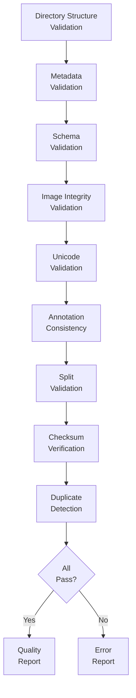
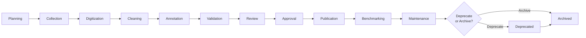
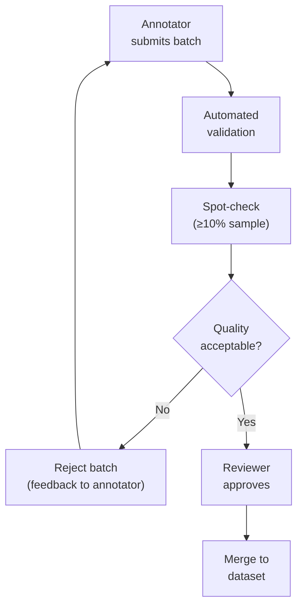

# STD-003 — Dataset Standards

> **STD-003 · 2026.07-r1 · Tier 3 — Standards**
>
> The definitive dataset standards for the OpenTamilOCR organization.
> Datasets are strategic organizational assets. Dataset quality determines OCR quality.
> Changes require an RFC and maintainer approval.

---

## 1. Purpose

This document establishes the mandatory engineering standards for designing, collecting, organizing, annotating, validating, versioning, reviewing, publishing, maintaining, and archiving datasets across the OpenTamilOCR organization.

OpenTamilOCR does not compete by inventing a new OCR engine.
Its long-term competitive advantage is the **quality of its datasets**.
Every OCR model, benchmark, experiment, publication, and AI workflow depends upon trustworthy, well-governed data.

Dataset quality directly determines OCR quality.

---

## 2. Scope

This standard applies to:

- All datasets in `tamilocr-datasets`.
- Benchmark datasets in `tamilocr-benchmarks`.
- Training and evaluation data referenced by `tamilocr-training`.
- Synthetic datasets generated by any OpenTamilOCR tool.
- Community-contributed datasets seeking official status.

This standard does **not** cover:

- Model artifacts (covered in STD-004 — Model Standards).
- Dataset storage architecture (covered in ARCH-005 — Data Architecture).
- OCR pipeline internals (covered in ARCH-004).

---

## 3. Dataset Philosophy

| # | Principle | Rationale |
|---|-----------|-----------|
| DS1 | **Data First.** | Datasets are the foundation. Better data improves every engine. Better engines without better data stagnate. |
| DS2 | **Quality Over Quantity.** | A smaller, perfectly annotated dataset is more valuable than a larger, noisy one. Quality is measured, not assumed. |
| DS3 | **Human Verified.** | Every published annotation passes human verification. AI may assist, but humans validate. |
| DS4 | **AI Assisted.** | AI accelerates annotation and quality checking but never replaces human judgment on ground truth. |
| DS5 | **Reproducible.** | Any experiment using a versioned dataset can be reproduced exactly (P6, FND-001). |
| DS6 | **Traceable.** | Every sample traces to its source document, collection method, annotator, and legal basis (FND-003, Section 5.1). |
| DS7 | **Version Controlled.** | Published datasets are immutable and versioned. Corrections produce new versions, never silent modifications. |
| DS8 | **Ethically Sourced.** | All data respects privacy, consent, copyright, and cultural sensitivity (FND-003). |
| DS9 | **License Compliant.** | Every dataset and every source document has a documented, compatible license (FND-004, Section 7). |
| DS10 | **Unicode Correct.** | All text is stored in UTF-8, NFC-normalized, and compliant with the Tamil Unicode standard. |
| DS11 | **Benchmark Ready.** | Datasets are structured for immediate use in benchmarking and training across any OCR engine. |
| DS12 | **Knowledge Graph Integrated.** | Dataset cards are nodes in the organizational knowledge graph (ARCH-003). |
| DS13 | **Future Expandable.** | The dataset architecture supports new document types, languages, and annotation levels without restructuring. |

---

## 4. Dataset Categories

### 4.1 By Document Type

| Category | Examples | Priority | Key Challenges |
|----------|---------|----------|----------------|
| **Printed books** | Modern Tamil literature, textbooks, novels. | v1 (highest) | Clean print, standard fonts, high volume. |
| **Newspapers** | Daily newspapers, periodicals, classifieds. | v1 | Multi-column, small text, variable print quality. |
| **Government records** | Forms, certificates, gazettes, notices. | v1 | Mixed Tamil-English, structured layout, legal terminology. |
| **Academic papers** | Research publications, theses, journal articles. | v1 | Technical terms, equations, citations, footnotes. |
| **Historical documents** | Pre-1950 printed Tamil, palm leaf manuscripts. | v1.x | Degraded print, archaic fonts, paper aging, rare characters. |
| **Magazines** | Illustrated periodicals, advertisements. | v1.x | Mixed text and images, varied layouts, decorative fonts. |
| **Educational material** | Textbooks, worksheets, exam papers. | v1.x | Tables, diagrams, numbered lists, structured content. |
| **Signage** | Street signs, shop signs, banners. | v2+ | Scene text, varied backgrounds, perspective distortion. |
| **Handwritten** | Letters, manuscripts, notes. | v2+ | Highly variable, cursive Tamil, personal styles. |
| **Forms** | Application forms, surveys, registration. | v2+ | Structured fields, checkboxes, mixed content. |
| **Receipts / Invoices** | Commercial documents. | v2+ | Small text, thermal print, mixed languages. |
| **Identity documents** | Government IDs, certificates. | v2+ | Security features, sensitive data, requires redaction. |

### 4.2 By Purpose

| Category | Purpose | Ground Truth Tier | Immutability |
|----------|---------|-------------------|-------------|
| **Training** | Model training. | Silver (single human annotator). | Versioned, immutable on release. |
| **Validation** | Hyperparameter tuning during training. | Silver. | Versioned, immutable. Never used for training. |
| **Test** | Final evaluation and benchmarking. | Gold (double-verified). | Versioned, immutable. Never used for training or tuning. |
| **Benchmark** | Standardized evaluation across engines and versions. | Gold. | Versioned, immutable. Published with elevated quality gates. |
| **Synthetic** | Augmentation and bootstrapping. | Automatic (generated). | Replaceable. Old versions may be archived. |
| **Experimental** | Research experiments. | Variable. | Short-lived. Archived or promoted within 6 months. |

---

## 5. Dataset Directory Structure

### 5.1 Canonical Layout

Every dataset follows this standard structure (ARCH-005, Section 5.2):

```
{dataset-name}/
│
├── dataset-card.yaml              # Machine-readable metadata (Section 18)
├── README.md                      # Human-readable description
├── LICENSE                        # Dataset license
├── CHANGELOG.md                   # Version history
├── VERSION                        # Current version (plain text)
│
├── images/                        # Source images
│   ├── train/
│   │   ├── {sample-id}.{ext}
│   │   └── ...
│   ├── val/
│   │   └── ...
│   └── test/
│       └── ...
│
├── annotations/                   # Ground truth and annotation data
│   ├── train/
│   │   ├── {sample-id}.json
│   │   └── ...
│   ├── val/
│   │   └── ...
│   ├── test/
│   │   └── ...
│   ├── manifest.json              # Complete sample listing with checksums
│   └── schema.json                # Annotation schema for this dataset
│
├── metadata/                      # Dataset-level metadata
│   ├── provenance.yaml            # Source tracking per document
│   ├── statistics.yaml            # Distribution statistics
│   ├── bias-report.yaml           # Bias evaluation (FND-003, Section 5.5)
│   ├── quality-report.yaml        # Quality metrics
│   └── annotators.yaml            # Annotator registry (anonymized IDs)
│
├── scripts/                       # Dataset-specific tooling
│   ├── validate.py                # Full dataset validation
│   ├── statistics.py              # Statistics generation
│   ├── visualize.py               # Sample visualization
│   └── convert/                   # Engine-specific format converters
│       ├── to_paddleocr.py
│       ├── to_tesseract.py
│       ├── to_trocr.py
│       ├── to_easyocr.py
│       └── to_coco.py
│
└── exports/                       # Pre-generated engine-specific formats
    ├── paddleocr/
    ├── tesseract/
    └── ...
```

### 5.2 Directory Rules

| Directory | Rules |
|-----------|-------|
| `images/` | Images only. No annotations, metadata, or scripts. Split into `train/`, `val/`, `test/`. |
| `annotations/` | One annotation file per image. Same split structure as `images/`. |
| `metadata/` | Dataset-level files only. No per-sample data. |
| `scripts/` | Executable scripts. Each has a docstring/comment explaining purpose. |
| `exports/` | Generated files. May be regenerated from canonical annotations at any time. |

---

## 6. Naming Standards

### 6.1 Dataset Names

| Rule | Convention | Example |
|------|-----------|---------|
| Format | `tamil-{type}-v{N}` | `tamil-printed-v1` |
| Case | All lowercase. | `tamil-newspapers-v2` |
| Separator | Single hyphen. | `tamil-historical-books-v1` |
| Version suffix | Always include version. | `tamil-benchmark-v1` |
| Synthetic prefix | `synthetic-tamil-{type}-v{N}` | `synthetic-tamil-printed-v1` |

### 6.2 Sample IDs

```
{document-id}-page-{NNN}-{level}-{NNN}
```

| Component | Description | Example |
|-----------|-------------|---------|
| `document-id` | Source document identifier. | `doc-0042` |
| `page-{NNN}` | Zero-padded page number. | `page-003` |
| `{level}` | Annotation level. | `line`, `word`, `region` |
| `{NNN}` | Zero-padded index within the page. | `042` |

Full example: `doc-0042-page-003-line-042`

### 6.3 File Names

| File Type | Convention | Example |
|-----------|-----------|---------|
| Image | `{sample-id}.{ext}` | `doc-0042-page-003-line-042.png` |
| Annotation | `{sample-id}.json` | `doc-0042-page-003-line-042.json` |
| Metadata | `{purpose}.yaml` | `provenance.yaml`, `statistics.yaml` |
| Export | Engine-specific convention. | `labels.txt` (PaddleOCR format) |

---

## 7. Image Standards

### 7.1 Format Requirements

| Property | Standard | Rationale |
|----------|----------|-----------|
| **Formats** | PNG (lossless, preferred), JPEG (lossy, acceptable for large datasets), TIFF (archival). | PNG preserves quality. JPEG reduces storage for large-scale datasets. |
| **Bit depth** | 8-bit per channel minimum. 24-bit RGB or 8-bit grayscale. | Standard for OCR processing. |
| **Color space** | sRGB for color images. Grayscale for binarized or line-level images. | Consistent processing across engines. |
| **DPI** | Minimum 200 DPI for printed text. 300 DPI recommended. 150 DPI acceptable for degraded sources. | Below 200 DPI, Tamil character recognition degrades significantly. |
| **Compression** | PNG: maximum compression (lossless). JPEG: quality ≥85. | Preserve character detail. |

### 7.2 Quality Requirements

| Requirement | Standard |
|-------------|----------|
| **Orientation** | Images must be upright (text reads left-to-right, top-to-bottom). Rotation correction applied if needed. |
| **Cropping** | Line-level images cropped tightly with 2–5 pixel padding. Page-level images include full page with minimal border. |
| **Margins** | Consistent margins within a dataset. Document in `metadata/statistics.yaml`. |
| **Noise** | Source noise is preserved (for realistic training). Augmentation noise is applied separately and documented. |
| **Integrity** | Every image file passes integrity check (not truncated, not corrupted). Verified by `scripts/validate.py`. |
| **Checksums** | SHA-256 checksum recorded for every image in `manifest.json`. |

### 7.3 Scanning Standards

| Property | Minimum Standard |
|----------|-----------------|
| **Scanner DPI** | 300 DPI minimum for new scans. |
| **Color mode** | Color scan preferred (grayscale conversion done in preprocessing). |
| **Format** | TIFF for archival. PNG for working copies. |
| **Calibration** | Scanner calibrated using a standard test card at the start of each scanning session. |
| **Quality check** | Each scanned page inspected for skew, blur, cutoff, and artifacts. |

---

## 8. Annotation Standards

### 8.1 Canonical Annotation Format

All annotations use the canonical JSON format defined in ARCH-005, Section 6.1.
The annotation format is recorded as DEC-002 (Annotation Format Selection).

```json
{
  "sample_id": "doc-0042-page-003-line-042",
  "image_path": "images/train/doc-0042-page-003-line-042.png",
  "text": "தமிழ் இலக்கிய வரலாறு",
  "language": "tam",
  "script": "Tamil",
  "level": "line",
  "bounding_box": {
    "type": "axis_aligned",
    "coordinates": [120, 340, 890, 395]
  },
  "metadata": {
    "source_document": "doc-0042",
    "page": 3,
    "line_index": 42,
    "annotator_id": "ann-007",
    "annotation_date": "2026-09-15",
    "confidence": 1.0,
    "verified": true,
    "verification_method": "human_single",
    "tags": ["printed", "modern", "book"]
  }
}
```

### 8.2 Text Encoding Rules

| Rule | Standard |
|------|----------|
| **TE1: UTF-8.** | All text is encoded in UTF-8. No other encoding is permitted. |
| **TE2: NFC normalization.** | All Tamil text is stored in Unicode NFC (Canonical Composition) form. |
| **TE3: Tamil Unicode range.** | Tamil characters use codepoints U+0B80–U+0BFF. No Private Use Area codepoints. |
| **TE4: Zero-width characters.** | ZWJ (U+200D) and ZWNJ (U+200C) are used only where linguistically correct. Never as formatting hacks. |
| **TE5: Whitespace.** | Leading and trailing whitespace is trimmed. Internal whitespace matches the source exactly. |
| **TE6: Newlines.** | Line-level annotations contain no newlines. Paragraph-level annotations use `\n` for line breaks within the paragraph. |
| **TE7: Null characters.** | Null bytes (U+0000) are forbidden. |

### 8.3 Annotation Levels

| Level | Granularity | Primary Use | Bounding Structure |
|-------|-------------|-------------|-------------------|
| **Page** | Full page. | Layout evaluation, end-to-end testing. | Page bounding box. |
| **Region** | Text block within a page. | Layout analysis, reading order. | Polygon or axis-aligned box. |
| **Line** | Single text line. | **Primary training unit.** Most OCR engines train on line images. | Axis-aligned box. |
| **Word** | Single word. | Word-level metrics, lexicon building. | Axis-aligned box. |
| **Character** | Single character. | Character analysis, font studies, confusion matrices. | Axis-aligned box. |

**Primary level:** Line-level annotation is the standard for training and benchmarking. Other levels are supplementary.

### 8.4 Bounding Box Standards

| Type | Format | Use Case | Coordinates |
|------|--------|----------|-------------|
| **Axis-aligned** | `[x, y, width, height]` | Printed, well-aligned text. | Origin: top-left of image. Units: pixels. |
| **Oriented** | `[cx, cy, width, height, angle]` | Rotated text. | Center point. Angle in degrees, counterclockwise. |
| **Polygon** | `[[x1,y1], ..., [xn,yn]]` | Irregular regions. | Vertices in clockwise order. |

**Rules:**

- Coordinates are in pixel units, relative to the processed image.
- Origin is top-left corner (x increases rightward, y increases downward).
- Bounding boxes must tightly enclose the text with 0–2 pixel padding.
- No bounding box extends outside the image dimensions.

### 8.5 Special Content

| Content | Annotation Rule |
|---------|----------------|
| **Tamil numerals** (௧, ௨, ...) | Annotated as-is. Not converted to Arabic numerals. |
| **Arabic numerals** (1, 2, ...) | Annotated as-is. |
| **Tamil punctuation** | Preserved exactly as in source. |
| **Mixed Tamil-English** | Both scripts annotated as-is. `language` field may use `tam+eng`. |
| **Grantha characters** (ஜ, ஷ, ஸ, ஹ) | Annotated using standard Tamil Unicode codepoints. |
| **Ligatures** | Annotated as the component characters, not as a single glyph. |
| **Symbols** (ௐ, ௹, etc.) | Annotated using standard Unicode codepoints. |
| **Damaged / illegible text** | Use `[?]` placeholder per illegible character. Tag as `damaged`. |
| **Missing text** (cropped) | Use `[...]` for text cut off by image boundary. Tag as `cropped`. |

---

## 9. Ground Truth Standards

### 9.1 Ground Truth Tiers

| Tier | Verification | Use | Accuracy Target |
|------|-------------|-----|-----------------|
| **Gold** | Double-verified by independent annotators. Disagreements adjudicated. | Benchmark and test datasets. | ≥99.5% character accuracy. |
| **Silver** | Single human annotator with automated validation. | Training datasets. | ≥97% character accuracy. |
| **Bronze** | Automated annotation (OCR output) with spot-check verification (≥10% sample). | Large-scale bootstrapping, synthetic data validation. | ≥90% character accuracy. |

### 9.2 Ground Truth Rules

| Rule | Standard |
|------|----------|
| **GT1: Exact match.** | Ground truth text exactly matches the text visible in the source image. |
| **GT2: No correction.** | Do not correct spelling errors in the source. Annotate what is printed, not what was intended. |
| **GT3: No inference.** | Do not guess illegible text. Mark as `[?]` or `[...]`. |
| **GT4: Consistent conventions.** | All annotators follow the same conventions (whitespace, punctuation, special content). |
| **GT5: Documented exceptions.** | Any deviation from standard rules is documented per-sample in the annotation metadata. |

### 9.3 Annotator Agreement

| Metric | Minimum Requirement |
|--------|-------------------|
| **Character-level agreement** | ≥98% between independent annotators on Gold-tier samples. |
| **Word-level agreement** | ≥95% between independent annotators on Gold-tier samples. |
| **Disagreement resolution** | Third annotator or expert adjudication. Decision documented. |
| **Measurement frequency** | Measured on ≥5% of Gold-tier samples per dataset version. |

---

## 10. Metadata Standards

### 10.1 Per-Sample Metadata

Every annotation includes a `metadata` object with:

| Field | Type | Required | Description |
|-------|------|----------|-------------|
| `source_document` | String | Yes | Document ID linking to provenance record. |
| `page` | Integer | Yes | Page number within the source document. |
| `line_index` | Integer | Conditional | Line index within the page (for line-level). |
| `annotator_id` | String | Yes | Anonymized annotator identifier. |
| `annotation_date` | Date | Yes | ISO 8601 date of annotation. |
| `confidence` | Float [0,1] | Yes | Annotator confidence. 1.0 = certain. |
| `verified` | Boolean | Yes | Whether the annotation has been verified. |
| `verification_method` | Enum | Yes | `human_single`, `human_double`, `automated`, `spot_check`. |
| `tags` | List | Yes | Descriptive tags: `printed`, `modern`, `book`, `degraded`, etc. |

### 10.2 Per-Document Provenance

`metadata/provenance.yaml` contains per-source-document records:

| Field | Description |
|-------|-------------|
| `document_id` | Unique identifier for the source document. |
| `source` | Where the document was obtained (library, archive, donation, URL). |
| `document_type` | Category from Section 4.1. |
| `language` | Primary language(s). ISO 639-3 code: `tam` for Tamil. |
| `date_estimate` | Approximate date of original publication. |
| `condition` | `clean`, `degraded`, `heavily_degraded`. |
| `scan_resolution` | DPI of the digitized image. |
| `scan_date` | Date of digitization. |
| `scanner` | Scanner model or camera (if applicable). |
| `license` | License of the source document. |
| `rights_holder` | Copyright holder (if applicable). |
| `collection_method` | `scanned`, `donated`, `purchased`, `scraped`, `generated`. |
| `collector` | Person or organization that collected the document. |
| `consent` | Consent documentation reference (if applicable). |

### 10.3 Dataset-Level Metadata

`metadata/statistics.yaml` contains:

| Section | Content |
|---------|---------|
| **Sample counts** | Total samples, per-split counts, per-document-type counts. |
| **Character distribution** | Frequency of each Tamil character across the dataset. |
| **Word frequency** | Most common words and unique word count. |
| **Image statistics** | Resolution distribution, file size distribution, format distribution. |
| **Quality scores** | Per-tier ground truth counts, average annotator confidence. |
| **Diversity** | Document type distribution, time period distribution, font diversity. |

---

## 11. Dataset Splits

### 11.1 Split Strategy

| Split | Purpose | Typical Proportion | Rules |
|-------|---------|-------------------|-------|
| **train** | Model training. | 70–80% | May be augmented. |
| **val** | Hyperparameter tuning during training. | 10–15% | Fixed across experiments. Never used for training. |
| **test** | Final evaluation and benchmarking. | 10–15% | Sacred. Never used for training or tuning. |

### 11.2 Split Rules

| Rule | Standard |
|------|----------|
| **SP1: No leakage.** | No sample appears in more than one split. |
| **SP2: Document-level splitting.** | All samples from the same source document belong to the same split. Prevents information leakage across splits. |
| **SP3: Deterministic.** | Split assignment is deterministic (hash-based or explicit mapping). Documented random seed. |
| **SP4: Immutable within version.** | Splits are frozen at dataset version release. Never modified within a version. |
| **SP5: Stratified.** | Splits are stratified by document type and quality level where the dataset is large enough. |
| **SP6: Documented.** | Split ratios and assignment method are documented in the dataset card. |

---

## 12. Dataset Quality Standards

### 12.1 Quality Metrics

| Metric | Definition | Measurement |
|--------|-----------|-------------|
| **Completeness** | % of images with valid, complete annotations. | `scripts/validate.py` |
| **Accuracy** | % of annotations matching ground truth (measured by spot-check or double-annotation). | Human review. |
| **Consistency** | % of annotations conforming to schema and conventions. | Schema validation. |
| **Coverage** | Distribution across document types, quality levels, and time periods. | `scripts/statistics.py` |
| **Balance** | Evenness of category distribution (Gini coefficient or equivalent). | `scripts/statistics.py` |
| **Duplicate rate** | % of duplicate or near-duplicate samples. | Duplicate detection script. |
| **Corruption rate** | % of corrupted or unreadable image files. | Integrity validation. |
| **Metadata completeness** | % of samples with all required metadata fields populated. | Schema validation. |

### 12.2 Quality Targets

| Dataset Category | Completeness | Accuracy | Metadata |
|-----------------|-------------|----------|----------|
| **Benchmark** | 100% | ≥99.5% (Gold) | 100% |
| **Training** | ≥99% | ≥97% (Silver) | ≥99% |
| **Synthetic** | 100% (auto-generated) | ≥90% (Bronze, spot-checked) | 100% |
| **Experimental** | ≥90% | ≥90% | ≥90% |

---

## 13. Validation Standards

### 13.1 Validation Pipeline



### 13.2 Validation Checks

| Check | Description | Blocking |
|-------|-------------|----------|
| **Directory structure** | All required directories and files exist. | Yes |
| **Dataset card** | `dataset-card.yaml` is valid against SCH-003 schema. | Yes |
| **Manifest** | `manifest.json` lists every sample with checksum. | Yes |
| **Image integrity** | Every image file opens without error. Not truncated or corrupted. | Yes |
| **Image format** | All images in supported formats (PNG, JPEG, TIFF). | Yes |
| **Annotation schema** | Every annotation file is valid against `schema.json`. | Yes |
| **Unicode validation** | All text is valid UTF-8, NFC-normalized, and in the Tamil Unicode range. | Yes |
| **Sample pairing** | Every image has exactly one annotation. Every annotation has exactly one image. | Yes |
| **Split integrity** | No sample appears in multiple splits. All splits sum to total. | Yes |
| **Checksum match** | File checksums match `manifest.json` values. | Yes |
| **Duplicate detection** | No exact-duplicate images (by checksum). Near-duplicate detection (advisory). | Warning |
| **Metadata completeness** | All required metadata fields are populated. | Yes |
| **Provenance coverage** | Every source document has a provenance record. | Yes |

### 13.3 Validation Tooling

- `scripts/validate.py` runs the full validation pipeline.
- Validation runs in CI on every PR to `tamilocr-datasets`.
- Validation failures block merge.
- `scripts/statistics.py` generates `metadata/statistics.yaml` after successful validation.

---

## 14. Dataset Lifecycle

### 14.1 Lifecycle Stages



### 14.2 Stage Requirements

| Stage | Activities | Output |
|-------|-----------|--------|
| **Planning** | Define scope, document types, target size, annotation level, licensing strategy. | Dataset plan (documented in RFC or issue). |
| **Collection** | Obtain source documents. Verify legal rights. Record provenance. | Raw source documents + provenance records. |
| **Digitization** | Scan or photograph documents. Apply scanning standards (Section 7.3). | Digital images at ≥300 DPI. |
| **Cleaning** | Remove damaged pages, duplicates, and non-text content. Verify image quality. | Cleaned image set. |
| **Annotation** | Apply ground truth text. Follow annotation standards (Section 8). | Annotation files in canonical JSON format. |
| **Validation** | Run full validation pipeline (Section 13). Generate statistics and quality reports. | Validation report. Quality report. |
| **Review** | Human review of annotation quality, metadata completeness, and bias evaluation. | Review sign-off. |
| **Approval** | Maintainer approves dataset version for publication. | Approved version. |
| **Publication** | Version tagged. Checksums finalized. Dataset card completed. Uploaded to storage. | Published dataset version. |
| **Benchmarking** | Run standard benchmarks against the published dataset. | Benchmark report. |
| **Maintenance** | Monitor quality. Accept corrections as new versions. Update statistics. | Patch versions. |
| **Deprecation** | Mark as deprecated. Document replacement. | Deprecation notice. |
| **Archival** | Move to cold storage. Preserve for historical reference. | Archived dataset. |

---

## 15. Human Review Standards

### 15.1 Review Workflow



### 15.2 Reviewer Requirements

| Requirement | Standard |
|-------------|----------|
| **Tamil literacy** | Reviewer must be able to read and verify Tamil text. |
| **Independence** | Reviewer must not be the same person who annotated the batch. |
| **Spot-check rate** | ≥10% of samples in each batch are manually verified by the reviewer. |
| **Disagreement threshold** | If spot-check reveals >3% error rate, the entire batch is rejected for re-annotation. |
| **Documentation** | Reviewer records approval in a review log with date, batch ID, spot-check results, and decision. |

---

## 16. AI-Assisted Annotation

### 16.1 Permitted AI Activities

| Activity | Description | Human Role |
|----------|-------------|------------|
| **Pre-annotation** | AI generates initial annotations from existing OCR engine output. | Human corrects and verifies every annotation. |
| **Error detection** | AI flags annotations that may contain errors (low confidence, unusual characters). | Human reviews flagged items. |
| **Duplicate detection** | AI identifies duplicate or near-duplicate images. | Human decides whether to remove. |
| **Consistency checking** | AI checks annotations against schema and encoding rules. | Automated. Human reviews failures. |
| **Statistics generation** | AI generates distribution statistics and bias metrics. | Human interprets. |
| **Metadata enrichment** | AI suggests metadata tags, document type classifications. | Human approves. |

### 16.2 Prohibited AI Activities

| Activity | Reason |
|----------|--------|
| **Final annotation approval** | Ground truth must be human-verified. AI suggestions are not ground truth. |
| **Modifying published annotations** | Published annotations are immutable. Changes require a new version through human-reviewed process. |
| **Removing samples** | AI cannot delete data from a dataset. Removal requires human decision. |
| **Changing splits** | Split assignment is a human-governed decision. |

---

## 17. Dataset Versioning

### 17.1 Version Rules

Datasets use Semantic Versioning (ARCH-005, Section 9.1):

| Change | Increment | Example |
|--------|-----------|---------|
| Breaking schema change, split change | MAJOR | `1.0.0` → `2.0.0` |
| New samples added | MINOR | `1.0.0` → `1.1.0` |
| Annotation corrections | PATCH | `1.0.0` → `1.0.1` |
| Metadata-only update | PATCH | `1.0.0` → `1.0.1` |

### 17.2 Immutability

- Published dataset versions are **frozen**. Contents never change after publication.
- Corrections produce a new version. The old version remains available.
- `manifest.json` records SHA-256 checksums for every file in the version.
- Consumers can pin to a specific version and trust its stability.

---

## 18. Dataset Cards

### 18.1 Required Dataset Card

Every dataset includes a `dataset-card.yaml` conforming to SCH-003:

```yaml
name: "tamil-printed-v1"
version: "1.2.0"
description: "Line-level annotations for printed Tamil text from modern books and newspapers."
language: "tam"
script: "Tamil"
license: "CC-BY-4.0"
created: "2026-09-01"
updated: "2026-11-15"
owner: "@founder"
maintainers: ["@founder"]

collection:
  method: "scanned"
  sources: ["National Library of India", "Tamil Virtual Academy"]
  date_range: "1950–2025"
  consent: "Public domain and openly licensed sources only."

composition:
  total_samples: 15420
  splits:
    train: 10794
    val: 2313
    test: 2313
  annotation_levels: ["line"]
  document_types:
    books: 8500
    newspapers: 4200
    government: 2720
  ground_truth_tiers:
    gold: 4626    # val + test
    silver: 10794 # train

quality:
  annotation_accuracy: 0.98
  inter_annotator_agreement: 0.96
  completeness: 1.0
  metadata_completeness: 1.0
  quality_report: "metadata/quality-report.yaml"

bias:
  evaluated: true
  report: "metadata/bias-report.yaml"
  known_biases: "Dataset skews toward modern printed text. Historical documents underrepresented."
  mitigation: "Historical documents will be added in v2."

intended_use:
  primary: "Training and evaluating Tamil OCR models."
  out_of_scope: "Not suitable for handwritten Tamil. Not suitable for non-Tamil scripts."

limitations:
  - "Limited to printed Tamil text."
  - "Modern fonts overrepresented."
  - "Government documents may contain mixed Tamil-English text."

ethics:
  pii_check: true
  pii_found: false
  cultural_sensitivity: "Reviewed for culturally sensitive content."
  reference: "FND-003"

citation:
  bibtex: |
    @dataset{tamil_printed_v1,
      title={Tamil Printed OCR Dataset},
      author={OpenTamilOCR Contributors},
      year={2026},
      url={https://github.com/OpenTamilOCR/tamilocr-datasets}
    }

checksums:
  manifest: "sha256:abc123..."
  images: "sha256:def456..."
  annotations: "sha256:ghi789..."

tags: ["printed", "tamil", "ocr", "line-level", "training", "benchmark"]
```

---

## 19. Licensing Standards

### 19.1 Dataset Licensing

| Asset | Default License | Authority |
|-------|----------------|-----------|
| **Annotations** | CC-BY-4.0 | FND-004, Section 7.2 |
| **Curated images (own scans)** | CC-BY-4.0 | FND-004, Section 7.2 |
| **Third-party images** | Source license (must be compatible with CC-BY-4.0) | FND-004, Section 9 |
| **Synthetic images** | CC-BY-4.0 | FND-004, Section 7.4 |
| **Scripts** | Apache-2.0 | FND-004, Section 7.1 |

### 19.2 Licensing Rules

| Rule | Standard |
|------|----------|
| **Every source documented.** | Every source document has a license field in `provenance.yaml`. |
| **Compatibility verified.** | Third-party licenses are verified compatible with CC-BY-4.0 before inclusion. |
| **Attribution preserved.** | Source attribution is maintained in provenance metadata. |
| **Redistribution clear.** | Dataset card clearly states redistribution rights. |
| **Derived datasets.** | Derived datasets inherit the most restrictive license of their sources. |

---

## 20. Security and Privacy

### 20.1 Privacy Standards

| Rule | Standard |
|------|----------|
| **PV1: No PII.** | Datasets must not contain personally identifiable information (names, addresses, phone numbers, ID numbers). |
| **PV2: PII scanning.** | Automated PII scanning runs before publication. |
| **PV3: Redaction.** | If PII is discovered, it is redacted in the image and annotation. The original is not distributed. |
| **PV4: Consent.** | Data from private sources requires documented consent. |
| **PV5: Sensitive content.** | Content that is culturally, politically, or religiously sensitive is flagged and reviewed before inclusion. |

### 20.2 Security Standards

| Rule | Standard |
|------|----------|
| **SE1: Checksums.** | Every file has a SHA-256 checksum in `manifest.json`. |
| **SE2: Integrity verification.** | Consumers verify checksums after download. |
| **SE3: Access control.** | Unreleased datasets are accessible only to maintainers. |
| **SE4: No embedded code.** | Image files must not contain embedded scripts or executable content. |

---

## 21. Benchmark Compatibility

### 21.1 Engine Compatibility

Datasets include engine-specific converter scripts (Section 5.1, `scripts/convert/`) for:

| Engine | Converter | Output Format |
|--------|-----------|---------------|
| PaddleOCR | `to_paddleocr.py` | `label.txt` with `image_path\ttext` format. |
| Tesseract | `to_tesseract.py` | `.gt.txt` ground truth files. |
| TrOCR / HuggingFace | `to_trocr.py` | HuggingFace datasets format. |
| EasyOCR | `to_easyocr.py` | EasyOCR training format. |
| COCO-Text | `to_coco.py` | COCO JSON annotations. |

### 21.2 Converter Rules

- Converters read the canonical JSON format and output engine-specific format.
- Converters are **lossless for engine-required fields**.
- Converter correctness is verified by round-trip test where possible.
- Pre-generated exports are stored in `exports/` for convenience.

---

## 22. Quality Gates

### 22.1 Publication Gate

Before any dataset version is published:

- [ ] Full validation pipeline passes (Section 13).
- [ ] Quality report generated and reviewed.
- [ ] Bias report generated and reviewed (FND-003, Section 5.5).
- [ ] Dataset card complete and valid.
- [ ] Checksums generated for all files.
- [ ] At least 1 maintainer approves.
- [ ] LICENSE file present and correct.
- [ ] README updated.
- [ ] CHANGELOG updated.
- [ ] VERSION file updated.

### 22.2 Benchmark Dataset Gate (Elevated)

In addition to the Publication Gate:

- [ ] Ground truth is Gold-tier (double-verified).
- [ ] Inter-annotator agreement measured and documented.
- [ ] Coverage across all target document types documented.
- [ ] At least 1 benchmark run completed against the dataset.
- [ ] Steering Council approves (or Founder during Bootstrap).

---

## 23. Future Evolution

Dataset standards evolve through the RFC process (GOV-003):

1. New document types, annotation levels, or metadata fields are proposed via RFC.
2. The RFC documents backward compatibility impact.
3. If approved, STD-003 is updated.
4. Existing datasets are not retroactively modified. New versions incorporate the new standards.
5. A DEC record captures the decision.

**Backward compatibility:** New standards do not invalidate existing published datasets. Existing datasets are updated to new standards through new version releases.

---

## 24. Governance Relationship

| Document | Relationship |
|----------|-------------|
| FND-001 — Project Charter | Parent. Mission: world-class Tamil OCR through better data. |
| FND-003 — Ethics Framework | Required. Section 5 governs data collection ethics, privacy, and bias. |
| FND-004 — Licensing Policy | Required. Section 7 governs dataset licensing. |
| ARCH-005 — Data Architecture | Required. Dataset structure, versioning, and lineage inherited from ARCH-005. |
| ARCH-004 — OCR Pipeline Architecture | Sibling. Pipeline consumes datasets. |
| GOV-003 — Decision Process | Reference. DEC-002 governs annotation format. |
| GOV-004 — Release Governance | Reference. Dataset releases follow release governance. |
| STD-001 — Documentation Standards | Sibling. README and dataset documentation follow STD-001. |
| STD-004 — Model Standards | Downstream. Models reference training datasets. |

---

## 25. Related Documents

| Document | Relationship |
|----------|-------------|
| SYS-000 — Master Index | Root. |
| ARCH-005 — Data Architecture | Required. Data architecture. |
| FND-001 — Project Charter | Required. Mission. |
| FND-003 — Ethics Framework | Required. Data ethics. |
| FND-004 — Licensing Policy | Required. Data licensing. |
| ARCH-001 — System Architecture | Reference. Ecosystem context. |
| ARCH-004 — OCR Pipeline Architecture | Reference. Data consumption. |
| GOV-003 — Decision Process | Reference. Annotation format decision. |
| GOV-004 — Release Governance | Reference. Dataset release process. |
| STD-001 — Documentation Standards | Sibling. |
| STD-002 — Coding Standards | Sibling. Script quality. |

---

## 26. Review Policy

- **Review frequency:** Every 6 months during the Standards Review Cycle, or when a new document type or annotation level is adopted.
- **Amendment process:** RFC → DEC → Maintainer + SC member approval.
- **Trigger for review:** New document type, new annotation format, community feedback on dataset quality.

---

## 27. Document History

| Version | Date | Summary |
|---------|------|---------|
| 2026.07-r1 | 2026-07-17 | Initial draft. Founding dataset standards for the OpenTamilOCR organization. |

---

> **Approved by:** Pending Steering Council approval.
> **Effective date:** Upon approval.
