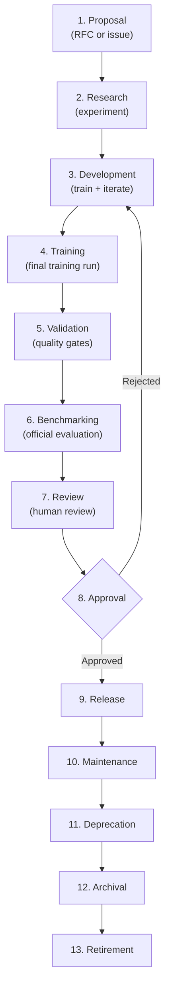
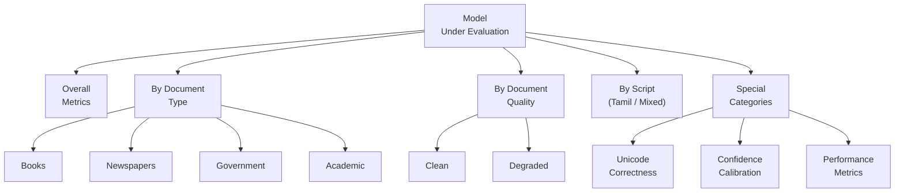
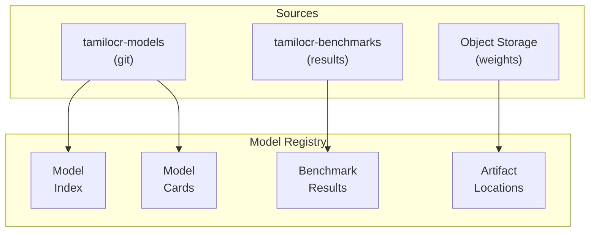
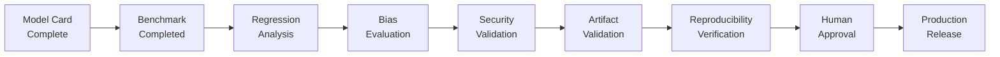

# STD-004 — Model Standards

> **STD-004 · 2026.07-r1 · Tier 3 — Standards**
>
> The definitive model governance standard for the OpenTamilOCR organization.
> Models are replaceable. Governance is permanent. Datasets outlive models. Standards outlive implementations.
> Changes require an RFC and maintainer approval.

---

## 1. Purpose

This document defines the organizational standard governing AI models within the OpenTamilOCR ecosystem.

It establishes how OCR models are identified, versioned, documented, evaluated, benchmarked, released, archived, and maintained throughout their lifecycle.

This standard governs **models** — not machine learning frameworks.
It remains applicable regardless of whether the organization uses Tesseract, PaddleOCR, TrOCR, Donut, EasyOCR, Vision Transformers, CRNN, foundation models, or any future OCR architecture.

---

## 2. Scope

This standard applies to:

- OCR recognition models (text line → character sequence).
- Text detection models (image → text region bounding boxes).
- Layout analysis models (page → structured regions).
- Classification models (document type, quality level, script identification).
- Segmentation models (pixel-level text/background separation).
- Language models used within OCR post-processing workflows.
- Fine-tuned models derived from pre-trained base models.
- Experimental, research, development, and production models.

This standard does **not** cover:

- Training pipeline implementation (covered in repository-level operational guides).
- Dataset standards (covered in STD-003).
- Framework-specific configuration (covered in repository-level guides).

---

## 3. Model Philosophy

| # | Principle | Rationale |
|---|-----------|-----------|
| MP1 | **Models are organizational assets.** | Every model represents investment in data, compute, and expertise. Models are tracked, versioned, and governed like any other organizational asset. |
| MP2 | **Models must be reproducible.** | Given the same dataset version, configuration, and random seed, another contributor can retrain and obtain equivalent results. |
| MP3 | **Models must be benchmarkable.** | Every model is evaluated on standardized benchmarks. Claims without benchmark evidence are unsubstantiated. |
| MP4 | **Models must be documented.** | Every model has a Model Card that describes its purpose, training, evaluation, limitations, and bias considerations. |
| MP5 | **Models must never be black boxes.** | Training data, configuration, evaluation metrics, and known limitations are always disclosed. No opaque deployments. |
| MP6 | **Every model has a lifecycle.** | Models are born (proposed), mature (trained, validated, released), and die (deprecated, archived). The lifecycle is governed. |
| MP7 | **Every model has ownership.** | One maintainer is accountable for each model. Orphaned models are deprecated. |
| MP8 | **Every model has evidence.** | Promotion decisions (experimental → production) are backed by benchmark evidence, not by opinion. |
| MP9 | **Every model must be replaceable.** | The organization never depends on a single model. The pipeline architecture (ARCH-004) abstracts models behind engine interfaces. |
| MP10 | **Model quality is measured — not assumed.** | Quality is defined by CER, WER, and other objective metrics on versioned benchmarks. Self-reported quality is not quality. |

---

## 4. Model Categories

### 4.1 Category Definitions


| Category | Purpose | Quality Requirements | Governance |
|----------|---------|---------------------|------------|
| **Experimental** | Early exploration. May not be reproducible. | None. | Creator manages. |
| **Research** | Structured research with documented hypothesis. | Documented config. Preliminary metrics. | Experiment record (EXP-NNN). |
| **Development** | Active improvement toward production readiness. | Reproducible. Benchmarked. Model card draft. | Maintainer oversight. |
| **Validation** | Release candidate. Under final evaluation. | All quality gates except final approval. | Maintainer + reviewer. |
| **Production** | Officially released and supported. | All quality gates passed. Full model card. | Maintainer + SC approval. |
| **Legacy** | Superseded by a newer production model. Still functional. | Maintained for backward compatibility. | Maintainer. |
| **Deprecated** | Scheduled for removal. Not recommended for use. | Deprecation notice published. Migration guidance. | Maintainer. |
| **Archived** | Permanently preserved. No longer maintained. | Preserved for historical reference. | Read-only. |

### 4.2 Promotion Criteria

| Promotion | Required Evidence |
|-----------|------------------|
| Experimental → Research | Documented hypothesis. Experiment record created. |
| Research → Development | Reproducible training. Preliminary benchmark results. |
| Development → Validation | Full benchmark on official dataset. Model card complete. No critical issues. |
| Validation → Production | Quality gates passed (Section 22). Maintainer approval. SC approval for first model per engine. |
| Production → Legacy | Newer production model available. Deprecation timeline published. |
| Legacy → Deprecated | Support period expired. Migration guidance published. |
| Deprecated → Archived | All users migrated. Artifacts preserved in cold storage. |

---

## 5. Model Identification

### 5.1 Model ID Format

```
{task}-{language}-{engine}-v{MAJOR}.{MINOR}.{PATCH}
```

| Component | Description | Example |
|-----------|-------------|---------|
| `{task}` | Model task. | `recognition`, `detection`, `layout` |
| `{language}` | Primary language. | `tamil`, `tamil-english` |
| `{engine}` | Inference engine. | `paddleocr`, `tesseract`, `trocr` |
| `v{MAJOR}.{MINOR}.{PATCH}` | Semantic Version. | `v1.2.0` |

Full example: `recognition-tamil-paddleocr-v1.2.0`

### 5.2 Naming Rules

| Rule | Standard |
|------|----------|
| **MI1: Lowercase.** | All model IDs are lowercase. |
| **MI2: Hyphen-separated.** | Components separated by hyphens. |
| **MI3: Globally unique.** | Model ID + version is unique across the organization. |
| **MI4: Stable.** | Once assigned, a model ID never changes. Renamed models get a new ID and an `obsoletes` pointer. |

### 5.3 Model Families

A model family groups related models:

| Family | Members Example |
|--------|----------------|
| `recognition-tamil-paddleocr` | `v1.0.0`, `v1.1.0`, `v2.0.0` |
| `detection-tamil-paddleocr` | `v1.0.0` |
| `recognition-tamil-trocr` | `v1.0.0` |

---

## 6. Model Metadata

### 6.1 Required Metadata Fields

| Field | Type | Required | Description |
|-------|------|----------|-------------|
| `model_id` | String | Yes | Unique identifier (Section 5.1). |
| `version` | String | Yes | SemVer version. |
| `name` | String | Yes | Human-readable name. |
| `category` | Enum | Yes | Category from Section 4.1. |
| `owner` | String | Yes | GitHub handle of the responsible maintainer. |
| `license` | String | Yes | SPDX identifier. Apache-2.0 default (FND-004). |
| `task` | Enum | Yes | `recognition`, `detection`, `layout`, `classification`, `segmentation`, `language_model`. |
| `languages` | List | Yes | ISO 639-3 codes. `["tam"]` or `["tam", "eng"]`. |
| `scripts` | List | Yes | Unicode script names. `["Tamil"]` or `["Tamil", "Latin"]`. |
| `engine` | String | Yes | Inference engine name. |
| `engine_versions` | List | Yes | Compatible engine versions. |
| `architecture` | String | Yes | Model architecture name (e.g., `CRNN`, `ViT`, `DBNet`). |
| `training_dataset` | String | Yes | Dataset name + version used for training. |
| `training_dataset_checksum` | String | Yes | SHA-256 of training dataset manifest. |
| `benchmark_dataset` | String | Yes | Benchmark dataset name + version. |
| `model_size_bytes` | Integer | Yes | Size of the model artifact in bytes. |
| `input_format` | Object | Yes | Expected input (image format, resolution, color). |
| `output_format` | Object | Yes | Output structure (text, bounding boxes, confidence). |
| `hardware_requirements` | Object | Yes | Minimum hardware (CPU/GPU, memory). |
| `known_limitations` | List | Yes | Documented limitations. |
| `created` | Date | Yes | ISO 8601 creation date. |
| `updated` | Date | Yes | ISO 8601 last update date. |
| `status` | Enum | Yes | `experimental`, `research`, `development`, `validation`, `production`, `legacy`, `deprecated`, `archived`. |
| `deprecation_date` | Date | Conditional | Set when status is `deprecated`. |
| `superseded_by` | String | Conditional | Model ID of replacement. |
| `tags` | List | Yes | Searchable keywords. |

---

## 7. Model Card Standard

### 7.1 Required Model Card

Every model in Development category or above must include a `model-card.yaml` conforming to SCH-002.

### 7.2 Model Card Sections

| Section | Content | Required |
|---------|---------|----------|
| **Identity** | Model ID, version, name, owner, license. | Yes |
| **Purpose** | What the model does and its intended use. | Yes |
| **Architecture** | Model architecture name and brief description. | Yes |
| **Training summary** | Dataset version, configuration highlights, training duration. | Yes |
| **Supported languages** | Languages and scripts the model handles. | Yes |
| **Supported document types** | Document types the model is designed for. | Yes |
| **Evaluation results** | CER, WER, line accuracy on benchmark dataset. | Yes |
| **Per-category results** | Metrics broken down by document type and quality level. | Yes |
| **Benchmark summary** | Benchmark dataset version, date, environment. | Yes |
| **Known limitations** | Conditions under which performance degrades. | Yes |
| **Bias considerations** | Performance disparities across categories. Mitigation plans. | Yes (FND-003, Section 6.4) |
| **Ethical considerations** | Out-of-scope uses. Potential for misuse. | Yes (FND-003, Section 6.6) |
| **Environmental impact** | Training compute, hardware, estimated carbon footprint. | Yes |
| **Reproducibility** | Exact steps to reproduce training. | Yes |
| **License** | License and attribution requirements. | Yes |
| **Maintenance status** | Current lifecycle category and maintainer. | Yes |
| **Version history** | Changes from previous version. | Yes |
| **References** | Related papers, datasets, and documents. | Yes |
| **Citation** | BibTeX for citing this model. | Yes |

---

## 8. Model Lifecycle

### 8.1 Lifecycle Stages



### 8.2 Stage Requirements

| Stage | Activities | Output | Authority |
|-------|-----------|--------|-----------|
| **Proposal** | Define model purpose, target engine, expected improvement. | Issue or RFC. | Any contributor. |
| **Research** | Explore approaches. Run preliminary experiments. | Experiment record (EXP-NNN). | Researcher. |
| **Development** | Iterate on architecture, data, hyperparameters. | Development checkpoint. | Developer. |
| **Training** | Final training run with documented configuration. | Trained model artifact. | Developer. |
| **Validation** | Run quality gates (Section 22). | Validation report. | Maintainer. |
| **Benchmarking** | Evaluate on official benchmark dataset. | Benchmark report. | Maintainer. |
| **Review** | Human review of model card, benchmark, and bias report. | Review sign-off. | Maintainer + reviewer. |
| **Approval** | Formal promotion decision. | Approval record. | Maintainer (SC for first per engine). |
| **Release** | Tag version. Publish artifacts. Update registry. | Published model. | Maintainer. |
| **Maintenance** | Monitor quality. Accept improvements as new versions. | Patch versions. | Maintainer. |
| **Deprecation** | Publish deprecation notice. Migration guidance. | Deprecation record. | Maintainer. |
| **Archival** | Move to cold storage. Preserve for historical reference. | Archived artifacts. | Maintainer. |
| **Retirement** | Final removal from active registry. | Retired record. | SC approval. |

---

## 9. Training Governance

### 9.1 Training Requirements

This section defines **organizational requirements** for training — not training algorithms.

| Requirement | Standard |
|-------------|----------|
| **TG1: Reproducibility.** | Training must be reproducible. Same dataset + same config + same seed → equivalent model (within floating-point tolerance). |
| **TG2: Dataset versioning.** | Training datasets are referenced by exact name + SemVer + manifest checksum (STD-003, Section 17). |
| **TG3: Configuration preservation.** | The complete training configuration is preserved as a YAML snapshot alongside the model artifact. |
| **TG4: Random seed documentation.** | Random seeds for initialization, data shuffling, and augmentation are documented. |
| **TG5: Dependency documentation.** | All software dependencies (framework, libraries) are recorded with pinned versions. |
| **TG6: Hardware documentation.** | GPU model, CPU, memory, and OS are recorded. Hardware affects floating-point reproducibility. |
| **TG7: Environment documentation.** | A complete environment specification (e.g., `environment.yaml`) is preserved. |
| **TG8: Training logs retained.** | Training logs (loss curves, validation metrics per epoch) are retained for ≥1 year. |
| **TG9: Checkpoint policy.** | At minimum, the best checkpoint (by validation metric) and the final checkpoint are preserved. |
| **TG10: License compliance.** | All training data, pre-trained weights, and augmentation tools are license-compatible (FND-004). |

### 9.2 Training Configuration Snapshot

```yaml
model_id: "recognition-tamil-paddleocr-v1.2.0"
training_date: "2026-10-15"
dataset: "tamil-printed-v1.2.0"
dataset_checksum: "sha256:abc123..."
splits:
  train: 10794
  val: 2313
architecture: "CRNN"
optimizer: "Adam"
learning_rate: 0.001
batch_size: 64
epochs: 100
random_seed: 42
augmentation:
  - "random_rotation: [-3, 3]"
  - "gaussian_noise: 0.01"
hardware:
  gpu: "NVIDIA A100 40GB"
  cpu: "AMD EPYC 7763"
  memory: "128 GB"
framework: "PaddleOCR 2.7.0"
dependencies:
  - "PaddlePaddle 2.5.0"
  - "Python 3.11.0"
  - "CUDA 12.1"
training_duration_hours: 18.5
best_checkpoint_epoch: 87
final_val_cer: 0.032
```

---

## 10. Evaluation Standards

### 10.1 Mandatory Metrics

| Metric | Definition | Measured On |
|--------|-----------|-------------|
| **CER** | Character Error Rate. | Benchmark test split. |
| **WER** | Word Error Rate. | Benchmark test split. |
| **Line Accuracy** | % of lines with zero errors. | Benchmark test split. |
| **Accuracy** | 1 − CER. | Benchmark test split. |

### 10.2 Required Evaluation Dimensions



| Dimension | Requirement |
|-----------|-------------|
| **Overall** | CER, WER, line accuracy across the full benchmark. |
| **By document type** | Metrics per category: books, newspapers, government, academic. |
| **By quality level** | Metrics per quality: clean, degraded. |
| **By script** | Metrics for pure Tamil vs mixed Tamil-English. |
| **Unicode correctness** | % of output that is valid UTF-8, NFC-normalized, and in the Tamil Unicode range. |
| **Confidence calibration** | If model provides confidence, measure calibration (expected accuracy at each confidence level). |
| **Historical comparison** | Compare against previous model version and baseline. |

### 10.3 Evaluation Rules

| Rule | Standard |
|------|----------|
| **EV1: Official benchmark only.** | Production promotion requires evaluation on the official benchmark dataset. Internal tests are supplementary. |
| **EV2: Versioned benchmark.** | The benchmark dataset version is recorded with every evaluation. |
| **EV3: Reproducible evaluation.** | Same model + same benchmark + same config = same results. |
| **EV4: Regression detection.** | If any metric degrades compared to the previous version, the regression is documented and justified. |
| **EV5: No cherry-picking.** | Evaluation is on the full benchmark. Subset results are supplementary, not primary. |

---

## 11. Benchmark Governance

### 11.1 Benchmark Standards

| Standard | Requirement |
|----------|-------------|
| **Official benchmark datasets** | Maintained in `tamilocr-benchmarks`. Versioned. Immutable after release. Gold-tier ground truth (STD-003, Section 9.1). |
| **Benchmark versioning** | Benchmark dataset versions follow SemVer. New versions require SC approval. |
| **Benchmark reproducibility** | Evaluation scripts are versioned alongside benchmark datasets. |
| **Baseline models** | Each benchmark version designates a baseline model. All comparisons are relative to baseline. |
| **Regression policy** | A model with any metric worse than the current production model requires documented justification for promotion. |

### 11.2 Benchmark Report Format

```yaml
benchmark_id: "tamil-printed-bench-v1.0.0"
model_id: "recognition-tamil-paddleocr-v1.2.0"
date: "2026-10-20"
evaluator: "@contributor-42"
environment:
  hardware: "NVIDIA A100 40GB"
  os: "Ubuntu 22.04"
  framework: "PaddleOCR 2.7.0"
  python: "3.11.0"
results:
  overall:
    cer: 0.032
    wer: 0.089
    line_accuracy: 0.912
    accuracy: 0.968
  by_document_type:
    books: { cer: 0.021, wer: 0.058 }
    newspapers: { cer: 0.045, wer: 0.112 }
    government: { cer: 0.038, wer: 0.095 }
  by_quality:
    clean: { cer: 0.015, wer: 0.042 }
    degraded: { cer: 0.058, wer: 0.148 }
  unicode_correctness: 0.999
comparison_to_baseline:
  baseline_model: "recognition-tamil-paddleocr-v1.1.0"
  cer_delta: -0.005
  wer_delta: -0.012
  regression: false
reproducibility_seed: 42
```

### 11.3 Leaderboard

| Rule | Standard |
|------|----------|
| **Ranked by CER.** | Primary ranking metric is CER on the official benchmark. |
| **Multi-dimensional.** | Separate leaderboards per document type and quality level. |
| **Version-tagged.** | Each entry records model version, engine version, and benchmark version. |
| **Historical.** | Previous entries preserved. Trends visualized. |
| **Reproducible.** | Each entry links to the configuration needed to reproduce the result. |

---

## 12. Model Registry

### 12.1 Registry Architecture



### 12.2 Registry Fields

| Field | Description |
|-------|-------------|
| `model_id` | Unique identifier. |
| `family` | Model family. |
| `version` | Current version. |
| `category` | Lifecycle category. |
| `owner` | Responsible maintainer. |
| `latest_benchmark` | Latest benchmark report reference. |
| `artifact_location` | URL or path to model artifacts. |
| `compatibility` | Compatible engine versions, pipeline versions. |
| `dependencies` | Required libraries and versions. |
| `release_notes` | Summary of changes from previous version. |
| `status` | Active, deprecated, archived. |

---

## 13. Artifact Management

### 13.1 Model Artifact Structure

```
{model-id}/
├── model-card.yaml                # Model card (SCH-002)
├── LICENSE                        # Model license
├── README.md                      # Human-readable description
├── CHANGELOG.md                   # Version history
├── VERSION                        # Current version
│
├── weights/                       # Model weights
│   ├── model.{ext}               # Engine-specific format
│   ├── config.yaml                # Model configuration
│   └── checksums.sha256           # Integrity hashes
│
├── training/                      # Training provenance
│   ├── training-config.yaml       # Complete training config snapshot
│   ├── environment.yaml           # Software and hardware environment
│   └── training-log.csv           # Loss and metric curves
│
├── evaluation/                    # Evaluation results
│   ├── benchmark-report.yaml      # Official benchmark results
│   ├── bias-report.yaml           # Bias evaluation
│   └── confusion-analysis/        # Detailed error analysis
│       ├── confusion-matrix.csv
│       └── error-samples/
│
└── metadata/                      # Additional metadata
    ├── dataset-reference.yaml     # Training dataset version and checksum
    └── experiment-reference.yaml  # EXP-NNN that produced this model
```

### 13.2 Artifact Rules

| Rule | Standard |
|------|----------|
| **AR1: Checksums.** | Every artifact file has a SHA-256 checksum in `checksums.sha256`. |
| **AR2: Immutable releases.** | Published model versions are frozen. Updates produce new versions. |
| **AR3: Complete provenance.** | Every model traces to its training dataset, config, experiment, and benchmark. |
| **AR4: No orphan artifacts.** | Every artifact is referenced by a registry entry. Unreferenced artifacts are cleaned up. |
| **AR5: Secure storage.** | Model artifacts are stored in authorized locations only (ARCH-006, Section 10). |

---

## 14. Versioning Standards

### 14.1 Semantic Versioning

| Change | Increment | Example |
|--------|-----------|---------|
| Architecture change, input/output format change (breaking). | MAJOR | `1.0.0` → `2.0.0` |
| Improved accuracy, new document type support (backward-compatible). | MINOR | `1.0.0` → `1.1.0` |
| Bug fix, minor accuracy improvement, metadata update. | PATCH | `1.0.0` → `1.0.1` |

### 14.2 Pre-Release Versions

| Stage | Format | Example |
|-------|--------|---------|
| Experimental | `v0.{N}.{N}` | `v0.1.0` |
| Release candidate | `v{N}.{N}.{N}-rc.{N}` | `v1.0.0-rc.1` |

### 14.3 Compatibility Guarantees

| Version Change | Guarantee |
|---------------|-----------|
| **PATCH** | Drop-in replacement. Same inputs → equivalent outputs. |
| **MINOR** | Backward-compatible. Existing inputs work. New capabilities added. |
| **MAJOR** | Breaking. Input format, output format, or API may change. Migration guide required. |

---

## 15. Compatibility Standards

### 15.1 Compatibility Matrix

| Dimension | Requirement |
|-----------|-------------|
| **OCR pipeline** | Model specifies which pipeline versions it is compatible with (ARCH-004). |
| **Engine version** | Model specifies compatible engine versions. Tested on each before release. |
| **Dataset version** | Training dataset version is recorded. Models are evaluated on the corresponding benchmark version. |
| **Unicode version** | Model output conforms to the Unicode standard referenced by the dataset. |
| **API version** | If served via API, model specifies compatible API versions (ARCH-006). |
| **Platform** | Supported operating systems and architectures documented. |

---

## 16. Security Standards

### 16.1 Model Security Rules

| Rule | Standard |
|------|----------|
| **MS1: Integrity verification.** | Model artifacts are verified by checksum before loading. Mismatched checksums fail loading. |
| **MS2: Trusted sources only.** | Models are loaded only from the model registry or verified storage locations. |
| **MS3: No embedded code.** | Model files must not contain executable code. Pickle-based formats require documented risk acknowledgment. |
| **MS4: Dependency verification.** | All inference dependencies are scanned for vulnerabilities before release. |
| **MS5: License verification.** | Pre-trained base model licenses are compatible with Apache-2.0 (FND-004). |
| **MS6: Supply chain tracking.** | If a model is fine-tuned from a third-party base, the base model provenance is documented. |

---

## 17. Performance Standards

### 17.1 Performance Metrics

Performance is measured and documented — not constrained to specific hardware numbers.

| Metric | Description | How Measured |
|--------|-------------|-------------|
| **Inference latency** | Time per image (ms). | Average over ≥100 images on reference hardware. |
| **Throughput** | Images per second. | Sustained over ≥60 seconds. |
| **Memory (inference)** | Peak RSS during inference. | Measured by profiler. |
| **Model size** | Artifact size on disk (bytes). | File size. |
| **Startup time** | Time from process start to first inference. | Average over ≥5 runs. |
| **GPU utilization** | % GPU compute during inference. | Profiler. |
| **Batch efficiency** | Throughput improvement at batch sizes 1, 4, 16, 64. | Measured per batch size. |

### 17.2 Performance Documentation

Every production model documents:

- Reference hardware (GPU model, CPU, memory).
- Inference latency at batch size 1 and optimal batch size.
- Memory consumption.
- Model size.
- Comparison to previous version.

---

## 18. Reproducibility Standards

### 18.1 Reproducibility Requirements

| Requirement | Mechanism |
|-------------|-----------|
| **Configuration preservation** | `training-config.yaml` snapshot stored with model. |
| **Environment documentation** | `environment.yaml` with framework, library, OS, hardware versions. |
| **Random seeds** | All seeds documented: initialization, data shuffling, augmentation. |
| **Dependency versions** | Pinned in lock file format. |
| **Training logs** | Loss and validation metric per epoch retained. |
| **Evaluation logs** | Per-sample predictions retained for error analysis. |
| **Benchmark logs** | Complete benchmark output retained. |
| **Artifact integrity** | SHA-256 checksums for all files. |

### 18.2 Reproducibility Verification

A model is considered reproducible if an independent contributor can:

1. Clone the training repository at the documented commit.
2. Install dependencies from the lock file.
3. Download the documented dataset version.
4. Run training with the documented configuration and seed.
5. Obtain a model with CER within ±0.5% of the documented result.

---

## 19. Human Review Requirements

### 19.1 Approval Matrix

| Action | Required Approval |
|--------|------------------|
| Promotion to Production | 1 maintainer + SC approval (first model per engine). |
| Major version release | 1 maintainer + benchmark evidence. |
| Deprecation | 1 maintainer + migration guidance published. |
| Retirement | SC approval. |
| Benchmark dataset change | SC approval. |
| Model card approval | 1 maintainer. |

### 19.2 Review Checklist

Before production promotion, the reviewer verifies:

- [ ] Model card is complete and accurate.
- [ ] Benchmark results meet or exceed baseline.
- [ ] No regressions in any category without documented justification.
- [ ] Bias report reviewed and acceptable (FND-003).
- [ ] Training configuration is reproducible.
- [ ] All artifacts have valid checksums.
- [ ] License compliance verified.
- [ ] Security scan passed.
- [ ] Performance metrics documented.

---

## 20. AI-Assisted Model Development

### 20.1 Permitted AI Activities

| Activity | AI Role | Human Role |
|----------|---------|------------|
| **Training analysis** | AI analyzes training curves and suggests improvements. | Human evaluates and decides. |
| **Hyperparameter suggestions** | AI suggests hyperparameter configurations based on experiment history. | Human approves and runs. |
| **Evaluation summaries** | AI generates natural language summaries of benchmark results. | Human reviews for accuracy. |
| **Benchmark analysis** | AI identifies performance patterns, strengths, and weaknesses across categories. | Human interprets. |
| **Error analysis** | AI categorizes common errors (character substitutions, omissions, insertions). | Human prioritizes fixes. |
| **Documentation** | AI drafts model card content from training and evaluation data. | Human reviews and approves. |

### 20.2 Prohibited AI Activities

| Activity | Reason |
|----------|--------|
| **Approving production promotion.** | Promotion is a human governance decision. |
| **Replacing benchmark evidence.** | AI assertions are not evidence. Benchmarks produce evidence. |
| **Modifying published evaluation results.** | Published results are immutable. |
| **Selecting models for release without human review.** | Release is a human decision (GOV-004). |

---

## 21. Deprecation Policy

### 21.1 Deprecation Stages


### 21.2 Deprecation Rules

| Rule | Standard |
|------|----------|
| **DP1: Advance notice.** | Deprecation notice published ≥6 months before end of support. |
| **DP2: Migration guidance.** | Documentation describing how to migrate to the replacement model. |
| **DP3: Replacement available.** | A replacement model must be in Production before deprecation begins. |
| **DP4: Support period.** | Deprecated models receive critical bug fixes during the support period. No new features. |
| **DP5: Archived permanently.** | Deprecated model artifacts are archived (not deleted) for historical reference and reproducibility. |

---

## 22. Quality Gates

### 22.1 Production Promotion Gate



| Gate | Requirement | Evidence |
|------|-------------|---------|
| **Documentation** | Model card complete and reviewed. | `model-card.yaml` exists and is valid. |
| **Benchmark** | Evaluated on official benchmark. Metrics meet baseline. | `benchmark-report.yaml`. |
| **Regression** | No unacknowledged regressions. | Comparison to previous version documented. |
| **Bias** | Bias evaluation completed. Disparities documented and justified. | `bias-report.yaml`. |
| **Security** | Artifact checksums valid. Dependencies scanned. License compatible. | Security scan report. |
| **Artifacts** | All required files present. Checksums match. | Validation script output. |
| **Reproducibility** | Training config, environment, and seeds documented. | `training-config.yaml` + `environment.yaml`. |
| **Human approval** | Maintainer signs off. SC approves (first per engine). | Approval record. |

---

## 23. Future Evolution

Model standards evolve through the RFC process (GOV-003):

1. A contributor identifies a new model category, metric, or governance requirement.
2. An RFC is filed with the proposal and impact analysis.
3. The RFC is reviewed and decided.
4. If approved, STD-004 is updated.
5. Existing models are not retroactively affected. New standards apply to future models.
6. A DEC record captures the decision.

**Backward compatibility:** New model standards do not invalidate existing published models. Existing models conform to new standards through new version releases.

---

## 24. Governance Relationship

| Document | Relationship |
|----------|-------------|
| FND-001 — Project Charter | Parent. Mission: world-class Tamil OCR. Models serve this mission. |
| FND-003 — Ethics Framework | Required. Bias evaluation, ethical considerations, out-of-scope uses. |
| ARCH-004 — OCR Pipeline Architecture | Required. Pipeline consumes models through engine abstraction. |
| ARCH-005 — Data Architecture | Required. Model artifacts, model cards (SCH-002), and lineage defined. |
| FND-004 — Licensing Policy | Reference. Model and dependency licensing. |
| GOV-003 — Decision Process | Reference. Model standards changes through RFC. |
| GOV-004 — Release Governance | Reference. Model releases follow release governance. |
| ARCH-006 — Platform Architecture | Reference. Model registry in platform. |
| ARCH-007 — AI Workflow Architecture | Reference. AI-assisted model development. |
| STD-001 — Documentation Standards | Sibling. Model documentation standards. |
| STD-002 — Coding Standards | Sibling. Training code standards. |
| STD-003 — Dataset Standards | Sibling. Training data requirements. |
| STD-006 — Testing Standards | Sibling. Model validation testing. |

---

## 25. Related Documents

| Document | Relationship |
|----------|-------------|
| SYS-000 — Master Index | Root. |
| ARCH-004 — OCR Pipeline Architecture | Required. Pipeline integration. |
| ARCH-005 — Data Architecture | Required. Model artifacts. |
| FND-001 — Project Charter | Required. Mission. |
| FND-003 — Ethics Framework | Required. Ethics. |
| FND-004 — Licensing Policy | Reference. Licensing. |
| GOV-003 — Decision Process | Reference. Change process. |
| GOV-004 — Release Governance | Reference. Releases. |
| ARCH-006 — Platform Architecture | Reference. Registry. |
| ARCH-007 — AI Workflow Architecture | Reference. AI development. |
| STD-003 — Dataset Standards | Sibling. Training data. |
| STD-006 — Testing Standards | Sibling. Model testing. |

---

## 26. Review Policy

- **Review frequency:** Every 6 months during the Standards Review Cycle, or when a new engine, model architecture, or evaluation metric is adopted.
- **Amendment process:** RFC → DEC → Maintainer + SC member approval.
- **Trigger for review:** New engine adoption, new model category, new benchmark methodology, community feedback on model quality.

---

## 27. Document History

| Version | Date | Summary |
|---------|------|---------|
| 2026.07-r1 | 2026-07-17 | Initial draft. Founding model governance standard for the OpenTamilOCR organization. |

---

> **Approved by:** Pending Steering Council approval.
> **Effective date:** Upon approval.
