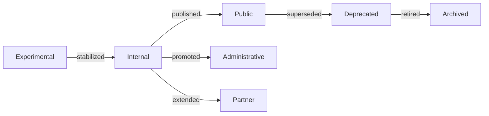
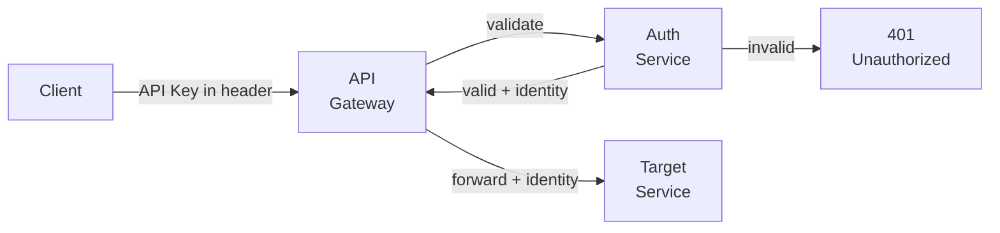
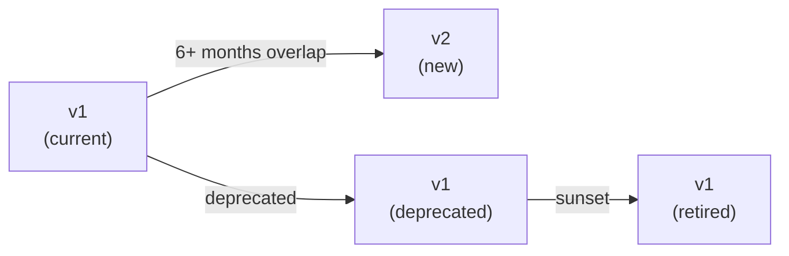
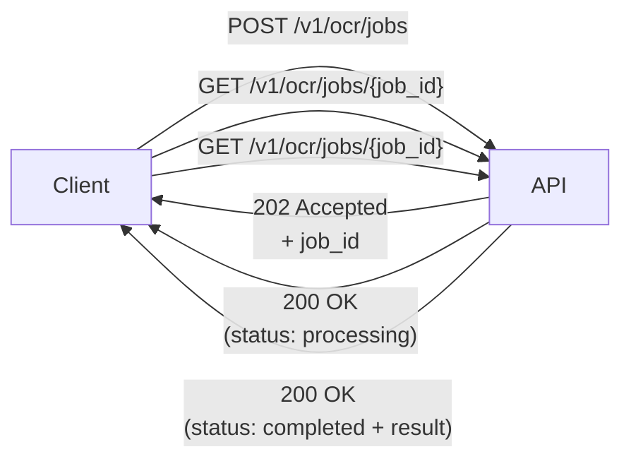
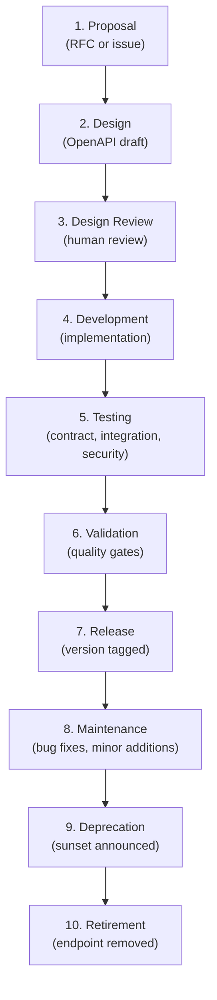

# STD-005 — API Standards

> **STD-005 · 2026.07-r1 · Tier 3 — Standards**
>
> The definitive API governance standard for the OpenTamilOCR organization.
> APIs are contracts. Contracts must be stable. Frameworks are replaceable.
> Changes require an RFC and maintainer approval.

---

## 1. Purpose

This document establishes how APIs are designed, versioned, documented, secured, tested, evolved, and governed across every OpenTamilOCR service.

This standard governs **API design** — not API implementation.
It remains applicable regardless of implementation technology: FastAPI, Flask, Go, Rust, Node.js, gRPC gateways, or any future platform.

The API contract is permanent.
Frameworks are replaceable.

---

## 2. Scope

This standard applies to:

- Public REST APIs (consumed by external users and applications).
- Internal APIs (consumed by other OpenTamilOCR services).
- Administrative APIs (consumed by operators and maintainers).
- Authentication and authorization APIs.
- OCR, model, dataset, benchmark, search, and registry APIs.
- Webhook delivery endpoints.
- AI Gateway APIs (ARCH-006, Section 18).
- Future service APIs.

This standard does **not** cover:

- Framework-specific implementation patterns.
- Database or ORM design.
- Business logic implementation.
- Infrastructure and deployment configuration.

---

## 3. API Philosophy

| # | Principle | Rationale |
|---|-----------|-----------|
| AP1 | **APIs are contracts.** | An API defines the boundary between producer and consumer. Both sides depend on the contract. Breaking the contract breaks trust. |
| AP2 | **Contracts must be stable.** | Consumers build on APIs. Instability forces costly rework. Stability enables ecosystem growth. |
| AP3 | **Consistency over creativity.** | A consistent API surface is easier to learn, use, and maintain than a collection of individually clever designs. |
| AP4 | **Explicit is better than implicit.** | API behavior is documented and predictable. No hidden defaults, undocumented side effects, or magic parameters. |
| AP5 | **Backward compatibility is critical.** | Removing or changing existing behavior breaks consumers. Non-breaking additions are always preferred. |
| AP6 | **Documentation is part of the API.** | An undocumented API does not exist. The OpenAPI specification is as important as the implementation. |
| AP7 | **Security is mandatory.** | Authentication, authorization, rate limiting, and input validation are architectural requirements, not optional features. |
| AP8 | **Errors must be predictable.** | Every error response follows a canonical format. Consumers can build reliable error handling. |
| AP9 | **APIs evolve through governance.** | Changes to API contracts follow the RFC process. Breaking changes require a major version. |
| AP10 | **Every API has ownership.** | One maintainer is accountable for each API. Orphaned APIs are deprecated. |

---

## 4. API Categories

### 4.1 Category Definitions

| Category | Audience | Stability | Auth Required | Rate Limited |
|----------|----------|-----------|---------------|-------------|
| **Public** | External users, researchers, community. | High. Breaking changes require major version. | Optional (read), required (write). | Yes. |
| **Internal** | Other OpenTamilOCR services. | Medium. Changes coordinated across teams. | Service token. | Yes (higher limits). |
| **Administrative** | Operators, maintainers, SC members. | Medium. | Admin credentials. | Yes. |
| **Partner** | Institutional partners, federated services. | High. Governed by partner agreements. | Partner credentials. | Negotiated. |
| **Experimental** | Internal testing and prototyping. | Low. May change without notice. | Required. | Yes. |
| **Deprecated** | Legacy consumers during migration. | Frozen. No new features. Bug fixes only. | Same as original. | Same as original. |

### 4.2 Category Lifecycle



---

## 5. API Identification

### 5.1 Resource Naming

| Rule | Standard | Example |
|------|----------|---------|
| **AN1: Plural nouns.** | Collections use plural nouns. | `/datasets`, `/models` |
| **AN2: Lowercase.** | All URI segments are lowercase. | `/benchmarks`, not `/Benchmarks` |
| **AN3: Hyphen-separated.** | Multi-word segments use hyphens. | `/model-cards`, not `/modelCards` |
| **AN4: No verbs.** | URIs represent resources, not actions. Actions are HTTP methods. | `/ocr/results`, not `/runOcr` |
| **AN5: No file extensions.** | Content negotiation via `Accept` header. | `/models/v1`, not `/models/v1.json` |
| **AN6: Consistent naming.** | The same concept uses the same name across all APIs. | `dataset_id` everywhere, not `ds_id` in some and `datasetId` in others. |

### 5.2 URI Structure

```
/{version}/{resource}/{resource-id}/{sub-resource}
```

| Component | Description | Example |
|-----------|-------------|---------|
| `{version}` | API version prefix. | `/v1` |
| `{resource}` | Top-level resource (plural noun). | `/datasets` |
| `{resource-id}` | Unique identifier for a specific resource. | `/tamil-printed-v1` |
| `{sub-resource}` | Nested resource. | `/versions`, `/card` |

Examples:

```
GET  /v1/datasets
GET  /v1/datasets/tamil-printed-v1
GET  /v1/datasets/tamil-printed-v1/versions
GET  /v1/models/recognition-tamil-paddleocr-v1/card
POST /v1/ocr/recognize
GET  /v1/benchmarks/results?model=recognition-tamil-paddleocr-v1
```

---

## 6. HTTP Method Standards

### 6.1 Method Usage

| Method | Purpose | Idempotent | Safe | Cacheable |
|--------|---------|-----------|------|-----------|
| **GET** | Retrieve a resource or collection. | Yes | Yes | Yes |
| **POST** | Create a resource or trigger an action. | No (unless idempotency key). | No | No |
| **PUT** | Replace a resource entirely. | Yes | No | No |
| **PATCH** | Partially update a resource. | No | No | No |
| **DELETE** | Remove a resource. | Yes | No | No |
| **HEAD** | Retrieve headers without body. | Yes | Yes | Yes |
| **OPTIONS** | Retrieve supported methods and CORS. | Yes | Yes | No |

### 6.2 Method Rules

| Rule | Standard |
|------|----------|
| **HM1: GET is read-only.** | GET requests never modify server state. |
| **HM2: POST for creation.** | POST creates new resources. Returns `201 Created` with the created resource. |
| **HM3: PUT for full replacement.** | PUT replaces the entire resource. Omitted fields are reset to defaults. |
| **HM4: PATCH for partial update.** | PATCH modifies specific fields. Omitted fields are unchanged. |
| **HM5: DELETE is idempotent.** | Deleting an already-deleted resource returns `204 No Content` or `404 Not Found`, not an error. |
| **HM6: POST for actions.** | Non-CRUD actions (e.g., OCR recognition) use POST on an action sub-resource: `POST /v1/ocr/recognize`. |

---

## 7. Request Standards

### 7.1 Required Headers

| Header | Required | Description |
|--------|----------|-------------|
| `Content-Type` | Yes (POST, PUT, PATCH) | Media type of request body. `application/json` default. |
| `Accept` | Recommended | Expected response media type. `application/json` default. |
| `Authorization` | Conditional | Authentication token or API key. Required for authenticated endpoints. |
| `X-Request-ID` | Recommended | Client-generated unique request identifier for tracing. |
| `X-Correlation-ID` | Recommended | Correlation identifier for cross-service tracing. |
| `Accept-Language` | Optional | Preferred language for error messages. |
| `Accept-Encoding` | Optional | Supported compression: `gzip`, `br`. |

### 7.2 Request Body Rules

| Rule | Standard |
|------|----------|
| **RQ1: JSON default.** | Request bodies use `application/json` unless the endpoint explicitly accepts other types (e.g., `multipart/form-data` for file upload). |
| **RQ2: UTF-8 encoding.** | All text is UTF-8 encoded. |
| **RQ3: snake_case fields.** | JSON field names use `snake_case`. |
| **RQ4: No unknown fields.** | Unknown fields in the request body are ignored (forward compatibility) or rejected (strict mode, configurable). |
| **RQ5: Size limits.** | Maximum request body size is enforced and documented per endpoint. |

---

## 8. Response Standards

### 8.1 Success Response Format

```json
{
  "data": {
    "id": "recognition-tamil-paddleocr-v1.2.0",
    "type": "model",
    "attributes": {
      "name": "Tamil Printed OCR - PaddleOCR",
      "version": "1.2.0",
      "status": "production",
      "cer": 0.032
    }
  },
  "meta": {
    "request_id": "req-abc123",
    "timestamp": "2026-10-20T14:30:00Z"
  }
}
```

### 8.2 Collection Response Format

```json
{
  "data": [
    { "id": "model-1", "type": "model", "attributes": { "..." : "..." } },
    { "id": "model-2", "type": "model", "attributes": { "..." : "..." } }
  ],
  "meta": {
    "request_id": "req-def456",
    "timestamp": "2026-10-20T14:30:00Z",
    "total_count": 42
  },
  "pagination": {
    "cursor": "eyJpZCI6Im1vZGVsLTIifQ==",
    "has_more": true,
    "page_size": 20
  }
}
```

### 8.3 Response Rules

| Rule | Standard |
|------|----------|
| **RS1: Envelope.** | All responses are wrapped in a standard envelope: `data`, `meta`, and optionally `pagination` or `errors`. |
| **RS2: snake_case.** | JSON field names use `snake_case`. |
| **RS3: ISO 8601 timestamps.** | All dates and times use ISO 8601 format with UTC timezone: `2026-10-20T14:30:00Z`. |
| **RS4: Null vs absent.** | Null means explicitly no value. Absent means the field was not requested or is not applicable. |
| **RS5: Request ID echoed.** | `meta.request_id` echoes the client's `X-Request-ID` or provides a server-generated one. |

---

## 9. Error Standards

### 9.1 Error Response Format

```json
{
  "errors": [
    {
      "code": "VALIDATION_ERROR",
      "message": "Invalid image format.",
      "detail": "Expected PNG or JPEG. Received: image/webp.",
      "field": "image",
      "documentation_url": "https://docs.opentamilocr.org/api/v1/errors#VALIDATION_ERROR"
    }
  ],
  "meta": {
    "request_id": "req-ghi789",
    "timestamp": "2026-10-20T14:30:00Z"
  }
}
```

### 9.2 Error Response Fields

| Field | Type | Required | Description |
|-------|------|----------|-------------|
| `code` | String | Yes | Machine-readable error code. UPPER_SNAKE_CASE. |
| `message` | String | Yes | Human-readable summary. |
| `detail` | String | No | Additional context: what was expected, what was received. |
| `field` | String | No | The request field that caused the error (for validation errors). |
| `documentation_url` | String | No | Link to error documentation. |

### 9.3 Error Code Registry

| Code | HTTP Status | Meaning |
|------|-------------|---------|
| `VALIDATION_ERROR` | 400 | Request body or parameter is invalid. |
| `INVALID_FORMAT` | 400 | Unsupported content format. |
| `MISSING_FIELD` | 400 | Required field is missing. |
| `AUTHENTICATION_REQUIRED` | 401 | Request requires authentication. |
| `INVALID_TOKEN` | 401 | Authentication token is invalid or expired. |
| `FORBIDDEN` | 403 | Authenticated but not authorized. |
| `NOT_FOUND` | 404 | Resource does not exist. |
| `METHOD_NOT_ALLOWED` | 405 | HTTP method not supported for this resource. |
| `CONFLICT` | 409 | Resource state conflict (e.g., duplicate creation). |
| `PAYLOAD_TOO_LARGE` | 413 | Request body exceeds size limit. |
| `UNSUPPORTED_MEDIA_TYPE` | 415 | Content-Type not supported. |
| `RATE_LIMIT_EXCEEDED` | 429 | Too many requests. Retry after specified duration. |
| `INTERNAL_ERROR` | 500 | Unexpected server error. |
| `SERVICE_UNAVAILABLE` | 503 | Service temporarily unavailable. |

---

## 10. Status Code Standards

### 10.1 Approved Status Codes

| Code | Meaning | When Used |
|------|---------|-----------|
| **200 OK** | Successful GET, PUT, PATCH, DELETE. | Response body contains the result. |
| **201 Created** | Successful POST creating a resource. | Response body contains the created resource. `Location` header set. |
| **202 Accepted** | Request accepted for async processing. | Response contains a job/task reference. |
| **204 No Content** | Successful DELETE or action with no response body. | No response body. |
| **301 Moved Permanently** | Resource permanently moved. | `Location` header set. |
| **304 Not Modified** | Resource unchanged since last request. | Used with conditional GET (`If-None-Match`). |
| **400 Bad Request** | Client error in request. | Error response with details. |
| **401 Unauthorized** | Authentication required or failed. | Error response. |
| **403 Forbidden** | Authenticated but insufficient permissions. | Error response. |
| **404 Not Found** | Resource does not exist. | Error response. |
| **405 Method Not Allowed** | HTTP method not supported. | `Allow` header lists supported methods. |
| **409 Conflict** | State conflict. | Error response with conflict details. |
| **413 Payload Too Large** | Request exceeds size limit. | Error response with limit. |
| **415 Unsupported Media Type** | Content-Type not accepted. | Error response with accepted types. |
| **429 Too Many Requests** | Rate limit exceeded. | `Retry-After` header set. |
| **500 Internal Server Error** | Unexpected server failure. | Generic error response. No internal details exposed. |
| **503 Service Unavailable** | Service temporarily down. | `Retry-After` header set. |

### 10.2 Status Code Rules

| Rule | Standard |
|------|----------|
| **SC1: Use standard codes.** | Only use the status codes listed above. No custom status codes. |
| **SC2: Correct semantics.** | Use the code that matches the semantics. Do not return `200` for errors or `404` for authorization failures. |
| **SC3: 5xx for server errors only.** | Client mistakes are 4xx. Server failures are 5xx. Never expose internal stack traces in 5xx responses. |

---

## 11. Authentication Standards

### 11.1 Authentication Flow



### 11.2 Authentication Methods

| Method | Mechanism | Use Case |
|--------|-----------|----------|
| **API Key** | `Authorization: Bearer {key}` header. | Primary authentication for API consumers. |
| **Service Token** | `Authorization: Bearer {service-token}` header. | Service-to-service communication. |
| **OAuth 2.0** (future) | Standard OAuth 2.0 flow with JWT. | User accounts, third-party integrations. |
| **Anonymous** | No authentication header. | Public read-only endpoints. |

### 11.3 Authentication Rules

| Rule | Standard |
|------|----------|
| **AU1: Header-based.** | Credentials are passed in the `Authorization` header. Never in URL query parameters. |
| **AU2: HTTPS only.** | Credentials are only transmitted over HTTPS. |
| **AU3: Token rotation.** | API keys can be rotated without downtime. Old keys are revocable. |
| **AU4: No embedded secrets.** | API keys are never embedded in client-side code. |
| **AU5: Scope-limited.** | Tokens are scoped to minimum required permissions. |

---

## 12. Authorization Standards

### 12.1 Authorization Model

| Role | Permissions | Reference |
|------|------------|-----------|
| **anonymous** | Public read APIs. | ARCH-006, Section 13.3 |
| **user** | Anonymous + OCR API, playground. | ARCH-006, Section 13.3 |
| **contributor** | User + experiment submission, benchmark submission. | ARCH-006, Section 13.3 |
| **maintainer** | Contributor + registry updates, admin read. | ARCH-006, Section 13.3 |
| **admin** | All permissions. | ARCH-006, Section 13.3 |
| **service** | Internal inter-service communication. | ARCH-006, Section 13.2 |

### 12.2 Authorization Rules

| Rule | Standard |
|------|----------|
| **AZ1: Least privilege.** | Every API key and token has the minimum permissions needed. |
| **AZ2: Explicit deny.** | If a role is not explicitly granted a permission, access is denied. |
| **AZ3: Consistent enforcement.** | Authorization is enforced at the API Gateway. Services do not re-implement authorization. |
| **AZ4: Audit logging.** | All authorization decisions (grants and denials) are logged. |

---

## 13. Versioning Standards

### 13.1 Version Format

```
/v{MAJOR}/{resource}
```

- Version prefix is in the URI path: `/v1/`, `/v2/`.
- Only MAJOR version in the URI. MINOR and PATCH changes are backward-compatible.

### 13.2 Versioning Rules

| Rule | Standard |
|------|----------|
| **VR1: Additive changes are non-breaking.** | Adding new fields, new endpoints, or new optional parameters is non-breaking. |
| **VR2: Removals are breaking.** | Removing fields, endpoints, or changing field types requires a new major version. |
| **VR3: Deprecation before removal.** | Fields and endpoints are deprecated for ≥1 release cycle before removal. |
| **VR4: Sunset header.** | Deprecated endpoints include a `Sunset` header with the planned removal date. |
| **VR5: Migration guide.** | Every major version includes a migration guide documenting all breaking changes. |
| **VR6: Parallel support.** | Previous major version is supported for ≥6 months after the new version is released. |

### 13.3 Version Evolution



---

## 14. Pagination Standards

### 14.1 Cursor-Based Pagination (Preferred)

```
GET /v1/datasets?page_size=20&cursor=eyJpZCI6ImRzLTQyIn0=
```

| Parameter | Type | Description |
|-----------|------|-------------|
| `page_size` | Integer | Number of items per page. Default: 20. Max: 100. |
| `cursor` | String | Opaque cursor from previous response. |

Response includes:

```json
{
  "pagination": {
    "cursor": "eyJpZCI6ImRzLTYyIn0=",
    "has_more": true,
    "page_size": 20
  }
}
```

### 14.2 Pagination Rules

| Rule | Standard |
|------|----------|
| **PG1: Cursor-based preferred.** | Cursor pagination is the default. Provides stable iteration over changing data. |
| **PG2: Offset permitted.** | Offset pagination (`?offset=40&limit=20`) is permitted for small, static datasets. |
| **PG3: Default page size.** | Default page size is 20. Documented per endpoint. |
| **PG4: Maximum page size.** | Maximum page size is 100 (configurable per endpoint). |
| **PG5: Total count optional.** | `total_count` is included when feasible. Omitted for expensive counts. |

---

## 15. Filtering and Sorting Standards

### 15.1 Filtering

```
GET /v1/models?engine=paddleocr&status=production&cer_lt=0.05
```

| Pattern | Syntax | Example |
|---------|--------|---------|
| **Equality** | `?field=value` | `?engine=paddleocr` |
| **Range (less than)** | `?field_lt=value` | `?cer_lt=0.05` |
| **Range (greater than)** | `?field_gt=value` | `?cer_gt=0.01` |
| **Range (between)** | `?field_gte=a&field_lte=b` | `?created_gte=2026-01-01&created_lte=2026-12-31` |
| **Multiple values** | `?field=a,b,c` | `?status=production,validation` |
| **Search** | `?q=search+term` | `?q=tamil+printed` |

### 15.2 Sorting

```
GET /v1/models?sort=-cer,name
```

| Convention | Description |
|-----------|-------------|
| `sort=field` | Ascending sort by field. |
| `sort=-field` | Descending sort by field (prefix `-`). |
| `sort=field1,-field2` | Multi-field sort, comma-separated. |

### 15.3 Field Selection

```
GET /v1/models?fields=id,name,cer,status
```

- Clients can request specific fields to reduce response size.
- Server may ignore `fields` if not supported for an endpoint.

---

## 16. Validation Standards

### 16.1 Input Validation Rules

| Rule | Standard |
|------|----------|
| **IV1: Validate all inputs.** | Every request parameter, header, and body field is validated before processing. |
| **IV2: Type checking.** | Fields must match their documented type. Type mismatches return `400 VALIDATION_ERROR`. |
| **IV3: Required fields.** | Missing required fields return `400 MISSING_FIELD` with the field name. |
| **IV4: Size limits.** | String length, array size, and numeric range limits are enforced. |
| **IV5: Unicode validation.** | Text fields are validated for valid UTF-8. Invalid encoding is rejected. |
| **IV6: File validation.** | Uploaded files are validated for type, size, and integrity. Magic bytes checked. |
| **IV7: Reject malicious input.** | Inputs containing script injection, SQL injection, or path traversal patterns are rejected. |

---

## 17. Security Standards

### 17.1 Transport Security

| Rule | Standard |
|------|----------|
| **TS1: HTTPS mandatory.** | All API traffic is encrypted via TLS 1.2+. HTTP redirects to HTTPS. |
| **TS2: HSTS enabled.** | `Strict-Transport-Security` header set on all responses. |
| **TS3: No credentials in URLs.** | API keys and tokens are never in query parameters or URL paths. |

### 17.2 Application Security

| Rule | Standard |
|------|----------|
| **AS1: Input sanitization.** | All inputs are sanitized before processing. |
| **AS2: Output encoding.** | Responses that may be rendered in browsers are properly encoded. |
| **AS3: Rate limiting.** | All endpoints enforce rate limits. Limits vary by authentication level (ARCH-006, Section 16.1). |
| **AS4: Audit logging.** | All authentication, authorization, and data-modifying actions are logged with actor, timestamp, and outcome. |
| **AS5: No internal details in errors.** | 5xx responses never expose stack traces, file paths, or internal implementation details. |
| **AS6: CORS configuration.** | CORS is configured per API category. Public APIs allow cross-origin. Internal APIs restrict origin. |
| **AS7: File upload security.** | Uploaded files are validated, size-limited, and stored outside the web root. No user-uploaded file is executed. |
| **AS8: Replay protection.** | Idempotency keys prevent replay attacks for POST requests (where applicable). |

---

## 18. Performance Standards

### 18.1 Performance Expectations

| Metric | Standard |
|--------|----------|
| **Response time (p50)** | Metadata APIs: <200ms. OCR APIs: documented per model. |
| **Response time (p99)** | Metadata APIs: <1000ms. OCR APIs: documented per model. |
| **Availability** | Target: 99.5% uptime for public APIs. |
| **Throughput** | Documented per endpoint based on capacity planning. |

### 18.2 Performance Rules

| Rule | Standard |
|------|----------|
| **PF1: Caching.** | GET responses include appropriate `Cache-Control`, `ETag`, and `Last-Modified` headers. |
| **PF2: Compression.** | Responses are compressed (`gzip` or `br`) when client sends `Accept-Encoding`. |
| **PF3: Timeouts.** | Every API call has a documented server-side timeout. Long-running operations use async processing (Section 18.3). |
| **PF4: Streaming.** | Large responses (e.g., dataset downloads) use HTTP streaming rather than buffering the entire response. |
| **PF5: Concurrent limits.** | Per-client concurrent request limits are enforced to prevent resource exhaustion. |

### 18.3 Async Processing

Long-running operations use the async pattern:



---

## 19. Documentation Standards

### 19.1 API Documentation Requirements

| Requirement | Standard |
|-------------|----------|
| **OpenAPI 3.x specification.** | Every API has an OpenAPI specification in YAML format, maintained alongside the code. |
| **Endpoint descriptions.** | Every endpoint has a summary and detailed description. |
| **Parameter documentation.** | Every parameter (path, query, header, body) has a description, type, and required flag. |
| **Request examples.** | At least one example request per endpoint. |
| **Response examples.** | At least one success and one error response example per endpoint. |
| **Authentication documentation.** | Authentication requirements documented per endpoint. |
| **Error documentation.** | All possible error codes documented per endpoint. |
| **Version history.** | Changelog documenting all changes per API version. |
| **Deprecation notices.** | Deprecated endpoints and fields are clearly marked in the specification. |

### 19.2 Documentation Location

- OpenAPI specifications are stored in the repository alongside the API implementation.
- Published documentation is generated from the OpenAPI specification.
- Documentation is versioned alongside the API.

---

## 20. API Lifecycle

### 20.1 Lifecycle Stages



### 20.2 Stage Requirements

| Stage | Requirements |
|-------|-------------|
| **Proposal** | Use case, consumers, expected load, security requirements. |
| **Design** | OpenAPI draft. Resource naming. Error codes. Authentication. |
| **Design review** | Peer review of OpenAPI specification. Consistency with STD-005. |
| **Development** | Implementation with tests. |
| **Testing** | Contract tests, integration tests, security tests (STD-006). |
| **Validation** | Quality gates passed (Section 22). |
| **Release** | Version tagged. Documentation published. Changelog updated. |
| **Maintenance** | Non-breaking improvements. Bug fixes. |
| **Deprecation** | Sunset header. Migration guide. Support period (≥6 months). |
| **Retirement** | Endpoint removed. Version archived. |

---

## 21. API Registry

### 21.1 Registry Fields

| Field | Description |
|-------|-------------|
| `api_id` | Unique API identifier. |
| `name` | Human-readable name. |
| `owner` | Responsible maintainer. |
| `version` | Current version. |
| `category` | Public, internal, administrative, partner, experimental. |
| `lifecycle_state` | Active, deprecated, retired. |
| `base_url` | Base URL for the API. |
| `openapi_url` | URL to the OpenAPI specification. |
| `documentation_url` | URL to human-readable documentation. |
| `security_classification` | Public, internal, confidential. |
| `dependencies` | Other APIs this API depends on. |
| `consumers` | Known consumers of this API. |

---

## 22. AI-Assisted API Development

### 22.1 Permitted AI Activities

| Activity | AI Role | Human Role |
|----------|---------|------------|
| **OpenAPI generation** | AI generates OpenAPI from requirements or code. | Human reviews for correctness and consistency. |
| **Schema drafting** | AI drafts request/response schemas. | Human validates against standards. |
| **Documentation** | AI generates endpoint descriptions and examples. | Human reviews for accuracy. |
| **Test generation** | AI generates contract tests from OpenAPI specification. | Human reviews and extends. |
| **Security review** | AI identifies potential security issues in API design. | Human evaluates and decides. |

### 22.2 Prohibited AI Activities

| Activity | Reason |
|----------|--------|
| **Approving API designs for production.** | API design approval is a human decision. |
| **Bypassing design review.** | All APIs require human review regardless of AI involvement. |
| **Generating undocumented endpoints.** | Every endpoint must have documentation before implementation. |
| **Modifying published API contracts.** | Published contracts are immutable within a version. |

---

## 23. Quality Gates

### 23.1 Pre-Release Gate

| Gate | Requirement | Evidence |
|------|-------------|---------|
| **OpenAPI complete** | Specification covers all endpoints, parameters, responses, and errors. | Valid OpenAPI 3.x YAML. |
| **Documentation complete** | All endpoints documented with examples. | Published documentation. |
| **Security review** | Authentication, authorization, and input validation reviewed. | Review sign-off. |
| **Contract testing** | All endpoints tested against OpenAPI specification. | Test suite passes. |
| **Integration testing** | Key workflows tested end-to-end. | Test suite passes. |
| **Backward compatibility** | No breaking changes within the same major version. | Compatibility analysis. |
| **Performance baseline** | Response time and throughput documented. | Performance test results. |
| **Human approval** | ≥1 maintainer approves. | Approval record. |
| **Version recorded** | Version tagged in git. Changelog updated. | Git tag + CHANGELOG. |

---

## 24. Deprecation Policy

### 24.1 Deprecation Rules

| Rule | Standard |
|------|----------|
| **DR1: Advance notice.** | Deprecated endpoints include `Sunset` header and `Deprecation` header with dates. |
| **DR2: Migration documentation.** | Migration guide published before deprecation takes effect. |
| **DR3: Support period.** | Deprecated APIs are supported for ≥6 months after the replacement is released. |
| **DR4: Monitoring.** | Usage of deprecated endpoints is monitored. Active consumers are notified. |
| **DR5: No silent removal.** | Endpoints are never removed without the full deprecation process. |

### 24.2 Sunset Headers

```
Sunset: Sat, 01 Jul 2027 00:00:00 GMT
Deprecation: true
Link: <https://docs.opentamilocr.org/api/migration/v1-to-v2>; rel="successor-version"
```

---

## 25. Future Evolution

API standards evolve through the RFC process (GOV-003):

1. A contributor identifies a new API pattern, security requirement, or design improvement.
2. An RFC is filed with the proposal and backward compatibility analysis.
3. The RFC is reviewed and decided.
4. If approved, STD-005 is updated.
5. Existing APIs are not retroactively modified within a version. New standards apply to new API versions.
6. A DEC record captures the decision.

**Backward compatibility:** New API standards do not break existing published API versions. Breaking changes require a new major API version.

---

## 26. Governance Relationship

| Document | Relationship |
|----------|-------------|
| FND-001 — Project Charter | Parent. APIs serve the mission of accessible Tamil OCR. |
| ARCH-001 — System Architecture | Required. AP3 (API First) principle governs this standard. |
| ARCH-006 — Platform Architecture | Required. API categories, authentication, authorization model inherited. |
| FND-003 — Ethics Framework | Reference. PII handling in API responses. |
| FND-004 — Licensing Policy | Reference. API terms of use. |
| GOV-003 — Decision Process | Reference. API standard changes through RFC. |
| GOV-004 — Release Governance | Reference. API releases follow release governance. |
| ARCH-004 — OCR Pipeline Architecture | Reference. OCR API wraps pipeline. |
| ARCH-005 — Data Architecture | Reference. Dataset and model APIs serve data platform. |
| ARCH-007 — AI Workflow Architecture | Reference. AI Gateway API. |
| STD-001 — Documentation Standards | Sibling. API documentation conventions. |
| STD-002 — Coding Standards | Sibling. API implementation code quality. |
| STD-006 — Testing Standards | Sibling. API testing requirements. |
| STD-007 — Git Standards | Sibling. API versioning and release workflow. |

---

## 27. Related Documents

| Document | Relationship |
|----------|-------------|
| SYS-000 — Master Index | Root. |
| ARCH-001 — System Architecture | Required. API First principle. |
| ARCH-006 — Platform Architecture | Required. Service and API architecture. |
| FND-001 — Project Charter | Required. Mission. |
| FND-003 — Ethics Framework | Reference. Data privacy. |
| GOV-003 — Decision Process | Reference. Change process. |
| GOV-004 — Release Governance | Reference. Releases. |
| ARCH-004 — OCR Pipeline Architecture | Reference. Pipeline API. |
| ARCH-005 — Data Architecture | Reference. Data APIs. |
| STD-001 — Documentation Standards | Sibling. Docs conventions. |
| STD-002 — Coding Standards | Sibling. Code quality. |
| STD-006 — Testing Standards | Sibling. API testing. |
| STD-007 — Git Standards | Sibling. Release workflow. |

---

## 28. Review Policy

- **Review frequency:** Every 6 months during the Standards Review Cycle, or when a new API pattern or security requirement is proposed.
- **Amendment process:** RFC → DEC → Maintainer + SC member approval.
- **Trigger for review:** New API category, new authentication method, new error code, community feedback on API design.

---

## 29. Document History

| Version | Date | Summary |
|---------|------|---------|
| 2026.07-r1 | 2026-07-17 | Initial draft. Founding API governance standard for the OpenTamilOCR organization. |

---

> **Approved by:** Pending Steering Council approval.
> **Effective date:** Upon approval.
