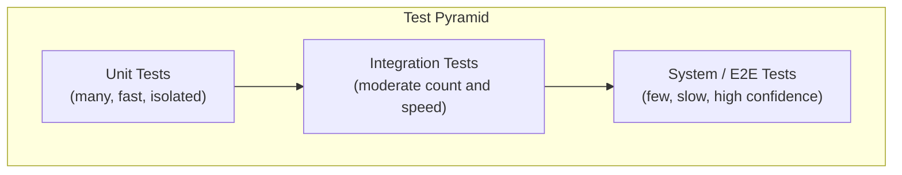
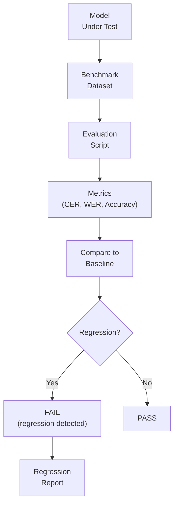
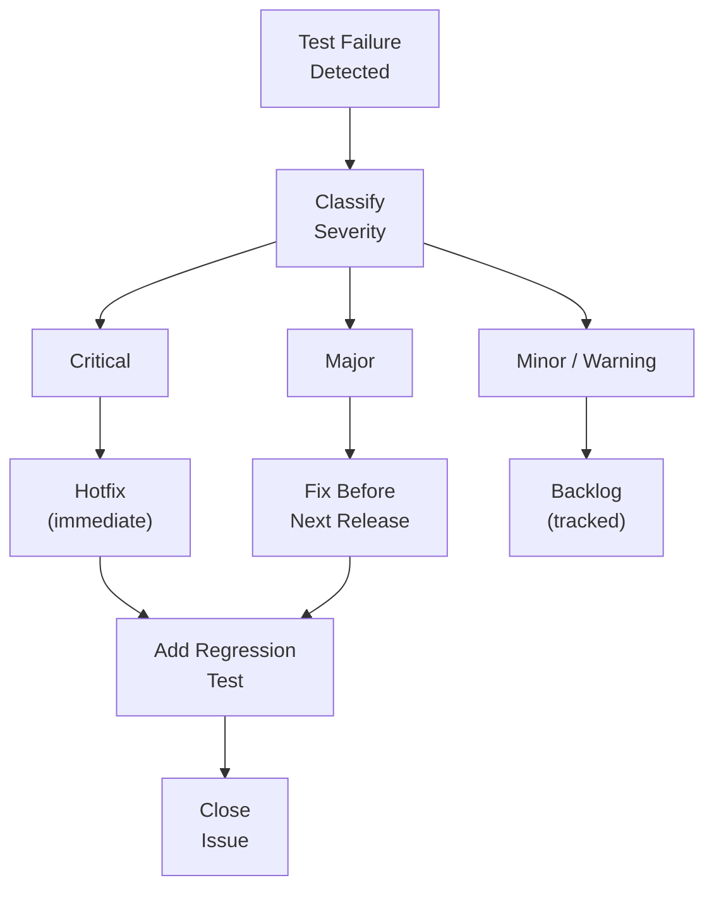
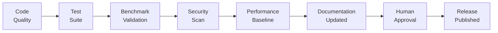

# STD-006 — Testing Standards

> **STD-006 · 2026.07-r1 · Tier 3 — Standards**
>
> The definitive testing standards for the OpenTamilOCR organization.
> Testing is mandatory. Every artifact must be verifiable, measurable, reproducible, and continuously validated.
> Changes require an RFC and maintainer approval.

---

## 1. Purpose

This document defines the engineering standards for validating software, datasets, models, APIs, OCR pipelines, AI workflows, infrastructure, and documentation across the OpenTamilOCR organization.

Testing is not performed to prove that software works.
Testing is performed to **discover defects before users do**.

Quality is not a phase.
Quality is **continuously verified** through automated and human-driven validation at every stage of the development and release lifecycle.

---

## 2. Scope

This standard applies to:

- All source code in every OpenTamilOCR repository.
- All datasets and dataset validation tooling.
- All models and model evaluation pipelines.
- All APIs (public, internal, administrative).
- OCR pipeline components and integrations.
- AI agent workflows and outputs.
- CI/CD pipelines and infrastructure.
- Documentation validation.

This standard does **not** cover:

- Test framework selection or language-specific test libraries (covered in repository-level operational guides).
- Benchmark methodology details (covered in STD-004 — Model Standards, evaluation section).
- Annotation quality review procedures (covered in STD-003 — Dataset Standards).

---

## 3. Testing Philosophy

| # | Principle | Rationale |
|---|-----------|-----------|
| TP1 | **Test Everything.** | Every artifact — code, data, models, APIs, documentation, configuration — has associated validation. Untested artifacts are untrustworthy. |
| TP2 | **Shift Left.** | Find defects as early as possible. A bug found in unit testing costs less than one found in production. |
| TP3 | **Automate Whenever Possible.** | Automated tests run faster, more consistently, and more frequently than manual tests. Automate first; supplement with manual testing where automation is insufficient. |
| TP4 | **Human Review Complements Automation.** | Automation catches known patterns. Human review catches design issues, usability problems, and subtle correctness errors. Both are required. |
| TP5 | **Reproducibility.** | Every test produces the same result given the same inputs and environment. Non-deterministic tests are treated as defects (P6, FND-001). |
| TP6 | **Deterministic Results.** | Tests do not depend on external services, network connectivity, or system clock unless explicitly designed as integration tests. |
| TP7 | **Independent Verification.** | Tests are independent of each other. No test depends on the execution order or result of another test. |
| TP8 | **Regression Prevention.** | Every fixed bug gets a regression test. The same bug must never escape twice. |
| TP9 | **Continuous Validation.** | Tests run on every commit, every PR, and on a scheduled basis. Quality is always current, never stale. |
| TP10 | **Fail Fast.** | When a test fails, it fails immediately with a clear, actionable error message. No silent failures. |
| TP11 | **Evidence-Based Quality.** | Quality claims are backed by metrics: coverage, pass rates, benchmark scores. Assertions without evidence are assumptions. |
| TP12 | **Benchmark-Driven Evaluation.** | OCR quality is measured by standardized benchmarks, not subjective assessment. |
| TP13 | **AI-Assisted Testing.** | AI accelerates test generation, edge case discovery, and failure analysis — but never replaces human judgment on release decisions. |

---

## 4. Test Categories

### 4.1 Category Definitions

| Category | Scope | Speed | When |
|----------|-------|-------|------|
| **Unit** | Single function, class, or module in isolation. | Fast (ms). | Every commit. |
| **Integration** | Interaction between two or more components. | Medium (seconds). | Every PR. |
| **System** | End-to-end workflow through the full system. | Slow (minutes). | Pre-release. |
| **Regression** | Previously fixed defects re-verified. | Fast–Medium. | Every PR. |
| **Smoke** | Critical-path sanity check after deployment. | Fast. | Post-deploy. |
| **Acceptance** | User-facing behavior validated against requirements. | Medium. | Pre-release. |
| **Benchmark** | OCR accuracy measured against standardized datasets. | Slow (minutes–hours). | Pre-release, nightly. |
| **Performance** | Latency, throughput, memory, and resource consumption. | Medium–Slow. | Pre-release, nightly. |
| **Stress** | Behavior under extreme load or resource pressure. | Slow. | Pre-release. |
| **Security** | Vulnerability scanning, secret detection, input validation. | Medium. | Every PR, weekly. |
| **Dataset validation** | Schema, integrity, and quality checks on datasets. | Medium. | Every dataset PR. |
| **Model validation** | Accuracy, bias, reproducibility checks on trained models. | Slow. | Pre-release. |
| **API contract** | API responses match published schema. | Fast–Medium. | Every PR. |
| **Configuration** | Config files validated against schema. | Fast. | Every commit. |

### 4.2 Test Pyramid



**Rules:**

- The majority of tests should be unit tests (fast, isolated, numerous).
- Integration tests verify component boundaries.
- System/E2E tests verify critical user workflows only — not exhaustive.
- The pyramid shape is maintained: more tests at the base, fewer at the top.

---

## 5. Test Organization

### 5.1 Directory Structure

```
{repository}/
├── tests/
│   ├── unit/                  # Unit tests (mirrors src/ structure)
│   │   ├── test_{module}.{ext}
│   │   └── ...
│   ├── integration/           # Integration tests
│   │   └── ...
│   ├── system/                # System / E2E tests
│   │   └── ...
│   ├── benchmark/             # OCR benchmark tests
│   │   └── ...
│   ├── performance/           # Performance tests
│   │   └── ...
│   ├── security/              # Security tests
│   │   └── ...
│   ├── fixtures/              # Shared test fixtures
│   │   ├── images/            # Test images
│   │   ├── annotations/       # Test annotations
│   │   ├── configs/           # Test configurations
│   │   └── golden/            # Golden output references
│   └── conftest.{ext}         # Shared test configuration
```

### 5.2 Naming Conventions

| Element | Convention | Example |
|---------|-----------|---------|
| Test file | `test_{module}.{ext}` | `test_preprocessing.py` |
| Test function | `test_{what}_{condition}_{expected}` | `test_binarize_low_contrast_returns_valid_image` |
| Test class | `Test{Component}` | `TestPreprocessingPipeline` |
| Fixture file | `{purpose}.{ext}` | `sample_annotation.json` |
| Golden file | `golden_{test_name}.{ext}` | `golden_binarize_output.png` |

### 5.3 Test Data Rules

| Rule | Standard |
|------|----------|
| **TD1: Version-controlled.** | Test fixtures are committed to git (if small) or managed by DVC/LFS (if large). |
| **TD2: Minimal.** | Test data is the smallest dataset that exercises the test case. |
| **TD3: Documented.** | Every fixture has a comment or README explaining its purpose. |
| **TD4: Licensed.** | Test images and text respect licensing (FND-004). Prefer synthetic or own-created test data. |
| **TD5: No PII.** | Test data contains no personally identifiable information (FND-003). |
| **TD6: Deterministic.** | Test data generation is reproducible (fixed seeds, documented generation scripts). |

---

## 6. Unit Testing Standards

### 6.1 Unit Test Rules

| Rule | Standard |
|------|----------|
| **UT1: Isolation.** | Unit tests do not access the filesystem, network, database, or external services. Dependencies are mocked or injected. |
| **UT2: Speed.** | Individual unit tests complete in <100ms. Full unit suite completes in <5 minutes. |
| **UT3: Deterministic.** | Same inputs → same result. No random behavior without fixed seeds. |
| **UT4: One assertion per concept.** | Each test validates one behavior. Multiple assertions are acceptable if they validate the same concept. |
| **UT5: Edge cases.** | Unit tests include: empty inputs, boundary values, invalid inputs, Unicode edge cases (Tamil combining characters), and error paths. |
| **UT6: Error paths.** | Error handling is explicitly tested. Verify that correct exceptions are raised with correct messages. |
| **UT7: Readability.** | Tests are documentation. A reader should understand the expected behavior by reading the test, without reading the implementation. |

### 6.2 Tamil-Specific Unit Tests

| Scenario | What to Test |
|----------|-------------|
| **NFC normalization** | Input in NFD → output in NFC. |
| **Combining marks** | Tamil vowel signs correctly combined with consonants. |
| **Grantha characters** | ஜ, ஷ, ஸ, ஹ handled correctly. |
| **Tamil numerals** | ௧–௯, ௰, ௱, ௲ processed without corruption. |
| **Zero-width characters** | ZWJ/ZWNJ preserved where linguistically correct. |
| **Mixed script** | Tamil + English text processed without corruption to either script. |
| **Empty text** | Empty strings and whitespace-only strings handled gracefully. |

---

## 7. Integration Testing Standards

### 7.1 Integration Test Rules

| Rule | Standard |
|------|----------|
| **IT1: Component boundaries.** | Integration tests validate the contract between two or more components. |
| **IT2: Real dependencies.** | Integration tests use real implementations (not mocks) for the components under test. External services may be replaced with test doubles. |
| **IT3: Cleanup.** | Integration tests clean up all created resources (files, database records, processes) after execution. |
| **IT4: Isolation from other tests.** | Integration tests do not depend on shared global state. Each test sets up and tears down its own state. |
| **IT5: Documented prerequisites.** | Any environmental requirement (running service, available GPU, specific dataset) is documented. |

### 7.2 Integration Test Scenarios

| Integration | What to Test |
|-------------|-------------|
| **OCR engine + preprocessing** | Preprocessed images produce expected OCR output. |
| **Pipeline + dataset** | Pipeline correctly loads and processes samples from a dataset. |
| **API + backend service** | API endpoint returns correct response for valid and invalid requests. |
| **Training + dataset** | Training pipeline successfully loads data and completes one training step. |
| **Benchmark + model** | Benchmark suite correctly evaluates a model and produces a valid report. |
| **Converter + annotation** | Engine-specific converter produces valid output from canonical annotations. |

---

## 8. OCR Testing Standards

### 8.1 OCR Metrics

| Metric | Definition | Formula |
|--------|-----------|---------|
| **CER** | Character Error Rate. Edit distance at character level. | `edit_distance(predicted, reference) / len(reference)` |
| **WER** | Word Error Rate. Edit distance at word level. | `edit_distance(predicted_words, reference_words) / len(reference_words)` |
| **Line Accuracy** | % of lines with zero errors. | `correct_lines / total_lines` |
| **Accuracy** | 1 − CER. Character-level accuracy. | `1 - CER` |

### 8.2 OCR Test Requirements



| Requirement | Standard |
|-------------|----------|
| **OT1: Standardized benchmark.** | OCR quality is always measured on the official benchmark dataset (versioned, immutable). |
| **OT2: Baseline comparison.** | Every evaluation compares against the current baseline. Regressions are flagged. |
| **OT3: Per-category results.** | Results are reported per document type (books, newspapers, government) and per quality level (clean, degraded). |
| **OT4: Unicode correctness.** | OCR output is validated for valid UTF-8, NFC normalization, and Tamil Unicode compliance. |
| **OT5: Mixed-language evaluation.** | Tamil-English mixed text is evaluated separately from pure Tamil. |
| **OT6: Confidence calibration.** | If the model produces confidence scores, calibration is measured and reported. |
| **OT7: Reproducibility.** | Same model + same benchmark + same configuration = same metrics (within floating-point tolerance). Random seeds documented. |
| **OT8: Historical tracking.** | Benchmark results are stored historically. Trends are visualized. |

### 8.3 Robustness Testing

| Dimension | What to Test |
|-----------|-------------|
| **Noise** | Performance under Gaussian noise, salt-and-pepper, and compression artifacts. |
| **Resolution** | Performance at 150, 200, 300, and 600 DPI. |
| **Rotation** | Performance with ±1°, ±3°, ±5° skew. |
| **Contrast** | Performance on low-contrast and high-contrast images. |
| **Blur** | Performance under motion blur and defocus blur. |
| **Degradation** | Performance on aged, foxed, and stained paper. |

---

## 9. Dataset Validation Testing

Dataset validation implements the validation pipeline from STD-003, Section 13.

| Test | What Is Validated | Reference |
|------|------------------|-----------|
| **Schema validation** | Annotation files conform to `schema.json`. | STD-003, Section 8 |
| **Unicode validation** | All text is UTF-8, NFC-normalized, valid Tamil. | STD-003, Section 8.2 |
| **Integrity** | Every image opens without error. No truncated files. | STD-003, Section 7.2 |
| **Pairing** | Every image has one annotation. Every annotation has one image. | STD-003, Section 13.2 |
| **Split integrity** | No sample in multiple splits. Splits sum to total. | STD-003, Section 11.2 |
| **Checksum** | File checksums match `manifest.json`. | STD-003, Section 17.2 |
| **Metadata** | All required metadata fields populated. | STD-003, Section 10 |
| **Provenance** | Every source document has a provenance record. | STD-003, Section 10.2 |
| **Duplicates** | No exact-duplicate images (by checksum). | STD-003, Section 12.1 |
| **Dataset card** | `dataset-card.yaml` valid against SCH-003. | STD-003, Section 18 |

---

## 10. Model Validation Testing

| Test | What Is Validated | Timing |
|------|------------------|--------|
| **Inference correctness** | Model produces non-empty, valid UTF-8 output for standard test images. | Every model change. |
| **Accuracy validation** | CER, WER on benchmark dataset meet or exceed baseline. | Pre-release. |
| **Reproducibility** | Same model + same data + same seed = same metrics. | Pre-release. |
| **Bias evaluation** | Performance compared across document types and quality levels. Disparities documented. | Pre-release. |
| **Resource usage** | Memory, inference time, and model size documented and within limits. | Pre-release. |
| **Compatibility** | Model loads and runs on the target engine version. | Every model change. |
| **Model card** | `model-card.yaml` valid against SCH-002. | Pre-release. |

---

## 11. API Testing Standards

### 11.1 API Test Requirements

| Requirement | Standard |
|-------------|----------|
| **AT1: Contract testing.** | Every API endpoint is tested against its OpenAPI specification. |
| **AT2: Status codes.** | Tests verify correct HTTP status codes for success, client error, and server error scenarios. |
| **AT3: Schema validation.** | Response bodies are validated against documented response schemas. |
| **AT4: Authentication.** | Authenticated endpoints reject unauthenticated requests. Public endpoints accept anonymous requests. |
| **AT5: Authorization.** | Endpoints respect role-based access control. Users cannot access resources outside their permissions. |
| **AT6: Rate limiting.** | Rate-limited endpoints correctly enforce limits and return `429 Too Many Requests`. |
| **AT7: Error responses.** | Error responses follow the standard error format (ARCH-006, Section 5.2). |
| **AT8: Version compatibility.** | API tests verify backward compatibility when API versions change. |
| **AT9: Input validation.** | Endpoints reject malformed, oversized, and malicious inputs with appropriate error messages. |

---

## 12. Performance Testing Standards

### 12.1 Performance Test Requirements

| Requirement | Standard |
|-------------|----------|
| **PT1: Baseline established.** | Performance baselines are documented for every critical path. |
| **PT2: Regression detection.** | Performance tests flag regressions exceeding a defined threshold (e.g., >10% latency increase). |
| **PT3: Resource measurement.** | Tests measure CPU, memory, disk I/O, and GPU utilization. |
| **PT4: Reproducible environment.** | Performance tests run on consistent hardware or document the hardware used. |
| **PT5: Batch efficiency.** | Batch processing throughput is measured and optimized. |

### 12.2 Performance Benchmarks

| Dimension | Metric | Measurement Method |
|-----------|--------|-------------------|
| **Inference latency** | Time per image (ms). | Average over ≥100 images. |
| **Throughput** | Images per second. | Sustained over ≥60 seconds. |
| **Memory** | Peak RSS during inference. | Measured by profiler. |
| **Startup time** | Time from process start to first inference. | Average over ≥5 runs. |
| **Model loading** | Time to load model into memory. | Average over ≥5 runs. |

---

## 13. Security Testing Standards

### 13.1 Security Test Requirements

| Requirement | Standard |
|-------------|----------|
| **ST1: Dependency scanning.** | All dependencies scanned for known vulnerabilities on every PR and weekly on `main`. |
| **ST2: Secret detection.** | Pre-commit hooks and CI scan for accidentally committed secrets (API keys, passwords, tokens). |
| **ST3: Input validation.** | Fuzz testing or boundary testing on all user-facing inputs (image uploads, text inputs, API parameters). |
| **ST4: Output sanitization.** | Outputs that are rendered in web contexts are sanitized to prevent XSS. |
| **ST5: Configuration validation.** | Configuration files validated against schema. No default credentials. |
| **ST6: License scanning.** | All dependencies checked for license compatibility (FND-004, Section 9). |
| **ST7: Container scanning.** | Container images scanned for vulnerabilities before deployment. |

---

## 14. AI-Assisted Testing

### 14.1 Permitted AI Activities

| Activity | AI Role | Human Role |
|----------|---------|------------|
| **Test generation** | AI generates test cases from specifications or code. | Human reviews for correctness and completeness. |
| **Edge case discovery** | AI identifies inputs that may cause failures. | Human evaluates relevance and adds to test suite. |
| **Regression analysis** | AI analyzes test failures and suggests root causes. | Human verifies diagnosis and fixes. |
| **Coverage analysis** | AI identifies untested code paths and suggests tests. | Human prioritizes and implements. |
| **Flaky test detection** | AI identifies tests with non-deterministic behavior. | Human investigates and fixes. |
| **Failure explanation** | AI explains complex test failures in natural language. | Human validates explanation. |

### 14.2 Prohibited AI Activities

| Activity | Reason |
|----------|--------|
| **Approving releases based on test results.** | Release decisions require human judgment. |
| **Modifying test expectations to match failing output.** | Tests define correctness. Changing expectations to match broken output masks defects. |
| **Disabling or skipping tests.** | Test disabling requires human decision with documented justification. |
| **Marking flaky tests as passing.** | Flaky tests are fixed, not suppressed. |

---

## 15. Test Data Standards

### 15.1 Golden Samples

| Rule | Standard |
|------|----------|
| **GS1: Curated.** | Golden samples are manually verified, representative test inputs. |
| **GS2: Versioned.** | Golden samples are version-controlled alongside tests. |
| **GS3: Minimal.** | Golden datasets are small (10–100 samples) and focused. |
| **GS4: Diverse.** | Golden samples cover key categories: clean text, degraded text, mixed language, special characters, edge cases. |
| **GS5: Licensed.** | All golden samples are properly licensed (FND-004). |

### 15.2 Synthetic Test Data

| Rule | Standard |
|------|----------|
| **SY1: Reproducible generation.** | Generated by scripts with fixed seeds. Scripts committed to `tests/fixtures/`. |
| **SY2: Realistic.** | Synthetic data should exercise realistic scenarios, not random noise. |
| **SY3: Documented.** | Generation method and parameters documented. |

---

## 16. Coverage Standards

### 16.1 Coverage Requirements

| Repository Category | Unit Coverage | Integration Coverage | Benchmark Coverage |
|--------------------|--------------|---------------------|-------------------|
| **Engine** (`tamilocr-core`) | ≥80% line | ≥60% critical paths | All benchmark datasets |
| **Data** (`tamilocr-datasets`) | ≥70% (validation scripts) | ≥70% (converters) | — |
| **Platform** (`tamilocr-backend`) | ≥80% line | ≥70% API endpoints | — |
| **Scripts** (`tamilocr-os/scripts/`) | ≥60% line | — | — |
| **Training** (`tamilocr-training`) | ≥70% line | ≥60% training workflow | Training on golden dataset |

### 16.2 Coverage Rules

| Rule | Standard |
|------|----------|
| **CV1: Measured in CI.** | Coverage is measured on every PR and reported. |
| **CV2: No regressions.** | Coverage cannot decrease on a PR without documented justification. |
| **CV3: Critical path priority.** | 100% coverage is required for security-critical, data-integrity, and Unicode-handling code paths. |
| **CV4: Test quality over quantity.** | Coverage percentage is a minimum bar, not a goal. A test that exercises a code path without meaningful assertions provides false confidence. |

---

## 17. CI/CD Integration

### 17.1 CI Pipeline

```mermaid
graph LR
    subgraph COMMIT["Pre-Commit"]
        PC1["Format"]
        PC2["Lint"]
        PC3["Secret Scan"]
    end

    subgraph PR["Pull Request"]
        PR1["Unit Tests"]
        PR2["Integration Tests"]
        PR3["Security Scan"]
        PR4["License Scan"]
        PR5["Coverage Report"]
    end

    subgraph NIGHTLY["Nightly"]
        N1["Full Test Suite"]
        N2["Performance Tests"]
        N3["Benchmark Tests"]
        N4["Dependency Scan"]
    end

    subgraph RELEASE["Release"]
        R1["All Nightly Tests"]
        R2["System / E2E Tests"]
        R3["Stress Tests"]
        R4["Model Validation"]
        R5["Dataset Validation"]
    end

    COMMIT --> PR --> NIGHTLY --> RELEASE
```



### 17.2 CI Rules

| Rule | Standard |
|------|----------|
| **CI1: PR blocking.** | Unit tests, integration tests, and security scans must pass before a PR can be merged. |
| **CI2: Nightly runs.** | Full test suite including performance and benchmark tests runs nightly on `main`. |
| **CI3: Release validation.** | Pre-release validation runs the complete test suite including system tests, stress tests, and model validation. |
| **CI4: Failure notification.** | Test failures on `main` trigger immediate notification to maintainers. |
| **CI5: Test timeout.** | Every test has a defined timeout. Hanging tests fail after the timeout. |
| **CI6: Artifact retention.** | Test logs, coverage reports, and benchmark results are retained for ≥90 days. |

---

## 18. Failure Classification

### 18.1 Severity Levels

| Severity | Definition | Response | Release Blocking |
|----------|-----------|----------|-----------------|
| **Critical** | Data loss, security vulnerability, OCR corruption, or system crash. | Fix immediately. Patch release. | Yes — blocks all releases. |
| **Major** | Significant functionality broken, accuracy regression, or API contract violation. | Fix before next release. | Yes — blocks the affected release. |
| **Minor** | Non-critical bug, cosmetic issue, or edge case failure. | Fix within 2 release cycles. | No. |
| **Warning** | Non-blocking diagnostic. Potential issue that may become a defect. | Investigate. Track in issue. | No. |
| **Informational** | Observation. No action required. | Log for future reference. | No. |

### 18.2 Failure Response



---

## 19. Quality Gates

### 19.1 Gate Matrix

| Artifact | Unit | Integration | Benchmark | Security | Coverage | Human Review | Documentation |
|----------|------|-------------|-----------|----------|----------|-------------|---------------|
| **Source code** | ✓ | ✓ | — | ✓ | ✓ | ✓ | ✓ |
| **OCR model** | ✓ | ✓ | ✓ | ✓ | — | ✓ | ✓ (model card) |
| **Dataset** | ✓ (validation) | ✓ (converters) | ✓ | ✓ (PII scan) | — | ✓ | ✓ (dataset card) |
| **API** | ✓ | ✓ (contract) | — | ✓ | ✓ | ✓ | ✓ (OpenAPI) |
| **Documentation** | — | — | — | — | — | ✓ | ✓ (metadata, refs) |
| **AI output** | — | — | — | — | — | ✓ | ✓ (validation) |
| **Configuration** | ✓ (schema) | — | — | ✓ (secrets) | — | ✓ | — |

### 19.2 Release Quality Gate

Before any release (GOV-004):



- All automated tests pass.
- No critical or major open defects.
- Benchmark results meet or exceed baseline.
- Security scan reports no critical vulnerabilities.
- Performance meets documented baselines.
- Documentation is updated for all user-facing changes.
- At least one maintainer approves.

---

## 20. Future Evolution

Testing standards evolve through the RFC process (GOV-003):

1. A contributor identifies a gap in testing coverage or a new testing requirement.
2. An RFC is filed with the proposed change, rationale, and impact analysis.
3. The RFC is reviewed and decided.
4. If approved, STD-006 is updated.
5. Existing tests are updated during regular maintenance cycles.
6. A DEC record captures the decision.

**Backward compatibility:** New testing requirements do not retroactively fail previously passing code. Existing code is updated to new standards during regular maintenance cycles.

---

## 21. Governance Relationship

| Document | Relationship |
|----------|-------------|
| FND-001 — Project Charter | Parent. Principle P6 (Reproducibility) mandates testable, verifiable systems. |
| ARCH-001 — System Architecture | Required. AP9 (Modularity) enables testable components. |
| ARCH-002 — Repository Architecture | Required. Repository structure defines test directory layout. |
| STD-002 — Coding Standards | Required. EP9 (Testability) and quality gate rules are implemented here. |
| ARCH-004 — OCR Pipeline Architecture | Sibling. Pipeline testing implements OCR testing standards. |
| ARCH-005 — Data Architecture | Sibling. Dataset validation implements data testing standards. |
| ARCH-006 — Platform Architecture | Sibling. API testing implements platform testing standards. |
| ARCH-007 — AI Workflow Architecture | Sibling. AI agent validation implements AI testing standards. |
| STD-003 — Dataset Standards | Sibling. Dataset validation testing references STD-003. |
| GOV-003 — Decision Process | Reference. Testing standards evolve through RFC. |
| GOV-004 — Release Governance | Reference. Release quality gates include testing gates. |
| STD-001 — Documentation Standards | Sibling. Documentation validation is part of quality gates. |

---

## 22. Related Documents

| Document | Relationship |
|----------|-------------|
| SYS-000 — Master Index | Root. |
| ARCH-001 — System Architecture | Required. Modularity. |
| ARCH-002 — Repository Architecture | Required. Test directory structure. |
| STD-002 — Coding Standards | Required. Testability principles. |
| FND-001 — Project Charter | Required. Reproducibility. |
| FND-003 — Ethics Framework | Reference. Test data privacy. |
| ARCH-004 — OCR Pipeline Architecture | Reference. OCR testing. |
| ARCH-005 — Data Architecture | Reference. Dataset testing. |
| ARCH-006 — Platform Architecture | Reference. API testing. |
| ARCH-007 — AI Workflow Architecture | Reference. AI testing. |
| STD-003 — Dataset Standards | Sibling. Dataset validation. |
| GOV-004 — Release Governance | Reference. Release gates. |

---

## 23. Review Policy

- **Review frequency:** Every 6 months during the Standards Review Cycle, or when new test categories, tools, or coverage requirements are proposed.
- **Amendment process:** RFC → DEC → Maintainer + SC member approval.
- **Trigger for review:** New repository added, new test category needed, significant CI/CD changes, community feedback on testing practices.

---

## 24. Document History

| Version | Date | Summary |
|---------|------|---------|
| 2026.07-r1 | 2026-07-17 | Initial draft. Founding testing standards for the OpenTamilOCR organization. |

---

> **Approved by:** Pending Steering Council approval.
> **Effective date:** Upon approval.
