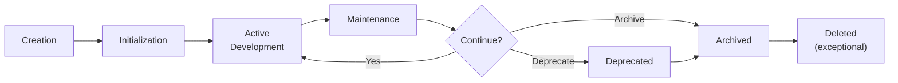
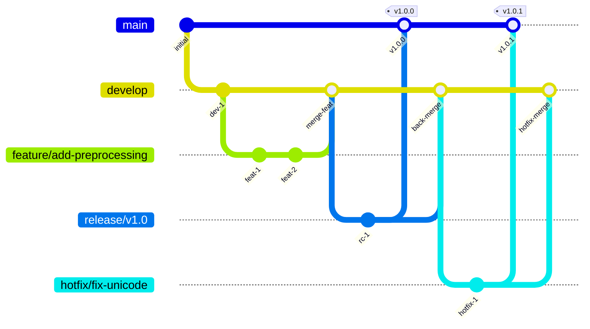
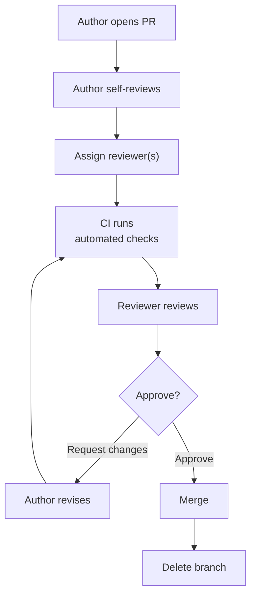
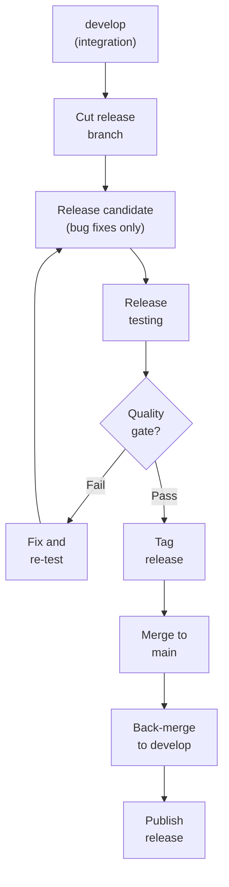
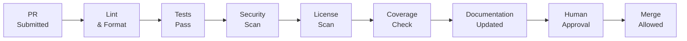

# STD-007 — Git, Commit & Review Standards

> **STD-007 · 2026.07-r1 · Tier 3 — Standards**
>
> The definitive version control and collaboration standard for the OpenTamilOCR organization.
> Git history is institutional knowledge. Every commit must be meaningful, traceable, and reviewable.
> Changes require an RFC and maintainer approval.

---

## 1. Purpose

This document establishes the mandatory engineering practices for version control across every OpenTamilOCR repository.

Git history is not merely source control.
It is **institutional knowledge**.

Every commit should help future contributors understand what changed, why it changed, who approved it, and what decision it implements.

---

## 2. Scope

This standard applies to:

- All repositories in the OpenTamilOCR organization.
- All contributors (human and AI-assisted).
- All branches, commits, pull requests, merges, tags, and releases.

This standard does **not** cover:

- CI/CD pipeline implementation details (covered in repository-level operational guides).
- Release governance procedures (covered in GOV-004).
- Testing requirements (covered in STD-006).

---

## 3. Version Control Philosophy

| # | Principle | Rationale |
|---|-----------|-----------|
| VC1 | **History is Documentation.** | Commit history tells the story of the project. Well-written history is as valuable as well-written code. |
| VC2 | **Small Atomic Commits.** | Each commit represents one logical change. Small commits are easier to review, revert, and bisect. |
| VC3 | **Review Before Merge.** | No change reaches a protected branch without human review. Reviews catch defects, enforce standards, and share knowledge. |
| VC4 | **Protected Main Branch.** | The `main` branch always represents a releasable state. Direct pushes to `main` are forbidden. |
| VC5 | **Reproducibility.** | Any past state of any repository can be exactly reproduced from a commit hash or release tag (P6, FND-001). |
| VC6 | **Traceability.** | Every change traces to an issue, RFC, or decision record. Unlinked changes are orphaned knowledge. |
| VC7 | **Transparency.** | All development happens in the open. Force pushes to shared branches are forbidden. History is not rewritten after sharing. |
| VC8 | **Auditability.** | Who changed what, when, and why — is always answerable from the git log. |
| VC9 | **Collaboration First.** | Git workflows are designed for teams, not individuals. Conventions reduce friction between contributors. |
| VC10 | **Documentation-Driven Development.** | Documentation changes accompany code changes in the same PR. Code without documentation is incomplete. |
| VC11 | **Quality Before Merge.** | All quality gates (tests, lint, security) pass before merge. Broken `main` is never acceptable. |
| VC12 | **Automation First.** | Formatting, linting, testing, and validation are automated. Humans focus on design and correctness. |

---

## 4. Repository Workflow

### 4.1 Repository Lifecycle



### 4.2 Repository Initialization

Every new repository must be initialized with:

| File | Requirement | Reference |
|------|-------------|-----------|
| `README.md` | Repository description, status, quick start, documentation link. | ARCH-002, Section 6.1 |
| `LICENSE` | Apache-2.0 (code) or CC-BY-4.0 (data/docs). | FND-004 |
| `CHANGELOG.md` | Keep a Changelog format. Empty initial entry. | STD-001, Section 15 |
| `CONTRIBUTING.md` | Contribution guide referencing organizational standards. | FND-002 |
| `CODE_OF_CONDUCT.md` | Reference to FND-002. | FND-002 |
| `SECURITY.md` | Security vulnerability reporting policy. | ARCH-002, Section 6.3 |
| `.gitignore` | Repository-specific ignore rules (Section 13). | — |
| `.agents/AGENTS.md` | AI agent configuration for this repository. | ARCH-007, Section 10.2 |

### 4.3 Repository Protection

| Rule | Standard |
|------|----------|
| **RP1: Branch protection on `main`.** | Direct pushes forbidden. All changes via PR. |
| **RP2: Required reviews.** | Minimum 1 approved review before merge. 2 reviews for Tier 0–2 documents. |
| **RP3: Required status checks.** | CI must pass (lint, test, security scan) before merge is allowed. |
| **RP4: No force push on shared branches.** | Force push to `main` and `develop` is forbidden. |
| **RP5: Delete after merge.** | Feature branches are deleted after their PR is merged. |
| **RP6: Linear history preferred.** | Where supported, require linear history on `main`. |

---

## 5. Branching Strategy

### 5.1 Branch Model



### 5.2 Branch Definitions

| Branch | Purpose | Source | Target | Lifetime | Protection |
|--------|---------|--------|--------|----------|------------|
| `main` | Production-ready code. Every commit is releasable. | — | — | Permanent | Full (no direct push). |
| `develop` | Integration branch. Next release candidate. | `main` | `main` (via release) | Permanent | Protected (PR required). |
| `feature/{name}` | New feature development. | `develop` | `develop` | Short (≤2 weeks). | None. |
| `bugfix/{name}` | Non-critical bug fix. | `develop` | `develop` | Short (≤1 week). | None. |
| `hotfix/{name}` | Critical production fix. | `main` | `main` + `develop` | Very short (≤3 days). | None. |
| `release/{version}` | Release stabilization. Only bug fixes, no new features. | `develop` | `main` + `develop` | Short (≤1 week). | Protected during stabilization. |
| `experiment/{name}` | Research and experimentation. Relaxed standards. | `develop` | `develop` (if promoted) | Variable. | None. |
| `research/{name}` | Long-running research. | `develop` | `develop` (if promoted) | Variable (≤3 months). | None. |
| `docs/{name}` | Documentation-only changes. | `develop` | `develop` | Short (≤1 week). | None. |

### 5.3 Branch Rules

| Rule | Standard |
|------|----------|
| **BR1: Descriptive names.** | Branch names describe the change: `feature/add-binarization-plugin`, not `feature/fix`. |
| **BR2: Lowercase with hyphens.** | Branch names use `lowercase-with-hyphens`. No underscores, no camelCase. |
| **BR3: Issue reference.** | Include issue number where applicable: `feature/42-add-preprocessing`. |
| **BR4: Short-lived.** | Feature and bugfix branches should be merged within 2 weeks. Stale branches are flagged. |
| **BR5: Delete after merge.** | Merged branches are deleted immediately. Git preserves the history in the merge commit. |
| **BR6: No long-lived feature branches.** | If a feature takes >2 weeks, break it into smaller increments that can be merged independently. |

---

## 6. Commit Standards

### 6.1 Commit Message Format

OpenTamilOCR uses **Conventional Commits** (v1.0.0):

```
<type>(<scope>): <description>

[optional body]

[optional footer(s)]
```

### 6.2 Commit Types

| Type | Purpose | Example |
|------|---------|---------|
| `feat` | New feature. | `feat(pipeline): add binarization plugin support` |
| `fix` | Bug fix. | `fix(unicode): correct NFC normalization for grantha chars` |
| `docs` | Documentation change. | `docs(arch): add ARCH-005 Data Architecture` |
| `style` | Formatting, whitespace (no logic change). | `style(core): apply formatter to preprocessing module` |
| `refactor` | Code change that neither fixes a bug nor adds a feature. | `refactor(engine): extract adapter interface` |
| `perf` | Performance improvement. | `perf(inference): batch image preprocessing` |
| `test` | Adding or fixing tests. | `test(pipeline): add binarization edge case tests` |
| `build` | Build system or dependency change. | `build: update dependencies to latest versions` |
| `ci` | CI configuration change. | `ci: add security scan to PR pipeline` |
| `chore` | Maintenance task. | `chore: update .gitignore for generated files` |
| `revert` | Revert a previous commit. | `revert: revert "feat(pipeline): add beta plugin"` |

### 6.3 Commit Message Rules

| Rule | Standard |
|------|----------|
| **CM1: Imperative mood.** | "Add feature" not "Added feature" or "Adds feature." |
| **CM2: Lowercase first word.** | `feat(scope): add preprocessing` not `feat(scope): Add preprocessing`. |
| **CM3: No period at end.** | Description does not end with a period. |
| **CM4: ≤72 characters.** | Subject line ≤72 characters. Wrap body at 72 characters. |
| **CM5: Blank line.** | Blank line between subject and body. |
| **CM6: Body explains why.** | The subject says what. The body explains why and how. |
| **CM7: Reference issues.** | Include issue references: `Closes #42`, `Fixes #87`, `Refs #123`. |
| **CM8: Reference decisions.** | Include decision references when applicable: `Implements DEC-002`. |

### 6.4 Commit Message Examples

**Good:**

```
feat(annotation): add polygon bounding box support

Adds polygon bounding box type to the canonical annotation format.
This supports irregular text regions in historical documents where
axis-aligned boxes are insufficient.

Implements DEC-002.
Refs ARCH-005, Section 6.3.
Closes #156.
```

```
fix(unicode): handle Tamil combining marks in NFC normalization

The previous implementation split multi-codepoint grapheme clusters
when normalizing to NFC. This caused data corruption for Tamil text
containing vowel signs.

Fixes #203.
```

**Bad:**

```
fixed stuff                          # Vague. No type. No scope.
update files                         # What files? Why?
WIP                                  # Not a meaningful commit.
feat: Added the new feature.         # Past tense. Period. No scope.
```

### 6.5 Commit Trailers

| Trailer | Purpose | Example |
|---------|---------|---------|
| `Signed-off-by` | Developer Certificate of Origin. | `Signed-off-by: Name <email>` |
| `Reviewed-by` | Reviewer attribution. | `Reviewed-by: Name <email>` |
| `Co-authored-by` | Multiple authors. | `Co-authored-by: Name <email>` |
| `Refs` | Reference to related issue, RFC, or DEC. | `Refs: #42, RFC-003` |
| `BREAKING CHANGE` | Breaking change description. | `BREAKING CHANGE: annotation schema v2 is incompatible with v1` |

### 6.6 Atomic Commits

| Rule | Standard |
|------|----------|
| **AC1: One logical change.** | Each commit represents exactly one logical change. Do not mix refactoring with feature work. |
| **AC2: Compilable.** | Every commit results in a buildable, testable state. No commit should break the build. |
| **AC3: Reviewable.** | Each commit should be independently reviewable. |
| **AC4: Revertible.** | Each commit can be reverted without creating inconsistencies. |

---

## 7. Pull Request Standards

### 7.1 PR Template

Every PR must include:

```markdown
## Summary
Brief description of what this PR does and why.

## Changes
- List of specific changes made.

## Related
- Issue: #NNN
- RFC: RFC-NNN (if applicable)
- Decision: DEC-NNN (if applicable)

## Testing
- [ ] Unit tests added/updated
- [ ] Integration tests added/updated (if applicable)
- [ ] All existing tests pass

## Documentation
- [ ] Documentation updated (if user-facing change)
- [ ] CHANGELOG updated (if applicable)

## Checklist
- [ ] Follows coding standards (STD-002)
- [ ] Follows commit standards (STD-007)
- [ ] No secrets or credentials
- [ ] License-compatible dependencies
```

### 7.2 PR Rules

| Rule | Standard |
|------|----------|
| **PR1: Small PRs.** | PRs should be ≤400 lines of meaningful changes. Larger PRs are split into smaller, independent PRs. |
| **PR2: Single purpose.** | Each PR addresses one issue, one feature, or one bug. |
| **PR3: Descriptive title.** | PR title follows commit message format: `feat(scope): description`. |
| **PR4: Linked issue.** | Every PR links to an issue (except trivial fixes). |
| **PR5: Draft for WIP.** | Work-in-progress PRs are marked as Draft. Draft PRs are not reviewed. |
| **PR6: Tests pass.** | All CI checks pass before requesting review. |
| **PR7: Self-review first.** | Author reviews their own diff before requesting peer review. |
| **PR8: No merge commits in PR.** | PRs should not contain merge commits. Rebase on target branch instead. |

### 7.3 PR Size Guidelines

| Size | Lines Changed | Review Time | Risk |
|------|--------------|-------------|------|
| **Small** | ≤100 | 15–30 min | Low |
| **Medium** | 101–400 | 30–60 min | Medium |
| **Large** | 401–1000 | 1–2 hours | High (split if possible) |
| **Very Large** | >1000 | Unacceptable | Must be split. |

---

## 8. Code Review Standards

### 8.1 Review Workflow



### 8.2 Reviewer Responsibilities

| Responsibility | Description |
|---------------|-------------|
| **Correctness** | Verify the change does what it claims to do. |
| **Standards compliance** | Verify adherence to coding (STD-002), documentation (STD-001), and testing (STD-006) standards. |
| **Architecture alignment** | Verify the change does not violate architectural boundaries (ARCH-001, ARCH-002). |
| **Security** | Check for secrets, injection risks, and unsafe operations. |
| **Test coverage** | Verify that tests are adequate for the change. |
| **Documentation** | Verify documentation is updated if the change is user-facing. |
| **Readability** | Verify the code is clear and maintainable. |

### 8.3 Author Responsibilities

| Responsibility | Description |
|---------------|-------------|
| **Self-review** | Review your own diff before requesting review. |
| **Respond to all comments** | Address every comment with a code change or an explanation. |
| **Keep PR updated** | Rebase on the target branch if it has diverged. |
| **Be receptive** | Accept feedback constructively. |
| **Explain context** | Provide sufficient context for reviewers who may not know the area. |

### 8.4 Review Etiquette

| Guideline | Standard |
|-----------|----------|
| **Constructive** | Comments are constructive, specific, and actionable. Follow FND-002. |
| **Questions vs directives** | Distinguish between "Have you considered X?" (question) and "This must use X" (directive). |
| **Prefix comments** | Use prefixes: `nit:` (nitpick, non-blocking), `question:` (seeking understanding), `blocking:` (must fix). |
| **Praise good work** | Acknowledge well-written code and thoughtful design. |
| **Timely** | Complete reviews within 48 hours for normal PRs, 24 hours for security patches. |

### 8.5 Approval Requirements

| Change Type | Minimum Approvals |
|------------|------------------|
| Normal code change | 1 maintainer |
| Architecture document (Tier 0–2) | 2 maintainers or 1 SC member |
| Security-sensitive change | 1 maintainer with security context |
| Dependency update | 1 maintainer (license review required) |
| Breaking change | 2 maintainers + documented RFC/DEC |

---

## 9. Merge Strategy

### 9.1 Merge Methods

| Method | When to Use | Effect |
|--------|------------|--------|
| **Squash merge** | Feature and bugfix branches into `develop`. Default for most PRs. | Combines all PR commits into a single commit. Clean history. |
| **Merge commit** | Release branches into `main`. Hotfix into `main` + `develop`. | Preserves the merge point. Clear release boundary. |
| **Rebase merge** | Small, already-clean PRs where individual commits are meaningful. | Applies commits linearly. No merge commit. |

### 9.2 Merge Rules

| Rule | Standard |
|------|----------|
| **MR1: Never merge failing CI.** | All status checks must pass before merge. |
| **MR2: Never merge without approval.** | All required reviews must be completed. |
| **MR3: Resolve all blocking comments.** | No unresolved `blocking:` comments at merge time. |
| **MR4: Squash message quality.** | The squash commit message follows Conventional Commits format with a clear summary. |
| **MR5: No merge of merge commits.** | PRs should not contain internal merge commits. Rebase before merging. |

### 9.3 Conflict Resolution

| Rule | Standard |
|------|----------|
| **CR1: Author resolves.** | The PR author is responsible for resolving merge conflicts. |
| **CR2: Rebase, don't merge.** | Resolve conflicts by rebasing on the target branch, not by merging the target into the feature branch. |
| **CR3: Re-review after conflict resolution.** | If conflict resolution changes significant logic, request re-review. |

---

## 10. Release Workflow

### 10.1 Release Process



### 10.2 Release Rules

Release workflow implements GOV-004 (Release Governance):

| Rule | Standard |
|------|----------|
| **RL1: Release branch from `develop`.** | Release branches are created from `develop` when the release scope is feature-complete. |
| **RL2: Only bug fixes on release branch.** | No new features on release branches. Only bug fixes and documentation updates. |
| **RL3: Tag on `main`.** | Version tags are created on `main` after the release branch merges. |
| **RL4: Back-merge.** | After merging to `main`, the release branch is back-merged to `develop` to incorporate fixes. |
| **RL5: Delete release branch.** | Release branches are deleted after merging. |

---

## 11. Tagging Standards

### 11.1 Tag Format

| Artifact | Format | Example |
|----------|--------|---------|
| Software release | `v{MAJOR}.{MINOR}.{PATCH}` | `v1.2.0` |
| Pre-release | `v{MAJOR}.{MINOR}.{PATCH}-{prerelease}` | `v1.2.0-rc.1` |
| TamilOCR OS milestone | `v{N}.{N}.{N}` | `v0.2.0` |

### 11.2 Tag Rules

| Rule | Standard |
|------|----------|
| **TG1: Annotated tags.** | All release tags are annotated (`git tag -a`), not lightweight. |
| **TG2: Signed tags.** | Release tags are signed where GPG keys are available. |
| **TG3: Tag message.** | Tag message summarizes the release: version, date, key changes. |
| **TG4: Never move tags.** | Published tags are never deleted or moved. If a tag is wrong, create a new version. |
| **TG5: SemVer compliance.** | Software versions follow Semantic Versioning 2.0.0. |

---

## 12. Changelog Standards

### 12.1 Changelog Format

Every repository maintains a `CHANGELOG.md` in Keep a Changelog format:

```markdown
# Changelog

All notable changes to this project are documented in this file.

## [Unreleased]

### Added
- New features.

### Changed
- Changes to existing functionality.

### Deprecated
- Features that will be removed in future versions.

### Removed
- Removed features.

### Fixed
- Bug fixes.

### Security
- Security-related changes.

## [1.0.0] - 2026-10-01

### Added
- Initial release.
```

### 12.2 Changelog Rules

| Rule | Standard |
|------|----------|
| **CL1: Updated with every PR.** | User-facing changes update `CHANGELOG.md` under `[Unreleased]`. |
| **CL2: Human-readable.** | Changelog entries are written for users, not developers. Focus on impact, not implementation. |
| **CL3: Categorized.** | Changes are categorized as Added, Changed, Deprecated, Removed, Fixed, or Security. |
| **CL4: Release sections frozen.** | Published release sections are never modified. Corrections go in the next version. |

---

## 13. Git Ignore Standards

### 13.1 Required Ignores

Every `.gitignore` must exclude:

| Category | Examples |
|----------|---------|
| **Secrets** | `.env`, `*.key`, `*.pem`, `credentials.yaml` |
| **Virtual environments** | `venv/`, `.venv/`, `node_modules/` |
| **Build artifacts** | `dist/`, `build/`, `*.egg-info/`, `__pycache__/` |
| **IDE files** | `.vscode/settings.json`, `.idea/`, `*.swp` |
| **OS files** | `.DS_Store`, `Thumbs.db` |
| **Generated files** | `*.pyc`, `*.pyo`, `coverage.xml`, `*.log` |
| **Temporary files** | `tmp/`, `*.tmp`, `*.bak` |
| **Large data files** | `*.zip`, `*.tar.gz` (unless managed by LFS) |
| **Caches** | `.cache/`, `.pytest_cache/`, `.mypy_cache/` |

### 13.2 Gitignore Rules

| Rule | Standard |
|------|----------|
| **GI1: Per-repository.** | Each repository has its own `.gitignore` tailored to its tech stack. |
| **GI2: No committed secrets.** | Secrets patterns are always in `.gitignore`. Pre-commit hooks enforce secret detection. |
| **GI3: No large binaries.** | Binary files >1 MB use Git LFS, not regular git. |

---

## 14. Security Standards

### 14.1 Git Security Rules

| Rule | Standard |
|------|----------|
| **GS1: No secrets in history.** | If a secret is accidentally committed, it is revoked immediately and the secret is rotated. History rewriting is a last resort. |
| **GS2: Pre-commit secret scanning.** | Pre-commit hooks scan for common secret patterns before commits are created. |
| **GS3: Signed commits.** | Commits are signed with GPG or SSH keys where available. Required for release commits. |
| **GS4: No force push on shared branches.** | Force push to `main` and `develop` is technically blocked via branch protection. |
| **GS5: Repository access control.** | Repository permissions follow the principle of least privilege (GOV-001). |
| **GS6: Security advisory.** | Security vulnerabilities are reported privately via `SECURITY.md`, not via public issues. |

---

## 15. Large File Standards

### 15.1 Large File Strategy

| File Type | Strategy | Threshold |
|-----------|----------|-----------|
| **Source code** | Regular git. | — |
| **Documentation** | Regular git. | — |
| **Images (small)** | Regular git. | <1 MB per file |
| **Images (large)** | Git LFS or DVC. | ≥1 MB per file |
| **Dataset images** | DVC (managed in `tamilocr-datasets`). | Any size |
| **Model weights** | DVC or external storage. | Any size |
| **Binary assets** | Git LFS. | ≥1 MB per file |

### 15.2 Large File Rules

| Rule | Standard |
|------|----------|
| **LF1: No large binaries in git.** | Files >1 MB must use LFS or DVC. Regular git stores pointers only. |
| **LF2: Dataset images via DVC.** | Dataset images are managed by DVC, not committed directly (ARCH-005, Section 10). |
| **LF3: Model weights via DVC/registry.** | Model weights are stored in the model registry or DVC, not in git. |
| **LF4: Repository size limit.** | Bare repository size (excluding LFS/DVC) should stay under 500 MB. |
| **LF5: LFS tracked in `.gitattributes`.** | LFS-tracked file patterns are declared in `.gitattributes`. |

---

## 16. Documentation Requirements

Every repository must include the following documentation files (STD-001, ARCH-002):

| File | Purpose | Standard |
|------|---------|----------|
| `README.md` | Repository introduction, status badge, quick start, links to docs. | ARCH-002, Section 6.1 |
| `LICENSE` | Project license. Apache-2.0 (code) or CC-BY-4.0 (data/docs). | FND-004 |
| `CHANGELOG.md` | Version history in Keep a Changelog format. | Section 12 |
| `CONTRIBUTING.md` | How to contribute. References organizational standards. | FND-002 |
| `CODE_OF_CONDUCT.md` | Community conduct. References FND-002. | FND-002 |
| `SECURITY.md` | Vulnerability reporting policy. | ARCH-002, Section 6.3 |

---

## 17. AI-Assisted Git Workflow

### 17.1 Permitted AI Activities

| Activity | AI Role | Human Role |
|----------|---------|------------|
| **Commit message drafting** | AI suggests commit messages from diffs. | Human reviews, edits, and commits. |
| **PR description generation** | AI summarizes changes for the PR description. | Human reviews for accuracy. |
| **Diff explanation** | AI explains complex diffs in natural language. | Human uses for understanding. |
| **Conflict analysis** | AI analyzes merge conflicts and suggests resolutions. | Human decides resolution. |
| **Regression identification** | AI analyzes test failures and identifies likely causing commits. | Human verifies and fixes. |
| **Review assistance** | AI generates initial review comments (standards compliance, common issues). | Human reviews and adds judgment. |

### 17.2 Prohibited AI Activities

| Activity | Reason |
|----------|--------|
| **Approving PRs.** | Merge approval is a human responsibility. |
| **Merging PRs.** | Merge action is a human decision. |
| **Force-pushing.** | History modification is a human decision. |
| **Rewriting published history.** | Published history is permanent. |
| **Bypassing CI.** | Quality gates are non-negotiable. |
| **Creating release tags.** | Releases are governed by GOV-004 and require human sign-off. |

---

## 18. Quality Gates

### 18.1 Pre-Merge Gate



| Check | Requirement | Blocking |
|-------|-------------|----------|
| **Lint & format** | Code passes linter with zero warnings. | Yes |
| **Tests pass** | All unit and integration tests pass. | Yes |
| **Security scan** | No critical or high vulnerabilities. | Yes |
| **License scan** | All dependencies license-compatible. | Yes |
| **Coverage** | No coverage regression without justification. | Yes |
| **Documentation** | User-facing changes have documentation updates. | Yes (enforced by checklist) |
| **Human approval** | ≥1 approved review (per Section 8.5). | Yes |
| **Commit messages** | All commits follow Conventional Commits format. | Yes |

---

## 19. Future Evolution

Git and collaboration standards evolve through the RFC process (GOV-003):

1. A contributor identifies a workflow improvement or new requirement.
2. An RFC is filed with the proposed change and rationale.
3. The RFC is reviewed and decided.
4. If approved, STD-007 is updated.
5. Repository configurations are updated to match.
6. A DEC record captures the decision.

**Backward compatibility:** Changes to Git standards do not retroactively rewrite existing history. New standards apply to future commits and PRs.

---

## 20. Governance Relationship

| Document | Relationship |
|----------|-------------|
| FND-001 — Project Charter | Parent. P6 (Reproducibility) requires traceable, versioned history. |
| ARCH-002 — Repository Architecture | Required. Repository structure, branching, and CODEOWNERS inherited. |
| STD-002 — Coding Standards | Required. Code quality gates referenced by merge requirements. |
| FND-002 — Code of Conduct | Reference. Review etiquette follows conduct standards. |
| FND-004 — Licensing Policy | Reference. LICENSE files and dependency license scanning. |
| GOV-001 — Governance Model | Reference. Approval authority matrix. |
| GOV-003 — Decision Process | Reference. Standards changes through RFC. |
| GOV-004 — Release Governance | Reference. Release workflow implements release governance. |
| ARCH-005 — Data Architecture | Reference. Large file and DVC strategy. |
| ARCH-007 — AI Workflow Architecture | Reference. AI-assisted Git rules. |
| STD-001 — Documentation Standards | Sibling. Documentation file requirements. |
| STD-006 — Testing Standards | Sibling. Test pass requirements in quality gates. |

---

## 21. Related Documents

| Document | Relationship |
|----------|-------------|
| SYS-000 — Master Index | Root. |
| ARCH-002 — Repository Architecture | Required. Repository structure. |
| STD-002 — Coding Standards | Required. Code quality. |
| FND-001 — Project Charter | Required. Principles. |
| FND-002 — Code of Conduct | Reference. Conduct. |
| FND-004 — Licensing Policy | Reference. Licensing. |
| GOV-001 — Governance Model | Reference. Authority. |
| GOV-003 — Decision Process | Reference. Change process. |
| GOV-004 — Release Governance | Reference. Releases. |
| ARCH-005 — Data Architecture | Reference. Large file storage. |
| ARCH-007 — AI Workflow Architecture | Reference. AI collaboration. |
| STD-001 — Documentation Standards | Sibling. Docs requirements. |
| STD-006 — Testing Standards | Sibling. Test requirements. |

---

## 22. Review Policy

- **Review frequency:** Every 6 months during the Standards Review Cycle, or when a new repository workflow pattern is proposed.
- **Amendment process:** RFC → DEC → Maintainer + SC member approval.
- **Trigger for review:** New Git platform migration, new branching requirement, community feedback on collaboration workflow.

---

## 23. Document History

| Version | Date | Summary |
|---------|------|---------|
| 2026.07-r1 | 2026-07-17 | Initial draft. Founding Git, commit, and review standards for the OpenTamilOCR organization. |

---

> **Approved by:** Pending Steering Council approval.
> **Effective date:** Upon approval.
