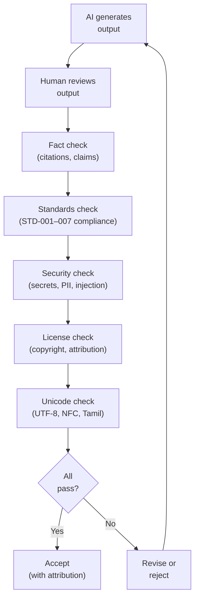
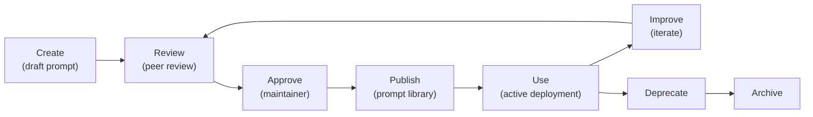
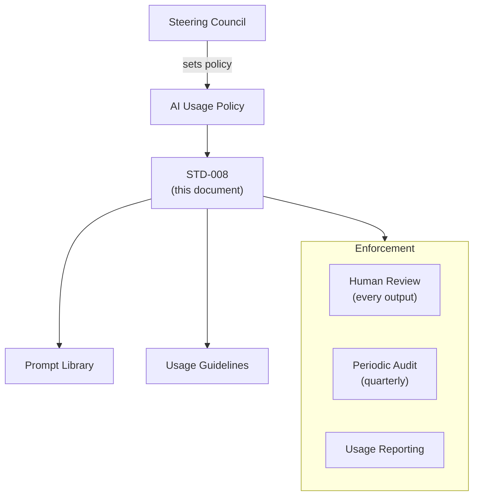
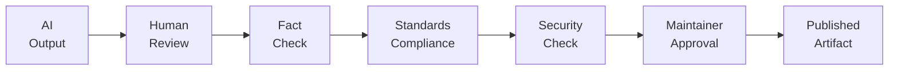

# STD-008 — AI Collaboration & Prompt Engineering Standards

> **STD-008 · 2026.07-r1 · Tier 3 — Standards**
>
> The definitive AI collaboration governance standard for the OpenTamilOCR organization.
> AI assists, humans decide. Human accountability is permanent.
> Changes require an RFC and maintainer approval.

---

## 1. Purpose

This document defines the organizational standard governing how Artificial Intelligence systems are used throughout OpenTamilOCR.

This is **not** merely a prompt-writing guide.
It is the governance standard for AI-assisted engineering.

It applies regardless of AI provider — ChatGPT, Claude, Gemini, DeepSeek, Qwen, Llama, Mistral, local LLMs, or any future foundation model.

The organization collaborates **with** AI.
AI never replaces organizational governance.
Human contributors remain accountable for every published artifact.

---

## 2. Scope

This standard applies to AI usage in:

- Software engineering (code generation, refactoring, review).
- Documentation (drafting, formatting, consistency checking).
- Architecture (analysis, discussion, documentation).
- API design (schema generation, documentation).
- Dataset creation (annotation assistance, metadata, quality review).
- OCR evaluation (benchmark analysis, error analysis).
- Model analysis (training analysis, evaluation summaries).
- Testing (test generation, edge case discovery).
- Research (literature review, experiment summaries).
- Git workflows (commit messages, PR descriptions).
- Planning and project management.
- Knowledge management.

This standard does **not** cover:

- Model training algorithms and hyperparameters (covered in STD-004).
- Inference pipeline implementation (covered in ARCH-004).
- Machine learning architecture design (covered in repository-level guides).

---

## 3. AI Collaboration Philosophy

| # | Principle | Rationale |
|---|-----------|-----------|
| AC1 | **AI assists, humans decide.** | AI generates options; humans make decisions. Authority and accountability always rest with humans. |
| AC2 | **AI outputs require verification.** | AI-generated content may contain errors, hallucinations, or subtle inaccuracies. Every output is verified before use. |
| AC3 | **Reproducibility is mandatory.** | AI interactions that produce organizational artifacts must be reproducible: prompt, model version, parameters, and context are preserved. |
| AC4 | **Transparency over automation.** | AI involvement is documented. Contributors and reviewers know when AI was involved. No hidden AI contributions. |
| AC5 | **AI is a collaborator, not an authority.** | AI suggestions are inputs to human judgment, not directives. Organizational standards always take precedence over AI recommendations. |
| AC6 | **Evidence over confidence.** | AI can sound confident while being wrong. Claims are backed by verifiable evidence, not by AI certainty. |
| AC7 | **Documentation over assumptions.** | AI interactions that inform decisions are documented. Undocumented AI influence creates untrustworthy artifacts. |
| AC8 | **Human accountability is permanent.** | The human who submits an AI-assisted contribution is fully accountable for its correctness, quality, and compliance. |
| AC9 | **Organizational standards override AI suggestions.** | When AI output conflicts with STD-001 through STD-007, the organizational standard prevails. Always. |

---

## 4. AI Categories

### 4.1 Category Definitions

| Category | Purpose | Human Review | Examples |
|----------|---------|-------------|---------|
| **Documentation Assistant** | Draft, format, and verify documentation. | Required before publication. | Drafting READMEs, formatting tables, cross-reference checking. |
| **Programming Assistant** | Generate, refactor, and review code. | Required before merge. | Code generation, refactoring, boilerplate, test generation. |
| **Review Assistant** | Assist with code and document review. | Advisory only. Human makes final decision. | Standards compliance checking, common bug detection. |
| **Research Assistant** | Summarize papers, analyze experiments, compare approaches. | Required. Verify citations independently. | Literature summaries, experiment comparison, trend analysis. |
| **Testing Assistant** | Generate tests, find edge cases, analyze failures. | Required before inclusion. | Test case generation, coverage analysis, flaky test detection. |
| **Dataset Assistant** | Assist with annotation, metadata, and quality review. | Required. Never fabricate annotations. | Pre-annotation, metadata tagging, duplicate detection. |
| **Benchmark Assistant** | Analyze benchmark results, identify patterns, summarize. | Required. Verify metrics independently. | Error pattern analysis, regression analysis, trend visualization. |
| **Architecture Assistant** | Discuss design, analyze trade-offs, document decisions. | Required. Architecture decisions are human. | Architecture discussion, trade-off analysis, documentation. |
| **Planning Assistant** | Draft plans, estimates, and timelines. | Required. Plans are human commitments. | Roadmap drafting, task breakdown, dependency analysis. |
| **Automation Assistant** | Generate scripts, CI configurations, infrastructure-as-code. | Required before execution. | CI scripts, validation scripts, deployment templates. |
| **Knowledge Assistant** | Search, summarize, and cross-reference organizational knowledge. | Required for accuracy. | Knowledge graph queries, document search, cross-reference. |

---

## 5. Prompt Engineering Standards

### 5.1 Prompt Structure

Every organizational prompt follows a consistent structure:

```
[ROLE]       Who the AI should act as.
[CONTEXT]    Organizational context, referenced documents, constraints.
[OBJECTIVE]  What the AI should produce.
[FORMAT]     Expected output format and structure.
[CONSTRAINTS] What the AI must NOT do.
[EXAMPLES]   Optional: examples of expected output.
```

### 5.2 Prompt Rules

| Rule | Standard |
|------|----------|
| **PE1: Explicit objectives.** | Every prompt states exactly what output is expected. Vague prompts produce unreliable results. |
| **PE2: Context first.** | Provide organizational context (referenced standards, document IDs, architectural decisions) before the objective. |
| **PE3: Constraints are mandatory.** | Every prompt includes what the AI must NOT do: no hallucination, no invented citations, no architecture changes without RFC. |
| **PE4: Output format specified.** | Specify the expected output format (markdown, YAML, JSON, table, diagram) explicitly. |
| **PE5: One objective per prompt.** | Each prompt addresses one clear objective. Multi-objective prompts produce lower-quality results. |
| **PE6: Reference organizational standards.** | Prompts reference specific document IDs (e.g., "Follow naming conventions from STD-002, Section 5"). |
| **PE7: No sensitive data in prompts.** | Prompts never include API keys, passwords, PII, or confidential information. |
| **PE8: Reusable templates.** | Common prompt patterns are formalized as templates in the prompt library. |

### 5.3 Prompt Techniques

| Technique | When to Use | Description |
|-----------|------------|-------------|
| **Role prompting** | Always. | Define the AI's role: "You are a Tamil OCR documentation specialist." |
| **Context injection** | When referencing standards. | Include relevant sections from organizational documents as context. |
| **Few-shot examples** | For consistent formatting. | Provide 1–3 examples of expected output before the actual request. |
| **Chain-of-thought** | For complex analysis. | Ask the AI to reason step-by-step before concluding. |
| **Constraint listing** | Always. | Explicitly list what the AI must not do. |
| **Output templating** | For structured output. | Provide the exact structure (YAML schema, markdown template) the AI should fill. |

---

## 6. AI Output Validation

### 6.1 Validation Pipeline



### 6.2 Validation Rules by Category

| AI Output | Required Validation |
|-----------|-------------------|
| **Code** | Code review (STD-002). Tests pass (STD-006). Lint pass. Security scan. License scan. |
| **Documentation** | Human review (STD-001). Fact check. Cross-reference check. Terminology consistency. |
| **Dataset annotations** | Human verification (STD-003, Section 15). Unicode validation. Ground truth tier appropriate. |
| **Benchmark analysis** | Metrics verified against raw data (STD-004). No invented numbers. |
| **Architecture discussion** | Human decision maker verifies alignment with ARCH-001 through ARCH-007. |
| **API schemas** | OpenAPI validation (STD-005). Consistency with existing APIs. |
| **Test cases** | Human review. Tests actually test meaningful behavior (STD-006). |
| **Commit messages** | Human review. Conventional Commits format (STD-007). |
| **Research summaries** | Citations independently verified. No hallucinated references. |

---

## 7. Human Responsibilities

### 7.1 Accountability Rules

| Responsibility | Standard |
|---------------|----------|
| **HR1: Final authority.** | Humans make all publication, promotion, and release decisions. |
| **HR2: Review all AI output.** | Every AI-generated artifact is reviewed by a human before it is committed, merged, or published. |
| **HR3: Verify correctness.** | The human reviewer verifies factual accuracy, not just formatting. |
| **HR4: Maintain ownership.** | The human who submits AI-assisted work owns it and is accountable for it. DCO signoff applies (STD-007, Section 6.5). |
| **HR5: Correct errors.** | If AI-generated content is later found to be incorrect, the human owner is responsible for correction. |
| **HR6: Document AI involvement.** | Contributors disclose when AI was used to generate significant portions of a contribution. |
| **HR7: Exercise judgment.** | Humans do not blindly accept AI output. Critical thinking is applied to every suggestion. |

---

## 8. AI Responsibilities

### 8.1 Permitted Activities

| Activity | Description | Governance |
|----------|-------------|------------|
| Generate code | Write functions, modules, scripts. | Human review before merge (STD-002). |
| Draft documentation | Write READMEs, docstrings, guides, standards drafts. | Human review before publication (STD-001). |
| Explain architecture | Describe system design, trade-offs, rationale. | Human validates against ARCH-001–007. |
| Summarize research | Condense papers, experiments, findings. | Human verifies citations. |
| Generate tests | Write unit, integration, and benchmark tests. | Human review and validation (STD-006). |
| Suggest improvements | Identify code smells, performance issues, security concerns. | Human evaluates and decides. |
| Draft prompts | Create reusable prompt templates. | Human reviews and approves. |
| Analyze benchmarks | Identify patterns, regressions, trends in evaluation data. | Human verifies against raw data (STD-004). |
| Generate reports | Create formatted evaluation, quality, and status reports. | Human reviews for accuracy. |
| Refactor code | Restructure code for readability and maintainability. | Human review before merge (STD-002). |

### 8.2 Prohibited Activities

| Activity | Reason |
|----------|--------|
| **Approve releases.** | Release approval is a human governance decision (GOV-004). |
| **Approve production promotion.** | Promotion requires human judgment and evidence (STD-004, Section 22). |
| **Override governance.** | Organizational governance is non-negotiable. AI cannot bypass RFC, DEC, or SC decisions. |
| **Publish independently.** | No artifact is published without human review and approval. |
| **Invent benchmark results.** | Benchmarks are measured, not generated. Fabricated metrics are fraud. |
| **Invent citations.** | Every citation must be independently verifiable. Hallucinated references are unacceptable. |
| **Fabricate dataset annotations.** | Ground truth is observed from source images, not generated from imagination. |
| **Hide uncertainty.** | AI must express uncertainty when present. Confident-sounding incorrect answers are dangerous. |
| **Access secrets or credentials.** | AI systems must not have access to production secrets, API keys, or user data. |
| **Modify published history.** | AI cannot rewrite git history, modify published evaluation results, or alter approved documents. |

---

## 9. Prompt Lifecycle

### 9.1 Lifecycle Stages



### 9.2 Lifecycle Rules

| Stage | Requirement |
|-------|-------------|
| **Create** | Author drafts prompt with structure from Section 5.1. Includes examples and constraints. |
| **Review** | Peer reviews for clarity, completeness, safety, and compliance. |
| **Approve** | Maintainer approves for inclusion in prompt library. |
| **Publish** | Prompt is added to the library with metadata (Section 10). |
| **Use** | Contributors use the prompt for its documented purpose. |
| **Improve** | Based on usage feedback, the prompt is refined. Changes follow the same review process. |
| **Deprecate** | Prompt is marked deprecated with replacement reference. |
| **Archive** | Deprecated prompts are archived for historical reference. |

---

## 10. Prompt Library

### 10.1 Library Structure

```
tamilocr-os/
└── prompts/
    ├── README.md                      # Prompt library guide
    ├── registry.yaml                  # Prompt registry
    ├── documentation/                 # Documentation prompts
    │   ├── PROMPT-DOC-001.md
    │   └── ...
    ├── coding/                        # Coding prompts
    │   ├── PROMPT-CODE-001.md
    │   └── ...
    ├── review/                        # Review prompts
    │   └── ...
    ├── testing/                       # Testing prompts
    │   └── ...
    ├── dataset/                       # Dataset prompts
    │   └── ...
    ├── benchmark/                     # Benchmark prompts
    │   └── ...
    └── research/                      # Research prompts
        └── ...
```

### 10.2 Prompt Template Format

```yaml
---
prompt_id: "PROMPT-DOC-001"
title: "Documentation Generation"
version: "1.0.0"
status: active
category: documentation
owner: "@founder"
created: "2026-07-17"
updated: "2026-07-17"
tags: ["documentation", "generation", "standards"]
requires: ["STD-001"]
---

# PROMPT-DOC-001 — Documentation Generation

## Role
You are an OpenTamilOCR documentation specialist.

## Context
[Insert: relevant section from STD-001]
[Insert: document metadata requirements]

## Objective
Generate a documentation section for [component name].

## Format
Markdown following STD-001 conventions.
YAML frontmatter conforming to ARCH-003 metadata schema.

## Constraints
- Do NOT invent cross-references to non-existent documents.
- Do NOT change approved terminology.
- Do NOT generate content that contradicts ARCH-001 through ARCH-007.
- Express uncertainty when applicable.

## Examples
[Provide 1–3 examples of expected output]
```

---

## 11. Prompt Identification

### 11.1 Prompt ID Format

```
PROMPT-{CATEGORY}-{NNN}
```

| Component | Description | Example |
|-----------|-------------|---------|
| `PROMPT` | Fixed prefix. | `PROMPT` |
| `{CATEGORY}` | Short category code. | `DOC`, `CODE`, `TEST`, `DATA`, `BENCH`, `REVIEW`, `RESEARCH` |
| `{NNN}` | Zero-padded sequence number. | `001`, `042` |

Full example: `PROMPT-CODE-003`

### 11.2 Prompt Metadata

| Field | Type | Required | Description |
|-------|------|----------|-------------|
| `prompt_id` | String | Yes | Unique identifier. |
| `title` | String | Yes | Human-readable name. |
| `version` | String | Yes | SemVer version. |
| `status` | Enum | Yes | `draft`, `active`, `deprecated`, `archived`. |
| `category` | Enum | Yes | Category from Section 4. |
| `owner` | String | Yes | Maintainer handle. |
| `created` | Date | Yes | ISO 8601 creation date. |
| `updated` | Date | Yes | ISO 8601 last update date. |
| `tags` | List | Yes | Searchable keywords. |
| `requires` | List | Yes | Referenced organizational documents. |
| `deprecated_by` | String | Conditional | Replacement prompt ID (when deprecated). |

---

## 12. Reproducibility Standards

### 12.1 Reproducibility Requirements

| Requirement | Standard |
|-------------|----------|
| **RP1: Prompt preservation.** | The exact prompt used to generate a published artifact is preserved alongside the artifact. |
| **RP2: Model identification.** | The AI model name and version (e.g., "Claude 3.5 Sonnet", "GPT-4o") is recorded. |
| **RP3: Parameter documentation.** | Key parameters (temperature, max tokens) are recorded when they affect output quality. |
| **RP4: Context documentation.** | Documents provided as context to the AI are referenced by document ID and version. |
| **RP5: Output versioning.** | AI-generated output is version-controlled alongside human-authored content. |
| **RP6: Date recorded.** | The date of AI interaction is recorded. AI models change over time; the same prompt may produce different output later. |

### 12.2 Reproducibility Metadata

```yaml
ai_interaction:
  prompt_id: "PROMPT-DOC-001"
  prompt_version: "1.0.0"
  model: "Claude 3.5 Sonnet"
  date: "2026-10-15"
  temperature: 0.3
  context_documents:
    - "STD-001 v2026.07-r1"
    - "ARCH-003 v2026.07-r1"
  output_reviewed_by: "@contributor-42"
  review_date: "2026-10-16"
```

---

## 13. AI Safety Standards

### 13.1 Safety Rules

| Rule | Standard |
|------|----------|
| **SF1: Hallucination awareness.** | AI outputs are treated as potentially containing hallucinations. Every factual claim is independently verified. |
| **SF2: Bias awareness.** | AI models have training biases. Outputs are reviewed for bias, particularly in dataset annotation, evaluation, and documentation. |
| **SF3: Privacy protection.** | No PII, user data, or private organizational information is sent to external AI services. |
| **SF4: Secret protection.** | No API keys, passwords, tokens, or credentials are included in prompts or context. |
| **SF5: Copyright compliance.** | AI-generated content is checked for potential copyright issues. Substantial similarity to known copyrighted works is flagged. |
| **SF6: License awareness.** | AI output used in the organization must be compatible with Apache-2.0 (code) and CC-BY-4.0 (data/docs) (FND-004). |
| **SF7: Data leakage prevention.** | Sensitive organizational data (unreleased research, unpublished benchmarks, internal discussions) is not sent to external AI services without authorization. |
| **SF8: Prompt injection awareness.** | When AI processes external content (user inputs, dataset text), prompt injection risks are mitigated. External text is treated as untrusted data. |
| **SF9: Output verification.** | AI output is not used in security-critical paths (authentication, authorization, cryptography) without expert human review. |

---

## 14. AI Ethics

This section implements FND-003 (Ethics Framework) for AI collaboration.

### 14.1 Ethical Rules

| Rule | Standard |
|------|----------|
| **ET1: Transparency.** | AI involvement in creating organizational artifacts is disclosed. |
| **ET2: Disclosure.** | Significant AI contributions are noted in commit messages, PR descriptions, or document metadata. |
| **ET3: Fairness.** | AI-generated content is reviewed for fairness, particularly in evaluation, annotation, and documentation that may affect community perception. |
| **ET4: Human oversight.** | AI never operates autonomously on organizational decisions. Human oversight is always present. |
| **ET5: Responsible use.** | AI is used to improve quality, not to circumvent review or bypass standards. |
| **ET6: Limitations acknowledged.** | Known limitations of AI involvement are documented. If AI-assisted annotation was used, the annotation process discloses this. |
| **ET7: Accessibility.** | AI-generated documentation meets accessibility requirements (STD-001, Section 13). |

---

## 15. Integration with Organizational Standards

### 15.1 Documentation Integration (STD-001)

| Activity | AI Role | Governance |
|----------|---------|------------|
| Documentation drafting | AI drafts content following STD-001 structure. | Human reviews format, accuracy, and cross-references. |
| Consistency checking | AI verifies terminology and formatting consistency. | Human validates findings. |
| Cross-reference verification | AI checks that referenced document IDs exist and are correct. | Human confirms. |
| Metadata generation | AI generates YAML frontmatter from document content. | Human validates all fields. |

### 15.2 Coding Integration (STD-002)

| Activity | AI Role | Governance |
|----------|---------|------------|
| Code generation | AI generates code following STD-002 conventions. | Human reviews (CR1, STD-002). |
| Refactoring | AI proposes refactoring for readability. | Human approves before merge. |
| Docstring generation | AI drafts docstrings for public APIs. | Human verifies accuracy. |
| Code review assistance | AI flags standards violations and common bugs. | Advisory. Human decides. |

### 15.3 Dataset Integration (STD-003)

| Activity | AI Role | Governance |
|----------|---------|------------|
| Pre-annotation | AI generates initial annotations from OCR engine output. | Human corrects and verifies every annotation. |
| Metadata enrichment | AI suggests metadata tags and document classifications. | Human approves. |
| Quality review | AI flags potential annotation errors. | Human reviews flagged items. |
| **Never fabricate annotations.** | AI does not create ground truth from imagination. | Absolute rule. |

### 15.4 Model Integration (STD-004)

| Activity | AI Role | Governance |
|----------|---------|------------|
| Training analysis | AI analyzes training curves and suggests improvements. | Human evaluates. |
| Evaluation summary | AI generates benchmark result summaries. | Human verifies against raw data. |
| Model card drafting | AI drafts model card content. | Human reviews and approves. |
| **Never approve promotion.** | AI does not promote models to production. | Absolute rule. |

### 15.5 API Integration (STD-005)

| Activity | AI Role | Governance |
|----------|---------|------------|
| OpenAPI generation | AI generates OpenAPI from requirements. | Human reviews for correctness and consistency. |
| Schema drafting | AI drafts request/response schemas. | Human validates against STD-005. |
| Documentation | AI generates endpoint descriptions and examples. | Human reviews for accuracy. |
| **Never publish APIs automatically.** | AI does not release API endpoints. | Absolute rule. |

### 15.6 Testing Integration (STD-006)

| Activity | AI Role | Governance |
|----------|---------|------------|
| Test generation | AI generates test cases from code or specifications. | Human reviews for correctness. |
| Edge case discovery | AI identifies inputs that may cause failures. | Human evaluates relevance. |
| Coverage analysis | AI identifies untested code paths. | Human prioritizes. |
| Failure analysis | AI explains complex test failures. | Human verifies diagnosis. |

### 15.7 Git Integration (STD-007)

| Activity | AI Role | Governance |
|----------|---------|------------|
| Commit message drafting | AI suggests commit messages from diffs. | Human reviews and commits. |
| PR description | AI summarizes changes for PR description. | Human reviews for accuracy. |
| Diff explanation | AI explains complex diffs in natural language. | Human uses for understanding. |
| Prompt versioning | Prompts are version-controlled in git following STD-007. | Same branching and review rules. |

---

## 16. AI Governance

### 16.1 Governance Structure



### 16.2 Governance Rules

| Rule | Standard |
|------|----------|
| **GV1: Acceptable use.** | AI is used for tasks defined in Section 8.1. All other uses require maintainer approval. |
| **GV2: Prohibited use.** | Activities in Section 8.2 are absolutely prohibited. Violations are treated as governance violations. |
| **GV3: Logging.** | Significant AI interactions that produce organizational artifacts are logged (reproducibility metadata, Section 12.2). |
| **GV4: Auditing.** | AI usage is reviewed quarterly. Audit checks for compliance with this standard. |
| **GV5: Policy violations.** | Violations are addressed through the Code of Conduct process (FND-002, Section 5). |
| **GV6: Exception process.** | Exceptions to this standard require documented approval from a maintainer and a rationale. |

---

## 17. Quality Gates

### 17.1 Publication Gate

Before any AI-assisted artifact is published:

| Gate | Requirement | Evidence |
|------|-------------|---------|
| **Human review** | At least one human has reviewed the artifact for correctness. | Review sign-off. |
| **Evidence verification** | All claims, metrics, and citations are independently verified. | Verification record. |
| **Documentation complete** | Artifact follows relevant documentation standard (STD-001). | Metadata valid. |
| **Standards compliance** | Artifact complies with all applicable standards (STD-001 through STD-007). | Compliance check. |
| **Security review** | No secrets, PII, or sensitive information in the artifact. | Security scan. |
| **Citation verification** | All citations are real and correctly attributed. | Independent verification. |
| **Approval** | Maintainer approves publication. | Approval record. |
| **Version recorded** | Artifact is version-controlled with reproducibility metadata. | Git commit + metadata. |

### 17.2 Quality Gate Pipeline



---

## 18. Future Evolution

AI collaboration standards evolve through the RFC process (GOV-003):

1. A contributor identifies a new AI use case, safety concern, or governance improvement.
2. An RFC is filed with the proposal, rationale, and impact analysis.
3. The RFC is reviewed and decided.
4. If approved, STD-008 is updated.
5. The prompt library is updated accordingly.
6. A DEC record captures the decision.

**Forward-looking considerations:**

- As AI capabilities evolve, the boundary between permitted and prohibited activities may shift — always through governance, never unilaterally.
- New AI providers and models are evaluated for safety and compliance before organizational adoption.
- Local/self-hosted models may reduce data leakage concerns; adoption follows the same governance process.

---

## 19. Governance Relationship

| Document | Relationship |
|----------|-------------|
| FND-001 — Project Charter | Parent. Mission governs AI collaboration purpose. |
| FND-003 — Ethics Framework | Required. AI ethics, bias, fairness, and responsible use. |
| ARCH-007 — AI Workflow Architecture | Required. AI agent architecture, `.agents/AGENTS.md`, and workflow patterns. |
| FND-002 — Code of Conduct | Reference. AI usage policy violations follow conduct process. |
| FND-004 — Licensing Policy | Reference. AI output licensing compatibility. |
| GOV-001 — Governance Model | Reference. Authority matrix for AI policy decisions. |
| GOV-003 — Decision Process | Reference. Standards changes through RFC. |
| GOV-004 — Release Governance | Reference. AI cannot approve releases. |
| ARCH-001 — System Architecture | Reference. AP1 (Documentation First) governs AI documentation. |
| STD-001 — Documentation Standards | Sibling. AI-assisted documentation rules. |
| STD-002 — Coding Standards | Sibling. AI-assisted coding rules. |
| STD-003 — Dataset Standards | Sibling. AI-assisted annotation rules. |
| STD-004 — Model Standards | Sibling. AI-assisted model evaluation rules. |
| STD-005 — API Standards | Sibling. AI-assisted API design rules. |
| STD-006 — Testing Standards | Sibling. AI-assisted testing rules. |
| STD-007 — Git Standards | Sibling. AI-assisted Git workflow rules. |

---

## 20. Related Documents

| Document | Relationship |
|----------|-------------|
| SYS-000 — Master Index | Root. |
| ARCH-007 — AI Workflow Architecture | Required. AI agent architecture. |
| FND-001 — Project Charter | Required. Mission. |
| FND-003 — Ethics Framework | Required. AI ethics. |
| FND-002 — Code of Conduct | Reference. Conduct. |
| FND-004 — Licensing Policy | Reference. Licensing. |
| GOV-003 — Decision Process | Reference. Change process. |
| GOV-004 — Release Governance | Reference. Releases. |
| STD-001 — Documentation Standards | Sibling. |
| STD-002 — Coding Standards | Sibling. |
| STD-003 — Dataset Standards | Sibling. |
| STD-004 — Model Standards | Sibling. |
| STD-005 — API Standards | Sibling. |
| STD-006 — Testing Standards | Sibling. |
| STD-007 — Git Standards | Sibling. |

---

## 21. Review Policy

- **Review frequency:** Every 6 months during the Standards Review Cycle, or when new AI capabilities, providers, or safety concerns emerge.
- **Amendment process:** RFC → DEC → Maintainer + SC member approval.
- **Trigger for review:** New AI model adoption, new safety incident, new AI use case, regulatory changes in AI governance, community feedback.

---

## 22. Document History

| Version | Date | Summary |
|---------|------|---------|
| 2026.07-r1 | 2026-07-17 | Initial draft. Founding AI collaboration and prompt engineering governance standard for the OpenTamilOCR organization. |

---

> **Approved by:** Pending Steering Council approval.
> **Effective date:** Upon approval.
